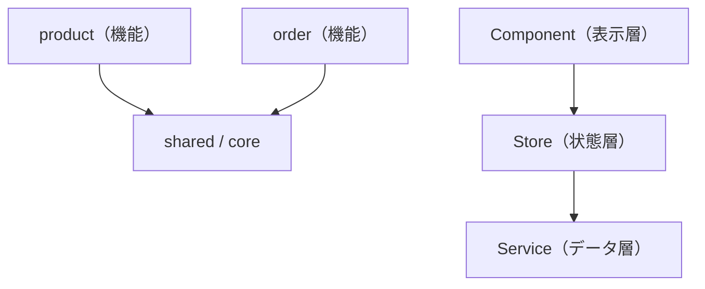

これまで、Component・Service・Router・状態管理と、アプリケーションを構成する部品を個別に学んできました。この章では、視点を最大限に引き上げ、それらを組み合わせてアプリケーション全体をどう構造化するか、というアーキテクチャ設計を扱います。

アーキテクチャとは、アプリケーションの骨格です。どこに何を置き、部品どうしがどう依存するかという、全体の秩序を定めます。よいアーキテクチャは、規模が大きくなっても見通しを保ち、変更を局所化し、複数人での開発を支えます。逆に、秩序のないアプリは、規模とともに複雑さが爆発し、やがて手がつけられなくなります。この章では、Angularアプリを健全に育てるための、設計の原則と実践を学びます。

:::message
**この章で学ぶこと**

- 機能（Feature）単位の分割
- レイヤーによる責務の分離
- 依存の方向を整える
- フォルダ構成の実践
:::

## 機能単位で分割する

大規模なアプリケーションを構造化する、もっとも基本的な軸が、機能（Feature）単位の分割です。第35章のLazy Loadingでも触れましたが、アプリを「商品」「注文」「管理」といった業務上のまとまりで分け、それぞれを独立したフォルダにまとめます。

```text
src/app/
├── product/      … 商品機能
├── order/        … 注文機能
├── admin/        … 管理機能
├── shared/       … 複数機能で共有する部品
└── core/         … アプリ全体の基盤（認証、設定など）
```

この分割の利点は、関連するものが一か所に集まることです。商品に関するComponent・Service・状態・ルートは、すべて`product/`の中にあります。ある機能を理解したいとき、そのフォルダだけを見ればよく、変更の影響範囲もその中に収まりやすくなります。第35章で学んだ`loadChildren`による遅延読み込みも、この機能単位の分割と、そのまま対応します。設計上の分割と、性能上の分割が一致するのです。

この「関連するものを近くに置く」という考え方は、コロケーションと呼ばれます。あるComponentと、それだけが使うServiceや型は、離れた共通フォルダに置くより、そのComponentのそばに置くほうが、見通しがよくなります。「一緒に変更されるものは、一緒に置く」という原則です。逆に、機能をまたいで役割別に分ける（すべてのServiceを一箇所、すべてのComponentを別の一箇所）と、ひとつの機能を追うのに、複数の場所を行き来することになります。役割ではなく、機能とまとまりで分けるのが、大規模開発では扱いやすい構成です。

`shared/`には、複数の機能で使い回す汎用的な部品を、`core/`には、認証やアプリ全体の設定といった、基盤となる仕組みを置きます。機能に属さないものの置き場所を、あらかじめ決めておくと、迷いが減ります。

## レイヤーで責務を分ける

機能という縦の分割に加えて、レイヤー（層）という横の分割も意識します。ひとつの機能の中でも、役割の異なる部品を、層として分けるのです。本書で学んできた要素は、おおむね次の層に整理できます。

- **表示層（Component）**: 画面の見た目と操作を担う。第2部・第3部・第4部。
- **状態層（Store・Service）**: 状態を保持し、業務ロジックを担う。第5部・第10部。
- **データアクセス層（Service・HttpClient）**: サーバーとの通信を担う。第9部。

Componentは状態層に依存し、状態層はデータアクセス層に依存する。この層構造を意識すると、責務がきれいに分かれます。第22章で学んだ「Componentは薄く、処理はServiceへ」という原則は、このレイヤー分割の一部です。表示・状態・データという層の分離が、アプリ全体を見通しよく保ちます。この層の考え方は、機能内でも機能をまたいでも一貫して適用でき、どの規模のアプリでも通用する基本になります。

## 依存の方向を整える

アーキテクチャで、機能分割やレイヤー分割と並んで重要なのが、依存の方向です。「どの部品が、どの部品に依存してよいか」を定め、その向きを守ります。

基本原則は、「依存は、内側（安定したもの）へ向ける」ことです。具体的には、表示層は状態層に依存してよいが、その逆はいけません。また、機能どうしは、原則として直接依存させず、共有が必要なら`shared/`や`core/`を介します。`product/`が`order/`に直接依存すると、両者が密結合になり、片方の変更がもう片方に波及します。



依存の方向が一定に保たれていると、変更の影響が予測できます。安定した基盤（`core/`）は、めったに変わらず、多くの部品から依存されます。個々の機能は、頻繁に変わるかもしれませんが、他の機能から依存されないため、安心して変更できます。この「変わりにくいものに依存し、変わりやすいものには依存されない」構造が、変更に強いアーキテクチャの核心です。

## 適切な粒度を保つ

分割は、細かすぎても粗すぎても問題です。第10章でComponentの分割について述べたのと同じ悩みが、アプリ全体の設計にも当てはまります。

機能を細かく分けすぎると、機能間のやり取りが増え、かえって複雑になります。逆に、ひとつの機能に何もかも詰め込むと、その機能が肥大化し、`shared/`のような共有領域が、雑多な置き場になってしまいます。目安は、第10章と同じく「名前を付けられるまとまりか」です。`product`のように、役割を言い表せる単位で分けます。

そして、アーキテクチャも、最初にすべてを決めきる必要はありません。第48章の状態管理と同じく、小さく始め、規模の拡大に応じて構造を育てるのが現実的です。最初は`app/`直下に平らに置き、機能が増えてきたらフォルダに分ける、という進め方でも構いません。過剰な設計を避け、必要に応じて構造を整えていきます。

## スタイルガイドに沿う

Angularには、公式のスタイルガイドがあります。ファイルの命名、フォルダの構成、Componentの書き方など、推奨される慣習がまとめられています。本書がこれまで従ってきた、型サフィックスなしのファイル名（第4章）や、セレクターの命名規則（第6章）も、このスタイルガイドにもとづくものです。

チームで開発するとき、こうした共通の規約に沿うことには、大きな価値があります。誰が書いても一定の形になり、他の人のコードも読みやすくなります。独自の流儀を編み出すより、広く知られた公式の慣習に従うほうが、長期的には保守しやすいアプリになります。アーキテクチャ設計も、この「共通の理解に沿う」という姿勢の延長線上にあります。

## 循環依存を避ける

依存の方向を整えるうえで、とくに避けたいのが、循環依存です。循環依存とは、「AがBに依存し、BもAに依存する」という、たがいに依存し合う状態です。こうなると、片方を理解するのに、もう片方が必要になり、切り離してテストすることも、片方だけを変更することも難しくなります。

循環依存は、多くの場合、責務の分担があいまいなことのサインです。たとえば、2つの機能が、たがいの内部を直接参照し合っているなら、その共通部分を`shared/`や`core/`に切り出すべきかもしれません。あるいは、状態層とデータ層が混ざっているなら、層の分離を見直します。循環依存が見つかったら、それを機械的に解消するのではなく、「なぜ循環が生まれたのか」という設計の問いに立ち返ることが大切です。依存の向きを一方向に保つ規律が、循環を未然に防ぎます。

## 状態の置き場所も設計の一部

第10部で学んだ状態管理も、アーキテクチャ設計の重要な一部です。どの状態を、どの層・どの機能に置くかは、アプリ全体の構造に関わります。第48章で状態を分類したように、ローカルな状態はComponentに、機能内で共有する状態はその機能のStoreに、アプリ全体で共有する状態は`core/`のStoreに、と配置します。

状態の置き場所が適切だと、依存の方向も自然に整います。逆に、共有すべき状態を末端のComponentに置いたり、ローカルで済む状態をアプリ全体のStoreに載せたりすると、依存が入り組み、アーキテクチャが崩れます。「この状態は、どこが持つべきか」という問いは、単なる状態管理の問題ではなく、アーキテクチャ設計そのものなのです。機能分割・レイヤー・依存の方向・状態配置は、すべて連動して、アプリの構造を形づくります。

## 規模の拡大とチーム開発

アーキテクチャの真価は、アプリとチームが大きくなったときに表れます。開発者が数人から数十人に増えると、「誰がどこを触っても壊れない」構造が、決定的に重要になります。機能単位の分割は、この点で効きます。各開発者が、担当する機能フォルダの中で作業でき、他の機能への影響を心配せずに済むためです。

さらに大規模になると、ひとつのリポジトリで複数のアプリやライブラリを管理する、モノレポという構成が選ばれることもあります。Angularは、こうした大規模構成とも相性がよく、共通のライブラリを複数のアプリで共有する、といった設計が可能です。本書では詳しく立ち入りませんが、アーキテクチャの原則、すなわち「機能で分け、層で分け、依存の向きを整える」は、規模が大きくなるほど、その価値を増します。逆にいえば、小規模なうちに、これらの原則を意識して構造を保っておくことが、将来の拡大に備えることになります。設計は、いまのためだけでなく、将来の自分やチームのためにも行うものです。

## よくあるつまずき

- **最初から作り込みすぎる**: 小さなアプリに、多層のフォルダや厳密な層分けを持ち込むと、かえって煩雑です。規模に見合った構造から始め、必要に応じて育てます。
- **`shared/`が雑多な置き場になる**: 「どこにも属さないもの」を安易に`shared/`へ入れ続けると、そこが巨大なゴミ箱になります。本当に共有されるものだけを置き、定期的に見直します。
- **機能どうしが直接依存する**: ある機能が別の機能の内部を直接参照すると、密結合になります。共有が必要なら、共通の場所を介します。
- **アーキテクチャを目的化する**: 立派な構造を作ること自体が目的になっては本末転倒です。構造は、変更のしやすさと見通しのための手段だと、常に意識します。
- **層をまたいで近道する**: Componentからデータ層を直接呼ぶなど、層を飛ばすと、一時的には楽でも、責務の境界が崩れます。層を通す規律を保ちます。
- **循環依存を放置する**: たがいに依存し合う関係は、責務のあいまいさのサインです。共通部分を切り出すなどして、依存の向きを一方向に整えます。

## まとめ

- アーキテクチャは、規模が大きくなっても見通しを保つための、アプリの骨格です
- アプリは、機能（Feature）単位の縦の分割で構造化するのが基本です
- 表示・状態・データという層（レイヤー）で、責務を横に分けます
- 依存は、変わりにくい基盤へ向け、機能どうしの直接依存は避けます
- 分割の粒度は「名前を付けられるまとまり」を目安にし、小さく始めて育てます
- 公式のスタイルガイドに沿うことが、チーム開発と長期保守を支えます

次章では、アプリの品質を支えるテストの基礎を、ComponentとServiceのテストから学びます。
