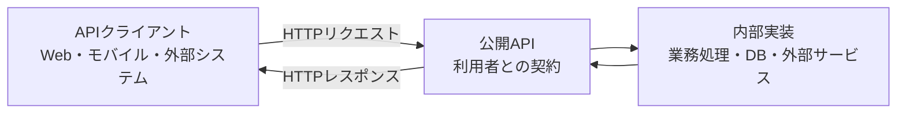

## この本の読み方

本書は、HTTPとJSONを使った簡単なAPIを実装した経験があり、設計判断を体系的に学びたい開発者を対象にしています。特定の言語やフレームワークの知識は必要ありません。

初めて学ぶ場合は、第1〜11章を順番に読んでください。APIの境界、HTTP、リソース設計という土台がつながります。第12章以降は、入力なら第12章、エラーなら第14章、大量データなら第16章、認証・認可なら第17〜18章、再試行なら第20章、変更管理なら第22章、非同期処理なら第23章というように、実務上の課題から引けます。

次の1行だけを渡されて、予約画面を実装できるでしょうか。

```text
POST /reservations
```

URLとHTTPメソッドは分かります。しかし、どのイベントを何席予約するのか、いつ予約が確定するのか、満席なら何が返るのかは分かりません。通信が途中で切れたとき、同じリクエストを送り直してよいかも判断できません。

API設計では、何を送ると何が起き、結果をどう確かめられるかという、提供者と利用者の間の約束全体を決めます。

## APIは内部実装を隠す境界になる

APIの利用者から、サーバー内部は見えません。データベースの製品やテーブル構成、処理を担うサービスの数を知らなくても使える必要があります。



クライアントが依存するのは、中央の公開APIです。契約を保てるなら、提供者はデータベースを移行したり、処理を複数のサービスへ分割したりできます。

反対に、テーブル名を変えただけでURLが変わる設計では、内部の都合が境界の外へ漏れています。本来は提供者だけで完結する変更に、すべての利用者を巻き込んでしまいます。

## 契約には「形」と「振る舞い」がある

イベント予約APIへ、次のリクエストを送るとします。

```http
POST /reservations HTTP/1.1
Host: api.example.com
Content-Type: application/json

{
  "eventId": "evt_123",
  "seats": 2
}
```

予約が確定すると、APIは作成した予約を返します。

```http
HTTP/1.1 201 Created
Location: /reservations/rsv_789
Content-Type: application/json

{
  "id": "rsv_789",
  "eventId": "evt_123",
  "seats": 2,
  "status": "confirmed"
}
```

この例から、メソッド、URL、JSONの型といった「形」は読み取れます。ただし、型が分かるだけでは実装できません。`seats`には、少なくとも次の意味を定める必要があります。

- 予約後の合計席数ではなく、今回追加する席数を表す
- 1以上で、イベントごとの上限を超えない
- 残席より多い値を送ると、予約は作成されない
- 同じ要求の再送で二重予約を作らない仕組みを用意する

型が`integer`であることは、契約の一部にすぎません。値の意味、処理が成立する条件、失敗時の結果まで決まって、利用者は安全に呼び出せます。

## 利用者の目的を一つの操作にまとめる

予約APIの内部では、次の処理が動くかもしれません。

1. 利用者を特定する
2. イベントが受付中か確認する
3. 残席を確保する
4. 予約を保存する
5. 確認メールを送る

この5工程を、そのまま5個の公開APIに分ける必要はありません。利用者の目的は「イベントの席を確保する」ことで、内部手順を順番に操作することではないからです。

残席の確認と確保を別々のAPIにすると、その間に別の予約が入り、定員を超えるおそれがあります。APIは内部の複雑さを利用者へ押し出さず、業務上ひとまとまりの操作を引き受けます。

## テーブル構造からエンドポイントを作らない

イベント予約サービスの内部に、次のテーブルがあるとします。

```text
events
reservation_records
reservation_status_histories
seat_allocations
notification_jobs
```

ここから機械的に`/reservation-records`や`/seat-allocations`を公開すると、クライアントは保存手順まで知ることになります。利用者が知りたいのは、予約が確定したか、現在どの状態か、取り消せるかです。

| 観点 | データベース | API |
|---|---|---|
| 目的 | データを矛盾なく保存する | 利用者の目的を安全に達成する |
| 主な利用者 | サーバー内部のプログラム | 別のアプリケーションや開発者 |
| 構造の単位 | テーブル、行、列 | リソース、操作、表現 |
| 変更で重視すること | 保存効率と整合性 | 分かりやすさと互換性 |

単純なデータなら、テーブルとリソースが似ることもあります。問題は似ていることではなく、理由を考えずに内部構造を公開仕様へ固定することです。

## 設計判断は5つの観点で比べる

API設計には、どの状況でも通用する唯一の正解はありません。本書では、候補を比べるときに次の5点を使います。

| 観点 | 確認すること |
|---|---|
| 予測可能性 | 名前や振る舞いから、使い方を推測できるか |
| 一貫性 | 同じ概念を同じ規則で表しているか |
| 明示性 | 成功、失敗、制約、状態が曖昧でないか |
| 変更容易性 | 内部を変えても、既存利用者との契約を保てるか |
| 運用可能性 | 障害調査、流量制御、変更や廃止の通知ができるか |

すべてを最大化できるとは限りません。レスポンスを小さくすると通信量は減りますが、必要な情報を集めるための往復は増えます。入力を厳密に検証すると不正な状態を防げますが、将来の拡張方法も同時に決めなければなりません。

設計には理由が要ります。流行している形式かどうかより、利用者と業務に合うかを説明できることが重要です。

## 本書では一つの予約APIを育てていく

全編を通して、架空のイベント予約APIを設計します。最初はイベントの検索、予約、照会、取消だけです。章が進むにつれて、現実の難しさを加えます。

- 受付開始と同時に予約が集中する
- 応答が届かず、同じリクエストが再送される
- 参加者、主催者、運用担当者で権限が異なる
- 予約やイベントが複数の状態を持つ
- 外部システムへ変更を通知する
- 古いクライアントを残したままAPIを更新する

問題が加わるたびに、リソース、エラー、冪等性、認可などの設計を見直します。第26章では、それまでの判断を一つのAPIへ統合します。

## 全体の見取り図

| 部 | 読んだ後にできること |
|---|---|
| 第1部（1〜3章） | 利用者の目的と要件からAPIの輪郭を作る |
| 第2部（4〜7章） | HTTPの語彙で操作と結果を表す |
| 第3部（8〜11章） | 業務概念をリソースと状態遷移へ変換する |
| 第4部（12〜16章） | 入力、応答、エラー、一覧、大量データを整える |
| 第5部（17〜21章） | 認証・認可・信頼性・流量を設計する |
| 第6部（22〜25章） | APIを変更し、他システムと接続し、運用する |
| 第7部（26章） | イベント予約APIの完成形をレビューする |

最後に用語集があります。本文中で意味を確認し直したくなったときに引いてください。

## 最初の演習：1行のAPIを契約にする

冒頭の`POST /reservations`へ戻ります。次の問いに答えられれば、エンドポイントが「契約」に近づきます。

1. 誰が呼び出せるか
2. イベントと席数をどの形式で指定するか
3. どの条件を満たすと予約が確定するか
4. 成功時に何が返り、どこから予約を照会できるか
5. 満席、受付終了、権限不足をどう見分けるか
6. 応答が届かなかった場合、どの条件なら再送できるか

この時点で答えを完成させる必要はありません。第2章から、問いごとに使える設計の道具を増やしていきます。
