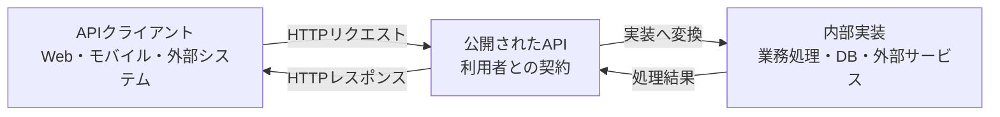
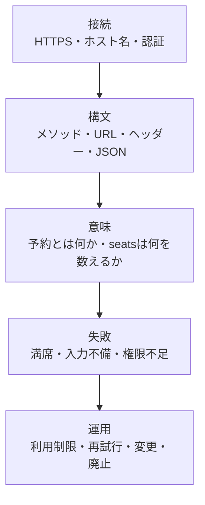
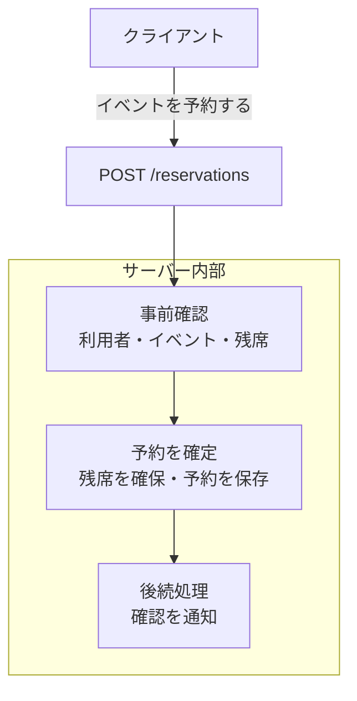

APIは契約です。設計の出発点には、URLの命名規則やJSONの形より先に、**APIの提供者と利用者の間で何を約束するのか**を置きます。

APIを使う側からは、サーバーの内部が見えません。どのデータベースを使っているのか、処理がいくつのサービスに分かれているのか、予約番号を内部でどう採番しているのかを知らなくても、APIを利用できる必要があります。

利用者は公開されたインターフェースを信頼して、プログラムを書きます。

- どのURLへリクエストを送るのか
- どのHTTPメソッドを使うのか
- 何を送れば受け付けてもらえるのか
- 成功すると何が返るのか
- 失敗をどう見分けるのか
- 一度公開された仕様が、どのように変更されるのか

これらの約束を決めることが、API設計の中心です。この章ではAPIを「利用者との契約」として捉え、実装とインターフェースを分けて考える土台を作ります。

## 本書の対象読者と読み方

HTTPとJSONを使った簡単なAPIを実装した経験があり、設計判断を体系的に学びたい開発者を主な対象にしています。特定のプログラミング言語やフレームワークの知識は前提にしません。

初めて体系的に学ぶ場合は、第1〜7章を順番に読んでください。契約、予測可能性、要件整理、HTTP、URI、メソッド、ステータスコードが後続章の土台です。第8〜16章では、ドメインをリソースへ変換し、入力、応答、エラー、一覧、大量データの設計へ進みます。

第17〜25章は、認証・認可、セキュリティ、冪等性、キャッシュ、互換性、Webhook、OpenAPI、運用を扱います。実務で直面した課題に応じ、必要な章だけ参照しても構いません。第26章では全要素をイベント予約APIへ統合します。

付録にはHTTP早見表、レビュー用チェックリスト、エラーカタログ、OpenAPI完全例、方式比較、用語集を収録しました。設計中やレビュー中に手元で引く用途を想定しています。

## APIはシステムの境界にある

APIは、あるソフトウェアの機能やデータを、別のソフトウェアから利用するための接点です。

Web APIでは、モバイルアプリ、Webフロントエンド、他社のサービス、社内の別システムなどがHTTPを通じてサーバーを利用します。APIは、その境界に置かれます。



図を見ると、クライアントと内部実装は直接つながっていません。クライアントが依存する相手は、公開されたAPIです。

APIの内側では、処理の方法を変えられます。データベースをPostgreSQLから別の製品へ移すことも、ひとつのアプリケーションを複数のサービスに分割することもあります。それでも公開した契約が守られていれば、クライアントは変更せずに使い続けられます。

逆に、内部実装を少し変えただけでもレスポンスのフィールド名やエラーの意味が変わるなら、APIが境界として機能していません。実装の都合が、契約の外側へ漏れています。

## 契約には構文と意味がある

APIの契約という言葉から、URLやJSONスキーマだけを想像するかもしれません。しかし、形だけでは足りません。

たとえば、イベントの予約を受け付けるAPIを考えます。

```http
POST /reservations HTTP/1.1
Host: api.example.com
Content-Type: application/json

{
  "eventId": "evt_123",
  "seats": 2
}
```

予約が作成された場合、次のレスポンスを返すとします。

```http
HTTP/1.1 201 Created
Content-Type: application/json
Location: /reservations/rsv_789

{
  "id": "rsv_789",
  "eventId": "evt_123",
  "seats": 2,
  "status": "confirmed"
}
```

この例から読み取れる契約には、複数の層があります。



`seats`が整数であることは、構文の約束です。しかし、それだけでは利用者が正しく使えるとは限りません。

- `seats`は予約する席数なのか、予約後の合計席数なのか
- 0や負数を指定できるのか
- 一度に予約できる上限はあるのか
- 残席が1席しかないときに2席を指定するとどうなるのか
- 同じリクエストを再送すると、予約が二重に作られるのか

これらは値の意味や処理の振る舞いに関する約束です。OpenAPIで型を`integer`と定義しても、その意味までは伝わりません。

API設計では、データの形と意味を一緒に決めます。利用者は、リクエストを送れるか、送信後に何が起きるか、その両方を知る必要があります。

## 実装とインターフェースを分けて考える

実装は「約束をどう実現するか」、インターフェースは「利用者に何を約束するか」を表します。

イベント予約APIの内部では、次のような処理を行うかもしれません。

1. アクセストークンから利用者を特定する
2. イベントが予約可能な状態か確認する
3. 残席数を確認する
4. 予約レコードを保存する
5. 残席数を更新する
6. 確認メールを送信する

しかし、これらをそのまま6個のAPIとして公開する必要はありません。利用者がしたいことは「イベントを予約する」ことであり、内部処理を順番に操作することではないからです。



内部処理をAPIの外へ露出すると、クライアントがサーバーの実装手順を知ることになります。処理の順番を変更したいだけでも、すべてのクライアントへ修正を求めなければなりません。途中で通信が切れた場合に、残席だけ減って予約が保存されていない、といった不整合も起こりやすくなります。

APIは、内部処理を隠すためだけの薄い包装ではありません。利用者の目的に合わせて、内部の複雑さを引き受ける境界です。

## データベースの構造はAPIの設計図ではない

APIを短時間で作ろうとすると、データベースのテーブルをそのままエンドポイントへ対応させたくなります。

たとえば、内部に次のテーブルがあるとします。

- `events`
- `reservation_records`
- `reservation_status_histories`
- `seat_allocations`
- `notification_jobs`

この構造から機械的にAPIを作ると、`/reservation-records`や`/seat-allocations`といったエンドポイントが生まれます。しかし、APIの利用者が知りたいのは、テーブルをどう更新するかではありません。予約を作成できたのか、予約は現在どの状態なのか、取り消せるのかを知りたいはずです。

データベースとAPIでは、設計の目的が違います。

| 観点 | データベース | API |
|---|---|---|
| 主な目的 | データを矛盾なく保存する | 利用者の目的を安全に達成する |
| 主な利用者 | サーバー内部のプログラム | 別のアプリケーションや開発者 |
| 変更の都合 | 保存効率や整合性 | 分かりやすさや後方互換性 |
| 構造の単位 | テーブル、行、列 | リソース、操作、表現 |

テーブルとリソースが似た形になること自体は問題ではありません。単純なデータでは、自然に一致する場合もあります。問題は、一致している理由を検討せず、内部構造を公開仕様として固定してしまうことです。

内部の正規化やテーブル分割は、運用とともに変わります。APIがその構造へ強く依存すると、本来は内部だけで済む変更が、利用者を巻き込む破壊的変更になります。

## APIの利用者は実装コードを読めない

同じ組織の中で使うAPIでは、「分からなければ実装を読めばよい」と考えがちです。しかし、その前提は長く続きません。

利用者が別のチームへ移ることもあれば、クライアントとサーバーで使用言語が異なることもあります。外部へ公開するAPIなら、実装コードへアクセスできません。コードを読まなければ意味が分からない仕様は、契約として情報が不足しています。

APIだけを見た利用者が、少なくとも次の問いに答えられる状態を目指します。

- このAPIで何を達成できるか
- どの順番で呼び出すのか
- 何を送信してよいか
- どの結果を成功と判断するか
- 失敗したとき、修正、再試行、断念のどれを選ぶか
- 将来の変更へどう備えるか

APIドキュメントは、この契約を利用者へ説明する重要な手段です。ただし、実装後にドキュメントを足せば設計上の曖昧さが消えるわけではありません。説明しにくいAPIは、設計自体に複数の意味が混ざっている可能性があります。

## 契約を決める5つの問い

APIを設計するときは、次の5つの問いから考えると、URLやJSONの議論だけに偏りにくくなります。

### 1. 利用者は何を達成したいのか

設計の出発点には、利用者の目的を置きます。

イベント予約APIをデータ操作の言葉で捉えると、「予約テーブルに行を追加したい」となります。利用者の言葉では、「参加したいイベントの席を確保したい」です。後者から考えると、どこまでをひとつの操作として扱うべきかが見えてきます。

### 2. 何を送れば、その操作を受け付けるのか

必要な入力、任意の入力、受け付ける値の範囲を決めます。型と業務上の制約をまとめて検討します。

たとえば、席数は1以上で、イベントごとに設定された上限以下とします。すでに終了したイベントには予約できません。この条件を利用者へ明示しなければ、失敗を予測できません。

### 3. 成功した結果をどう確認できるのか

ステータスコードとレスポンスボディを使い、何が確定したのかを伝えます。

予約を受け付けただけなのか、席の確保まで完了したのかで意味は違います。時間のかかる処理を非同期で行うなら、完了を確認する方法も契約に含めます。

### 4. 失敗した利用者は次に何をすればよいのか

失敗を返すだけでは足りません。入力を直せばよいのか、認証し直すのか、時間を置いて再試行するのか、別の席数を選ぶのかを判断できる必要があります。

同じ`400 Bad Request`でも、「JSONが壊れている」と「希望した席数を確保できない」では、その後の対応が異なります。利用者が分岐できる情報を設計します。

### 5. APIを将来どう変更するのか

公開したAPIは、利用者のコードに組み込まれます。提供者が新しい仕様を公開しても、すべてのクライアントが同時に更新されるとは限りません。

フィールドの追加、意味の変更、古い機能の廃止をどう進めるのか。変更を伝える方法と期間も、長期的な契約の一部です。

## 良いAPIを評価する5つの観点

APIの設計には、常にひとつだけの正解があるわけではありません。利用者、業務、既存システム、性能、セキュリティによって、適切な形は変わります。

それでも、設計を比較するための観点は持てます。本書では、次の5つを軸にAPIを評価します。

| 観点 | 確認すること |
|---|---|
| 予測可能性 | 名前や振る舞いから、使い方を推測できるか |
| 一貫性 | 同じ概念を同じ規則で表しているか |
| 明示性 | 成功、失敗、制約、状態が曖昧になっていないか |
| 変更容易性 | 内部実装と公開仕様を分離し、互換性を保てるか |
| 運用可能性 | 障害の調査、流量制御、廃止の通知ができるか |

ある観点を重視すると、別の観点にコストが生じることもあります。レスポンスを小さくすれば通信量は減りますが、必要な情報を得るためのリクエスト回数が増えるかもしれません。厳密な入力検証は不正な状態を防ぎますが、新しい値を追加した際の互換性には注意が必要です。

流行している形式を無条件に採用しても、良いAPIにはなりません。誰のどの問題を解くために選んだ設計なのか、理由を説明できる状態を目指します。

## 本書で設計するイベント予約API

本書では、架空のイベント予約サービスを題材にします。利用者は公開中のイベントを検索し、希望するイベントを予約できます。主催者はイベントを作成し、公開し、予約状況を確認できます。

序盤では、次のような小さな機能から始めます。

- イベントの一覧を取得する
- イベントの詳細を取得する
- イベントを予約する
- 自分の予約を確認する
- 予約を取り消す

章が進むにつれて、設計上の難しさを加えます。

- 満席のイベントへ予約が集中する
- 同じリクエストが複数回届く
- 一般利用者と主催者で操作できる範囲が違う
- 予約に確認待ち、確定、取消済みなどの状態がある
- イベントの変更を外部システムへ通知する
- 古いクライアントを残したままAPIを更新する

完成形は段階的に作ります。問題が起きるたびに設計を見直すため、規則と、その規則が必要になる理由を結びつけて学べます。

:::message
本書の中心は「RESTらしさの採点」ではありません。HTTPの性質を活かしつつ、利用者が安全に目的を達成できる契約を作ることです。
:::

## 設計演習：予約APIの契約を言葉にする

次のエンドポイントだけを見て、契約として不足している情報を考えてみてください。

```text
POST /reservations
```

少なくとも、次の内容を決めなければクライアントは実装できません。

1. 誰が呼び出せるか
2. イベントと席数をどの形式で指定するか
3. 予約可能な条件は何か
4. 予約が確定するタイミングはいつか
5. 成功時に何が返るか
6. 満席や受付終了をどう伝えるか
7. タイムアウト後に同じリクエストを再送してよいか
8. 作成した予約をどのAPIで確認できるか

ここで、URLは契約のごく一部にすぎないことが分かります。API設計では、エンドポイントの一覧を作った時点を完成と考えず、その操作の意味と前後の振る舞いまで詰めます。

## API設計チェックリスト

新しいAPIを設計するときは、最初に次の点を確認します。

- [ ] APIの利用者と、その利用目的を言葉にできる
- [ ] 公開する契約と内部実装を分けて考えている
- [ ] データベースの構造を理由なく公開していない
- [ ] 入力の形だけでなく、値の意味と制約を説明できる
- [ ] 成功時に何が確定したのかを説明できる
- [ ] 失敗した利用者が次の行動を判断できる
- [ ] 将来の変更と互換性を考えている
- [ ] 選んだ設計の理由を説明できる

## APIは利用者との契約として設計する

API設計は、エンドポイントへ名前を付ける作業ではありません。提供者と利用者の間で、操作、データ、振る舞い、失敗、変更についての契約を作る仕事です。

- クライアントは内部実装ではなく、公開されたAPIに依存します。
- 契約には、データの形だけでなく、その意味と振る舞いも含まれます。
- APIは内部処理の複雑さを引き受け、利用者の目的に合った操作を公開します。
- データベースの構造とAPIの構造は、目的を分けて設計します。
- 設計を選ぶときは、予測可能性、一貫性、明示性、変更容易性、運用可能性を確認します。

次章では、利用者が説明を読まなくても使い方を予測できるAPIについて考えます。名前やレスポンスの形式をそろえるだけでなく、認知負荷を減らす一貫性を具体的に整理します。
