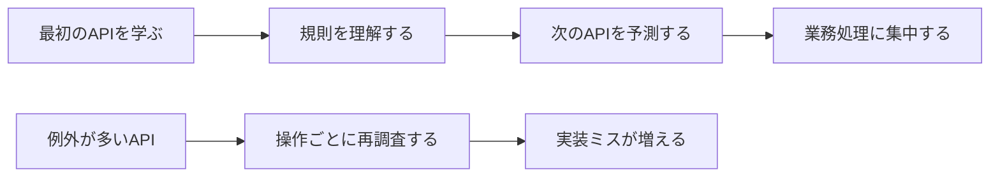

APIの使いやすさは、機能の多さだけでは決まりません。利用者が次の操作を予測できるかどうかで、大きく変わります。

あるエンドポイントでイベントIDが`eventId`なのに、別のエンドポイントでは`event_id`、さらに別の場所では`id`として現れる。作成成功時はJSONを返すが、更新成功時は文字列の`OK`を返す。このようなAPIは、一つひとつの処理が動いていても、利用者に毎回調査を求めます。

良いAPIでは、一度覚えた規則を次の操作にも使えます。本章では、この予測可能性をどのように作るのかを整理します。

## 利用者は小さな違いにも立ち止まる

次のAPI一覧を見てください。

| 操作 | メソッドとパス |
|---|---|
| イベント一覧 | `GET /getEvents` |
| イベント詳細 | `GET /event?id=evt_123` |
| イベント作成 | `POST /events/create` |
| イベント更新 | `POST /update-event/evt_123` |
| 予約一覧 | `GET /reservations` |
| 予約取消 | `DELETE /cancelReservation/rsv_789` |

どのエンドポイントも、実装は可能です。しかし利用者は、新しい操作を見るたびに次の点を確認しなければなりません。

- パスは単数形か複数形か
- 操作名をパスに含めるのか
- IDはパスとクエリのどちらに置くのか
- 更新には`POST`を使うのか
- 予約取消は削除として扱うのか

規則が見つからないため、既存のAPIから新しいAPIを推測できません。ドキュメントを開き、サンプルを探し、実際に送信して確かめる作業が毎回発生します。

この負担は、エンドポイントが数個の間は小さく見えます。数十個、数百個に増えると、SDK、テスト、運用手順にも例外が広がります。

## 一貫性は認知負荷を下げる

認知負荷とは、作業中に頭の中で保持し、判断しなければならない情報の量です。APIの規則がそろっていれば、利用者は業務処理に集中できます。規則がばらばらなら、通信の細部へ注意を奪われます。



一貫性は、すべてを同じ形にすることではありません。意味が同じものを同じ規則で表し、意味が違うものは違いが分かる形で表すことです。

たとえば、作成と更新で入力項目が異なるなら、リクエストスキーマを分けるべきです。形をそろえるために、更新では使わない必須項目まで送らせると、かえって意味が曖昧になります。

## 一貫性を作る5つの軸

API全体を確認するときは、名前だけでなく、次の5つの軸を見ます。

### 語彙をそろえる

同じ概念には同じ名前を使います。

イベントの識別子を`eventId`と決めたなら、リクエスト、レスポンス、エラー、Webhookでも同じ名前を使います。`eventCode`や`targetEvent`へ言い換えると、別の意味があるように見えます。

同義語を減らす一方で、意味の異なるIDは区別します。予約IDを`id`、イベントIDを`eventId`とするなど、文脈だけに頼らず読み取れる名前を選びます。

### データの形をそろえる

日時、金額、一覧、エラーなど、繰り返し現れるデータには共通の表現を決めます。

```json
{
  "startsAt": "2026-10-18T04:00:00Z",
  "createdAt": "2026-08-09T12:30:00Z"
}
```

ある日時はISO 8601形式、別の日時はUnix時間、さらに別の日時はローカル時刻という設計では、利用者が変換規則を何種類も持つことになります。

### 操作の振る舞いをそろえる

同種の操作は、成功時のステータスコードやレスポンスの有無も合わせます。

作成したリソースを返す方針なら、イベント作成と予約作成の両方で返します。更新後の表現を返すAPIと空のレスポンスを返すAPIが混在する場合は、違いの理由を説明できるようにします。

### 失敗の伝え方をそろえる

エラー形式が一定なら、クライアントは共通処理を作れます。

```json
{
  "type": "https://api.example.com/problems/event-full",
  "title": "Event capacity exceeded",
  "status": 409,
  "detail": "Only 1 seat remains."
}
```

あるAPIは`message`、別のAPIは`error_description`、別のAPIはHTMLを返す状態では、利用者がエンドポイントごとの分岐を書かなければなりません。

### コレクションの操作をそろえる

一覧取得では、絞り込み、並び替え、ページネーションの規則を共通化します。

`limit`と`pageSize`を混在させない。降順を`-startsAt`で表すと決めたなら、ほかの一覧でも同じ書式を使う。この規則はSDKや共通UIにも波及するため、早い段階で決める価値があります。

## 局所的な美しさより全体の規則を優先する

新しいエンドポイントだけを見れば、別の命名やレスポンス形式のほうが自然に思える場合があります。しかし、既存APIと異なる規則を一つ増やすと、利用者が覚える例外も増えます。

たとえば、既存APIがすべて複数形の`/events`、`/reservations`を使っているなら、新しい会場APIも`/venues`とするのが自然です。単一の会場を扱うから`/venue`にする、という局所的な理屈より、コレクションは複数形という全体規則を優先します。

もちろん、既存規則に重大な問題がある場合は見直します。そのときは、新しいAPIだけを例外にせず、移行計画を作って規則そのものを更新します。

## APIスタイルガイドを小さく始める

一貫性を人の記憶だけに任せると、チームが増えたときに崩れます。APIスタイルガイドへ、判断が繰り返される項目を記録します。

最初から大部の規約を作る必要はありません。イベント予約APIなら、次の内容から始められます。

| 項目 | 採用する規則 |
|---|---|
| パス | 小文字、複数形、単語区切りはハイフン |
| JSONフィールド | camelCase |
| 日時 | UTCのRFC 3339形式 |
| 作成 | `POST`と`201 Created` |
| エラー | RFC 9457 Problem Details |
| 一覧件数 | `limit` |
| 並び順 | `sort=startsAt`、降順は`sort=-startsAt` |

規則には「なぜ採用したか」も短く残します。理由があれば、新しい要件が来たときに、規則を維持するか変更するか判断できます。

## イベント予約APIの最初の規則を決める

先ほどのばらばらなAPIを、いったん次の形へそろえます。

| 操作 | メソッドとパス |
|---|---|
| イベント一覧 | `GET /events` |
| イベント詳細 | `GET /events/{eventId}` |
| イベント作成 | `POST /events` |
| イベント更新 | `PATCH /events/{eventId}` |
| 予約一覧 | `GET /reservations` |
| 予約取消 | `POST /reservations/{reservationId}/cancellation` |

最後の予約取消操作だけは、単純な削除にしていません。予約には取消日時や取消理由を残し、状態を`cancelled`へ移すという業務上の意味があるためです。この設計は第11章で詳しく検討します。

この表を絶対的な正解として覚える必要はありません。複数形、識別子の位置、メソッドの選択に一貫した理由があり、例外にも説明が付いている点を見てください。

## 設計演習：規則の乱れを見つける

次のレスポンスには、どのような迷いが生まれるでしょうか。

```json
{
  "event_id": "evt_123",
  "startDate": 1792296000000,
  "venue": null,
  "participants": {},
  "is_public": 1
}
```

少なくとも、命名規則、日時形式、`null`の意味、コレクションの形、真偽値の表現を確認する必要があります。直す際は、個々の好みで決めず、API全体に適用できる規則として書き出してください。

## 予測可能性を確認する

- [ ] 同じ概念に同じ名前を使っている
- [ ] パスとJSONの命名規則が決まっている
- [ ] 日時、金額、真偽値、空の値の表現がそろっている
- [ ] 同種の成功レスポンスが同じ方針に従っている
- [ ] エラーを共通処理できる
- [ ] 一覧取得のクエリ規則がそろっている
- [ ] 例外には、利用者が理解できる理由がある
- [ ] 繰り返す判断をスタイルガイドへ記録している

## 一度覚えた規則を次でも使えるようにする

利用者が迷わないAPIでは、名前、形、振る舞い、失敗、コレクション操作に一貫性があります。一貫性があると、新しいエンドポイントでも既存の知識を再利用できます。

次章では、見た目の規則から一歩戻り、APIを作る前の要件整理を扱います。画面やテーブルからエンドポイントを作るのではなく、利用者が達成したいことからAPIの輪郭を引きます。
