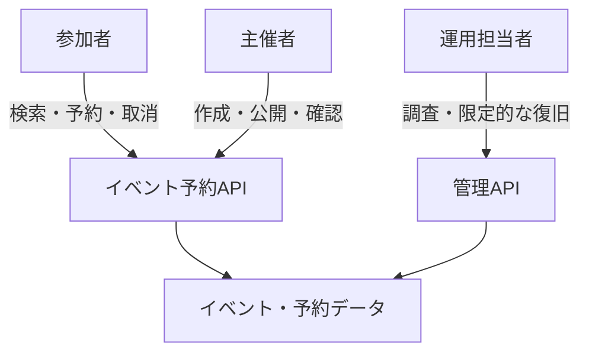
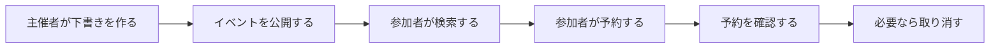
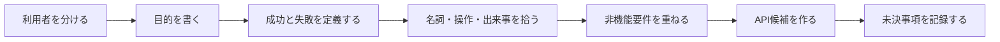

APIの設計をURLから始めると、必要な操作が抜けたり、役割の曖昧なエンドポイントが生まれたりします。先に整理するのは、利用者、目的、業務上の制約、失敗です。

ここでは、イベント予約サービスの要件から最初のAPI一覧を組み立てます。JSONの細部はまだ決めません。APIが引き受ける責任と境界に集中します。

## 画面をそのままAPIにしない

管理画面に「イベント編集」ページがあるから、`POST /editEventPage`を作る。この方法では、画面構成が変わるたびにAPIも揺れます。

同じイベント情報は、Web画面、モバイルアプリ、主催者向け管理画面、外部カレンダー連携から利用されるかもしれません。APIの境界を特定の画面へ合わせると、別の利用者には使いにくくなります。

画面の裏にある目的を取り出します。

| 画面上の操作 | 利用者の目的 |
|---|---|
| 検索ボタンを押す | 条件に合う公開イベントを探す |
| 予約フォームを送信する | イベントの席を確保する |
| 取消ボタンを押す | 確定済み予約を取り消す |
| 公開スイッチを入れる | 下書きイベントを参加者へ公開する |

目的は画面より長く残ります。APIは、この目的を安全に達成する操作として設計します。

## 最初に利用者を分ける

イベント予約サービスには、少なくとも3種類の利用者がいます。

- 参加者：イベントを探し、自分の予約を管理する
- 主催者：イベントを作成し、公開し、予約状況を確認する
- 運用担当者：問い合わせ対応や不正利用の調査を行う

同じデータを扱っていても、許される操作は違います。参加者が他人の予約を変更できてはいけません。主催者も、別の主催者が管理するイベントを編集できません。運用担当者の強い権限は、日常的なAPIから分離する必要があります。



利用者を先に分けると、認証と認可を後回しにせず、最初から要件へ組み込めます。「誰が」「どの対象へ」「何をできるか」を、要件の一部として持てるからです。

## ユースケースを一文で書く

ユースケースは、利用者がシステムを使って達成する目的です。次の型で一文にすると、主語と結果が明確になります。

```text
<利用者>は、<目的>のために、<対象>を<操作>する。
```

イベント予約サービスでは、次のように書けます。

- 参加者は、参加可能な催しを見つけるために、公開イベントを検索する。
- 参加者は、席を確保するために、イベントを予約する。
- 参加者は、参加できなくなったために、自分の予約を取り消す。
- 主催者は、参加者を募集するために、下書きイベントを公開する。
- 主催者は、当日の準備をするために、予約者一覧を取得する。

「イベントを処理する」「予約を管理する」のような広すぎる表現は避けます。成功した状態を想像できる粒度まで具体化します。

## 正常系と同時に失敗を書き出す

予約が成功する流れだけを考えると、APIの重要な契約が抜けます。席数が不足した場合、受付終了後、同じ利用者がすでに予約している場合も要件です。

予約ユースケースを次の表で整理します。

| 項目 | 内容 |
|---|---|
| 利用者 | ログイン済みの参加者 |
| 入力 | イベントID、希望席数 |
| 事前条件 | イベントが公開中で、受付期間内にある |
| 成功 | 席が確保され、予約IDが発行される |
| 業務上の失敗 | 満席、受付終了、重複予約、上限超過 |
| 技術上の失敗 | 認証失敗、一時的な保存障害、タイムアウト |
| 成功後 | 予約を照会でき、確認通知が送られる |

業務上の失敗と技術上の失敗は、クライアントの対応が異なります。満席なら別のイベントを提案できます。一時障害なら、条件を守って再試行する余地があります。この違いは、後のエラー設計と冪等性設計につながります。

## 業務の流れから境界を見つける

イベントが作成されてから予約されるまでを並べます。



この流れから、`event`と`reservation`という中心概念が見えます。さらに、公開と取消は単なるフィールド変更なのか、独立した業務操作なのかを検討できます。

境界を考えるときは、一つの操作で守るべき整合性も確認します。予約では、残席確認と席の確保を一体として扱わなければ、定員を超える可能性があります。クライアントに二つのAPIを順番に呼ばせる設計では、この整合性を守りにくくなります。

## 名詞・操作・出来事を分ける

要件の文章から、次の3種類を拾います。

| 種類 | イベント予約サービスの例 | API設計での使い道 |
|---|---|---|
| 名詞 | イベント、会場、予約、参加者 | リソース候補 |
| 操作 | 作成、検索、公開、予約、取消 | メソッドや業務操作候補 |
| 出来事 | イベント公開、予約確定、予約取消 | Webhookや監査記録の候補 |

すべての名詞をリソースにし、すべての動詞をパスにするわけではありません。この時点では候補を集めます。具体的な表現は、第5章以降でHTTPの性質と照らして決めます。

## 非機能要件もAPIの形を変える

機能要件が同じでも、利用規模や信頼性の要件によって設計は変わります。

イベント予約APIでは、次の条件を仮定します。

- 人気イベントの受付開始時に、短時間で予約が集中する
- モバイル回線から利用され、応答前に通信が切れることがある
- 主催者は数万人分の予約をCSVへ出力する
- 予約確定は重複してはならない
- 予約変更は監査できる必要がある
- 外部の入場管理システムへ予約確定を通知する

ここから、同時更新、冪等性、非同期処理、ページネーション、Webhook、監査ログが必要だと分かります。これらを実装直前まで考えないでいると、公開済みAPIを大きく変えることになります。

## 最初のAPI一覧を作る

ユースケースをもとに、粗いAPI一覧を作ります。

| 利用者 | 操作 | 最初の候補 |
|---|---|---|
| 参加者 | 公開イベントを検索する | `GET /events` |
| 参加者 | イベント詳細を見る | `GET /events/{eventId}` |
| 参加者 | イベントを予約する | `POST /reservations` |
| 参加者 | 自分の予約を見る | `GET /reservations/{reservationId}` |
| 参加者 | 自分の予約を取り消す | `POST /reservations/{reservationId}/cancellation` |
| 主催者 | イベントを作る | `POST /events` |
| 主催者 | イベントを編集する | `PATCH /events/{eventId}` |
| 主催者 | イベントを公開する | 設計保留 |
| 主催者 | 予約者一覧を見る | `GET /events/{eventId}/reservations` |

公開操作を保留にしたのは、判断材料が足りないためです。単純な更新として`PATCH`で`status`を変えるのか、重要な状態遷移として専用の操作にするのか。公開の取り消しや公開条件も確認してから決めます。

設計時に保留を明示するのは、悪いことではありません。根拠のない決定を確定事項に見せるより、安全です。

## 要件をAPIへ写す手順



URLを先に決めるより手順は増えますが、後戻りは減ります。特に、権限、同時実行、失敗時の扱いは、API公開後に足すほど難しくなります。

## 設計演習：ユースケースを分解する

「主催者がイベントを中止する」という要件を、次の観点で分解してください。

1. どの状態のイベントを中止できるか
2. 中止後、既存予約はどうなるか
3. 参加者へいつ、どの手段で通知するか
4. 中止を取り消せるか
5. 返金処理が失敗した場合、APIは何を返すか
6. 外部システムへどの出来事を通知するか

この問いに答える前に、`DELETE /events/{id}`と決めるのは早すぎます。業務上はイベントの記録を残し、複数の後続処理を追跡する必要があるかもしれません。

URLを決める前に、利用者、成功、失敗、権限、守るべき整合性を書き出す。この順序なら、画面変更に引きずられず、業務の目的に沿ったAPI候補を作れます。
