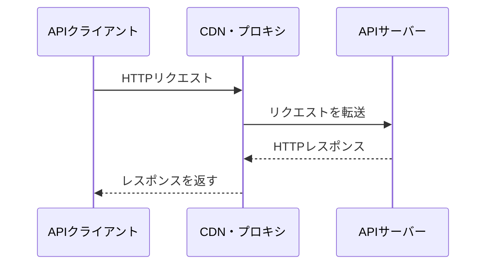
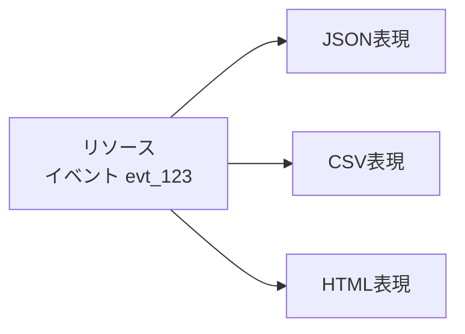

Web APIはHTTPの上に作られます。HTTPを単なる通信手段として扱うと、メソッド、ステータスコード、キャッシュ、条件付きリクエストなど、すでに用意されている仕組みを活かせません。

本章では、HTTPメッセージが何を伝えるのかを整理します。HTTP/1.1、HTTP/2、HTTP/3では転送方法が異なりますが、メソッドやステータスコードといった意味は共通です。

## HTTPメッセージは自己記述的に作られている

HTTPの通信は、クライアントがリクエストを送り、サーバーがレスポンスを返す形で進みます。



メッセージには、受信者が処理方法を判断する情報が含まれます。たとえば、`Content-Type: application/json`を見れば、内容がJSONであると分かります。`Cache-Control`は、レスポンスを保存して再利用できるかを伝えます。

この自己記述性があるため、クライアントとサーバーの間にCDN、リバースプロキシ、APIゲートウェイを置けます。中継者は業務の詳細を知らなくても、HTTPの意味に従って転送、圧縮、キャッシュ、認証補助などを行えます。

## リクエストは意図と対象を運ぶ

HTTPリクエストは、主に次の要素で構成されます。

```http
POST /reservations HTTP/1.1
Host: api.example.com
Authorization: Bearer eyJ...
Content-Type: application/json
Accept: application/json
Idempotency-Key: 7f4f5580-3d42-4f66-9d5f-91e6378b2231

{
  "eventId": "evt_123",
  "seats": 2
}
```

| 要素 | 例 | 伝えること |
|---|---|---|
| メソッド | `POST` | 対象へ何をしたいか |
| ターゲットURI | `/reservations` | どのリソースを対象にするか |
| ヘッダー | `Content-Type`など | 認証、表現形式、前提条件などのメタデータ |
| コンテント | JSON | 操作に必要なデータ |

HTTPの現在の仕様では、従来「ボディ」や「ペイロード」と呼ばれていた部分を、文脈に応じてコンテントや表現データとして説明します。本書では、一般的な会話では「ボディ」、HTTPの意味を強調するときは「コンテント」と書き分けます。

### メソッドは動作の意味を伝える

`GET`は現在の表現を取得し、`POST`は対象リソースに固有の処理を依頼します。メソッドはルーティングのための文字列ではありません。安全性、冪等性、キャッシュの可否など、クライアントや中継者が利用する意味を持ちます。

### URIは操作の対象を示す

`POST /reservations`の対象は、予約のコレクションです。メソッドとURIを組み合わせることで、「予約コレクションへ新しい予約の作成を依頼する」と読めます。

URIへ`/createReservation`と操作名まで書くと、`POST`が持つ意味と重複します。ただし、CRUDで表しにくい業務操作では、操作を示すリソースを設ける場合もあります。

### ヘッダーは処理条件を運ぶ

認証情報、受け入れ可能な表現、コンテントの形式、条件付き更新、キャッシュ制御などはヘッダーで伝えます。

業務データまで何でも独自ヘッダーへ入れる設計は避けます。主催者IDや席数はJSONまたはパスから読み取れる形にし、HTTP処理に関わるメタデータをヘッダーへ置きます。

## レスポンスは結果と次の判断材料を返す

リクエストが処理されると、サーバーはレスポンスを返します。

```http
HTTP/1.1 201 Created
Content-Type: application/json
Location: /reservations/rsv_789
ETag: "reservation-rsv_789-v1"

{
  "id": "rsv_789",
  "eventId": "evt_123",
  "seats": 2,
  "status": "confirmed"
}
```

| 要素 | 例 | 伝えること |
|---|---|---|
| ステータスコード | `201` | リクエストをどう処理したか |
| レスポンスヘッダー | `Location`、`ETag` | 作成先、キャッシュ、後続処理の情報 |
| コンテント | 予約のJSON | 結果の表現やエラーの詳細 |

ステータスコードは大分類を伝え、ボディはAPI固有の詳細を伝えます。`201 Created`からリソースが作られたと分かり、`Location`から作成先を、JSONから現在の状態を確認できます。

## 表現とリソースを区別する

リソースは、URIによって識別される概念です。レスポンスに入るJSONは、そのリソースをある時点・ある形式で表したものです。これを表現と呼びます。



APIでは通常JSONだけを提供します。それでも「リソースそのもの」と「JSON表現」を分けて考えると、レスポンスに何を含めるか、言語や権限によって表現が変わるか、ETagが何を識別するかを整理しやすくなります。

## Content-TypeとAcceptは別の方向を向く

`Content-Type`は、今送っているコンテントの形式を示します。`Accept`は、レスポンスとして受け取りたい形式を示します。

```http
POST /reports HTTP/1.1
Content-Type: application/json
Accept: text/csv

{"eventId":"evt_123"}
```

このリクエストでは、検索条件をJSONで送り、結果をCSVで受け取りたいと伝えています。サーバーがJSONの入力を扱えなければ`415 Unsupported Media Type`、CSVを提供できなければ`406 Not Acceptable`が候補になります。

同じ形式しか扱わないAPIでも、`Content-Type`を正しく返します。クライアントが内容を推測せず、安全に解析するためです。

## ステートレスは状態を保存しないという意味ではない

HTTPはステートレスなプロトコルです。ここでいうステートレスは、サーバーが予約や利用者の状態を保存してはいけない、という意味ではありません。

各リクエストを処理するために必要な情報を、リクエスト自体やサーバー上の識別可能なリソースから取得できることを指します。前の通信で暗黙に決まった情報へ依存しすぎると、別のサーバーで処理したり、障害後に再開したりしにくくなります。

たとえば、次の設計は呼び出し順へ強く依存します。

```text
POST /select-event
POST /set-seats
POST /confirm
```

どのイベントが選択されているかをサーバー内の一時セッションだけに置くと、`/confirm`単体では意味が分かりません。予約作成リクエストに`eventId`と`seats`を含めれば、処理に必要な情報が明確になります。

複数ステップが必要なら、下書き予約のようなリソースを作り、そのIDを明示的に操作します。状態を隠すのではなく、識別できる形にします。

## HTTPのバージョンと意味を混同しない

HTTP/1.1はテキスト形式、HTTP/2とHTTP/3はバイナリのフレーミングを使います。接続の多重化や転送効率にも違いがあります。一方、`GET`の意味、`404 Not Found`、`Cache-Control`などの意味は共通です。

API設計者が主に扱うのはセマンティクス、つまりメッセージの意味です。転送方式を特定バージョンへ固定する要件がない限り、APIドキュメントで`HTTP/1.1`と書く例は、人が読みやすい表示形式だと考えてください。

## イベント取得の一往復を読む

```http
GET /events/evt_123 HTTP/1.1
Host: api.example.com
Accept: application/json
If-None-Match: "event-evt_123-v7"
```

サーバー上の表現が変わっていなければ、次のように返せます。

```http
HTTP/1.1 304 Not Modified
ETag: "event-evt_123-v7"
```

クライアントは保存済みの表現を再利用できます。API独自の`changed: false`をJSONで返すより、HTTPの条件付きリクエストを使うほうが、中継者や汎用クライアントとも協調できます。

## メッセージ設計を確認する

- [ ] メソッドが操作の意味と合っている
- [ ] URIが操作対象を識別している
- [ ] HTTP処理のメタデータをヘッダーへ置いている
- [ ] 業務データを独自ヘッダーへ押し込んでいない
- [ ] `Content-Type`と`Accept`を区別している
- [ ] ステータスコードとボディの役割を分けている
- [ ] 暗黙の呼び出し順へ依存していない
- [ ] HTTPの既存機能で表せるものを独自実装していない

## HTTPを共通言語として利用する

HTTPは、メソッド、URI、ヘッダー、ステータスコード、コンテントを組み合わせて、操作の意図と結果を伝えます。API独自のルールを増やす前に、HTTPが持つ意味を使えるか確認します。

次章では、HTTPが操作する対象であるリソースを取り上げます。業務概念を安定したURIで識別し、コレクション、個別リソース、関連をどう表すかを考えます。

## 参考仕様

- [RFC 9110: HTTP Semantics](https://www.rfc-editor.org/rfc/rfc9110.html)
- [RFC 9111: HTTP Caching](https://www.rfc-editor.org/rfc/rfc9111.html)
