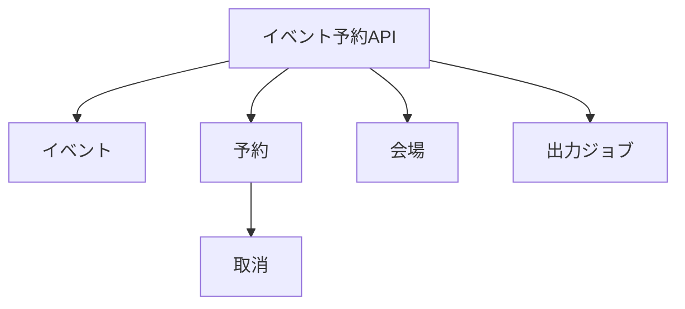
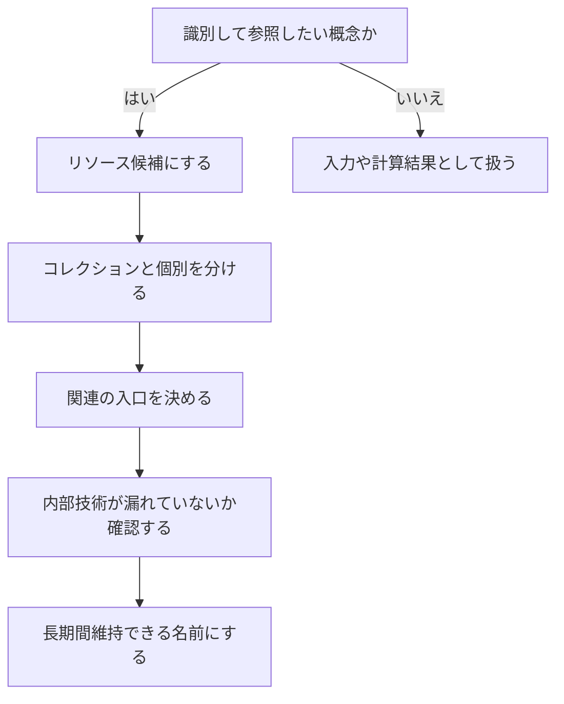

URIは、サーバーの関数名を書く場所ではありません。利用者が操作したい対象を、長期間安定して識別するための名前です。

イベント予約APIなら、イベント、予約、会場、主催者などがリソースの候補になります。本章では、業務概念をURIへ写し、コレクション、個別リソース、関連を一貫して表す方法を扱います。

## リソースはURIで識別したい概念である

リソースは、ファイルやデータベースの行に限りません。イベントという実体、イベントの予約一覧、予約の取消要求、長時間処理の進行状況など、APIを通じて識別し、取得または操作したい概念をリソースとして考えられます。



リソースを見つけるときは、「この概念へ安定した名前を付け、あとから参照したいか」を考えます。参照する必要のない一時的な計算結果まで、無理に永続リソースへする必要はありません。

## URIには名詞を置き、メソッドに操作を任せる

次のようなURIは、操作をパスへ書いています。

```text
POST /createEvent
GET  /getEvent?id=evt_123
POST /updateEvent
POST /deleteEvent
```

リソースを中心にすると、対象と操作の役割が分かれます。

```text
POST   /events
GET    /events/evt_123
PATCH  /events/evt_123
DELETE /events/evt_123
```

`/events/evt_123`は対象を識別し、メソッドが取得、部分更新、削除を表します。同じURIを複数の操作で共有できるため、API全体の規則も見えやすくなります。

ただし、「URLに動詞を一切使わない」は目的ではありません。予約の確定やイベント公開のような業務操作を、`/confirmations`というリソースとして表す方法もあります。名前の品詞だけを変えても意味が曖昧なら、設計は改善していません。操作後に何が作られ、どの状態が変わるかを先に決めます。

## コレクションと個別リソースを対にする

複数のイベントを表すコレクションには`/events`、その中の一件には`/events/{eventId}`を使います。

| URI | 意味 |
|---|---|
| `/events` | イベントのコレクション |
| `/events/evt_123` | 特定のイベント |
| `/reservations` | 予約のコレクション |
| `/reservations/rsv_789` | 特定の予約 |

パスパラメータ名は、OpenAPIやドキュメントで意味が分かる名前にします。`/{id}`だけでもルーティングできますが、`/{eventId}`なら、入れ子になったURIでも何のIDか迷いません。

実際のURIでは、`{eventId}`のような波括弧は使いません。これはドキュメント上のテンプレートです。リクエストでは`/events/evt_123`のような値になります。

## 識別子は不透明な値として扱う

クライアントは、IDの内部構造に依存しないようにします。

`evt_2026_tokyo_000123`に年、地域、連番を埋め込むと、クライアントが文字列を分解して使い始めるかもしれません。後から採番方式を変えにくくなります。年や地域が必要なら、明示的なフィールドとして返します。

```json
{
  "id": "evt_01J5Y8R7M3X4Q2N9A6K0B1CDEF",
  "region": "JP-13",
  "startsAt": "2026-10-18T04:00:00Z"
}
```

連番を使ってはいけないわけではありません。推測可能なIDを公開する場合は、認可を必ず別に行います。IDを知っていることをアクセス権の証明にしてはいけません。

## 関連を表すURIは利用者の入口から決める

イベントに属する予約一覧は、次の二通りで表せます。

```text
GET /events/evt_123/reservations
GET /reservations?eventId=evt_123
```

どちらも成立します。選択の基準は、関連の強さと主な利用方法です。

`/events/{eventId}/reservations`は「このイベントの予約」という入口が明確で、主催者向け画面に向きます。`/reservations?eventId=...`は、予約を横断検索し、イベントIDを絞り込み条件の一つとして扱う場合に向きます。

両方を提供する場合は、結果と権限の意味をそろえます。同じ予約一覧なのに、片方だけ取消済みを含む、片方だけ総件数が付く、といった差は利用者を迷わせます。

## 入れ子を深くしすぎない

次のURIは関係を詳しく表していますが、使いにくくなります。

```text
/organizers/org_1/events/evt_123/reservations/rsv_789/participants/usr_9
```

深い入れ子には、いくつか問題があります。

- URIが長くなり、ログやドキュメントで読みづらい
- 親が変わるとURIも変わる
- どの親まで認可条件に含むか曖昧になる
- 個別リソースへ直接アクセスしにくい

一意な予約IDがあるなら、個別予約は`/reservations/{reservationId}`で識別できます。親の文脈が必要なコレクション取得にだけ、`/events/{eventId}/reservations`を使うと整理しやすくなります。

目安として、所有関係を示す入れ子は1段か2段に抑えます。これは絶対規則ではありません。IDが親の中でしか一意にならない場合や、親から切り離して存在できない場合には、深い文脈が必要になることもあります。

## クエリはコレクションの見え方を変える

クエリパラメータは、主に絞り込み、並び替え、検索、ページネーション、表現の選択に使います。

```http
GET /events?status=published&city=tokyo&sort=startsAt&limit=20 HTTP/1.1
```

このURIは、イベントコレクションを特定の条件で見た結果を表します。条件の順序や省略時の既定値を決め、同じ条件が同じ意味になるようにします。

秘密情報はクエリへ入れません。URIはアクセスログ、ブラウザー履歴、分析ツール、Refererなどへ残る可能性があります。アクセストークン、パスワード、個人情報を含む検索値には別の伝達方法を検討します。

## URIへ実装技術を漏らさない

次のようなURIは、内部実装を公開契約へ持ち込みます。

```text
/api/getEvent.php?id=123
/v1/postgres/events/123
/lambda/create-reservation
```

PHPから別の実装へ移す、データベースを変える、サーバーレス関数を統合するといった内部変更が、URI変更につながります。

URIには利用者が理解する業務概念を置きます。実装の配置は、APIゲートウェイやルーティング層の内側で変更できるようにします。

ファイル拡張子も、表現形式を固定する理由がなければ不要です。`/events/evt_123.json`より`Accept: application/json`やAPI全体の既定形式で表すほうが、同じリソースに別表現を追加しやすくなります。

## URIは変えないことを優先する

公開したURIは、クライアントのコード、ログ、監視、ドキュメント、外部連携に残ります。命名を少し改善するためだけに変更すると、多くの利用者へ移行コストを生みます。

最初から完璧な名前を保証するのは困難です。だからこそ、業務概念を使い、内部技術を避け、細かな属性をIDへ埋め込まない設計が効きます。

変更が必要な場合は、リダイレクトだけで解決できるかを検討します。ただし、認証ヘッダーやメソッドを伴うAPIでは、クライアントがリダイレクトへどう対応するかを確認しなければなりません。新旧URIの併存と廃止通知を含む移行計画が必要です。

## イベント予約APIのURI一覧

現時点の主要なURIを整理します。

```text
/events
/events/{eventId}
/events/{eventId}/reservations
/reservations
/reservations/{reservationId}
/reservations/{reservationId}/cancellation
/venues
/venues/{venueId}
/exports
/exports/{exportId}
```

`/exports`は、予約者一覧のCSV生成を長時間処理として扱うためのリソースです。作成後に`/exports/{exportId}`を取得すれば、進行状況やダウンロード先を確認できます。

## URI設計の判断手順



## URIを公開する前に確認する

- [ ] URIが利用者の理解する業務概念を表している
- [ ] メソッドと重複する操作名を安易に入れていない
- [ ] コレクションと個別リソースの形がそろっている
- [ ] 識別子の内部構造へ依存させていない
- [ ] 入れ子が必要以上に深くない
- [ ] クエリへ秘密情報を入れていない
- [ ] フレームワーク、DB、実行基盤の名前が漏れていない
- [ ] URIを長期間維持できる

## URIは実装より長く残る

リソースを中心にURIを設計すると、利用者の目的とHTTPメソッドを自然につなげられます。URIは公開契約として残る名前なので、内部の関数名やテーブル名から切り離します。

次章では、同じURIへどのHTTPメソッドを組み合わせるかを決めます。安全性と冪等性を理解すると、取得、置換、部分更新、削除、業務操作を適切に分けられます。

## 参考仕様

- [RFC 3986: Uniform Resource Identifier](https://www.rfc-editor.org/rfc/rfc3986.html)
- [RFC 9110: HTTP Semantics](https://www.rfc-editor.org/rfc/rfc9110.html)
