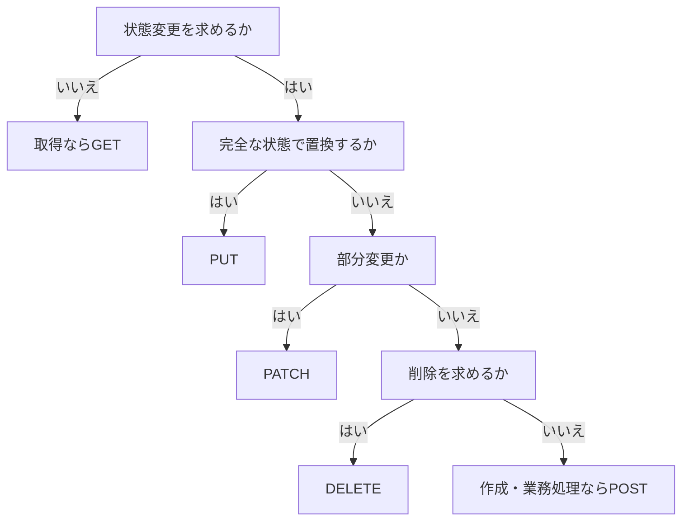

HTTPメソッドは、サーバーで呼び出す関数を選ぶだけの記号ではありません。クライアント、中継者、キャッシュが、リクエストの安全性や再試行可能性を判断する材料です。

`GET`、`POST`、`PUT`、`PATCH`、`DELETE`を中心に、イベント予約APIの操作へ適切なメソッドを割り当てます。

## 安全性と冪等性がメソッドの振る舞いを決める

HTTPメソッドを選ぶ前に、安全と冪等という二つの性質を理解します。

安全なメソッドは、クライアントがサーバーの状態変更を要求しません。`GET`で閲覧回数の記録やログ出力が起きても構いませんが、イベントを予約したり削除したりする意味を持たせてはいけません。

冪等なメソッドは、同じリクエストを一度実行しても複数回実行しても、意図したサーバー状態が同じになります。レスポンスが毎回同じという意味ではありません。

| メソッド | 安全 | 冪等 | 主な用途 |
|---|---:|---:|---|
| `GET` | はい | はい | 表現の取得 |
| `HEAD` | はい | はい | ボディを除く取得結果の確認 |
| `OPTIONS` | はい | はい | 通信方法や対応能力の確認 |
| `POST` | いいえ | 仕様次第 | 作成、処理の依頼 |
| `PUT` | いいえ | はい | 完全な表現による作成または置換 |
| `PATCH` | いいえ | 仕様次第 | 部分的な変更 |
| `DELETE` | いいえ | はい | 対象と現在の機能との関連を削除 |

冪等性は、通信障害時に効きます。クライアントがレスポンスを受け取れなかった場合、冪等な操作なら同じリクエストを再送しやすくなります。

## GETは取得だけに使う

イベント詳細の取得には`GET`を使います。

```http
GET /events/evt_123 HTTP/1.1
Accept: application/json
```

次のように、`GET`で状態を変更する設計は避けます。

```text
GET /reservations/rsv_789/cancel
GET /events/evt_123/publish
```

ブラウザーの先読み、検索エンジン、監視ツール、キャッシュなどが`GET`を自動実行することがあります。取得のつもりでアクセスしただけで予約が取り消されるAPIは危険です。

`GET`リクエストのコンテントには、一般化された意味が定義されていません。複雑な検索条件をボディへ入れると、クライアントや中継者が送信しない場合があります。通常はクエリを使い、長大な検索条件には`POST`による検索リソース、または後述する`QUERY`を検討します。

## POSTは対象固有の処理を依頼する

`POST`は、対象リソースに固有の処理を依頼します。コレクションへ送って新しいリソースを作る使い方が代表的です。

```http
POST /reservations HTTP/1.1
Content-Type: application/json

{
  "eventId": "evt_123",
  "seats": 2
}
```

サーバーが予約IDを決める場合、`POST /reservations`が自然です。成功時は`201 Created`と`Location`を返します。

`POST`は既定では冪等ではありません。同じ作成リクエストを再送すると、予約が二件作られる可能性があります。決済や予約のように重複が困る操作では、Idempotency-Keyなど、API固有の冪等化を設計します。

## PUTはクライアントが知る完全な状態で置き換える

`PUT`は、ターゲットURIの状態をリクエストの表現で作成または置換します。

```http
PUT /venues/ven_456 HTTP/1.1
Content-Type: application/json

{
  "name": "Harbor Hall",
  "address": {
    "country": "JP",
    "postalCode": "231-0001",
    "city": "Yokohama"
  },
  "capacity": 500
}
```

クライアントがURIを決め、会場の完全な表現を送れるなら`PUT`が使えます。同じ内容を繰り返し送っても、最終状態は変わりません。

一部のフィールドだけを送って更新する操作を`PUT`と呼ぶと、送らなかったフィールドが保持されるのか削除されるのか曖昧になります。部分更新には`PATCH`を使うか、API仕様で置換規則を明示します。

## PATCHではパッチ形式まで契約にする

`PATCH`は、リソースへ部分的な変更を適用します。何を送るかは、メディアタイプで決まります。

JSON Merge Patchでは、最終形に近いJSONを送ります。

```http
PATCH /events/evt_123 HTTP/1.1
Content-Type: application/merge-patch+json

{
  "title": "Web API Design Workshop",
  "description": null
}
```

この形式では、`description: null`はフィールドの削除を意味します。業務上の`null`を表したいフィールドとは相性が悪いため、採用前に確認が必要です。

JSON Patchでは、操作の列を送ります。

```http
PATCH /events/evt_123 HTTP/1.1
Content-Type: application/json-patch+json

[
  {"op":"replace","path":"/title","value":"Web API Design Workshop"},
  {"op":"remove","path":"/description"}
]
```

細かな操作や配列の変更を表せますが、パスが公開スキーマへ強く結びつきます。単純な更新ならMerge Patch、汎用編集機能ならJSON Patch、業務操作なら専用リソースというように使い分けます。

`PATCH`自体は必ずしも冪等ではありません。「参加者数を1増やす」というパッチは、送るたびに結果が変わります。「タイトルをこの値に置き換える」操作は冪等にできます。パッチ文書の意味まで見て判断します。

## DELETEは記録の物理削除を強制しない

`DELETE /events/evt_123`は、そのURIと現在の機能との関連を削除するよう求めます。データベースの行を物理的に消すことまでは要求しません。

監査や復旧のために内部記録を残しつつ、通常の取得から見えなくする実装も可能です。APIの契約には、利用者から見た結果を記載します。

一度削除した後に同じ`DELETE`を送った場合、最終状態は「対象が利用できない」のままです。最初は`204 No Content`、次は`404 Not Found`になっても、冪等性は保たれています。

イベント中止や予約取消を`DELETE`にするかは慎重に考えます。中止理由、返金、通知、状態遷移を追跡するなら、単純な削除より専用の業務操作が合います。

## HEADとOPTIONSは補助的な能力を提供する

`HEAD`は`GET`と同じヘッダーを、レスポンスボディなしで取得します。大きな出力ファイルの存在、サイズ、ETagを確認する用途があります。

```http
HEAD /exports/exp_123/file HTTP/1.1
```

`OPTIONS`は、対象との通信に利用できる選択肢を確認するメソッドです。ブラウザーのCORSプリフライトにも使われます。アプリケーションの業務データ取得へ流用しません。

## QUERYは安全な検索内容をボディで送る新しい選択肢

2026年6月に公開されたRFC 10008は、`QUERY`メソッドを定義しました。`QUERY`は安全かつ冪等で、検索内容をリクエストコンテントに入れられます。

```http
QUERY /events HTTP/1.1
Content-Type: application/json
Accept: application/json

{
  "startsBetween": ["2026-10-01", "2026-10-31"],
  "cities": ["tokyo", "yokohama"],
  "tags": {"all": ["api", "typescript"]}
}
```

複雑な検索を`POST /events/search`で表す方法に比べ、安全・冪等という意味がHTTP上で明確になります。ただし、新しいメソッドをプロキシ、WAF、SDK、ブラウザー環境が扱えるかは確認が必要です。互換性が重要な環境では、当面`GET`または検索専用リソースを使う判断も妥当です。

## 業務操作は結果のリソースから考える

イベント公開をどう表すか考えます。

単に`status`を`published`へ変更するだけで、特別な検証や履歴が不要なら、`PATCH /events/{id}`で十分かもしれません。

公開時に審査、公開日時の記録、通知、取り消し制約があるなら、公開という出来事を独立させます。

```http
POST /events/evt_123/publications HTTP/1.1
Content-Type: application/json

{
  "publishAt": "2026-08-10T01:00:00Z"
}
```

成功するとpublicationリソースが作られ、いつ誰が公開したかを参照できます。動詞を名詞に置き換えたから良いのではありません。独立したライフサイクルと記録を持つ概念だから、リソースにしています。

## メソッドを選ぶ順序



この図は出発点です。冪等性、処理結果として作られるリソース、クライアントや中継者の対応状況を重ねて最終決定します。

メソッドは名前の好みで選びません。状態を変えるか、完全置換か部分変更か、安全に再送できるかを先に決めると、クライアントもキャッシュや再試行の可否を判断できます。

## 参考仕様

- [RFC 9110: HTTP Semantics](https://www.rfc-editor.org/rfc/rfc9110.html)
- [RFC 5789: PATCH Method for HTTP](https://www.rfc-editor.org/rfc/rfc5789.html)
- [RFC 6902: JSON Patch](https://www.rfc-editor.org/rfc/rfc6902.html)
- [RFC 7386: JSON Merge Patch](https://www.rfc-editor.org/rfc/rfc7386.html)
- [RFC 10008: The HTTP QUERY Method](https://www.rfc-editor.org/rfc/rfc10008.html)
