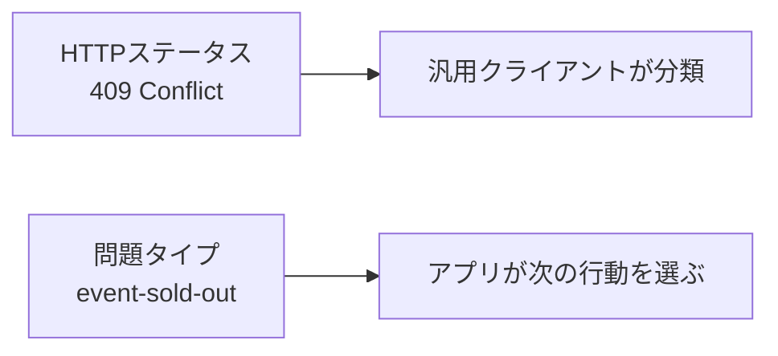

HTTPステータスコードは、クライアントがレスポンスを最初に分類するための情報です。成功、リダイレクト、クライアント側の問題、サーバー側の問題を、HTTPを理解するソフトウェアへ共通の意味で伝えます。

何でも`200 OK`で返してJSONの`success`を見る設計では、HTTPクライアント、監視、プロキシが結果を正しく判断できません。イベント予約APIで頻出するコードを、利用者の次の行動と結びつけて見ていきます。

## 3桁のコードは大分類から読む

| 範囲 | 分類 | クライアントの見方 |
|---|---|---|
| `1xx` | 情報 | 処理が継続している |
| `2xx` | 成功 | 意図が受け入れられた |
| `3xx` | リダイレクト | 別の表現や場所を参照する |
| `4xx` | クライアント側の問題 | リクエスト、認証、状態、流量を見直す |
| `5xx` | サーバー側の問題 | サーバーまたは中継者の回復を待つ |

細かなコードに迷ったときも、まず責任範囲を選びます。クライアントが入力を直せば成功する問題に`500`を返さず、サーバー障害に`400`を返しません。

## 成功コードは「何が完了したか」で選ぶ

### 200 OKは結果の表現を返す

取得や、結果をボディで返す更新に使います。

```http
HTTP/1.1 200 OK
Content-Type: application/json

{
  "id": "evt_123",
  "title": "API Design Workshop"
}
```

### 201 Createdはリソースの作成完了を示す

予約作成が完了したら、`201 Created`を返します。`Location`には作成されたリソースのURIを入れます。

```http
HTTP/1.1 201 Created
Location: /reservations/rsv_789
Content-Type: application/json

{
  "id": "rsv_789",
  "status": "confirmed"
}
```

### 202 Acceptedは受け付けただけである

CSV出力やイベント一括通知のように、処理を後で行う場合に使います。`202`は成功の完了を保証しません。処理が後で失敗する可能性があります。

```http
HTTP/1.1 202 Accepted
Location: /exports/exp_123
Content-Type: application/json

{
  "id": "exp_123",
  "status": "queued"
}
```

クライアントが進行状況を確認できるURI、完了通知、失敗時の状態を一緒に設計します。

### 204 No Contentは返す表現がない

削除や、結果を返す必要のない更新に使います。`204`レスポンスにボディを入れません。

```http
HTTP/1.1 204 No Content
```

更新後の値、警告、次のリンクを返したいなら、`200 OK`と表現を使います。

## 400はすべての失敗を入れる箱ではない

`400 Bad Request`は、リクエストの構文やフレーミングが不正で、サーバーが処理できない場合に使えます。壊れたJSONや、不正なクエリ構文が例です。

```http
HTTP/1.1 400 Bad Request
Content-Type: application/problem+json

{
  "type": "https://api.example.com/problems/malformed-json",
  "title": "Request body is not valid JSON",
  "status": 400
}
```

より具体的なコードがあるなら、そちらを使います。認証失敗と存在しないリソースを同じ`400`にすると、クライアントが次の行動を判断できません。

## 401と403で認証と認可を区別する

`401 Unauthorized`は、名前に反して「認証されていない、または提示した認証情報を受け入れられない」場合に使います。HTTP認証では`WWW-Authenticate`を返します。

```http
HTTP/1.1 401 Unauthorized
WWW-Authenticate: Bearer realm="event-api", error="invalid_token"
```

`403 Forbidden`は、サーバーがリクエストを理解したものの、実行を拒否する場合です。ログイン済みの参加者が主催者専用のイベント編集を試みた場合が該当します。

認証し直せば解決するなら`401`、現在の主体には権限がないなら`403`と考えます。ただし、リソースの存在自体を隠すため、他人の予約へ`404`を返す設計もあります。

## 404と410は存在の扱いを伝える

`404 Not Found`は、対象が見つからないか、存在を明かさない場合に使います。IDの形式が正しくても、該当イベントがなければ`404`です。

`410 Gone`は、対象が以前は存在したが、意図的に利用できなくなり、その状態が継続すると分かっている場合に使えます。すべての削除済みIDを記録できないAPIでは、`404`だけでも構いません。

## 409は現在の状態との競合を示す

`409 Conflict`は、リクエストが対象リソースの現在の状態と競合する場合に向きます。

- 満席のイベントへ予約する
- 公開済みイベントを、公開前だけ変更可能な方法で更新する
- 既存の一意な予約と重複する
- 現在のバージョンと異なる状態を更新する

```http
HTTP/1.1 409 Conflict
Content-Type: application/problem+json

{
  "type": "https://api.example.com/problems/event-sold-out",
  "title": "The event is full",
  "status": 409,
  "eventId": "evt_123"
}
```

競合を解消するために、クライアントが最新状態を取得したり、別の席数を選んだりできます。

## 412は条件付きリクエストの前提不成立を示す

`If-Match`を使った更新でETagが一致しない場合は、`412 Precondition Failed`を使います。

```http
PATCH /events/evt_123 HTTP/1.1
If-Match: "event-v7"
Content-Type: application/merge-patch+json

{"title":"New title"}
```

別の利用者が先に更新し、現在のETagが`"event-v8"`なら、前提条件を満たしません。

```http
HTTP/1.1 412 Precondition Failed
```

一般的な業務競合には`409`、HTTPの条件ヘッダーに失敗した場合には`412`と分けると、原因が明確になります。

## 415と406は表現形式の不一致を示す

`415 Unsupported Media Type`は、リクエストの`Content-Type`を処理できない場合です。JSONだけを受け付けるAPIへXMLを送った場合が該当します。

`406 Not Acceptable`は、`Accept`で求められたレスポンス形式を提供できない場合に使います。APIが対応形式を一つに限定しているなら、その形式をドキュメントに明記します。

## 422は構文を読めても内容を処理できない

`422 Unprocessable Content`は、コンテントの形式は理解できるものの、含まれた指示を処理できない場合に使えます。

```json
{
  "eventId": "evt_123",
  "seats": -2
}
```

JSONとしては正しくても、席数が負数なら業務入力として不正です。入力エラーをすべて`400`へ統一する設計も広く使われています。どちらを採用しても、API全体で規則をそろえ、エラー詳細から修正箇所を判断できるようにします。

`409`との境界は、値自体が受け入れられないのか、現在のリソース状態と組み合わせた結果として競合するのかで考えます。

## 429はクライアントごとの流量制限を示す

`429 Too Many Requests`は、一定時間内に送られたリクエストが多すぎる場合に使います。再試行可能な時刻や待ち時間を`Retry-After`で返せます。

```http
HTTP/1.1 429 Too Many Requests
Retry-After: 30
Content-Type: application/problem+json

{
  "type": "https://api.example.com/problems/rate-limit-exceeded",
  "title": "Too many requests",
  "status": 429
}
```

レート制限の単位、対象、リセット規則は別途ドキュメントにします。

## 5xxはクライアントの入力ミスに見せない

代表的な5xxを整理します。

| コード | 意味 | 例 |
|---|---|---|
| `500` | サーバー内で予期しない失敗 | 未処理例外 |
| `502` | ゲートウェイが上流から不正な応答を受けた | 決済サービスの異常応答 |
| `503` | 一時的に処理できない | 過負荷、保守、依存先停止 |
| `504` | ゲートウェイが上流応答を時間内に得られない | 外部サービスのタイムアウト |

`503 Service Unavailable`では`Retry-After`を返せます。ただし、クライアントは非冪等操作を無条件に再送してはいけません。サーバーが処理を完了した後、レスポンスだけ失われた可能性があるからです。

例外を一律に`400`へ変換すると、監視が障害を検知できず、クライアントは入力を直そうとして無駄な再送を行います。責任範囲を正しく返します。

## ステータスコードと業務コードを組み合わせる

HTTPコードだけでは、満席、受付終了、重複予約を区別しきれません。ステータスコードで一般的な意味を伝え、ボディの問題タイプで業務上の詳細を伝えます。



独自の業務コードでHTTPの意味を上書きしないことが要点です。`HTTP 200`のボディに`errorCode: 500`を入れる形は避けます。

## 予約APIの代表的な対応表

| 状況 | コード |
|---|---:|
| 予約を作成した | `201` |
| CSV出力を受け付けた | `202` |
| 予約を正常に取り消した | `200`または`204` |
| JSONが壊れている | `400` |
| トークンがない・無効 | `401` |
| 他人の予約を操作しようとした | `403`または`404` |
| イベントが存在しない | `404` |
| 満席・重複予約 | `409` |
| ETagが一致しない | `412` |
| Content-Typeを扱えない | `415` |
| 席数が負数 | `422`または一貫した方針の`400` |
| 呼び出し回数を超えた | `429` |
| サーバー内部で障害が起きた | `500` |
| 一時的な過負荷 | `503` |

ステータスコードは、クライアントが最初に読む結果の分類です。入力を直すのか、認証し直すのか、競合を解消するのか、待って再試行するのか。次の行動が異なるなら、同じコードへ押し込まないほうが扱いやすくなります。

## 参考仕様

- [RFC 9110: HTTP Semantics](https://www.rfc-editor.org/rfc/rfc9110.html)
- [RFC 6585: Additional HTTP Status Codes](https://www.rfc-editor.org/rfc/rfc6585.html)
