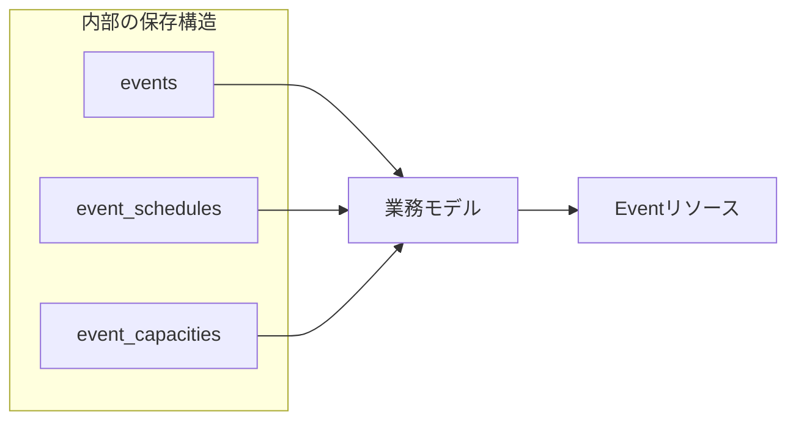
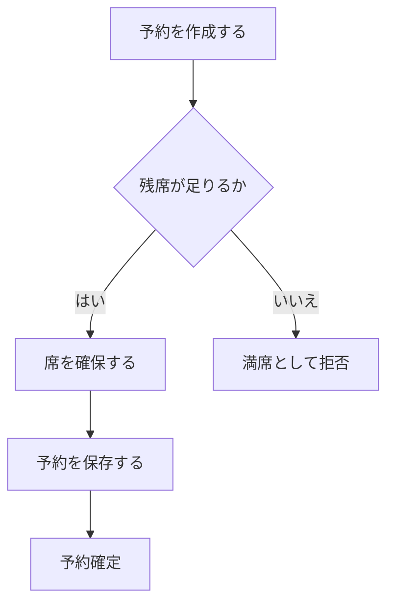

HTTPの基本を押さえたら、次は業務をどのようなリソースとして見せるかを考えます。

データベースには、保存と検索に都合のよい構造があります。APIに必要なのは、利用者が目的を達成しやすい構造です。両者が似ることはあっても、同じ設計図から機械的に作るものではありません。

イベント予約という業務を言葉で整理し、公開するリソースと内部に隠す構造を分けます。

## テーブルを公開すると内部変更が外へ漏れる

イベント予約サービスの内部に、次のテーブルがあるとします。

```text
events
event_schedules
event_capacities
reservation_records
reservation_seat_allocations
reservation_status_histories
users
```

これらをそのままAPIへ対応させると、イベント詳細を表示するだけで複数のエンドポイントを呼ぶことになります。さらに、正規化の方針を変えたとき、APIまで変更しなければなりません。

利用者が扱いたいのは、`event_capacities`の行ではなく、「このイベントにあと何席予約できるか」です。APIでは、内部の複数データを一つの業務概念として再構成します。



## 業務で使う言葉を集める

リソース候補を探すときは、要件、会話、業務ルールに繰り返し現れる言葉を集めます。

イベント予約サービスでは、次の言葉が中心になります。

| 言葉 | 意味 |
|---|---|
| イベント | 参加者を募集する催し |
| 開催枠 | 開始・終了日時と定員を持つ開催単位 |
| 会場 | イベントを開催する場所 |
| 予約 | 参加者が席を確保した記録 |
| 参加者 | 予約を行う利用者 |
| 主催者 | イベントを作成・公開する主体 |
| 取消 | 予約を有効な状態から外す業務上の出来事 |

同じ言葉を人によって違う意味で使っていないかも確認します。「参加者」が予約者だけを指すのか、同伴者を含むのか。「定員」が会場の最大収容数か、イベントで販売する席数か。意味が曖昧なままフィールド名へすると、APIの利用者も迷います。

## 識別・状態・振る舞いを持つ概念を探す

リソース候補を評価するときは、次の問いが役立ちます。

- 独立したIDで参照したいか
- 時間とともに状態が変わるか
- 作成、更新、取消などの操作対象になるか
- ほかの概念との関係を持つか
- 履歴や権限を個別に管理したいか

イベントと予約は、これらに当てはまります。一方、「残席数」はイベントから計算される値であり、独立したリソースにしなくても表現できます。

```json
{
  "id": "evt_123",
  "capacity": 100,
  "availableSeats": 18
}
```

残席数を独立リソースにするかは利用方法次第です。座席種別ごとの在庫を個別に確保し、履歴やロックを扱うなら、`inventory`や`seatPool`のような概念が必要になるかもしれません。

## 整合性を守る単位で更新境界を考える

予約作成では、予約レコードの保存と残席の確保を一体として扱う必要があります。二つを別々の公開操作にすると、片方だけ成功する状態が生まれます。



APIの操作単位は、テーブルの更新単位より、業務上の整合性を守る単位から決めます。内部ではトランザクション、ロック、キューなどを使いますが、クライアントには「予約が確定した」か「確定しなかった」かを返します。

## 内部モデルと公開モデルを分ける

内部で必要なデータをすべてAPIへ返す必要はありません。

```json
{
  "id": "evt_123",
  "title": "API Design Workshop",
  "startsAt": "2026-10-18T04:00:00Z",
  "status": "published",
  "availableSeats": 18
}
```

公開表現から、次のような内部情報は外します。

- データベースの連番主キー
- 内部ジョブのID
- 不正検知のスコア
- 主催者の審査メモ
- 論理削除の管理列
- 個人情報や認証情報

外しておけば安全、という単純な話でもありません。利用者の目的に必要な情報が欠けると、追加APIが増えます。公開する理由と隠す理由を、フィールドごとに確認します。

## 読み取りモデルは利用場面に合わせてよい

同じイベントでも、一覧と詳細で必要な情報量は違います。

一覧では、タイトル、開始日時、場所、受付状態があれば十分かもしれません。詳細では、説明、主催者、参加条件、取消規則も必要です。

```json
{
  "items": [
    {
      "id": "evt_123",
      "title": "API Design Workshop",
      "startsAt": "2026-10-18T04:00:00Z",
      "city": "yokohama",
      "availability": "available"
    }
  ]
}
```

一覧用に別のデータベーステーブルを公開するわけではありません。同じリソースの簡潔な表現として返します。必要なら`fields`や`include`で表現を選べるようにしますが、選択肢が増えるほどキャッシュとテストも複雑になります。

## 書き込みモデルは許可する変更を絞る

レスポンスのEvent表現を、そのまま作成リクエストに使う設計は危険です。

レスポンスには、サーバーが管理する`id`、`status`、`availableSeats`、`createdAt`が含まれます。これらをクライアントから受け取ると、無視するのか、検証するのか、上書きするのかが曖昧になります。

作成入力は、利用者が決めてよい値に限定します。

```json
{
  "title": "API Design Workshop",
  "startsAt": "2026-10-18T04:00:00Z",
  "endsAt": "2026-10-18T07:00:00Z",
  "venueId": "ven_456",
  "capacity": 100
}
```

作成、更新、公開では許される変更が異なります。用途別の入力スキーマを作ると、認可と業務ルールを表しやすくなります。

## 他システムの概念をそのまま自分のAPIにしない

決済、地図、通知などの外部サービスを使うと、そのサービス固有のIDや状態名が内部へ入ります。公開APIまで外部サービスの語彙にすると、乗り換えが難しくなります。

たとえば、決済事業者の`payment_intent_id`を予約APIの主識別子にしません。自分のAPIでは`paymentId`を持ち、外部IDとの対応を内部で管理します。

外部サービスの状態をそのまま返す必要がある場合は、どのサービス由来かを明示し、変更可能性を契約に含めます。通常は、自分の業務に必要な状態へ変換するほうが安定します。

## イベント予約APIのリソース境界

現時点では、次の境界を採用します。

| リソース | 主な責任 |
|---|---|
| Event | 催しの内容、開催日時、公開状態、定員 |
| Venue | 会場名、住所、収容可能人数 |
| Reservation | 参加者の席確保、現在状態、席数 |
| Cancellation | 予約取消の理由、実行者、実行日時 |
| Export | 大量データ出力の進行状況と結果 |

Userを公開リソースにするかは、APIの範囲によります。本書では認証基盤が利用者を管理し、イベント予約APIは認証結果の`subject`で主体を識別します。プロフィールAPIまで同じ境界へ入れる必要はありません。

リソースはデータの置き場所ではなく、利用者が識別し、状態を確かめ、操作する業務概念です。テーブルをいったん業務の言葉へ戻してから、公開後も保ちたい境界を選びます。
