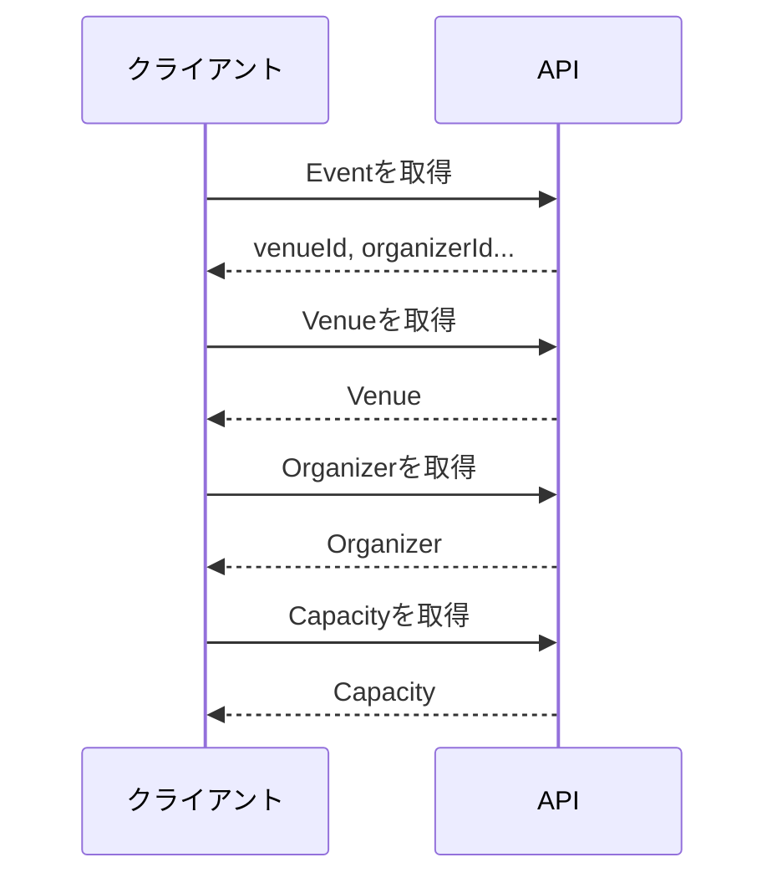
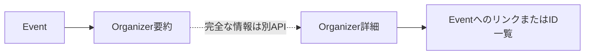

リソースを細かく分けすぎると、画面一つを表示するために大量のリクエストが必要になります。反対に、何でも一つのレスポンスへ詰め込むと、サイズ、権限、更新頻度の違いを扱いにくくなります。

関連データを埋め込むか、IDやリンクで参照するか。利用頻度、サイズ、権限、更新頻度から、リソースの粒度を判断します。

## 細かすぎるAPIは往復回数を増やす

イベント詳細を表示するため、次のAPIを順番に呼ぶ設計を考えます。

```text
GET /events/evt_123
GET /event-schedules/sch_456
GET /venues/ven_789
GET /organizers/org_234
GET /event-capacities/cap_567
```

各リソースが正規化されていても、クライアントは5回の通信と結合処理を担います。モバイル回線では待ち時間が積み重なり、途中の一件だけ失敗する可能性もあります。



内部データの分割を、クライアントへそのまま負担させています。

## 大きすぎるAPIは変化を結びつけすぎる

すべてを埋め込んだイベントレスポンスにも問題があります。

```json
{
  "id": "evt_123",
  "title": "API Design Workshop",
  "venue": {"id":"ven_789","name":"Harbor Hall","...":"..."},
  "organizer": {"id":"org_234","name":"Example Inc.","...":"..."},
  "reservations": ["...数千件..."],
  "auditLogs": ["...管理者専用..."],
  "relatedEvents": ["..."],
  "analytics": {"...":"..."}
}
```

利用者がタイトルだけ欲しい場合も巨大なレスポンスを受け取ります。参加者へ返してはいけない監査情報が混ざり、予約件数が増えるほどサイズも増えます。イベントと関連データの変更頻度が異なるため、キャッシュも効きにくくなります。

## 粒度は5つの観点で判断する

関連データを分けるか埋め込むかは、次の観点で検討します。

| 観点 | 埋め込みが向く | 分離が向く |
|---|---|---|
| 利用頻度 | ほぼ毎回一緒に使う | 必要な場面が限られる |
| サイズ | 小さく上限が明確 | 件数が増え続ける |
| 更新頻度 | 親と同程度 | 親と大きく異なる |
| 権限 | 同じ利用者が見られる | より厳しい権限が必要 |
| ライフサイクル | 親と一体 | 独立して作成・更新する |

会場の名前と都市は、イベント一覧でほぼ毎回使い、サイズも小さいため、簡潔に埋め込めます。予約一覧は件数が増え、権限も異なるため、別エンドポイントに分けます。

## ID参照と要約埋め込みを使い分ける

イベント詳細に、会場の要約を埋め込む例です。

```json
{
  "id": "evt_123",
  "title": "API Design Workshop",
  "venue": {
    "id": "ven_789",
    "name": "Harbor Hall",
    "city": "yokohama"
  }
}
```

完全な住所、設備、アクセス方法が必要なら、`GET /venues/ven_789`を取得します。

要約を埋め込むときは、その値がどの時点のものかを決めます。会場名を変更したら過去イベントの表現も変わるのか、予約時点の名称を保存するのか。単なるJSON構造に見えても、履歴の意味が関わります。

## リンクは関連先を発見できるようにする

関連先のURIをレスポンスへ含める方法もあります。

```json
{
  "id": "evt_123",
  "title": "API Design Workshop",
  "links": {
    "self": "/events/evt_123",
    "venue": "/venues/ven_789",
    "reservations": "/events/evt_123/reservations"
  }
}
```

クライアントがURIを組み立てずに済み、将来のパス変更にも対応しやすくなります。一方、すべてのレスポンスへ大量のリンクを入れると冗長です。外部公開API、長寿命の連携、状態に応じて利用可能な操作が変わるAPIでは効果が高くなります。

リンクを返すなら、文字列の意味をスタイルガイドで統一します。`url`、`href`、`link`を混在させません。

## includeで必要な関連だけ展開する

利用者によって必要な情報が違う場合、関連の展開を選べるようにします。

```http
GET /events/evt_123?include=venue,organizer HTTP/1.1
```

```json
{
  "id": "evt_123",
  "title": "API Design Workshop",
  "venue": {
    "id": "ven_789",
    "name": "Harbor Hall"
  },
  "organizer": {
    "id": "org_234",
    "displayName": "Example Inc."
  }
}
```

`include`は往復回数を減らしますが、組み合わせごとの性能、認可、キャッシュ、テストが必要です。無制限な多段展開を許すと、一つのリクエストで巨大な処理を要求されます。展開可能な関係と深さを限定します。

## 一覧と詳細で表現の厚みを変える

イベント一覧では、カード表示に必要な要約を返します。

```json
{
  "items": [
    {
      "id": "evt_123",
      "title": "API Design Workshop",
      "startsAt": "2026-10-18T04:00:00Z",
      "venue": {"name":"Harbor Hall","city":"yokohama"},
      "availability": "available"
    }
  ]
}
```

詳細では、説明、参加条件、取消規則を加えます。

同じフィールドの意味を変えてはいけません。一覧の`venue`が文字列、詳細の`venue`がオブジェクトという設計は、型を不安定にします。要約でもオブジェクトの形を保つか、`venueName`と`venue`を別名にします。

## 循環参照を作らない

イベントに主催者を埋め込み、主催者に全イベントを埋め込み、各イベントに再び主催者を埋め込むと、表現が循環します。



埋め込みは要約に留め、詳細やコレクションはリンクまたは別取得にします。どこで表現を切るかを明示します。

## 1回のAPI呼び出しを大量の内部問い合わせにしない

クライアントのリクエストを1回にまとめても、サーバーがイベント20件ごとに会場を20回問い合わせていれば、性能問題は残ります。

一覧の件数に比例して内部問い合わせが増える問題を、N+1と呼びます。API設計と実装は分けて考えますが、提供すると約束した表現を現実的なコストで作れるかは確認します。バッチ取得、結合、読み取り専用モデル、キャッシュなどを使い、一覧件数が増えても予測可能な処理量にします。

## イベント詳細の採用形

本書では、イベント詳細を次の方針にします。

- 会場と主催者は小さな要約を埋め込む
- 予約一覧は別エンドポイントに分ける
- 予約件数と残席数は集計値として返す
- 管理者向け監査情報は管理APIに分ける
- 必要な場合だけ`include`で追加情報を展開する

```json
{
  "id": "evt_123",
  "title": "API Design Workshop",
  "startsAt": "2026-10-18T04:00:00Z",
  "venue": {
    "id": "ven_789",
    "name": "Harbor Hall",
    "city": "yokohama"
  },
  "organizer": {
    "id": "org_234",
    "displayName": "Example Inc."
  },
  "capacity": 100,
  "availableSeats": 18,
  "reservationCount": 82
}
```

適切な粒度は、テーブルの分割数では決まりません。利用頻度、サイズ、更新頻度、権限、ライフサイクルが近い情報をまとめ、違う情報を分けます。そのうえで、約束した表現を現実的な処理量で作れるかまで確かめます。
