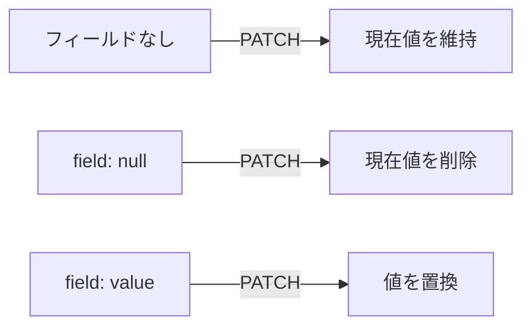

JSONは単純に見えますが、日時、金額、大きな整数、空の値をどう表すかには判断が必要です。表現を曖昧にすると、JavaScript、Java、Go、Swiftなど、クライアントの言語ごとに異なる解釈が生まれます。

本章では、イベント予約APIの命名と基本データ型を統一します。

## 名前は意味の違いを運ぶ

同じ概念には同じ名前を使い、異なる概念は区別します。

```json
{
  "id": "rsv_789",
  "eventId": "evt_123",
  "reservedBy": "usr_456"
}
```

このレスポンスでは、`id`は予約ID、`eventId`は対象イベント、`reservedBy`は予約を行った主体です。すべてを`id`、`targetId`、`user`のような短い名前にすると、文脈を読まなければ意味が分かりません。

名前を長くしすぎる必要もありません。`identifierOfTheEventBeingReserved`は正確でも扱いにくいため、API全体で`eventId`の意味を共有します。

## 命名規則を一つ選ぶ

JSONフィールドには、主にcamelCaseとsnake_caseが使われます。

```json
{"startsAt":"2026-10-18T04:00:00Z"}
```

```json
{"starts_at":"2026-10-18T04:00:00Z"}
```

どちらか一方が常に優れているわけではありません。対象クライアント、既存API、生成ツールとの相性から選びます。本書ではcamelCaseを採用します。

パスは小文字とハイフン、JSONはcamelCaseというように、場所ごとに規則が異なっても構いません。同じ場所で混在させないことが大切です。

略語も規則を決めます。`url`、`api`、`id`を`URL`、`Api`、`ID`と揺らさず、`callbackUrl`、`apiVersion`、`eventId`のように統一します。

## IDは文字列として公開する

内部で整数を使っていても、公開APIではIDを文字列にすると扱いやすくなります。

```json
{
  "id": "evt_123"
}
```

JavaScriptの`number`は、`2^53 - 1`を超える整数を正確に表せません。データベースの64ビット整数をJSON数値で返すと、クライアントで丸められる可能性があります。

文字列なら、UUID、ULID、連番など内部の採番方式を変更しやすく、先頭のゼロも保持できます。IDへ算術演算を行う理由もありません。

IDの形式は公開契約になるため、クライアントには不透明な値として扱ってもらいます。正規表現で分解し、埋め込まれた意味を利用させません。

## 日時はタイムゾーンを失わない

ある瞬間を表す日時には、RFC 3339形式の文字列を使います。

```json
{
  "startsAt": "2026-10-18T04:00:00Z",
  "bookingClosesAt": "2026-10-17T14:59:59Z"
}
```

`Z`はUTCを表します。オフセット付きの`2026-10-18T13:00:00+09:00`も同じ瞬間を表せます。API全体でUTCに正規化すると比較しやすくなりますが、表示時には会場のタイムゾーンが必要です。

```json
{
  "startsAt": "2026-10-18T04:00:00Z",
  "timeZone": "Asia/Tokyo"
}
```

タイムゾーン名は、将来の夏時間規則を含む地域の規則を表します。UTCオフセット`+09:00`だけでは、地域や将来の規則を特定できません。

### 日付だけの値は日時にしない

誕生日、請求対象日、イベントの開催日ラベルなど、時刻を持たない値は`YYYY-MM-DD`で表します。

```json
{"eventDate":"2026-10-18"}
```

便宜的に午前0時の日時へ変換すると、タイムゾーン変換によって前日になることがあります。業務上の型が日付なら、日付として公開します。

### 期間は開始と終了を明示する

```json
{
  "startsAt": "2026-10-18T04:00:00Z",
  "endsAt": "2026-10-18T07:00:00Z"
}
```

終了時刻を含むかどうかも契約です。本書では、期間を`startsAt <= t < endsAt`の半開区間として扱います。隣接する開催枠を重なりなく表せます。

## 金額は浮動小数点数にしない

`19.99`のような十進小数をJSON数値で扱うと、言語によって二進浮動小数点へ変換され、丸め誤差が生じます。

方法の一つは、最小通貨単位の整数と通貨コードを使うことです。

```json
{
  "amount": 2500,
  "currency": "JPY"
}
```

日本円なら`2500`円です。小数単位を持つ通貨では、`amount`がセントなどの最小単位を表します。通貨によって小数桁が異なるため、意味をドキュメントに書きます。

任意精度の十進数を文字列で返す方法もあります。

```json
{
  "amount": "19.99",
  "currency": "USD"
}
```

計算方法、丸め規則、税込・税抜も契約です。フィールド名だけでは伝わらないため、スキーマの説明に含めます。

## 列挙値は将来増えると考える

予約状態を文字列の列挙値で返します。

```json
{"status":"confirmed"}
```

数値の`status: 2`より意味が読みやすく、ログでも理解できます。ただし、将来`waitlisted`や`expired`が追加される可能性があります。

クライアントが未知の値でクラッシュしない設計にします。表示上の既定処理を持ち、業務上安全でない操作は停止するなど、前方互換性を考えます。

提供者側では、一度公開した値の綴りや意味を変更しません。`canceled`から`cancelled`への修正も、利用者には破壊的変更です。

## Booleanは二値の問いにだけ使う

```json
{"isOnline":true}
```

真偽が明確な属性にはBooleanが合います。`status: 1`や`isOnline: "yes"`といった表現を混ぜません。

状態が三つ以上あるのにBooleanを使うと、後から苦しくなります。`isPublished`だけでは、下書き、公開予約、公開中、中止、終了を表せません。ライフサイクルには`status`を使います。

## null・省略・空を区別する

次の三つは意味が違います。

```json
{"description":null}
```

```json
{}
```

```json
{"tags":[]}
```

| 表現 | 代表的な意味 |
|---|---|
| `null` | 値がない、未設定、適用外 |
| フィールド省略 | 返却対象外、変更しない、権限で非表示 |
| 空文字列 | 文字列として値が空 |
| 空配列 | コレクションは存在するが要素が0件 |

特に`PATCH`では、省略を「変更しない」、`null`を「値を削除する」と定義する場合があります。レスポンスと更新入力で意味が異なることもあるため、スキーマごとに書きます。



## 配列は0件でも配列で返す

予約が0件のときに、`null`、空オブジェクト、空配列を状況によって変えません。

```json
{
  "items": []
}
```

クライアントは型を分岐せずに反復処理できます。単一リソースが存在しない場合は、ボディの`null`ではなく`404 Not Found`で表すほうが明確なこともあります。

## 単位を名前かスキーマで明示する

`timeout: 30`だけでは、秒かミリ秒か分かりません。

```json
{
  "timeoutSeconds": 30,
  "distanceMeters": 450
}
```

フィールド名へ単位を入れるか、スキーマで単位を明記します。時間間隔をISO 8601 durationの文字列で表す方法もありますが、クライアントの対応状況を確認します。

## イベント表現を統一する

```json
{
  "id": "evt_123",
  "title": "API Design Workshop",
  "status": "published",
  "startsAt": "2026-10-18T04:00:00Z",
  "endsAt": "2026-10-18T07:00:00Z",
  "timeZone": "Asia/Tokyo",
  "price": {
    "amount": 2500,
    "currency": "JPY"
  },
  "capacity": 100,
  "availableSeats": 18,
  "tags": ["api", "backend"],
  "description": null
}
```

各値の型だけでなく、単位、範囲、省略条件、更新可能性をOpenAPIへ記述します。

## データ表現を確認する

- [ ] 同じ概念に同じフィールド名を使っている
- [ ] JSONの命名規則と略語の扱いが決まっている
- [ ] IDを不透明な文字列として扱っている
- [ ] 瞬間、日付、期間、タイムゾーンを区別している
- [ ] 金額に通貨と丸め規則がある
- [ ] 列挙値の追加にクライアントが備えられる
- [ ] Booleanで多状態のライフサイクルを表していない
- [ ] `null`、省略、空配列の意味を決めている
- [ ] 数値の単位が分かる

## 値の意味まで型にする

型が`string`や`number`と分かるだけでは、正しく使えません。日時の基準、金額の単位、列挙値の拡張、空の意味まで含めてデータを設計します。

次章では、フィールド更新だけでは表現しにくい業務操作を扱います。イベント公開、予約取消、イベント中止を状態遷移として捉え、許される変化をAPIへ表します。

## 参考仕様

- [RFC 8259: The JavaScript Object Notation Data Interchange Format](https://www.rfc-editor.org/rfc/rfc8259.html)
- [RFC 3339: Date and Time on the Internet](https://www.rfc-editor.org/rfc/rfc3339.html)
- [RFC 9557: Date and Time on the Internet: Timestamps with Additional Information](https://www.rfc-editor.org/rfc/rfc9557.html)
