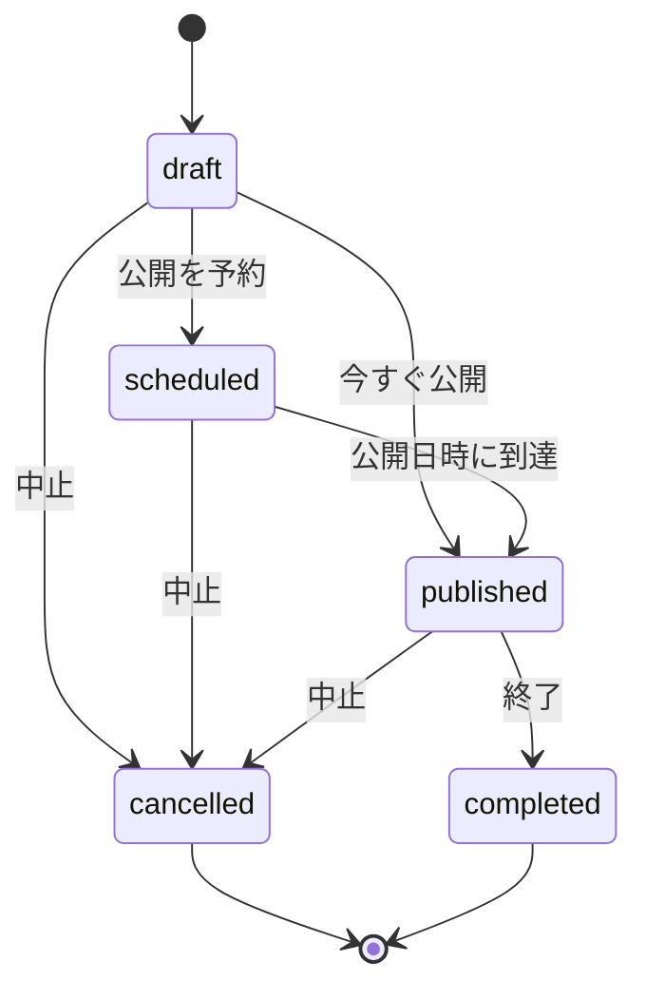
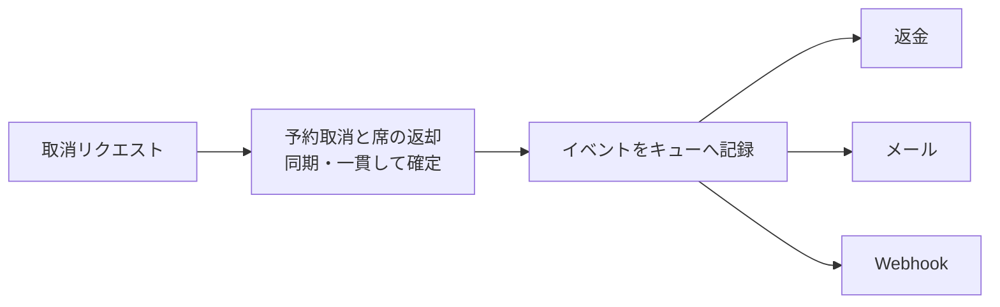

作成、取得、更新、削除だけで多くのAPIを表せます。しかし、イベント公開、予約取消、イベント中止には、単なるフィールド更新以上の意味があります。

業務操作には、実行条件、状態遷移、権限、後続処理、履歴があります。CRUDへ無理に押し込まず、業務上の意味を保ったままAPIへ表します。

## statusを自由更新させると業務ルールが漏れる

イベントの状態を次の`PATCH`で変更できるとします。

```http
PATCH /events/evt_123 HTTP/1.1
Content-Type: application/merge-patch+json

{"status":"published"}
```

この形だけでは、次の疑問に答えられません。

- 下書きから公開へ直接移れるか
- 審査中のイベントを公開できるか
- 開始日時を過ぎたイベントを公開できるか
- 公開時に必須項目を再検証するか
- 誰が公開したか記録するか
- 公開通知の失敗をどう扱うか

`status`を任意の文字列として更新させると、クライアントが状態機械を管理することになります。サーバーは最終的な整合性を守れません。

## 状態遷移を先に描く

イベントのライフサイクルを、次のように定義します。



図にすると、許される遷移と存在しない遷移が見えます。`completed`から`draft`へ戻す操作はありません。`cancelled`は削除ではなく、記録として残る終端状態です。

状態ごとに、編集可能なフィールドも変わります。下書きなら日時と定員を編集でき、公開後はタイトルの軽微な修正だけ許す、といった規則を別に定義します。

## 単純な属性変更にはPATCHを使う

説明文や問い合わせ先の更新は、イベントの本質的な状態遷移を起こしません。このような属性変更には`PATCH`が合います。

```http
PATCH /events/evt_123 HTTP/1.1
Content-Type: application/merge-patch+json
If-Match: "event-v7"

{
  "description": "Updated description",
  "contactEmail": "events@example.com"
}
```

更新可能なフィールドは、状態と権限に応じてサーバーが検証します。入力スキーマを公開状態別に分けるか、拒否理由を明確に返します。

## 重要な出来事はリソースとして表す

イベント公開に独立した記録とライフサイクルがあるなら、publicationリソースを作ります。

```http
POST /events/evt_123/publications HTTP/1.1
Content-Type: application/json

{
  "publishAt": "2026-08-10T01:00:00Z"
}
```

```http
HTTP/1.1 201 Created
Location: /events/evt_123/publications/pub_456
Content-Type: application/json

{
  "id": "pub_456",
  "eventId": "evt_123",
  "status": "scheduled",
  "publishAt": "2026-08-10T01:00:00Z"
}
```

これにより、公開予約の照会や取消をリソース操作として扱えます。

一方、公開記録を後から参照せず、即時に一回だけ状態を変えるなら、`POST /events/evt_123/publish`という命令型エンドポイントも実務上は成立します。RESTらしい見た目を作るために、実体のない名詞を増やす必要はありません。API全体で業務操作の表し方をそろえ、動作を説明します。

## 予約取消は削除より状態遷移が合う

予約を取り消しても、監査、問い合わせ、返金のために記録を残します。`DELETE /reservations/{id}`では、取消という出来事と理由を表しにくくなります。

```http
POST /reservations/rsv_789/cancellation HTTP/1.1
Content-Type: application/json

{
  "reason": "schedule_changed"
}
```

```http
HTTP/1.1 201 Created
Location: /reservations/rsv_789/cancellation
Content-Type: application/json

{
  "reservationId": "rsv_789",
  "status": "cancelled",
  "reason": "schedule_changed",
  "cancelledAt": "2026-08-09T12:45:00Z"
}
```

予約につき取消は一つなので、単数形の`cancellation`をサブリソースとして扱っています。複数回の取消要求や復旧履歴を保存するなら、`cancellations`のコレクションにする設計もあります。

## 遷移できない理由を競合として返す

すでに取消済みの予約を再び取り消す、終了済みイベントを公開するといった操作は、現在状態と競合します。

```http
HTTP/1.1 409 Conflict
Content-Type: application/problem+json

{
  "type": "https://api.example.com/problems/invalid-state-transition",
  "title": "The reservation cannot be cancelled",
  "status": 409,
  "currentStatus": "cancelled",
  "requestedAction": "cancel"
}
```

クライアントがメッセージを解析しなくても分岐できるよう、問題タイプと現在状態を構造化して返します。

同じ取消要求を再送した場合に、以前の成功結果を返す設計も可能です。これは冪等性の方針です。初回と再送を見分けるキー、保持期間、入力が異なる場合の拒否規則を第20章で扱います。

## 状態遷移と副作用を分けて考える

予約取消には、次の処理が続くかもしれません。

1. 予約状態を`cancelled`にする
2. 席を在庫へ戻す
3. 返金を開始する
4. 参加者へメールを送る
5. 外部の入場管理システムへ通知する

すべてを同期処理にすると、メールサービスの遅延で取消APIまで失敗します。取消の成立に必要な処理と、後から再試行できる副作用を分けます。



APIが`200`や`201`を返した時点で何が確定し、何が処理中なのかを明記します。返金完了まで待たないなら、予約表現に`refundStatus: "pending"`を含めるか、返金リソースを別に参照できるようにします。

## 長時間操作はジョブを作る

全イベントの予約者へ通知する処理は、同期レスポンスに収まらない可能性があります。`POST`でジョブを作り、`202 Accepted`を返します。

```http
POST /events/evt_123/notification-jobs HTTP/1.1
Content-Type: application/json

{
  "templateId": "event-cancelled"
}
```

```http
HTTP/1.1 202 Accepted
Location: /notification-jobs/job_456

{
  "id": "job_456",
  "status": "queued"
}
```

ジョブには`queued`、`running`、`succeeded`、`failed`などの状態を持たせます。部分成功、再実行、結果の保持期間も契約に含めます。

## 状態機械はサーバーが所有する

クライアントは、利用可能な操作を表示するため状態を参照します。しかし、遷移の正当性を最終判断するのはサーバーです。

画面で取消ボタンを隠しても、直接APIを呼ばれる可能性があります。現在状態、主体、期限、関連リソースをサーバーで検証します。

利用可能な操作をリンクで返す方法もあります。

```json
{
  "id": "rsv_789",
  "status": "confirmed",
  "links": {
    "self": "/reservations/rsv_789",
    "cancel": "/reservations/rsv_789/cancellation"
  }
}
```

取消済みなら`cancel`リンクを返しません。クライアントのUIを助けられますが、認可検証の代わりにはなりません。

CRUDは便利な出発点ですが、業務のすべてを表せるわけではありません。公開、取消、中止に固有の条件や履歴があるなら、状態遷移や独立したリソースとして表します。遷移の最終判断は、常にサーバーが担います。
