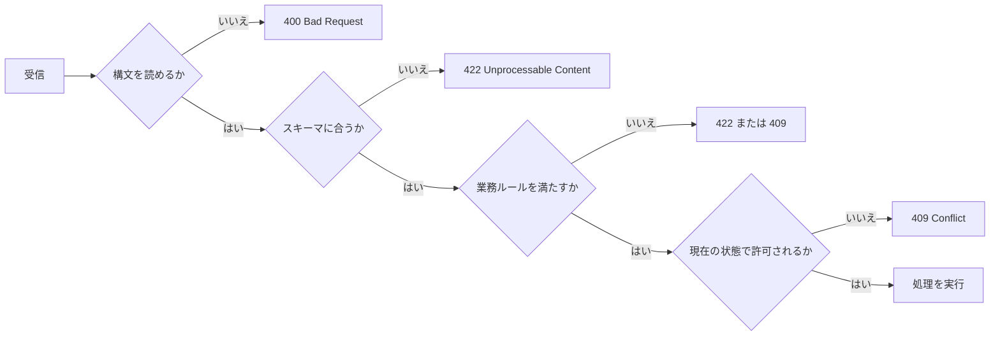

APIの入力は、パス、クエリ、ヘッダー、ボディへ分かれます。どこに何を置くかは見た目の問題ではありません。入力の役割、キャッシュ、ログ、再試行、セキュリティに影響する契約です。

本章では、イベント作成APIを例に、入力の配置と検証の境界を決めます。

## 入力の役割を四つに分ける

最初の目安は次のとおりです。

| 場所 | 主な役割 | 例 |
|---|---|---|
| パス | 操作対象の識別 | `/events/evt_123` |
| クエリ | 絞り込みや表示方法 | `?status=published&limit=20` |
| ヘッダー | HTTP処理に関する付帯情報 | `If-Match`、`Idempotency-Key` |
| ボディ | 作成・更新する業務データ | タイトル、日時、定員 |

パスに動的な検索条件を詰めたり、ボディに認証トークンを入れたりすると、共通部品が働きにくくなります。機密情報はURLへ置きません。URLはブラウザー履歴、アクセスログ、分析基盤などへ残りやすいためです。

## 作成用と更新用の入力を分ける

リソース表現を、そのまま入力スキーマへ流用しないでください。レスポンスには、サーバーだけが決められる値が含まれます。

```json
{
  "id": "evt_123",
  "title": "API Design Workshop",
  "status": "draft",
  "createdAt": "2026-08-09T03:00:00Z",
  "updatedAt": "2026-08-09T03:00:00Z"
}
```

`id`、`status`、`createdAt`を作成時に受け取ると、権限昇格やデータ改ざんの入口になります。作成用の入力では、利用者が指定してよい項目だけを列挙します。

```http
POST /events HTTP/1.1
Content-Type: application/json

{
  "title": "API Design Workshop",
  "startsAt": "2026-09-12T04:00:00Z",
  "endsAt": "2026-09-12T07:00:00Z",
  "capacity": 40
}
```

更新用スキーマも別にします。イベント作成時には必須でも、部分更新では省略できる項目があるからです。公開後には定員を減らせない、といった状態別の制約も加わります。

## 検証を四段階に分ける

すべてを「入力エラー」と一括りにすると、実装もエラー応答も曖昧になります。



1. **構文検証**: JSONとして読めるか、文字コードや`Content-Type`が正しいか
2. **スキーマ検証**: 必須項目、型、形式、長さ、範囲が正しいか
3. **業務検証**: 終了日時が開始日時より後か、定員が会場上限以下か
4. **状態検証**: 公開済みイベントに許される変更か、残席があるか

段階を分けると、どこまで共通ミドルウェアへ任せ、どこから業務ロジックで判断するかが明確になります。

## 未知のフィールドは黙って保存しない

入力に`isAdmin: true`が混ざっても、サーバーがオブジェクトを丸ごとDBへ保存しなければ安全だとは限りません。将来そのフィールドが追加されたとき、以前は無視された入力が突然効き始める可能性があります。

公開APIでは、未知のフィールドを拒否する方針が分かりやすい選択です。

```json
{
  "type": "https://api.example.com/problems/invalid-request",
  "title": "Request validation failed",
  "status": 422,
  "errors": [
    {
      "pointer": "/isAdmin",
      "code": "unknown_field",
      "message": "This field is not accepted."
    }
  ]
}
```

互換性上、未知のフィールドを無視する場合も、許可リストから入力モデルを組み立てます。外部入力を内部モデルへ一括代入してはいけません。

## 省略、null、空値を区別する

部分更新では、次の三つが異なる意味を持ちます。

- 項目を省略する: 現在値を変更しない
- `null`を送る: 現在値を消す
- 空文字列を送る: 空文字列へ変更する

たとえば問い合わせメールを削除できるなら、`null`を許可します。削除できないなら拒否します。意味を定義せず、言語やORMの都合で扱いを決めないようにします。

既定値も同様です。`capacity`を省略したら無制限になるのか、作成者のプラン上限になるのかを契約として説明します。サーバーが適用した既定値は、作成後の表現へ含めます。

## 境界値と大きさを先に決める

最低限、次の上限を設けます。

- 文字列の長さと配列要素数
- 数値の最小値と最大値
- JSONボディ全体のバイト数
- ネストの深さ
- 一回に指定できるIDの数
- 日時として受け入れる範囲

上限はドキュメントとOpenAPIに記載し、ゲートウェイとアプリケーションの設定をそろえます。大きすぎるボディは`413 Content Too Large`、対応しないメディアタイプは`415 Unsupported Media Type`で拒否できます。

## 入力設計の確認事項

- 入力の各項目に、利用者が指定すべき理由があるか
- パス、クエリ、ヘッダー、ボディの役割が混ざっていないか
- 作成用、更新用、レスポンス用のスキーマを分けたか
- 未知のフィールド、`null`、省略の意味を決めたか
- 形式だけでなく、業務ルールと現在状態を検証しているか
- 文字列、配列、ボディ全体に上限があるか
- エラーから修正箇所と修正方法を判断できるか

入力を厳密にする目的は、利用者を困らせることではありません。曖昧な入力を早い段階で止め、同じリクエストがいつも同じ意味になるようにするためです。

:::message
入力スキーマは、内部モデルのコピーではなく、利用者に許可する操作の一覧です。
:::
