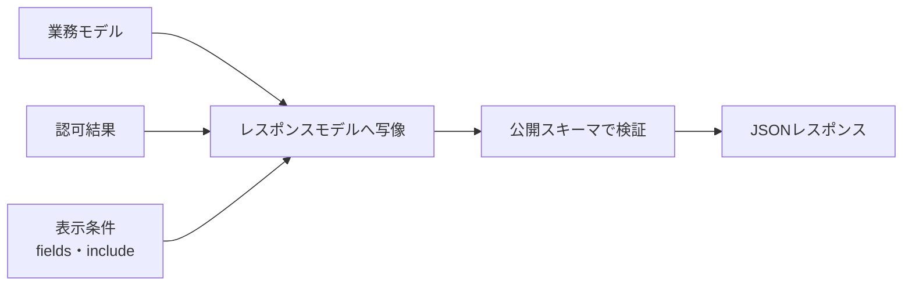

レスポンスは、データベースの行をJSONへ変換したものではありません。利用者が次の処理へ進むために必要な表現です。多すぎれば漏えいと結合を招き、少なすぎれば追加リクエストが増えます。

## 利用場面から必要な項目を選ぶ

イベント詳細の利用者は、タイトル、開催日時、場所、残席などを表示します。内部の審査メモ、原価、論理削除フラグは必要ありません。

```json
{
  "id": "evt_123",
  "title": "API Design Workshop",
  "status": "published",
  "startsAt": "2026-09-12T04:00:00Z",
  "endsAt": "2026-09-12T07:00:00Z",
  "capacity": 40,
  "availableSeats": 12,
  "venue": {
    "id": "ven_456",
    "name": "Tokyo Hall"
  },
  "updatedAt": "2026-08-09T03:00:00Z"
}
```

レスポンスモデルを明示すると、内部列を追加しただけで公開フィールドが増える事故を防げます。権限による表示差も、シリアライザーの偶然ではなく仕様として定義します。

## 単体と一覧で表現を分けてもよい

一覧には軽い要約、詳細には十分な情報を返す設計が実用的です。

```json
{
  "items": [
    {
      "id": "evt_123",
      "title": "API Design Workshop",
      "startsAt": "2026-09-12T04:00:00Z"
    }
  ],
  "page": {
    "nextCursor": "eyJpZCI6ImV2dF8xMjMifQ"
  }
}
```

同じ`Event`という名前で内容が場面ごとに変わると、生成コードや型定義が不安定になります。`EventSummary`と`EventDetail`のように、別の表現であることを示します。

## エンベロープは必要な場面で使う

単体取得を`{"data": {...}}`で包むか、リソースを直接返すかに唯一の正解はありません。包むとメタデータを追加しやすく、直接返すと単純です。

一覧では、ページ情報や関連リンクが必要なため、エンベロープが自然です。エンドポイントごとに気分で変えず、API全体の規則として選びます。

## 作成後は確定した表現を返す

作成APIでは、`201 Created`、`Location`、作成済みのリソース表現を返すと利用しやすくなります。

```http
HTTP/1.1 201 Created
Location: /events/evt_123
Content-Type: application/json
ETag: "event-v1"

{
  "id": "evt_123",
  "title": "API Design Workshop",
  "status": "draft",
  "createdAt": "2026-08-09T03:00:00Z"
}
```

サーバーが採番したID、正規化した値、適用した既定値が分かります。処理結果を照会する必要がなければ、更新や削除に`204 No Content`を選ぶこともできます。ただし同種の操作で方針を統一します。

## リンクは次の操作を案内する

URLを組み立てる規則を利用者へ押しつけず、関連リソースへのリンクを返す方法があります。

```json
{
  "id": "evt_123",
  "links": {
    "self": "/events/evt_123",
    "reservations": "/events/evt_123/reservations"
  }
}
```

すべてのAPIを厳密なハイパーメディア方式にする必要はありません。ページ送り、非同期ジョブ、ダウンロード結果など、次のURLが動的に決まる場面から採用すると効果が見えます。

## 表現を組み立てる境界を置く



この境界で、秘密情報の除外、日時形式の統一、関連データの要約、権限別のマスキングを行います。DBモデルを直接シリアライズしないことが重要です。

## 安定した意味を返す

- 金額は小数誤差が出ない表現を使う
- 日時はオフセットを含む文字列で返す
- IDは桁数に依存しない文字列として扱う
- 順序に意味がある配列だけ順序を保証する
- 値がない場合の`null`、省略、空配列を統一する
- 列挙値へ追加があり得ることを説明する

さらに、計算値の基準時刻を意識します。`availableSeats`は取得直後に変わる可能性があります。予約を確約する値ではない、と意味を明示し、最終判定は予約作成時に行います。

## フィールド追加にも注意する

JSONオブジェクトへの項目追加は一般に互換変更とされます。しかし、厳密なデシリアライザーやスナップショットテストでは壊れる場合があります。提供者は追加を予告し、利用者には未知の応答フィールドを無視する実装を求めます。

レスポンスは「返せるもの」ではなく「約束してよいもの」で構成します。利用者の仕事を一回の応答で進められ、内部変更には引きずられない表現が理想です。

:::message
レスポンスモデルは、公開してよい情報と、長期にわたって維持すべき意味を選び取ったものです。
:::
