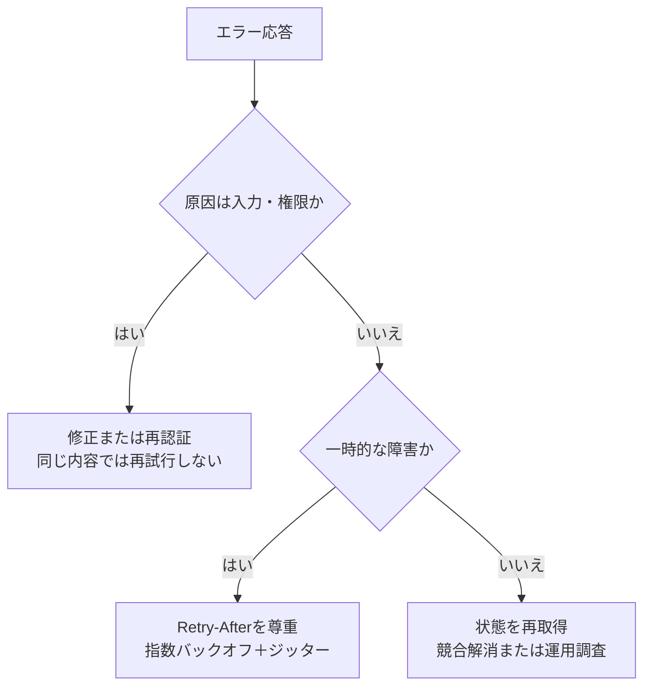
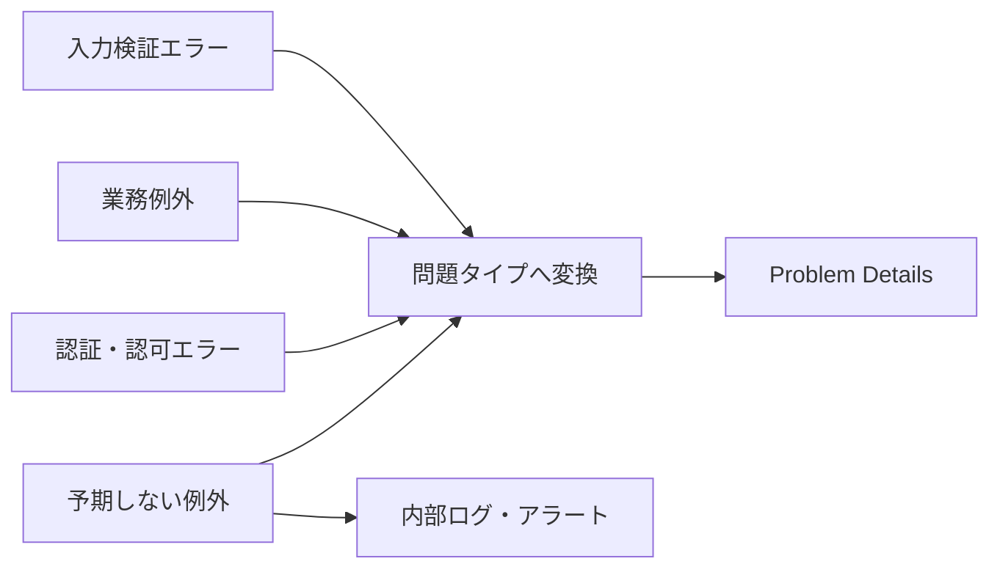

成功レスポンスだけを決めても、APIの半分しか設計したことになりません。利用者が本当に困るのは、失敗理由を判別できず、再試行すべきか、入力を直すべきか、運用担当へ知らせるべきか分からないときです。

本章では、HTTPステータスコードと問題詳細を組み合わせ、プログラムと人の双方が扱えるエラーを作ります。

## 三つの層で失敗を伝える

エラー応答には役割の違う三層があります。

1. HTTPステータスコードで、大まかな失敗分類を伝える
2. 機械判定用の問題タイプやコードで、具体的な理由を伝える
3. 詳細文や項目別エラーで、人が修正する手掛かりを伝える

`400`だけでは、JSONの構文不正なのか、必須項目不足なのか分かりません。反対に、独自コードだけを`200 OK`に包むと、HTTPクライアント、監視、プロキシが失敗を認識できません。

## Problem Detailsを共通形式にする

[RFC 9457](https://www.rfc-editor.org/rfc/rfc9457)は、HTTP APIの問題詳細を表す`application/problem+json`を定義しています。

```http
HTTP/1.1 409 Conflict
Content-Type: application/problem+json

{
  "type": "https://api.example.com/problems/event-sold-out",
  "title": "The event is sold out",
  "status": 409,
  "detail": "No seats remain for this event.",
  "instance": "/reservations/req_01J4Q8Q5",
  "eventId": "evt_123"
}
```

各フィールドの役割は次のとおりです。

| フィールド | 役割 |
|---|---|
| `type` | 問題の種類を識別するURI。クライアントの分岐に使う |
| `title` | 同じ問題タイプに共通する短い説明 |
| `status` | HTTPステータスコード |
| `detail` | 今回の発生内容に固有の説明 |
| `instance` | 今回の問題発生を識別するURI |

独自情報は拡張メンバーとして追加できます。クライアントは`detail`の文章を解析せず、`type`や拡張コードで処理を分けます。

## 項目別エラーをまとめて返す

入力に複数の問題があるなら、安全に検出できたものを一度に返すと修正が進みます。

```http
HTTP/1.1 422 Unprocessable Content
Content-Type: application/problem+json

{
  "type": "https://api.example.com/problems/validation-failed",
  "title": "Request validation failed",
  "status": 422,
  "errors": [
    {
      "pointer": "/title",
      "code": "required",
      "message": "The title is required."
    },
    {
      "pointer": "/endsAt",
      "code": "must_be_after",
      "message": "The end time must be after the start time."
    }
  ]
}
```

`pointer`にはJSON Pointer形式を使うと、配列やネストを曖昧なく指せます。クエリやヘッダーのエラーを扱う場合は、`location: "query"`と`name: "limit"`のような表現を別に定義します。

## 失敗の分類を先に作る

イベント予約APIでは、次のように整理できます。

| 状況 | ステータス | 問題タイプの末尾 | 利用者の行動 |
|---|---:|---|---|
| JSONを読めない | 400 | `malformed-json` | リクエストを修正 |
| 認証情報がない・無効 | 401 | `authentication-required` | 再認証 |
| 操作権限がない | 403 | `forbidden` | 権限を確認 |
| イベントが存在しない | 404 | `event-not-found` | IDを確認 |
| 入力制約に違反 | 422 | `validation-failed` | 指摘項目を修正 |
| 満席になった | 409 | `event-sold-out` | 別イベントを選択 |
| 更新版が競合した | 412 | `precondition-failed` | 再取得して再編集 |
| 利用上限を超えた | 429 | `rate-limit-exceeded` | 指定時間後に再試行 |
| 一時的な内部障害 | 503 | `service-unavailable` | 待って再試行 |

この表は、実装、OpenAPI、テスト、監視で共用できます。機能追加のたびに場当たり的なエラーコードを作ることを防ぎます。

## 再試行できるかを判定可能にする



`429`や`503`で待ち時間を示せる場合は`Retry-After`を返します。ただし、再試行可能であっても、非冪等な操作をそのまま再送すると二重処理になる恐れがあります。第20章で扱う冪等性キーと組み合わせます。

## 401と403を使い分ける

`401 Unauthorized`は名前に反して、認証が必要、または認証情報が有効でない状態を表します。必要に応じて`WWW-Authenticate`を返します。

`403 Forbidden`は、誰であるかは分かっているものの、その操作が許可されない状態です。リソースの存在自体を隠したい場合は、権限のない利用者へ`404`を返す方針もあります。同じ状況で応答時間や本文が大きく変わり、存在を推測できないよう注意します。

## 内部情報を漏らさない

次の情報を外部の`detail`へ含めてはいけません。

- スタックトレース、SQL、テーブル名
- ファイルパス、内部ホスト名
- アクセストークンやCookie
- 他の利用者のIDや個人情報
- 認証判定を回避する手掛かり

利用者向け応答と内部ログを分けます。応答には問い合わせに使える短い`requestId`を含め、内部ログでは同じIDから詳細を追跡できるようにします。秘密情報をIDへ埋め込まないでください。

## エラー文を契約の本体にしない

表示文は改善や翻訳で変わります。クライアントが`message === "Event is sold out"`で分岐すると、文言変更が破壊的変更になります。

プログラムは安定した`type`または`code`を使い、人へ見せる文は`title`と`detail`を使います。複数言語に対応する場合も、サーバーが翻訳文を返す方式と、コードを基にクライアントが翻訳する方式の責任を決めます。

## 例外を一か所で変換する



フレームワークの既定エラー、業務例外、外部サービス障害を共通形式へ変換します。予期しない例外は外部では汎用的な`500`にし、内部で原因を記録します。すべてを`500`へ潰すのも、例外メッセージをそのまま公開するのも避けます。

## エラー設計の完成条件

- 主要な失敗シナリオが一覧になっている
- HTTPステータスと問題タイプの対応が一貫している
- クライアントが文字列解析なしで分岐できる
- 入力エラーが修正箇所を指している
- 再試行の可否と待ち時間を判断できる
- 認証・認可・存在秘匿の方針が決まっている
- 内部情報と秘密情報を外部へ返さない
- OpenAPI、テスト、監視で同じ分類を使っている

良いエラーは、失敗を説明して終わりません。利用者が次に取るべき行動を選べるところまでが設計です。

:::message
ステータスコードで分類し、安定した問題タイプで判定し、人向けの詳細で回復を助けます。
:::

### 参考資料

- [RFC 9457: Problem Details for HTTP APIs](https://www.rfc-editor.org/rfc/rfc9457)
- [RFC 9110: HTTP Semantics](https://www.rfc-editor.org/rfc/rfc9110)
