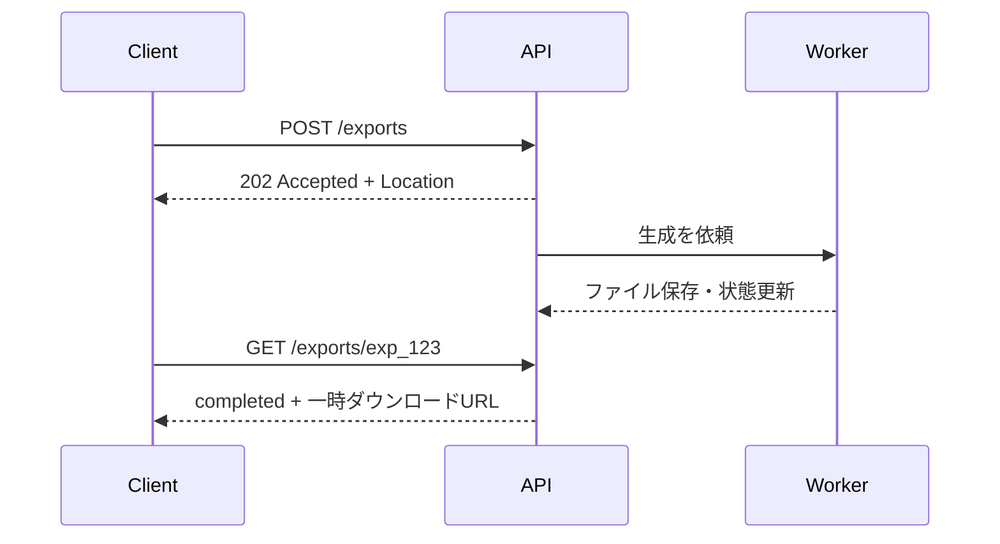

一覧を一度に返すと、データの増加に伴って応答時間とメモリ使用量が増えます。ページネーションは単なる画面分割ではなく、変化するデータを安定して読み進めるための仕組みです。

## オフセット方式は分かりやすい

```http
GET /events?offset=40&limit=20
```

ページ番号へ変換しやすく、任意の位置へ移動できます。小規模な管理画面や、更新の少ないデータに向きます。

一方、先頭から大量の行を読み飛ばす実装では、後ろのページほど遅くなります。ページ移動中に新しいイベントが先頭へ追加されると、同じ項目が次ページにも現れることがあります。削除されれば項目が抜けます。

## カーソル方式は基準点から続きを読む

```http
GET /events?limit=20&cursor=eyJzdGFydHNBdCI6IjIwMjYtMDktMTJUMDQ6MDA6MDBaIiwiaWQiOiJldnRfMTIzIn0
```

カーソルには、直前の項目を特定する並び順の値を含めます。


DBでは「40件読み飛ばす」のではなく、「開始日時とIDが前回位置より後」のように検索できます。連続スクロール、大規模テーブル、更新頻度の高い一覧に向きます。

## カーソルは不透明にする

クライアントはカーソルの中身を解釈せず、そのまま返送します。サーバーは次を考慮します。

- 改ざんを検出できる署名を付ける
- フィルターと並び順をカーソルへ結び付ける
- 有効期限と期限切れ時のエラーを定める
- 個人情報や秘密を平文で含めない
- 内部スキーマを変更しても移行できる版を持たせる

別の検索条件に古いカーソルを流用すると、予測しない結果になります。条件のハッシュを含めて拒否できるようにします。

## 一意な順序が土台になる

`startsAt`が同じイベントがあるため、次のように`id`を末尾へ加えます。

```sql
ORDER BY starts_at ASC, id ASC
```

カーソルも両方を保持します。順序が一意でなければ、「前回の続き」を定義できません。

更新によって項目が境界をまたぐと、カーソル方式でも重複や欠落が起こり得ます。必要な整合性に応じて選びます。

- フィード: 多少の重複を許し、クライアントがIDで除外する
- 帳票: スナップショット時刻を固定する
- 会計データ: 非同期で確定済みファイルを生成する

## 応答には次の移動方法を返す

```json
{
  "items": [
    {"id": "evt_123", "title": "API Design Workshop"}
  ],
  "page": {
    "limit": 20,
    "nextCursor": "eyJ2IjoxLCJpZCI6ImV2dF8xMjMifQ",
    "hasNext": true
  },
  "links": {
    "next": "/events?limit=20&cursor=eyJ2IjoxLCJpZCI6ImV2dF8xMjMifQ"
  }
}
```

最終ページでは`nextCursor`を`null`にするのか、省略するのかを統一します。クライアントがURLを再構築しなくてよいよう、`links.next`を返す設計も有効です。

## 一括処理は結果を項目ごとに示す

複数予約を一括取消する場合、全件を一つのトランザクションにするのか、成功した項目だけ確定するのかで契約が変わります。

```json
{
  "results": [
    {"id": "rsv_001", "status": "cancelled"},
    {
      "id": "rsv_002",
      "status": "failed",
      "problem": {
        "type": "https://api.example.com/problems/cancellation-deadline-passed",
        "title": "The cancellation deadline has passed"
      }
    }
  ]
}
```

HTTPステータスだけでは、一括処理内の部分失敗を表し切れません。原子性、処理順序、最大件数、再試行方法を説明します。

## 大きなエクスポートはジョブにする

大量CSVの生成を一回のHTTP接続で待たせると、タイムアウトと再試行が扱いにくくなります。



ジョブには`queued`、`running`、`completed`、`failed`、`expired`などの状態を持たせます。結果URLの有効期限、再生成、権限確認、個人情報を含むファイルの保護も必要です。

ページネーション、バルク処理、エクスポートは、データ量が増えてから後付けすると互換性を壊しがちです。最初から無制限の一覧を許さず、規模に応じて処理方式を切り替えられる境界を用意します。
