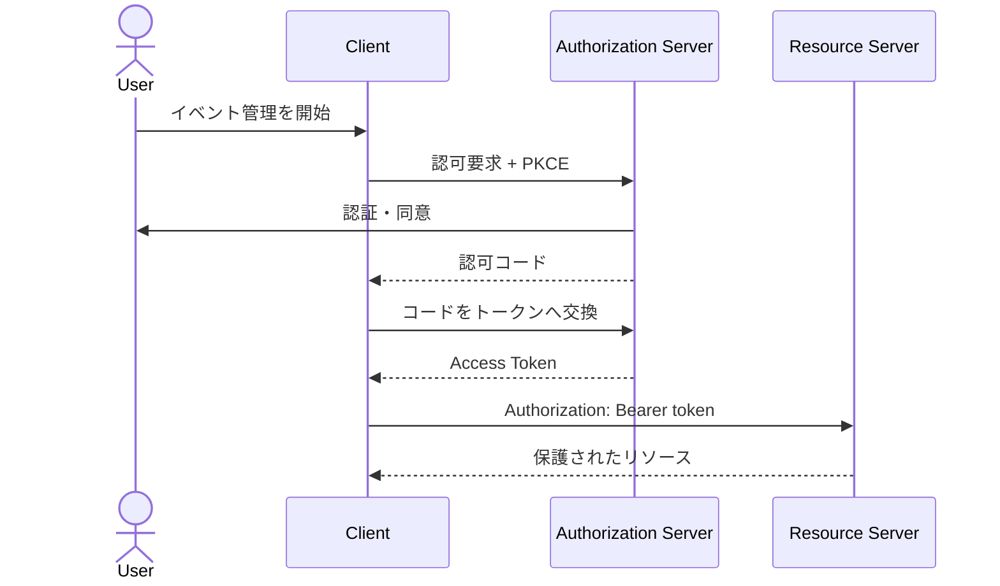
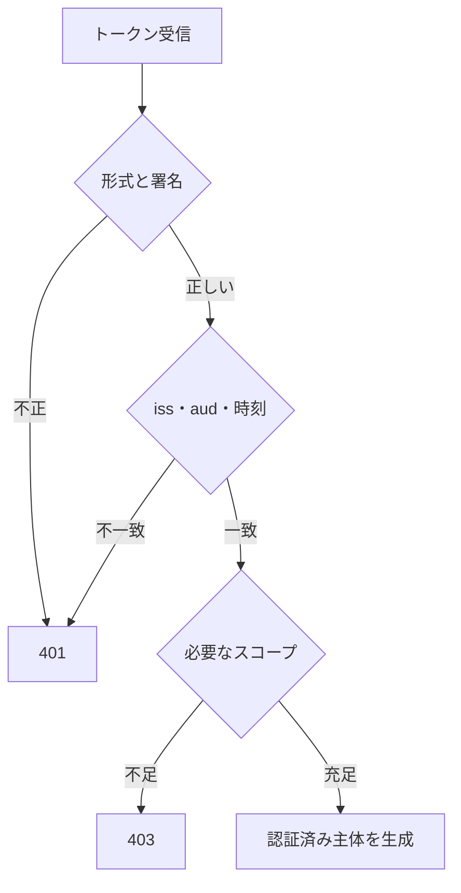

認証は「この呼び出し元は誰か」を確かめる仕組みです。認可は「その主体が、この操作をしてよいか」を判断します。二つを分けなければ、正しいトークンを持つだけで他人のリソースを操作できるAPIになりかねません。

## 認証方式は利用者に合わせる

| 利用者 | 主な方式 | 注意点 |
|---|---|---|
| ブラウザー上のWebアプリ | セッションCookie、OAuth/OIDC | CSRF、Cookie属性、リダイレクトURI |
| モバイル・SPA | OAuth 2.0 Authorization Code + PKCE | トークン保存、アプリ間遷移 |
| サーバー間通信 | OAuth 2.0 Client Credentials、署名付き資格情報 | 秘密の保管とローテーション |
| 単純な外部連携 | APIキー | 利用者認証には不十分、漏えい時の失効 |

APIキーはプロジェクトや呼び出し元の識別には使えますが、通常は人の本人確認を表しません。用途と脅威が違う方式を、実装が簡単という理由だけで使い回さないようにします。

## OAuthとOpenID Connectの役割を知る

OAuth 2.0では、リソース所有者、クライアント、認可サーバー、リソースサーバーの責任を分けます。OpenID ConnectはOAuth 2.0の上に本人認証の情報を加えます。



APIが受け取るのは、API利用を認めるアクセストークンです。IDトークンはクライアントがログイン結果を確認するためのもので、API用アクセストークンの代わりにしません。

## Bearerトークンを安全に渡す

```http
GET /me/reservations HTTP/1.1
Authorization: Bearer eyJ...
```

トークンは`Authorization`ヘッダーで送ります。クエリへ含めると、アクセスログ、履歴、`Referer`などへ漏れる恐れがあります。通信はTLSで保護し、ログやエラーへトークンを残しません。

Bearerトークンは、持っている主体が使えます。より強い送信者制約が必要なら、DPoPなどの方式を検討します。ただし鍵管理と相互運用の複雑さが増えるため、脅威モデルに基づいて選びます。

## トークンは署名だけでなく意味を検証する

JWT形式のアクセストークンを受け取る場合、最低限、次を確認します。

- 許可したアルゴリズムで署名が正しい
- 発行者`iss`が期待値と一致する
- 対象`aud`にこのAPIが含まれる
- 有効期限`exp`を過ぎていない
- `nbf`がある場合は利用開始時刻を満たす
- 必要なスコープや主体情報がある
- 鍵IDが未知の場合、信頼できる発行者から鍵を取得する

ライブラリが選んだアルゴリズムを無条件に受け入れず、許可リストを設定します。JWTのペイロードは通常、暗号化されていません。秘密情報を入れないでください。



## 失敗時は再認証の手掛かりを返す

認証情報がない、期限切れ、署名不正なら`401`を返します。

```http
HTTP/1.1 401 Unauthorized
WWW-Authenticate: Bearer realm="events-api", error="invalid_token"
Content-Type: application/problem+json
```

有効な主体だが必要な権限がない場合は`403`です。トークンの詳細な検証理由を外部へ返すと、攻撃者の手掛かりになる場合があります。クライアントが取るべき行動に必要な範囲へ絞ります。

## 有効期間と失効を設計する

アクセストークンを短命にすると、漏えい時の被害時間を抑えられます。長期利用には更新トークンを使いますが、更新トークンは認可サーバーへだけ送り、リソースAPIへ送信しません。

管理者権限、パスワード変更、アカウント停止など、即時失効が必要な場面もあります。短い有効期間、失効リスト、トークンイントロスペクション、主体の現在状態確認から、要件に合う組み合わせを選びます。

## 鍵と資格情報を運用する

- 鍵には識別子を付け、複数世代を並行して検証する
- 新しい鍵を配布してから署名鍵を切り替える
- 古い鍵は既存トークンの有効期間後に外す
- APIキーは利用者ごとに発行し、平文を再表示しない
- 漏えい時に個別失効できるようにする
- 本番資格情報をソースコードやテストデータへ入れない

認証はログイン画面だけの機能ではありません。トークンの発行から検証、ローテーション、失効、監査までを一つのライフサイクルとして設計します。

:::message
認証済みであることは、すべての操作を許可することではありません。認証結果を次章の認可判断へ渡します。
:::

### 参考資料

- [OAuth 2.0 Security Best Current Practice（RFC 9700）](https://www.rfc-editor.org/rfc/rfc9700)
- [JSON Web Token Best Current Practices（RFC 8725）](https://www.rfc-editor.org/rfc/rfc8725)
- [OAuth 2.0 Demonstrating Proof of Possession（RFC 9449）](https://www.rfc-editor.org/rfc/rfc9449)
- [OpenID Connect Core 1.0](https://openid.net/specs/openid-connect-core-1_0.html)

