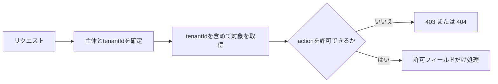

認可の中心は、エンドポイントへ到達できるかではありません。どの主体が、どのリソースに、何を、どの条件で行えるかを判断することです。

## 認可判断を四要素で表す

```text
allow(subject, action, resource, context)
```

- `subject`: 利用者、サービス、所属テナント、役割
- `action`: 閲覧、編集、公開、予約取消
- `resource`: 対象イベント、予約、フィールド
- `context`: 時刻、リソース状態、接続元、追加認証の有無

「管理者なら許可」という役割だけでは、代理店管理者が別の代理店のイベントを編集できるか判断できません。対象との関係やテナント境界が必要です。

## 一件ごとに所有関係を確認する

```http
GET /reservations/rsv_789 HTTP/1.1
Authorization: Bearer ...
```

IDを知っていることは権限の証明になりません。認証済みの利用者Aが利用者Bの予約IDへ差し替えたとき、必ず拒否します。これはAPIで頻出するオブジェクトレベル認可の問題です。



`SELECT * FROM reservations WHERE id = ?`で取得した後にテナントを確認するより、取得条件へ`tenant_id`を含める方が漏れを減らせます。共通リポジトリや行レベルセキュリティも防御層になります。

## 認可モデルを組み合わせる

| モデル | 判断材料 | 向く場面 |
|---|---|---|
| RBAC | 役割 | 運営者、編集者、閲覧者などの大枠 |
| ABAC | 属性 | 所属、時刻、状態、契約プラン |
| ReBAC | 関係 | イベントの主催者、予約の所有者、チーム所属 |

実務では組み合わせます。「event_editor役割を持ち、対象イベントの主催チームに属し、イベントが下書き状態なら編集可」という判断です。

ポリシーを各コントローラーへコピーすると、修正漏れが起きます。認可サービスや共通ポリシーへ集約し、入力と出力をテストできる形にします。ただし、リソースの読み込み前後どちらで何を判断するかは明確にします。

## 機能と項目にも認可がある

エンドポイント全体だけでなく、操作とフィールドを確認します。

- 一般編集者は説明文を変更できるが、公開はできない
- 会計担当は支払状態を見られるが、参加者の健康情報は見られない
- サポート担当は予約を代理取消できるが、返金額を自由入力できない

レスポンスで秘密項目を隠すだけでは不十分です。入力で同じ項目を更新できないようにします。GraphQLや`fields`指定でも、要求されたフィールドごとに認可を適用します。

## テナントは認証情報だけを信用しない

`X-Tenant-Id`をクライアントが自由に指定し、その値だけでDBを検索すると、別テナントへ切り替えられます。選択されたテナントが、認証済み主体の所属先であることを検証します。

```text
token.memberships contains requestedTenantId
```

テナントIDの取得元を一つに定め、URL、ヘッダー、トークンで不一致が起きた場合は拒否します。キャッシュキー、ジョブ、監査ログ、オブジェクトストレージのパスにもテナント境界を含めます。

## 403と404の方針をそろえる

存在するが権限がないリソースへ`403`を返すと、存在が分かります。予約IDの存在を隠したい場合は`404`を返せます。

どちらを採っても、一覧では見えないのに詳細取得では存在を推測できる、といった不整合を避けます。エラー本文、応答時間、件数集計からも情報が漏れないか確認します。管理画面など、存在を知らせて権限申請へつなげる方が有益な場面では`403`が適します。

## 特権操作を一段強く守る

返金、権限変更、個人データ出力などは、通常の認証だけでなく、追加認証、承認フロー、短時間の権限昇格を求められます。

誰が、誰の代理で、何を、いつ、なぜ実行したかを監査ログへ残します。監査ログ自体も、改ざんや過剰閲覧から守る対象です。

## 認可テストは拒否側を厚くする

- 別利用者のIDへ差し替える
- 同じ役割で別テナントへアクセスする
- 閲覧可能だが編集不可の主体で更新する
- 許可されないフィールドだけを送る
- 下書きでは許可、公開後は禁止される操作を試す
- 削除済み、停止済み、招待中の所属で試す
- バッチ、エクスポート、Webhookにも同じ境界を確認する

認可はUIでボタンを隠すことではありません。攻撃者が任意のHTTPリクエストを作る前提で、APIが最後の境界を守ります。

:::message
すべてのリソース操作で「誰が、どの対象に、何を、どの条件で行えるか」を評価します。
:::
