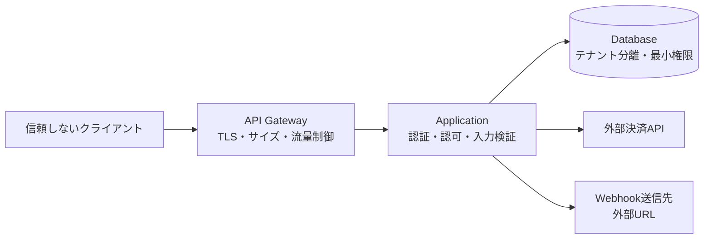

セキュリティは、実装後に診断をかけて足す機能ではありません。公開するデータ、入力上限、認可単位、外部通信、運用手順のすべてに設計判断があります。

## 資産と信頼境界から始める

イベント予約APIが守るものを列挙します。

- 参加者の氏名、連絡先、決済関連情報
- 残席、予約、返金の整合性
- 主催者のイベント公開権限
- APIの可用性と利用枠
- Webhook署名鍵、APIキー、監査ログ

次に、インターネット、APIゲートウェイ、アプリ、DB、決済サービス、Webhook送信先の境界を描きます。

境界を越える値は検証します。内部サービスから来たという理由だけで、利用者由来のIDやURLを信用しません。

## API特有の攻撃を設計レビューへ入れる

[OWASP API Security Top 10 – 2023](https://owasp.org/API-Security/editions/2023/en/0x11-t10/)は、設計レビューに使える観点を整理しています。

### オブジェクトと項目の認可

ID差し替えによる他人の予約取得、管理者専用項目の書き換え、レスポンスの過剰な個人情報を確認します。入力と出力は許可リストで組み立てます。

### 資源消費

リクエスト回数だけでなく、1件の計算量を制限します。ページサイズ、検索条件数、アップロード量、展開深度、同時ジョブ数、外部API呼び出し回数に上限を設けます。

### 重要業務フローの悪用

正しいAPIを大量に使う攻撃もあります。買い占め、招待コード総当たり、クーポン乱用、予約と取消の繰り返しです。CAPTCHA、段階的な流量制御、本人確認、保留期間、異常検知を業務要件と合わせて設計します。

### APIの棚卸し

古いバージョン、検証環境、廃止したはずのホスト、文書化されていない管理APIが攻撃面になります。所有者、用途、公開範囲、バージョン、廃止日を台帳で管理します。

## CORSとCSRFを混同しない

CORSは、ブラウザーが別オリジンの応答をJavaScriptへ渡すかを制御する仕組みです。認証やCSRF対策そのものではありません。

Cookie認証では、ブラウザーがCookieを自動送信するためCSRF対策が必要です。`SameSite`属性、CSRFトークン、`Origin`検証を組み合わせます。BearerトークンをJavaScriptがヘッダーへ付ける構成では脅威が変わりますが、XSSでトークンを盗まれる危険があります。

`Access-Control-Allow-Origin: *`と資格情報許可を安易に組み合わせず、必要なオリジン、メソッド、ヘッダーだけを許可します。

## SSRFを外向き通信の入口で防ぐ

利用者がWebhook URLや画像URLを登録できると、サーバーから内部ネットワークへアクセスさせるSSRFの入口になります。

- `https`だけを許可する
- URLを正規化してから検証する
- localhost、リンクローカル、プライベートIPを拒否する
- DNS解決後と接続先IPの双方を確認する
- リダイレクトごとに再検証する
- 外向き通信を専用ネットワークと許可先で制限する
- 応答サイズと時間を制限する

文字列の先頭一致だけでは、別表記のIPやDNS再束縛を防げません。

## 秘密情報をデータの流れから外す

秘密は、コード、URL、例外、分析イベントへ入れません。保管にはシークレット管理基盤を使い、サービスごとに最小権限で読み取ります。

ログへは次を原則として残さないようにします。

- `Authorization`、Cookie、APIキー
- パスワード、ワンタイムコード
- 決済情報と本人確認書類
- Webhook署名鍵
- リクエスト・レスポンスの無差別な全文

必要な業務項目はマスキングし、保持期間と閲覧権限を決めます。

## 依存先の応答も信用しない

外部APIやパッケージから得たデータも、形式、サイズ、署名、鮮度を検証します。外部サービスが遅くても処理スレッドを長時間占有しないよう、タイムアウト、回路遮断、同時実行制限を設けます。

Webhookは署名を検証し、古すぎるタイムスタンプと重複イベントを拒否します。パッケージは由来と更新方針を管理し、脆弱性情報を継続的に監視します。

## セキュリティ要件をテスト可能にする

「安全にする」では検証できません。次のように具体化します。

- 別テナントの全IDに対して情報を返さない
- ボディは1 MiB、配列は100要素を上限とする
- Webhookは送信時刻から5分を超える署名を拒否する
- 管理操作は多要素認証から15分以内に限る
- APIキーの値は発行時だけ表示し、保存時はハッシュ化する
- 監査ログは一年保持し、運用管理者だけが閲覧できる

設計レビュー、コードレビュー、自動テスト、負荷試験、運用監視で同じ要件を確かめます。
