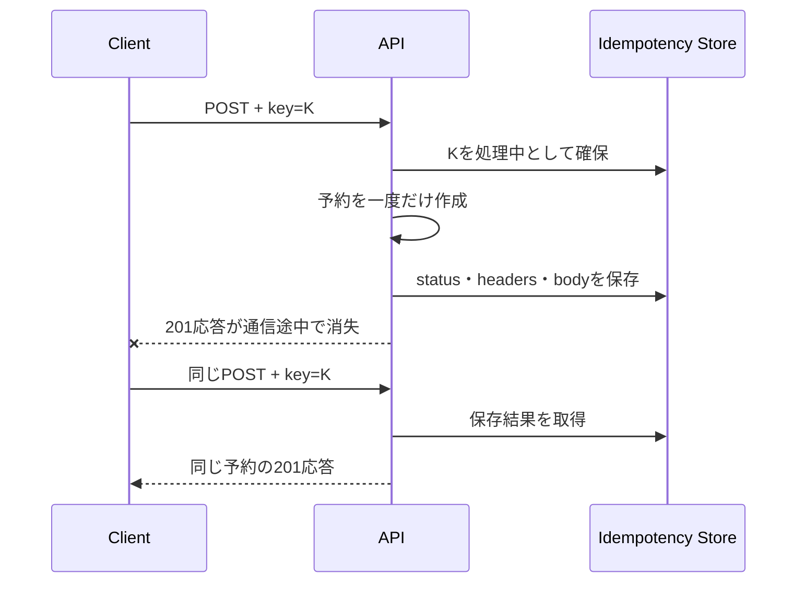
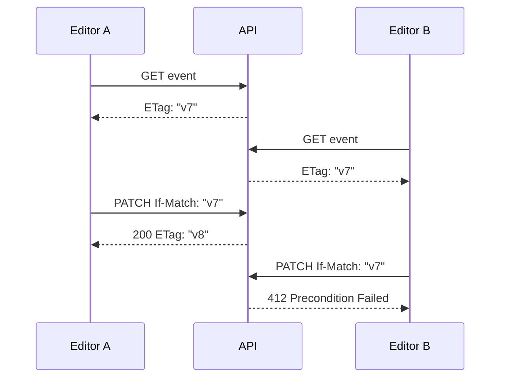

ネットワークでは、応答が届かなかったことと、処理されなかったことを区別できません。予約作成後に接続が切れた利用者は、再送すべきか迷います。この不確実さを扱うのが、冪等性、同時実行制御、再試行の設計です。

## 安全と冪等は別の性質

- **安全**: リソース状態を変更する意図がない。`GET`、`HEAD`、`OPTIONS`など
- **冪等**: 同じ要求を複数回送っても、意図した効果が一回と同じ。`PUT`、`DELETE`など

`DELETE`を二回送ったときのステータスが一回目と同じである必要はありません。最終的に対象が削除済みになる効果が同じなら、メソッドの意味は冪等です。

予約作成の`POST`は、そのままでは送信回数だけ予約が増えます。

## 冪等性キーでPOSTの再送を束ねる

```http
POST /events/evt_123/reservations HTTP/1.1
Idempotency-Key: 01J4Q8Q5Y0X1G7G2Q9P8K3A6M4
Content-Type: application/json

{"seats": 2}
```

サーバーは初回の処理結果を保存します。同じ主体が同じキーと同じ内容で再送したら、新しい予約を作らず、保存済みの結果を返します。



保存キーには、利用主体、テナント、HTTPメソッド、経路を含めます。ボディの正規化ハッシュも保存し、同じキーで異なる内容が来たら`409 Conflict`などで拒否します。

同時に同じキーが到着した場合、最初の処理が完了するまで待つか、「処理中」と返すかを決めます。DBの一意制約や原子的な挿入で、二件がともに初回と判定されないようにします。

`Idempotency-Key`は広く使われていますが、2026年8月時点ではIETFの標準RFCではなく、HTTPAPIワーキンググループのインターネットドラフトです。独自採用する場合は、キー形式、保持期間、競合応答、再現するヘッダーをAPI契約で定義します。

## リソースの競合には条件付きリクエストを使う

二人の編集者が同じイベントを取得し、別々に更新すると、後の保存が前の変更を消すことがあります。



クライアントは`ETag`を保存し、更新時に`If-Match`へ入れます。現在のタグと一致しなければ、サーバーは変更を適用しません。利用者は最新版を再取得し、自分の変更を統合します。

残席の減算では、ETagだけでなく、DBトランザクション、条件付き更新、一意制約を使って不変条件を守ります。

```sql
UPDATE events
SET available_seats = available_seats - 2
WHERE id = :id AND available_seats >= 2;
```

更新件数が0なら満席として扱います。「先に残席を読んでから減らす」だけでは、その間に別の予約が入り得ます。

## 再試行は選んで行う

再試行候補は、接続失敗、一部の`5xx`、`429`です。認証失敗、入力不正、恒久的な権限不足を同じ内容で繰り返しても直りません。

```text
待ち時間 = min(上限, 基本時間 × 2^試行回数) + ランダムな揺らぎ
```

指数バックオフへジッターを加えると、多数のクライアントが同時に再試行する「再試行の嵐」を抑えられます。`Retry-After`があれば尊重し、最大試行回数と全体の締切を設けます。

`POST`を再試行するなら冪等性キーが必要です。`GET`でも、非常に重い処理を無制限に再試行してよいわけではありません。

## 「一度だけ」を層ごとに考える

分散システム全体で、障害時にも副作用が厳密に一度だけ起きると約束するのは困難です。実務では次を組み合わせ、利用者から一度に見える状態を作ります。

- API入口で冪等性キーを重複排除する
- DBの一意制約で予約の重複を止める
- トランザクショナルアウトボックスでDB更新とイベント記録をそろえる
- メッセージ受信側もイベントIDで重複排除する
- メールや返金など外部副作用にも独自の冪等性キーを渡す

入口だけを守っても、ワーカー再実行でメールが二通送られるかもしれません。副作用が生まれる各境界を確認します。

## 期限と記録を決める

冪等性記録を永久保存する必要はありませんが、クライアントが再試行し得る時間より短いと危険です。保持期間を文書化し、期限後の同じキーを新規として扱うのか拒否するのかを決めます。

保存する応答に個人情報が含まれるなら、暗号化、アクセス制御、削除要件も適用します。キー自体を監査や相関に利用できても、秘密情報を埋め込ませないよう形式と長さを制限します。

:::message
タイムアウト後の曖昧さ、同時更新、再試行は別々の問題に見えますが、同じ副作用を安全に確定する一つの設計です。
:::

### 参考資料

- [RFC 9110: HTTP Semantics](https://www.rfc-editor.org/rfc/rfc9110)
- [The Idempotency-Key HTTP Header Field（IETF Internet-Draft）](https://datatracker.ietf.org/doc/draft-ietf-httpapi-idempotency-key-header/)

