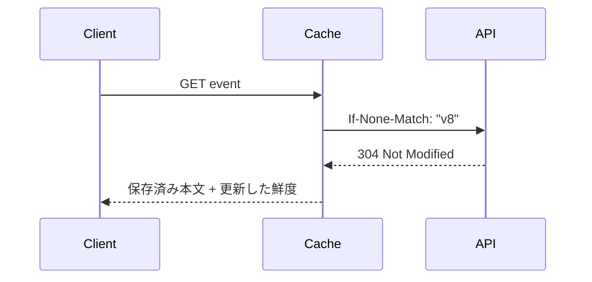

速いAPIを作るためにキャッシュを置き、安定したAPIを守るために流量を制御します。どちらもインフラ設定だけでは完結しません。表現の鮮度、利用者ごとの差、再試行方法をAPIの契約として決めます。

## キャッシュできる表現を分類する

イベント公開情報は多くの利用者で共有できます。自分の予約一覧は利用者ごとに異なります。決済直後の状態は保存させたくないかもしれません。

| データ | 方針例 |
|---|---|
| 公開イベント詳細 | `public, max-age=60, stale-while-revalidate=30` |
| 認証済み利用者の予約 | `private, max-age=0, must-revalidate` |
| トークン、決済情報を含む応答 | `no-store` |

`no-cache`は「保存禁止」ではなく、再利用前に検証を要求します。保存自体を禁止するのは`no-store`です。

## ETagで変更がないことを伝える

```http
GET /events/evt_123 HTTP/1.1
If-None-Match: "event-v8"
```

変更がなければ、サーバーは本文なしで返せます。

```http
HTTP/1.1 304 Not Modified
ETag: "event-v8"
Cache-Control: public, max-age=60
```

ETagはバイト表現または選んだ版を識別します。圧縮方式や言語で表現が変わる場合、`Vary`とキャッシュキーを適切に設定します。同じURLで利用者ごとの秘密情報を返すなら、共有キャッシュへ保存されない方針が必要です。



## 無効化の責任を決める

公開イベントを更新しても、CDNに古い表現が残ることがあります。

- 短い有効期間で自然に更新する
- 更新時にキャッシュを削除する
- URLへ不変なバージョンを含める
- 古い値を許す時間を要件として合意する

すべてを即時無効化しようとすると複雑になります。「タイトルは最大60秒古くてよいが、残席は予約時に必ず再判定する」のように、項目の意味で鮮度を分けます。

## 流量制御の単位を選ぶ

IPアドレスだけで制限すると、企業ネットワークの多数利用者を一人として扱い、攻撃者はIPを変えられます。次の単位を組み合わせます。

- APIキー、利用者、OAuthクライアント
- テナントと契約プラン
- エンドポイントや業務操作
- IP、ネットワーク、地域
- 同時実行数、リクエスト数、処理コスト

一覧1回と巨大エクスポート1回は同じ費用ではありません。回数、同時数、帯域、ジョブ数へ別々の上限を設けます。

## 超過時は待ち方を伝える

```http
HTTP/1.1 429 Too Many Requests
Retry-After: 30
Content-Type: application/problem+json

{
  "type": "https://api.example.com/problems/rate-limit-exceeded",
  "title": "Rate limit exceeded",
  "status": 429,
  "detail": "Retry after 30 seconds."
}
```

クライアントは`Retry-After`を尊重し、ジッターを加えて再試行します。上限へ近づいた全クライアントが秒境界で一斉に送る設計を避けます。

`RateLimit`関連ヘッダーの標準化作業は続いており、2026年8月時点のIETF文書はインターネットドラフトです。採用する場合は、使用するヘッダー名と意味を独自契約として明記し、RFCとして扱わないでください。`429`と`Retry-After`は標準化済みです。

## アルゴリズムより利用者体験を先に決める

トークンバケットやスライディングウィンドウは実装方式です。その前に、次を決めます。

- 瞬間的なバーストをどこまで許すか
- 一分、一日、月間のどの枠を持つか
- 高価な操作を別枠にするか
- 上限値を利用者へ公開するか
- 契約プラン変更がいつ反映されるか
- 共有テナント内で枠をどう配るか

複数リージョンで厳密な一つのカウンターを維持すると遅延や可用性へ影響します。わずかな超過を許す近似制御と、請求に使う正確な計測を分ける場合もあります。

## 過負荷では早く小さく失敗する

流量制御は利用者別の公平性を保ちます。処理能力を超えそうなときに優先度の低い要求を早めに拒否し、システム全体を守る制御がロードシェディングです。依存先が詰まったときも、キューを無限に伸ばさず`503`を返します。

障害中の依存先を一時的に呼ばない回路遮断や、同時実行上限も組み合わせます。再試行は各層で無制限に行わず、システム全体で許す回数を予算として決めます。サーバーが落ちかけているときに各層が三回ずつ再試行すると、かえって負荷が増えるためです。

キャッシュと流量制御は、正常時の性能だけでなく、古い情報をどこまで許し、混雑時に誰をどう待たせるかというサービス方針です。

鮮度と公平性を数値で決めれば、キャッシュと流量制御をテスト可能な契約にできます。

### 参考資料

- [RFC 9111: HTTP Caching](https://www.rfc-editor.org/rfc/rfc9111)
- [RFC 6585: 429 Too Many Requests](https://www.rfc-editor.org/rfc/rfc6585)
- [RateLimit header fields for HTTP（IETF Internet-Draft）](https://datatracker.ietf.org/doc/draft-ietf-httpapi-ratelimit-headers/)
