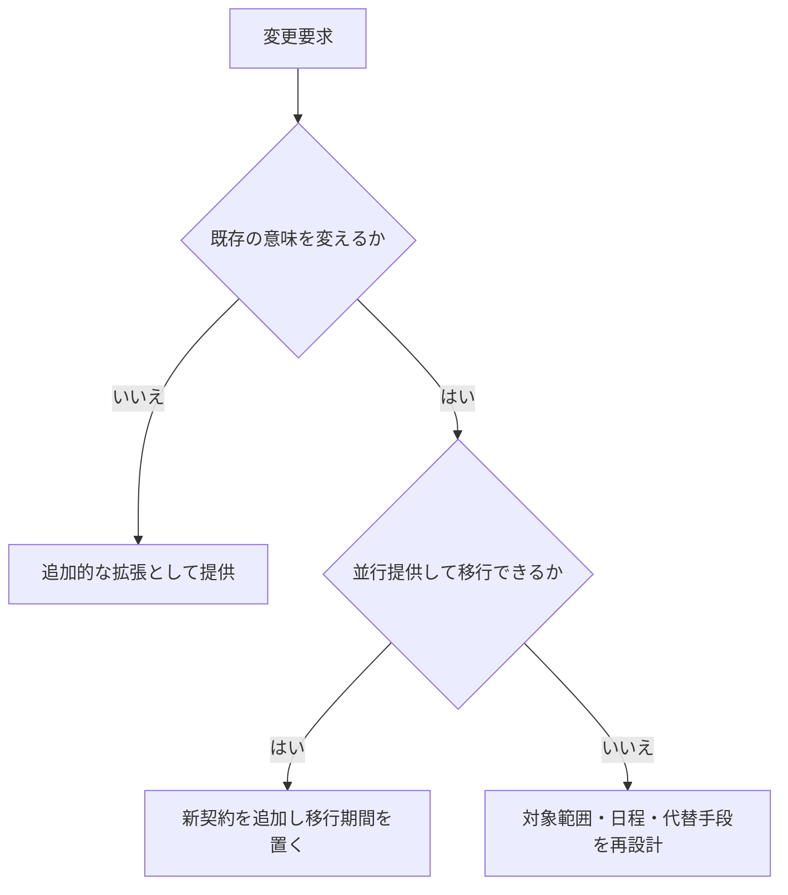
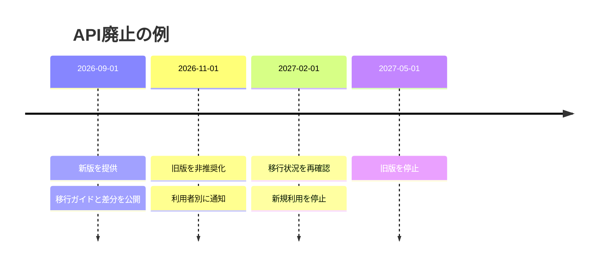

APIは公開した瞬間から、利用者のコードに組み込まれます。提供者にとって小さな変更でも、利用者にとっては本番障害になり得ます。バージョン番号を付ける前に、何が壊れるのか、どう移行してもらうのかを設計します。

## 変更を利用者の観点で分類する

次は一般に破壊的変更です。

- エンドポイント、フィールド、列挙値を削除・改名する
- 任意項目を必須にする
- 文字列を数値へ変える
- 許容範囲を狭める
- ステータスコードやエラーの意味を変える
- 一覧の既定順序やページ方式を変える
- 認証方式や必要スコープを変更する

フィールド追加は多くの場合、互換変更です。それでも未知の項目を拒否するデシリアライザーは壊れます。列挙値の追加も、クライアントが網羅的な分岐をしていると障害になります。「追加だから必ず安全」とは限りません。

## まず既存契約の中で拡張する

新しい任意フィールド、別エンドポイント、新しいメディアタイプ、明示指定する機能フラグなどで要求を満たせないか検討します。



同じフィールドの意味を設定で切り替えると、リクエストを見ても契約が分かりません。意味が違うなら、別名や別バージョンとして明示します。

## バージョン方式を選ぶ

| 方式 | 例 | 長所 | 注意点 |
|---|---|---|---|
| URL | `/v2/events` | 発見しやすく、ルーティングしやすい | URLが版ごとに増える |
| ヘッダー | `API-Version: 2026-08-01` | URLを保てる | ブラウザーや手動確認で見落としやすい |
| メディアタイプ | `Accept: application/vnd.example.v2+json` | 表現の版を表せる | 運用とツールが複雑 |
| 日付版 | `2026-08-01` | 変更時点を共有しやすい | 日付間の差分管理が必要 |

方式より、版の適用単位と保守方針が重要です。API全体、エンドポイント、利用者アカウントのどれに版が結び付くのかを決めます。版を増やすほど、セキュリティ修正、監視、テスト、ドキュメントの組み合わせも増えます。

## 廃止は段階的に進める



非推奨化では、代替手段、移行期限、影響、検証環境、問い合わせ経路を示します。アクセスログから利用中のクライアントを特定し、重要な利用者へ個別に連絡します。

[RFC 9745](https://www.rfc-editor.org/rfc/rfc9745)は`Deprecation`応答ヘッダーを定義しています。Structured Fieldsの日時形式を使います。

```http
Deprecation: @1798761600
Sunset: Sat, 01 May 2027 00:00:00 GMT
Link: <https://docs.example.com/migrations/events-v2>; rel="deprecation"
```

`Deprecation`は非推奨になった時点、`Sunset`は応答を提供しなくなる予定時点を伝えます。ヘッダーだけでは届かないため、変更履歴、メール、ダッシュボード、SDK警告も併用します。

## 二つの契約を実装上も分離する

旧版と新版が一つの条件分岐だらけになると、修正の影響を予測できません。境界で版ごとの入力・出力モデルを持ち、内部の共通業務処理へ変換します。

セキュリティ修正は旧版にも必要です。旧版の意味を変えずに修正できない場合、例外的な変更の理由、影響、緩和策を明確にして連絡します。

## 互換性を自動で確かめる

- OpenAPIの差分から削除、必須化、型変更を検出する
- 過去版の契約テストを継続する
- 主要SDKで未知フィールド・未知列挙値を試す
- 利用者別の版と廃止対象トラフィックを計測する
- 新旧を同じ入力で比較するシャドーテストを行う

自動差分だけでは、`capacity`の意味を「総定員」から「残席」へ変えたような意味変更を検出できません。レビューには変更理由と意味の差分を記載します。

## 利用者が備えること

利用者側も、次のように変更へ強い実装を作れます。

- 未知の応答フィールドを無視する
- 未知の列挙値にフォールバックを持つ
- エラー文ではなく問題タイプで分岐する
- 順序が保証されない配列に依存しない
- 明示された廃止日と変更履歴を監視する

互換性は提供者だけでは守れません。提供者が拡張規則を示し、利用者がその規則に従うことで、双方が安全に進化できます。

:::message
バージョン番号は変更を安全にしません。並行提供、移行観測、停止条件までそろって初めて進化の仕組みになります。
:::

### 参考資料

- [RFC 9745: The Deprecation HTTP Response Header Field](https://www.rfc-editor.org/rfc/rfc9745)
- [RFC 8594: The Sunset HTTP Header Field](https://www.rfc-editor.org/rfc/rfc8594)

