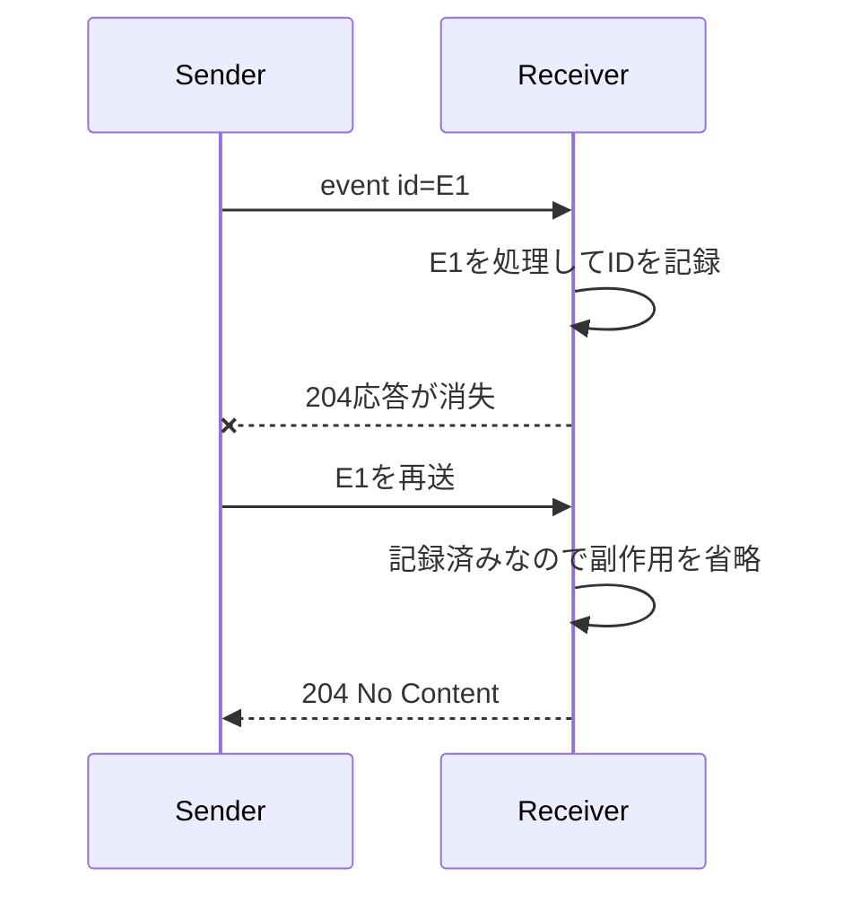
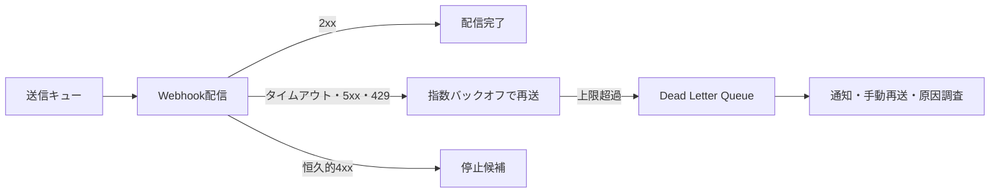

処理完了まで数分かかる、別システムへ変化を知らせたい。この二つは、同期HTTPだけでは扱いにくい課題です。本章では、ジョブとWebhookを「いつか届く通信」として設計します。

## 同期、ポーリング、Webhookを選ぶ

| 方式 | 向く場面 | 主な費用 |
|---|---|---|
| 同期応答 | 数秒以内に結果が確定 | 接続を待つ |
| ジョブをポーリング | 完了時刻が読めない、受信URLを持てない | 定期的な照会 |
| Webhook | 変化を早く外部へ通知 | 送達、署名、再送の実装 |

Webhookを使っても、受信失敗や紛失に備えて状態を照会するAPIは残します。通知を唯一の真実にしない方が回復しやすくなります。

## 受付と完了を分ける

```http
POST /event-exports HTTP/1.1
Content-Type: application/json

{"format":"csv","filter":{"status":"published"}}
```

```http
HTTP/1.1 202 Accepted
Location: /event-exports/exp_123
Retry-After: 5
Content-Type: application/json

{"id":"exp_123","status":"queued"}
```

`202`は処理完了を意味しません。ジョブの状態、失敗理由、取消可否、結果の有効期限を照会できるようにします。

## イベントの封筒を安定させる

```json
{
  "id": "evtmsg_01J4Q9",
  "type": "reservation.confirmed",
  "version": "1",
  "occurredAt": "2026-08-09T04:15:32Z",
  "subject": "reservations/rsv_789",
  "data": {
    "reservationId": "rsv_789",
    "eventId": "evt_123",
    "seats": 2
  }
}
```

`id`は重複排除、`type`は処理分岐、`version`はペイロード進化、`occurredAt`は出来事の時刻に使います。送信時刻と出来事の時刻を混同しません。

イベントにリソースの全状態を入れるか、IDと変更項目だけを入れるかを選びます。全状態は受信側の追加取得を減らしますが、個人情報の拡散とスキーマ結合が増えます。IDだけなら受信側は最新状態をAPIから取得できます。

## 少なくとも一回届く前提で受ける

送信側は、受信側が処理した後で応答を受け取れない場合があります。このとき再送すると、同じイベントが二回届きます。



受信側はイベントIDを保存し、処理と重複記録を同じトランザクションに入れます。配信順序も保証されない前提が安全です。リソース版や発生時刻を使い、古い更新で新しい状態を上書きしないようにします。

## 署名は生のボディで検証する

TLSは通信経路を守りますが、送信者をアプリケーションで確認し、改ざんとリプレイを防ぐには署名が役立ちます。

```text
署名対象 = イベントID + 送信時刻 + 生のHTTPボディ
```

JSONをパースして再シリアライズすると、空白やキー順が変わります。署名検証前の生バイト列を保持します。許容時間を超えたタイムスタンプを拒否し、イベントIDも重複確認します。

署名鍵は受信先ごとに発行し、複数世代を並行検証してローテーションします。比較にはタイミング攻撃を避ける定数時間比較を使います。独自方式を作る代わりに、[Standard Webhooks](https://github.com/standard-webhooks/standard-webhooks/blob/main/spec/standard-webhooks.md)や[RFC 9421 HTTP Message Signatures](https://www.rfc-editor.org/rfc/rfc9421)を検討できます。

## 再送には上限と観測を置く



接続タイムアウトと全体タイムアウトを短くし、応答本文を無制限に読みません。`429`と`Retry-After`を尊重します。認証失敗など恒久的な`4xx`を長期間再送し続けないでください。

管理画面やAPIでは、直近の試行時刻、応答コード、次回予定、配送状態を確認できるようにします。秘密を除外したテスト送信と手動再送も運用に役立ちます。

## 受信URL登録は外向き通信の権限である

Webhook URLを自由入力させるとSSRFの入口になります。`https`、許可ポート、DNS解決後のIP、リダイレクト先を検証します。所有確認のチャレンジを送り、受信できたURLだけ有効にする方式もあります。

購読者が受け取れるイベントとデータを認可します。別テナントのイベントを購読できないこと、購読作成後に権限が失われた場合の停止も確認します。

## 共通仕様は境界を共有する助けになる

[CloudEvents](https://cloudevents.io/)はイベントの共通属性を、[AsyncAPI](https://www.asyncapi.com/docs/reference/specification/latest)は非同期APIの契約を記述する仕組みを提供します。導入すれば信頼性が自動で得られるわけではありませんが、イベント名、チャネル、メッセージ、認証方式を組織間で共有しやすくなります。

:::message
WebhookはHTTPのコールバックではなく、重複・遅延・順不同・停止を前提にした配送システムです。
:::

