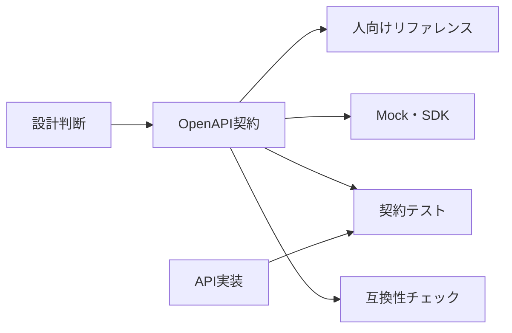

文章だけの仕様書は読みやすくても、必須項目やエラー形式の食い違いを機械的に見つけられません。OpenAPIは、HTTP APIの入口と出口を、ツールが読める契約として記述します。

## OpenAPIが担う範囲

OpenAPI文書から、リファレンス表示、入力検証、モック、SDK生成、互換性差分、契約テストを作れます。一方、次はYAMLだけでは十分に伝わりません。

- なぜそのリソース境界を選んだか
- 満席判定や取消期限などの業務ルール
- 再試行、順序、整合性の保証
- 廃止までの移行手順
- 典型的な利用シナリオ



OpenAPIを仕様の一部として版管理し、文章のガイドと相互にリンクします。

## 最小の文書から始める

2026年8月時点の最新版であるOpenAPI Specification 3.2.0を使った例です。

```yaml
openapi: 3.2.0
info:
  title: Events API
  version: 1.0.0
servers:
  - url: https://api.example.com
paths:
  /events/{eventId}:
    get:
      operationId: getEvent
      summary: イベント詳細を取得する
      parameters:
        - $ref: '#/components/parameters/EventId'
      responses:
        '200':
          description: イベントを取得した
          headers:
            ETag:
              schema:
                type: string
          content:
            application/json:
              schema:
                $ref: '#/components/schemas/Event'
        '404':
          $ref: '#/components/responses/NotFound'
components:
  parameters:
    EventId:
      name: eventId
      in: path
      required: true
      schema:
        type: string
        pattern: '^evt_[A-Za-z0-9]+$'
  schemas:
    Event:
      type: object
      required: [id, title, status, startsAt]
      properties:
        id:
          type: string
          example: evt_123
        title:
          type: string
          minLength: 1
          maxLength: 120
        status:
          type: string
          enum: [draft, scheduled, published, cancelled, completed]
        startsAt:
          type: string
          format: date-time
    Problem:
      type: object
      required: [type, title, status]
      properties:
        type:
          type: string
          format: uri-reference
        title:
          type: string
        status:
          type: integer
          minimum: 100
          maximum: 599
  responses:
    NotFound:
      description: 対象が存在しないか、閲覧できない
      content:
        application/problem+json:
          schema:
            $ref: '#/components/schemas/Problem'
```

パスパラメーターは必須です。レスポンスコードは文字列として記述します。共通要素は`components`へ置き、`$ref`で再利用します。

## operationIdを安定した名前にする

`operationId`はSDKの関数名やテスト識別子に使われます。`getEvent`、`createReservation`のようにAPI全体で一意かつ長期に保てる名前を付けます。パスを変えても同じ操作なら維持する方針も決めます。

`summary`は一覧で読める短文、`description`は前提条件、副作用、権限、整合性などを説明する本文にします。型から分かることを言い換えるだけでは不十分です。

## 入力と出力のスキーマを分ける

```yaml
CreateEventInput:
  type: object
  additionalProperties: false
  required: [title, startsAt, endsAt, capacity]
  properties:
    title:
      type: string
      minLength: 1
      maxLength: 120
    startsAt:
      type: string
      format: date-time
    endsAt:
      type: string
      format: date-time
    capacity:
      type: integer
      minimum: 1
      maximum: 10000
```

`Event`を作成入力に使うと、サーバー管理の`id`や`status`まで入力可能に見えます。用途別の名前を付けます。

日時の前後関係や「公開後は定員を予約数未満にできない」といった制約は、スキーマだけで表しにくいため、説明、例、エラー応答、テストへ記録します。

## 成功だけでなく全経路を書く

- 認証失敗`401`と`WWW-Authenticate`
- 認可失敗`403`または存在秘匿の`404`
- 検証失敗`422`と項目別エラー
- 競合`409`、事前条件失敗`412`
- 流量超過`429`と`Retry-After`
- 一時障害`503`

各応答には現実的な`examples`を置きます。一つの汎用`default`応答だけにすると、クライアントが回復方法を判断できません。

## セキュリティ要件を操作へ結び付ける

```yaml
components:
  securitySchemes:
    oauth2:
      type: oauth2
      flows:
        authorizationCode:
          authorizationUrl: https://auth.example.com/authorize
          tokenUrl: https://auth.example.com/token
          scopes:
            events:read: イベントを読む
            events:write: イベントを編集する
security:
  - oauth2: ['events:read']
```

全体の既定値を置き、書き込み操作だけ`events:write`へ上書きできます。OpenAPIのスコープ記載は認可実装の代わりではありませんが、必要権限を利用者とテストへ共有できます。

## Design-firstとCode-firstを循環させる

Design-firstでは、実装前に契約をレビューしやすくなります。Code-firstでは、実装との同期を保ちやすい一方、フレームワークの型がAPI設計を支配しがちです。

どちらを選んでも、次の循環を作ります。

1. 変更提案でOpenAPIと設計理由をレビューする
2. lintと互換性チェックを通す
3. モックまたは契約テストで利用側と確認する
4. 実装が契約どおりか検証する
5. 配布した文書と本番の差を監視する

生成コードは出発点です。ページ送り、再試行、トークン更新、未知列挙値など、SDKとしての利用体験は別に設計します。

:::message
OpenAPIはドキュメントの完成品ではなく、設計・実装・テストを同じ契約へ接続する中心ファイルです。
:::

### 参考資料

- [OpenAPI Specification 3.2.0](https://spec.openapis.org/oas/v3.2.0.html)
