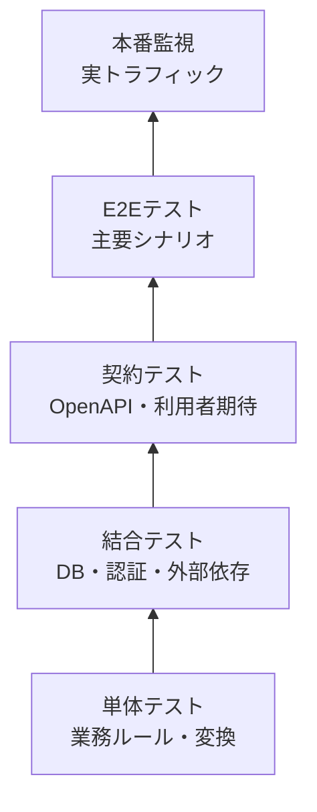
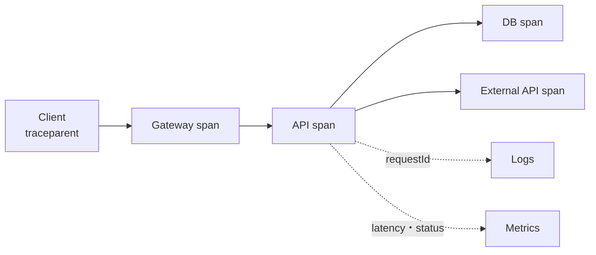

API設計は仕様書を公開して終わりではありません。実装が契約を守り、本番で期待する品質を保っているか確かめ続ける必要があります。

## テストを境界ごとに重ねる

上へ行くほど実環境へ近くなりますが、遅く、不安定で、原因特定が難しくなります。すべてをE2Eへ寄せず、各層の責任を分けます。

## 契約の正例と負例を試す

イベント作成では、成功例だけでなく次をテストします。

- 必須項目の欠落、未知フィールド、型違い
- 文字列・配列・ボディサイズの境界
- 終了日時が開始日時以前
- 期限切れトークン、誤った`aud`、不足スコープ
- 別テナントのID、編集不可フィールド
- 同じ冪等性キーの再送と内容不一致
- 古い`If-Match`による競合
- 依存先タイムアウト、429、5xx

エラーのステータスだけでなく、`Content-Type`、問題タイプ、必須ヘッダー、秘密情報の不在を確認します。

## 提供者と利用者の期待を照合する

OpenAPIに対するスキーマ検証は、型のずれを見つけます。消費者駆動契約テストは、実際のクライアントが依存する要求と応答を提供者側で再生します。

すべての利用者の内部実装へ提供者が依存するのは避けます。重要な利用シナリオを選び、互換性差分、過去版の回帰テスト、代表SDKのテストを組み合わせます。

## 性能試験は現実の分布で行う

平均応答時間だけでは、遅い一部の利用者が見えません。p50、p95、p99などの分位点を観測します。

- 通常の検索条件と最悪に近い許可条件
- 小さいページと最大ページ
- キャッシュヒットとミス
- 同じ人気イベントへの予約集中
- 外部依存の遅延と失敗
- 再試行が重なった状態

負荷試験で作るデータ量、テナント数、同時接続、実行時間を本番想定へ近づけます。最大スループットだけでなく、過負荷時に早く安全に失敗し、回復するかを確かめます。

## ログ、メトリクス、トレースを使い分ける

| 信号 | 得意な問い | 例 |
|---|---|---|
| ログ | 個別の失敗で何が起きたか | requestId、problem type、主体種別 |
| メトリクス | 全体傾向がどう変化したか | リクエスト数、エラー率、p95遅延 |
| トレース | どの依存先で時間を使ったか | API→DB→決済APIのspan |

[W3C Trace Context](https://www.w3.org/TR/trace-context/)の`traceparent`を境界で伝播すると、分散した処理を結べます。外部から届いた値は形式を検証し、内部の権限判断や秘密情報に使いません。

ログへトークンや本文全体を残さず、必要項目を構造化して記録します。利用者IDやURLパスの生値をメトリクスラベルにすると、系列数が爆発します。低カーディナリティの操作名、ステータスクラス、問題タイプを使います。

## 利用者視点のSLIとSLOを決める

「サーバーが動いている」ではなく、利用者が操作を完了できるかを測ります。

- 可用性: 有効な予約要求のうち、期待した時間内に正しく完了した割合
- 遅延: イベント詳細取得の95%が300ms以内
- 鮮度: 公開変更が検索結果へ60秒以内に反映される割合
- Webhook: 通知の99%が発生から5分以内に成功する割合

利用者の入力不正による`4xx`を可用性低下へ含めるか、API側の`429`をどう扱うかを明示します。指標の分母が曖昧だと、同じ数値でも意味が変わります。

SLOを下回る変更速度を制御するため、エラーバジェットを使えます。残量が少ないときは新機能より信頼性改善を優先する、と事前に方針を決めます。

## 段階的にリリースし、戻せるようにする

新しい実装は、内部テスト、少量トラフィック、特定テナント、全体の順に広げます。旧実装と結果を比較するシャドー実行も有効です。

DB変更は、旧版と新版の両方が動く順序で行います。まず追加、両方へ書き込み、データ移行、読み取り切替、利用確認、最後に削除という流れです。アプリだけをロールバックしても壊れない状態を保ちます。

## 障害対応もAPI体験に含める

- アラートには利用者影響と問題タイプを含める
- ランブックに確認クエリ、緩和策、戻し方を書く
- ステータスページで影響範囲と更新時刻を知らせる
- 障害後に契約、テスト、上限、監視を修正する
- 問い合わせ用requestIdから秘密を漏らさず追跡する

運用で何度も手作業になる判断は、APIや管理機能へ戻して設計し直します。観測によって、仕様書では見えなかった利用方法とボトルネックが分かります。

:::message
契約は、テストで守り、本番環境の観測データで確かめ、障害から学んで更新し続けるものです。
:::

### 参考資料

- [W3C Trace Context](https://www.w3.org/TR/trace-context/)
- [OpenTelemetry: Signals](https://opentelemetry.io/docs/concepts/signals/)
- [Google SRE: Error Budget Policy](https://sre.google/workbook/error-budget-policy/)
