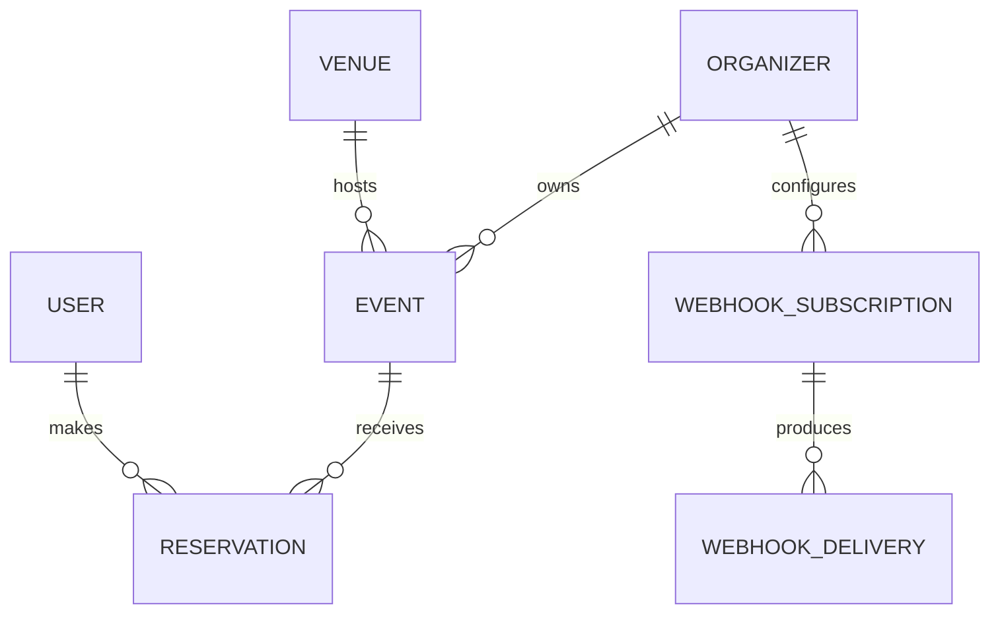
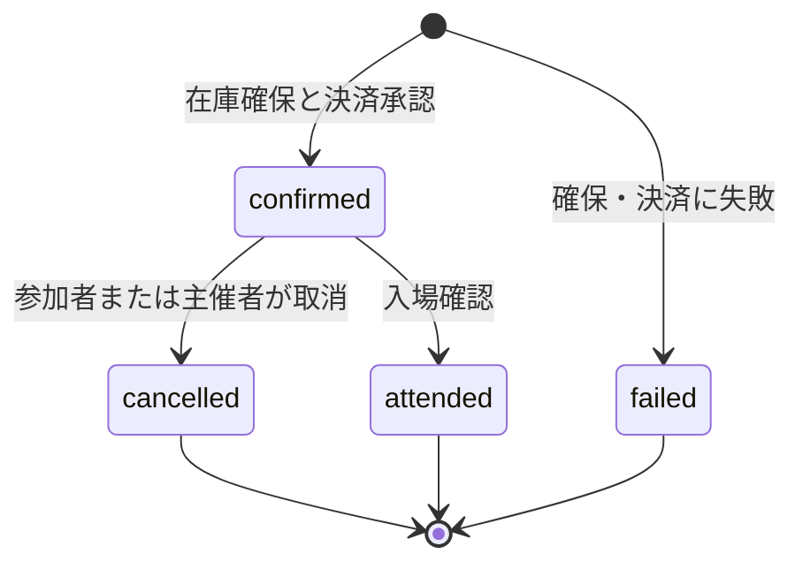
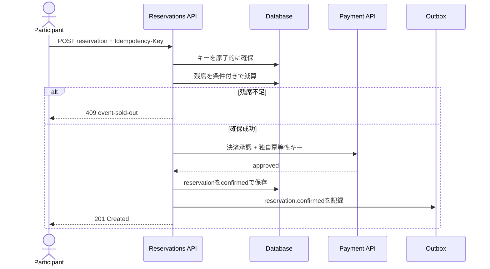
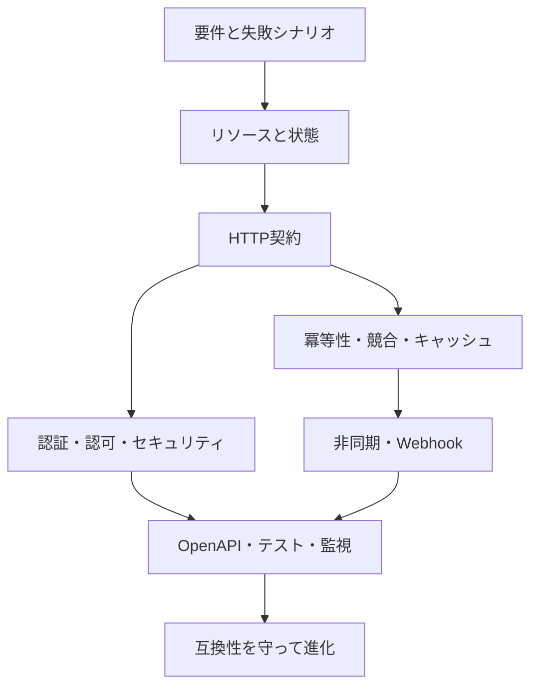

最後に、ここまで学んだ判断を一つのAPIへ統合します。題材は、主催者がイベントを公開し、参加者が席を予約し、外部システムが予約確定通知を受け取るサービスです。

この章の目的は、唯一の正解を示すことではありません。要件からリソース、HTTP、エラー、セキュリティ、信頼性、運用まで、設計判断がつながっている状態を作ります。

## 設計を始める前の5つの問い

完成例を読む前に、自分ならどう設計するかを考えてみてください。

1. APIの責任範囲をどこまでとし、どの利用者を想定するか
2. 何を独立したリソースとし、予約にどの状態遷移を許すか
3. 満席、再送、同時更新をどの応答と仕組みで扱うか
4. 参加者と主催者をどう認証し、対象ごとの権限をどう確認するか
5. Webhook、監視、契約テストを使って公開後のAPIをどう運用するか

以降は、この5問に対する一つの設計例です。要件が変われば答えも変わるため、各判断の理由に注目してください。

## 1. 境界と利用者を定める

対象範囲は次のとおりです。

- 主催者はイベントを下書き作成し、公開・中止できる
- 参加者は公開イベントを検索し、自分の予約を作成・取消できる
- 同じ席を定員以上に販売しない
- 外部連携先は予約確定と取消のWebhookを受け取れる
- 支払い処理そのものは外部決済サービスの責任とする

| 主体 | 主な操作 | 見せない情報 |
|---|---|---|
| 未認証の閲覧者 | 公開イベントの検索・詳細取得 | 下書き、参加者情報 |
| 参加者 | 自分の予約作成・閲覧・取消 | 他人の予約、主催者内部メモ |
| 主催者の編集者 | 所属イベントの編集 | 他主催者のイベント |
| 主催者の管理者 | 公開・中止、Webhook管理 | 他テナントの設定 |

APIの外側に、本人認証、カード情報の保管、メール配送の実装があります。APIはそれらの結果を利用しますが、内部詳細を契約へ漏らしません。

## 2. リソースと状態を描く



中心リソースは次の六つです。

- `events`: 公開対象となるイベント
- `venues`: 開催場所
- `reservations`: 参加者と席数を結ぶ予約
- `event-publications`: 公開予約と公開履歴
- `webhook-subscriptions`: 通知先と購読イベント
- `exports`: 大量出力の非同期ジョブ

予約をイベントの配列へ埋め込まず、独立したリソースにします。予約には所有者、取消期限、状態、監査履歴があるためです。



一時的な席の確保は内部処理とし、公開する予約状態にはしません。この状態機械から、`cancelled`をDELETEで消さない、確定済みの予約を未確定へ戻さない、といったAPI判断が導けます。

## 3. エンドポイントを一覧にする

### 公開イベント

| メソッド | パス | 結果 |
|---|---|---|
| `GET` | `/events` | 公開イベント一覧 |
| `GET` | `/events/{eventId}` | 公開イベント詳細 |
| `GET` | `/venues/{venueId}` | 会場詳細 |

### 主催者向け

| メソッド | パス | 結果 |
|---|---|---|
| `POST` | `/events` | 下書きイベントを作成 |
| `PATCH` | `/events/{eventId}` | 許可された属性を部分更新 |
| `POST` | `/events/{eventId}/publications` | 即時または予約公開 |
| `POST` | `/events/{eventId}/cancellation` | イベントを中止 |
| `GET` | `/events/{eventId}/reservations` | 参加者予約一覧 |

### 参加者向け

| メソッド | パス | 結果 |
|---|---|---|
| `POST` | `/reservations` | 自分の予約を作成 |
| `GET` | `/me/reservations` | 自分の予約一覧 |
| `GET` | `/reservations/{reservationId}` | 自分の予約詳細 |
| `POST` | `/reservations/{reservationId}/cancellation` | 予約を取消 |

取消には実行者、理由、返金結果があり、記録を後から確認するため、`DELETE`ではなくcancellationリソースを作ります。

### 外部連携・非同期処理

| メソッド | パス | 結果 |
|---|---|---|
| `POST` | `/webhook-subscriptions` | Webhook購読を作成 |
| `GET` | `/webhook-subscriptions` | Webhook購読を一覧取得 |
| `DELETE` | `/webhook-subscriptions/{subscriptionId}` | Webhook購読を解除 |
| `GET` | `/webhook-deliveries/{deliveryId}` | 配送結果を確認 |
| `POST` | `/exports` | 大量出力ジョブを作成 |
| `GET` | `/exports/{exportId}` | 出力の進行状況と取得先を確認 |

## 4. 一覧の契約を決める

```http
GET /events?status=published&startsAt.gte=2026-09-01T00%3A00%3A00Z&venueId=ven_456&sort=startsAt,id&limit=20 HTTP/1.1
```

- `status`は公開利用者には`published`だけを許す
- `startsAt.gte`と`startsAt.lte`で開催範囲を指定する
- `sort`は`startsAt`、`-startsAt`、`createdAt`に限定する
- 一意な順序にするため、常に`id`を末尾へ補う
- `limit`の既定値は20、最大100
- 次ページは不透明なカーソルで進む

```json
{
  "items": [
    {
      "id": "evt_123",
      "title": "API Design Workshop",
      "startsAt": "2026-09-12T04:00:00Z",
      "venue": {"id": "ven_456", "name": "Tokyo Hall"},
      "availability": "available"
    }
  ],
  "page": {
    "limit": 20,
    "nextCursor": "eyJ2IjoxLCJzdGFydHNBdCI6Ii4uLiIsImlkIjoiZXZ0XzEyMyJ9",
    "hasNext": true
  }
}
```

一覧の`availability`は表示用の目安です。予約の成功を保証しません。総件数は検索費用が大きいため、通常応答には含めません。

## 5. イベント作成を設計する

```http
POST /events HTTP/1.1
Authorization: Bearer ...
Content-Type: application/json

{
  "title": "API Design Workshop",
  "description": "HTTPから運用までを学ぶワークショップです。",
  "startsAt": "2026-09-12T04:00:00Z",
  "endsAt": "2026-09-12T07:00:00Z",
  "venueId": "ven_456",
  "capacity": 40,
  "price": {"amount": 3000, "currency": "JPY"}
}
```

サーバーは、JSON構文、スキーマ、会場の所有テナント、日時の前後関係、会場上限を順に検証します。`status`、`organizerId`、`availableSeats`は入力させません。

```http
HTTP/1.1 201 Created
Location: /events/evt_123
ETag: "event-v1"
Content-Type: application/json

{
  "id": "evt_123",
  "title": "API Design Workshop",
  "status": "draft",
  "startsAt": "2026-09-12T04:00:00Z",
  "endsAt": "2026-09-12T07:00:00Z",
  "venue": {"id": "ven_456", "name": "Tokyo Hall"},
  "capacity": 40,
  "createdAt": "2026-08-09T05:00:00Z",
  "updatedAt": "2026-08-09T05:00:00Z"
}
```

## 6. 公開を業務操作として表す

```http
POST /events/evt_123/publications HTTP/1.1
Authorization: Bearer ...
Content-Type: application/json
Idempotency-Key: 01J4QBM8Z9D6CGBNTFCPV0AH2R

{"publishAt":"2026-08-15T01:00:00Z"}
```

公開前に、タイトル、会場、日時、定員、販売条件を再検証します。主催者の`events:publish`スコープと対象イベントの管理権限が必要です。公開予約を作成したら`201`を返します。

公開処理が別システムへの反映を含み、完了まで待てない場合は`202`にしてpublicationの状態を照会させます。同じ操作なのに負荷状況だけで`201`と`202`を切り替えず、完了条件で契約を固定します。

## 7. 予約作成の一貫性を守る

```http
POST /reservations HTTP/1.1
Authorization: Bearer ...
Idempotency-Key: 01J4QBX4H80YDTB81Y6KZQ40XG
Content-Type: application/json

{"eventId":"evt_123","seats":2,"paymentMethodId":"pm_abc"}
```

処理の要点は、認可、重複排除、残席確保、決済連携、結果記録です。



DBには、予約と「後で送るイベント」の記録を同じトランザクションで保存します。この方法をトランザクショナルアウトボックスと呼びます。

外部の決済サービスまで含めた一括更新はできないため、途中で失敗した場合の戻し方も決めます。残席確保後に決済が失敗したら席を戻し、予約を`failed`として記録します。タイムアウトで決済結果が分からないときは、決済側の冪等性キーで結果を照会してから予約を確定します。

冪等性の記録には、主体、経路、キー、応答に加え、入力から計算した識別値を24時間保持します。この識別値が入力フィンガープリントです。同じキーでイベント、席数、決済手段のいずれかが異なる要求を受けたら、`409`で拒否します。

## 8. 同時編集を上書きしない

```http
PATCH /events/evt_123 HTTP/1.1
Authorization: Bearer ...
If-Match: "event-v7"
Content-Type: application/merge-patch+json

{"capacity":50}
```

現在版が`v8`なら変更せず、`412 Precondition Failed`を返します。公開済みイベントでは、既存予約数より小さい定員、開始後の日時変更、許可されない状態変更を拒否します。

```json
{
  "type": "https://api.example.com/problems/precondition-failed",
  "title": "The event has changed",
  "status": 412,
  "detail": "Retrieve the latest event and apply the change again."
}
```

## 9. エラー体系を固定する

| 問題タイプ | HTTP | 再試行 | 代表場面 |
|---|---:|---|---|
| `malformed-json` | 400 | 修正後 | JSON構文不正 |
| `authentication-required` | 401 | 再認証後 | トークンなし・無効 |
| `forbidden` | 403 | 権限変更後 | 公開権限なし |
| `event-not-found` | 404 | しない | 存在しない、または閲覧不可 |
| `validation-failed` | 422 | 修正後 | 項目制約違反 |
| `event-sold-out` | 409 | 状態変化後 | 残席不足 |
| `idempotency-key-reused` | 409 | 新しいキー | 同一キーで内容違い |
| `precondition-failed` | 412 | 再取得後 | ETag不一致 |
| `rate-limit-exceeded` | 429 | 指定時刻後 | 利用枠超過 |
| `service-unavailable` | 503 | バックオフ後 | 一時障害 |

すべて`application/problem+json`を使い、検証エラーだけ`errors`配列を拡張します。予期しない例外では内部詳細を返さず、`requestId`でログと結びます。

## 10. 認証・認可の境界を置く

アクセストークンでは、署名、`iss`、`aud`、時刻、スコープを検証します。その後、対象リソースの`organizerId`または`userId`を照合します。

| 操作 | スコープ | 追加条件 |
|---|---|---|
| 公開イベント取得 | 不要 | `status=published` |
| 自分の予約取得 | `reservations:read` | `reservation.userId == subject` |
| 予約作成 | `reservations:write` | 本人、イベント公開中 |
| イベント編集 | `events:write` | 主催テナント所属、編集役割 |
| イベント公開 | `events:publish` | 管理役割、追加認証が有効 |

URLの`organizerId`やヘッダーのテナントIDだけを信用しません。認証済み主体の所属と一致することを確認し、DB検索にもテナント条件を入れます。

## 11. キャッシュと流量を操作別に決める

- 公開イベント詳細: `Cache-Control: public, max-age=60`、ETag対応
- 自分の予約: `Cache-Control: private, no-cache`
- トークンや決済を含む応答: `Cache-Control: no-store`
- イベント更新: `If-Match`を要求
- 予約作成: 利用者・イベント・IPを組み合わせた流量制御
- 検索: 最大100件、条件数と処理時間に上限
- エクスポート: テナントごとの同時ジョブ数を制限

公開一覧の残席表示はキャッシュで古い可能性があります。予約時はDBの現在値を条件付き更新し、整合性を守ります。

## 12. Webhookを配送する

主催者は`reservation.confirmed`と`reservation.cancelled`を購読できます。ペイロードには必要最小限の予約情報だけを含め、参加者の詳細は権限付きAPIから取得させます。

```json
{
  "id": "msg_01J4QD5",
  "type": "reservation.confirmed",
  "version": "1",
  "occurredAt": "2026-08-09T05:10:00Z",
  "subject": "reservations/rsv_789",
  "data": {
    "reservationId": "rsv_789",
    "eventId": "evt_123",
    "seats": 2
  }
}
```

送信時刻と生ボディへ署名し、指数バックオフで24時間再送します。受信側にはイベントIDで重複排除するよう求めます。配送履歴と手動再送を提供し、登録URLは所有確認とSSRF対策を通します。

## 13. 契約と運用を接続する

OpenAPI 3.2文書をリポジトリで管理し、次をCIで検証します。

- 構文とスタイルのlint
- 旧版との差分と破壊的変更
- 実装の応答がスキーマへ適合するか
- 主要なProblem Details例が存在するか
- 認証スコープ、`Idempotency-Key`、`If-Match`が記載されているか

本番では操作名、HTTPステータス、問題タイプ、p95遅延をメトリクスにします。トレースでは決済APIとDB待ち時間を分け、ログは`requestId`と予約IDから追跡します。トークン、決済手段、Webhook秘密は記録しません。

主なSLOは次のように置きます。

- 有効な予約作成の99.9%が2秒以内に確定応答する
- 公開イベント取得の99%が300ms以内に応答する
- 予約Webhookの99%が5分以内に一度以上成功する
- 予約の二重作成と定員超過を0件にする

## 14. 変更と廃止を準備する

新しい任意項目は同じ版へ追加できます。フィールドの意味変更、必須化、状態遷移の非互換変更は新しい契約で並行提供します。

廃止時には`Deprecation`、`Sunset`、移行ガイドへの`Link`を返します。トラフィックを利用者別に観測し、移行完了を確認してから停止します。古い版にも停止日までセキュリティ修正を適用します。

## 最終レビュー



次の問いに答えられれば、実装へ進める設計になっています。

- 利用者の主要な仕事が、エンドポイントの流れとして説明できるか
- 各リソースの所有者、状態、識別子、削除方針が決まっているか
- 入力、成功、失敗、再試行の契約が具体的か
- 認証後に、対象と項目の認可を毎回確認するか
- タイムアウトと同時実行でも、二重予約と定員超過を防げるか
- 一覧、エクスポート、Webhookがデータ増加に耐えるか
- OpenAPI、テスト、監視が同じ問題分類と操作名を使うか
- 変更を検出し、利用状況を見ながら廃止できるか

API設計は、URLを美しく並べる仕事ではありません。利用者の操作が、失敗や変更を含めて予測可能であり、提供者が内部を安全に進化させられる境界を作る仕事です。

:::message
設計判断は単独では働きません。HTTP、業務状態、セキュリティ、信頼性、運用が同じ契約を支えるとき、APIは長く使える製品になります。
:::
