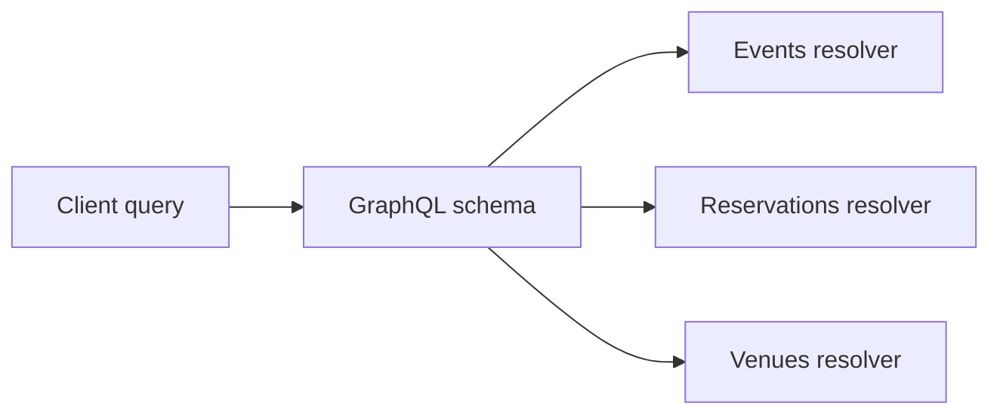
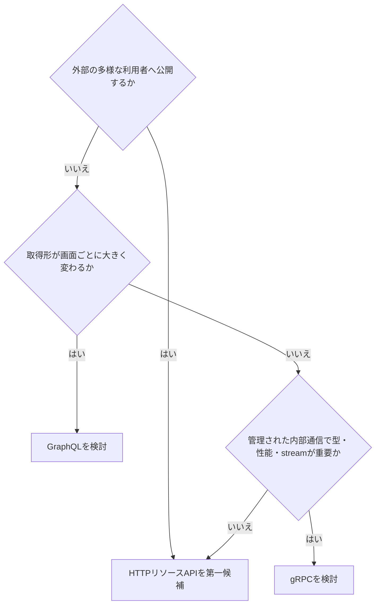

API方式は優劣ではなく、利用者、通信環境、データ形状、運用能力で選びます。一つのシステムで、公開REST API、画面向けGraphQL、内部gRPCを併用することもあります。

## 比較表

| 観点 | HTTPリソースAPI（REST） | GraphQL | gRPC |
|---|---|---|---|
| 契約 | URI・メソッド・HTTP・OpenAPI | 型付きスキーマと操作 | Protocol Buffersとservice |
| 取得単位 | エンドポイントが表現を決める | クライアントがフィールドを選ぶ | RPCメッセージが決める |
| 通信 | HTTP、主にJSON | HTTP、主にJSON | HTTP/2、Protocol Buffers |
| ブラウザー | 直接扱いやすい | 直接扱いやすい | 通常は変換層が必要 |
| キャッシュ | HTTPキャッシュを活用しやすい | 操作単位の工夫が必要 | アプリ側で設計 |
| ストリーミング | 別方式を組み合わせる | Subscriptionを別トランスポートで | 双方向を含め標準機能 |
| エラー | HTTP + Problem Details | `errors`と部分データ | status code + details |
| ツール | URL、curl、CDN、OpenAPI | Schema、Explorer、コード生成 | 強いコード生成、reflection |
| 主な適性 | 公開API、CRUD、HTTP連携 | 画面ごとに取得形が変わる | 管理された内部サービス間 |

RESTは特定の仕様製品名ではありません。本書では、HTTPの標準意味とリソース指向を活用するAPIを「HTTPリソースAPI」として扱っています。

## REST系APIが合う条件

- リソースと操作をHTTPの語彙で自然に表せる
- 外部の多様な利用者へ公開する
- CDN、ブラウザー、標準HTTPクライアントを活用したい
- エンドポイント単位で権限、キャッシュ、流量を管理したい
- 長期間の互換性を単純な道具で保ちたい

弱点は、画面ごとに必要なデータが違うと過不足や往復が増えることです。要約表現、`include`、集約エンドポイントで対応できますが、種類を増やしすぎると管理が難しくなります。

## GraphQLが合う条件

- 複数の画面が異なるフィールドと関連を必要とする
- フロントエンドとスキーマを協調して進化させられる
- 一つのグラフとして探索したいデータがある
- 型、非推奨、フィールド単位の利用状況を活用したい

自由な取得には費用管理が必要です。深さ、フィールド数、リスト件数、実行時間、N+1クエリを制御します。スキーマが一つでも、フィールドごとの認可を省けません。HTTPが常に`200`でもGraphQLの`errors`があるため、監視は実行結果を理解する必要があります。

## gRPCが合う条件

- 呼び出し元と提供者を同じ組織で管理できる
- 厳密な型とコード生成を重視する
- 低い転送コスト、多数の内部RPC、ストリーミングが必要
- HTTP/2を含む通信経路を管理できる

Protocol Buffersでは、公開済みフィールド番号を再利用しません。削除時は`reserved`にします。JSONより人が直接読みづらく、ブラウザーや一部プロキシとの接続にはgRPC-Webやゲートウェイが必要です。

## 決定の流れ

これは入口であり、結論ではありません。チームのデバッグ能力、ゲートウェイ、監視、権限モデル、SDK配布まで含めて小さな実証を行います。

## 併用するときの境界

方式間の変換層を置くなら、どこが正規の契約か決めます。GraphQL resolverがREST APIを呼び、RESTがgRPCへ変換する多段構成では、タイムアウト、エラー、認証主体、トレースを通して伝える必要があります。

外部の都合を内部へそのまま伝播させず、各境界で入力、認可、エラー、再試行を変換します。方式を増やすことは、契約と運用面を増やすことでもあります。

### 参考資料

- [GraphQL Specification](https://spec.graphql.org/)
- [gRPC Documentation](https://grpc.io/docs/)

