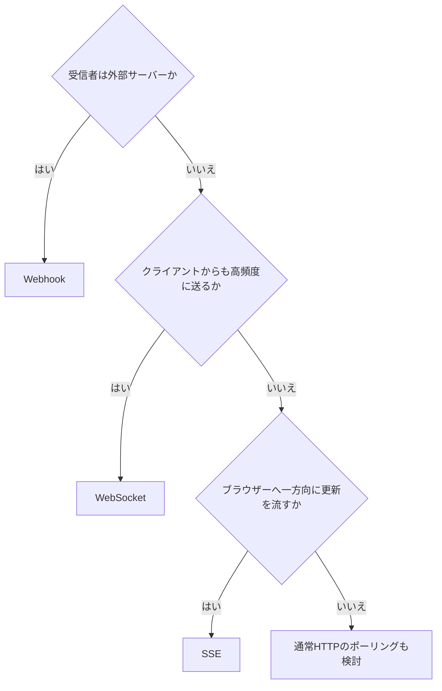

「リアルタイムにしたい」という要求だけでは方式を選べません。通信の向き、接続時間、受信者がブラウザーかサーバーか、欠落時の回復方法を確認します。

## 比較表

| 観点 | WebSocket | Server-Sent Events（SSE） | Webhook |
|---|---|---|---|
| 通信方向 | 双方向 | サーバー→ブラウザー | サーバー→別サーバー |
| 接続 | 長時間接続 | 長時間のHTTP応答 | イベントごとのHTTP要求 |
| 主な受信者 | Web・モバイル・ゲーム | ブラウザー画面 | 外部サービス |
| データ | text / binary frame | `text/event-stream` | 任意のHTTP本文 |
| 再接続 | アプリで設計 | ブラウザーが支援 | 送信側が再送 |
| 認証 | 接続時＋継続管理 | HTTP認証、Cookie等 | 署名、TLS、購読認可 |
| 水平分散 | 接続ルーティングが必要 | 接続ルーティングが必要 | キューで分離しやすい |
| 向く例 | チャット、共同編集 | 進捗、通知、ログ表示 | 予約確定を他社へ通知 |

## WebSocket

一つの接続で双方向に低遅延のメッセージを送れます。チャット、共同編集、対戦ゲームなど、クライアントからも頻繁に送信する場面に合います。

HTTP要求ごとの認証・流量制御から、接続単位の管理へ変わります。

- 接続時と権限変更後の認証をどう扱うか
- メッセージ種別、ID、版、応答相関をどう表すか
- 一接続の送信速度、キュー、最大メッセージをどう制限するか
- 遅い受信者に対するバックプレッシャーをどう扱うか
- 切断中のメッセージを再取得できるか
- サーバー間で接続をどうルーティングするか

接続が続いていることと、相手がメッセージを処理したことは別です。重要な処理には確認応答、ID、永続状態の照会を用意します。

## Server-Sent Events

SSEは、サーバーからブラウザーへテキストイベントを流す用途に適します。

```text
id: progress-42
event: export.progress
data: {"jobId":"exp_123","percent":80}

```

`id`を付けると、再接続時の`Last-Event-ID`を使って続きを送れます。実際にどこまで履歴を保持し、古すぎるIDをどう扱うかはアプリ側の契約です。

双方向ではないため、クライアントからの操作は通常のHTTP APIで行います。進捗、ダッシュボード更新、通知一覧などに向きます。プロキシのバッファリング、接続タイムアウト、一利用者あたりの接続数を確認します。

## Webhook

Webhookは、ブラウザーではなく別のサーバーへイベントを届けます。常時接続を求めず、受信者が公開HTTPS URLを持つ連携に適します。

重複、遅延、順不同、再送上限、署名、SSRF対策が必要です。リアルタイムというより「できるだけ早い、信頼性を設計した通知」です。受信側が停止しても、送信側のキューから再送できます。

## 選び方



数十秒に一回の更新なら、条件付きGETやロングポーリングの方が単純な場合があります。方式の華やかさではなく、必要な遅延と運用費用で選びます。

## 共通して必要な設計

- メッセージID、種類、スキーマ版、発生時刻
- 認証、購読認可、テナント分離
- 最大サイズ、送信頻度、同時接続・購読数
- 重複と順序、切断中の欠落への対応
- クライアントが最新状態を再取得するAPI
- メトリクス、配信遅延、切断・失敗率、追跡ID
- 互換性と非推奨化の規則

配送方式を変えても、真実の状態は永続リソースから照会できるようにします。通知は変化を知るきっかけ、APIは現在状態を確認する手段として組み合わせると回復しやすくなります。

### 参考資料

- [The WebSocket Protocol（RFC 6455）](https://www.rfc-editor.org/rfc/rfc6455)
- [WHATWG HTML: Server-sent events](https://html.spec.whatwg.org/multipage/server-sent-events.html)
- [Standard Webhooks Specification](https://github.com/standard-webhooks/standard-webhooks/blob/main/spec/standard-webhooks.md)

