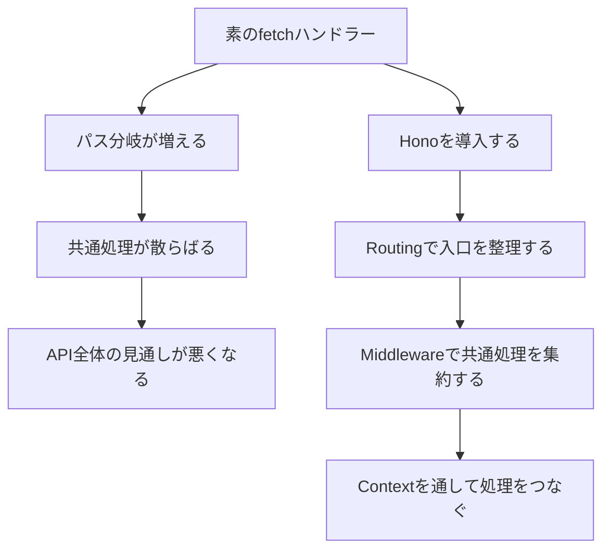
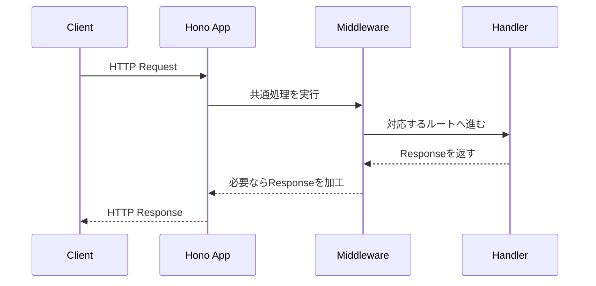
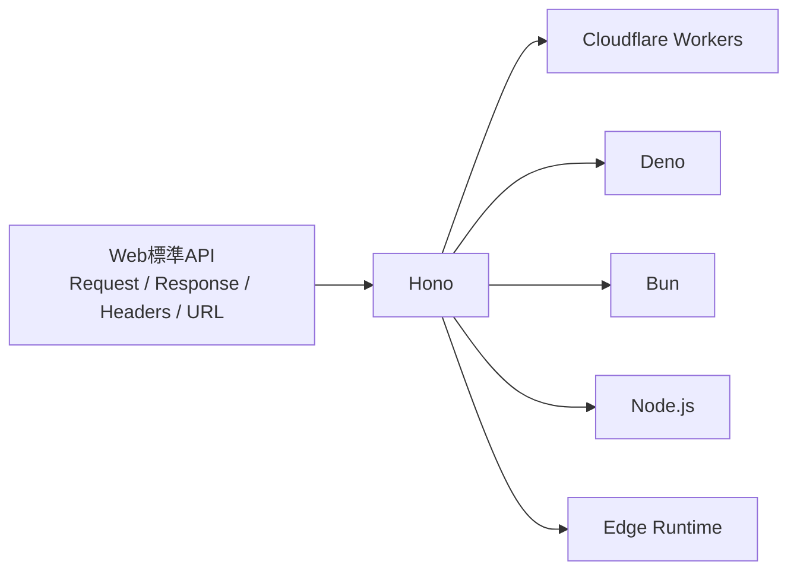
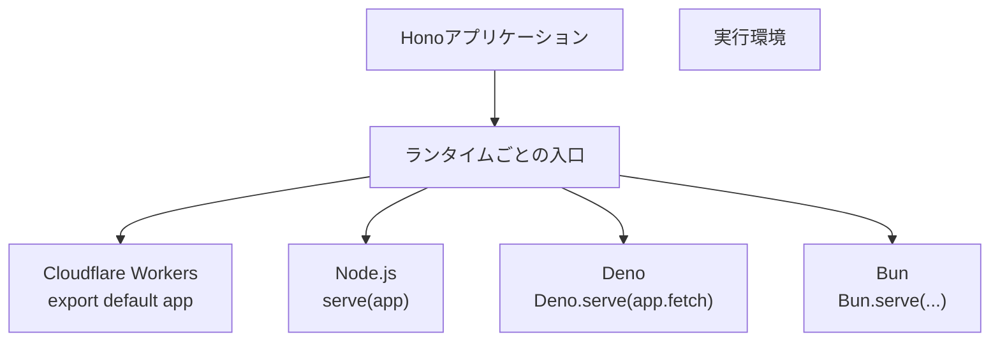

Honoは、Web標準APIを土台にした、軽量で高速なWebフレームワークです。TypeScriptやJavaScriptでWeb APIやWebアプリケーションを作れます。Cloudflare Workers、Deno、Bun、Node.jsなど、複数のJavaScriptランタイムで動くことも大きな特徴です。

ただし、Honoを「速いフレームワーク」とだけ覚えると、少しもったいないです。Honoの本質は、速さだけではありません。`Request`を受け取り、`Response`を返すというWeb標準の考え方に近いまま、ルーティング、ミドルウェア、型安全なAPI開発を扱えるところにあります。

ここでは細かいコードへ進む前に、Honoの設計思想、向いている開発、ExpressのようなNode.js中心のフレームワークとの違いを整理します。

## Honoをひとことで見る

Honoの最小コードは、とても短く書けます。

```ts:src/index.ts
import { Hono } from 'hono';

const app = new Hono();

app.get('/', (c) => {
  return c.text('Hello Hono!');
});

export default app;
```

このコードでは、`new Hono()`でアプリケーションを作り、`app.get()`でGETリクエストのルートを登録しています。Handlerの引数に渡される`c`は、Honoの`Context`です。`c.text()`は、テキストの`Response`を作って返します。

見た目はシンプルですが、この短いコードの中にHonoらしさが詰まっています。

- ルートは`app.get()`のようにHTTPメソッドごとに登録する
- Handlerはリクエストを受け取り、レスポンスを返す
- レスポンスはWeb標準の`Response`に近い考え方で扱う
- 同じHonoアプリケーションを複数のランタイムへ載せやすい

ここで大事なのは、Honoが「独自の世界を作る」というより、「Webの標準的な部品に薄く便利な層をかぶせる」タイプのフレームワークだということです。

## 名前の由来

Honoは、日本語の「炎」に由来します。公式ドキュメントでも、Honoは「flame in Japanese」と説明されています。

名前から連想されるとおり、Honoは速さを大事にしています。とはいえ、本書では「速いから使う」とだけ考えません。速さはHonoの魅力のひとつですが、Honoを使う価値は、次のような性質が組み合わさって生まれます。

| 性質 | 何がうれしいか |
|---|---|
| 軽量 | アプリケーションの起動や配布が軽くなりやすい |
| 高速 | ルーティングやリクエスト処理のオーバーヘッドを抑えやすい |
| Web標準ベース | `Request`や`Response`の知識がそのまま活きる |
| マルチランタイム | Cloudflare Workers、Deno、Bun、Node.jsなどへ展開しやすい |
| TypeScriptとの相性 | APIの型を保ったまま設計しやすい |

この章では、それぞれの意味を順番に見ていきます。

## Honoが解決する問題

Web APIを作るだけなら、Honoを使わなくても書けます。たとえば、Cloudflare Workersでは`fetch`ハンドラーを書けば、リクエストを受け取ってレスポンスを返せます。

```ts
export default {
  async fetch(request: Request): Promise<Response> {
    const url = new URL(request.url);

    if (url.pathname === '/health') {
      return Response.json({ ok: true });
    }

    return new Response('Not Found', { status: 404 });
  },
};
```

このような書き方は、Web標準に近くて分かりやすいです。小さな処理なら十分です。

しかし、APIが少し大きくなると、すぐに困りごとが出てきます。

- パスごとに`if`文が増える
- `GET`、`POST`、`PATCH`、`DELETE`の分岐が散らばる
- URLパラメータやクエリ文字列の扱いが毎回ばらつく
- 認証やログ出力などの共通処理をどこに置くか迷う
- エラー処理の形がルートごとに違ってくる
- テスト対象を切り出しにくくなる

Honoは、こうした問題を解決するために使います。



Honoは、Web標準の感覚を保ったまま、API開発に必要な整理棚を用意してくれるフレームワークです。

## Honoの基本構造

Honoアプリケーションの中心には、3つの要素があります。

| 要素 | 役割 |
|---|---|
| App | ルートやミドルウェアを登録するアプリケーション本体 |
| Handler | 個別のリクエストを処理してレスポンスを返す関数 |
| Context | リクエスト、レスポンス、環境変数、共有値などを扱うための入れ物 |

もう少し流れとして見ると、次のようになります。



この図で見ておきたいのは、Honoが「リクエストをどのHandlerへ届けるか」と「共通処理をどの順番で通すか」を管理していることです。

Handlerの中では、主に`Context`を使います。

```ts
app.get('/tasks/:id', (c) => {
  const id = c.req.param('id');

  return c.json({
    id,
    title: 'Honoを学ぶ',
  });
});
```

`c.req.param('id')`でパスパラメータを読み取り、`c.json()`でJSONレスポンスを返しています。このように、Honoでは`Context`を通して、リクエストの読み取りとレスポンスの作成を行います。

`Context`については、第7章で詳しく扱います。ここでは、Handlerに渡される`c`がHonoアプリケーションの中心的な操作口になる、と押さえておけば十分です。

## Web標準を重視する理由

Honoを理解するうえで、いちばん大事なのがWeb標準APIです。

Web標準APIとは、特定のフレームワークやランタイムだけに閉じない、Webプラットフォームの共通部品のことです。たとえば、次のようなものがあります。

- `Request`
- `Response`
- `Headers`
- `URL`
- `URLSearchParams`
- `FormData`
- `Blob`
- `fetch`

Honoは、こうしたWeb標準APIを土台にしています。これは、HonoのコードがCloudflare WorkersやDeno、Bunのようなランタイムと相性がよい理由のひとつです。



Node.jsだけを前提にしたフレームワークでは、Node.jsの`IncomingMessage`や`ServerResponse`に近い考え方が中心になります。一方、Honoでは`Request`と`Response`の考え方が中心になります。

この違いは、最初は小さく見えます。しかし、Cloudflare Workersのような環境でAPIを作るときには、とても大きな差になります。Workersでは、もともと`fetch`、`Request`、`Response`の考え方が重要だからです。

本書で第3章にHTTPとWeb標準APIを置いているのは、このためです。Honoの記法だけを先に覚えるより、Honoが乗っている土台を理解したほうが、あとで迷いにくくなります。

## 高速・軽量とは何を意味するのか

Honoは、高速で軽量なフレームワークとして紹介されることが多いです。

ただし、ここで注意したいのは、「高速」という言葉を雑に扱わないことです。API全体の速さは、フレームワークだけで決まるわけではありません。データベースへのアクセス、外部APIの呼び出し、認証処理、レスポンスサイズ、ネットワークなど、さまざまな要素が影響します。

Honoが得意なのは、主にフレームワークとしてのオーバーヘッドを小さくすることです。

| 観点 | Honoで期待できること | それだけでは決まらないこと |
|---|---|---|
| ルーティング | リクエストをHandlerへ届ける処理を軽くしやすい | Handlerの中で重い処理をしていないか |
| 依存関係 | フレームワーク本体を小さく保ちやすい | アプリ側で追加するライブラリの重さ |
| 起動 | サーバーレスやエッジ環境で扱いやすい | ランタイムごとの実行モデル |
| レスポンス | 薄い層で`Response`を返しやすい | DBや外部サービスの待ち時間 |

つまり、Honoを使えば何でも自動的に速くなる、という話ではありません。Honoは、速く作るための邪魔をしにくいフレームワークだと考えると分かりやすいです。

軽量であることも同じです。軽いフレームワークを選ぶと、アプリケーション側で必要な設計を自分で決める余地が増えます。これは自由でもあり、責任でもあります。本書では、その自由をどう扱うかを章を追って学びます。

## マルチランタイムという考え方

Honoは、複数のJavaScriptランタイムで動かせます。

ランタイムとは、JavaScriptやTypeScriptのコードを実行する環境のことです。Node.js、Deno、Bun、Cloudflare Workersなどが代表例です。

同じJavaScriptでも、ランタイムによって使えるAPIや起動の仕方は異なります。たとえば、Cloudflare WorkersではNode.jsの標準モジュールをそのまま使えない場面があります。一方、Workersはエッジ環境で動かしやすく、`Request`と`Response`を中心にしたモデルと相性がよいです。

HonoはWeb標準APIを土台にしているため、ランタイムごとの差を小さくできます。



ただし、「完全に同じコードが、どんな環境でも何も考えずに動く」という意味ではありません。データベース、環境変数、ファイルシステム、暗号化API、リクエストの入口などは、ランタイムごとに違いが出ます。

それでも、Honoの中心的なコード、つまりルーティングやHandlerの書き方は共通化しやすくなります。これは、学習にも実務にも大きな利点です。

## Expressとの違い

Honoを理解するために、Expressと比べてみます。ExpressはNode.jsの世界で長く使われてきたWebフレームワークです。豊富な実績があり、ミドルウェア文化も成熟しています。

HonoはExpressの単なる置き換えではありません。似た書き心地の部分はありますが、土台にしている考え方が違います。

| 観点 | Express | Hono |
|---|---|---|
| 主な前提 | Node.js | Web標準APIとマルチランタイム |
| リクエスト | Node.js由来の`req` | HonoRequestとWeb標準の`Request` |
| レスポンス | `res.send()`や`res.json()`で送信 | `c.text()`や`c.json()`で`Response`を返す |
| 実行環境 | Node.js中心 | Workers、Deno、Bun、Node.jsなど |
| 型安全 | 追加設計が必要になりやすい | Hono RPCなど型を活かす仕組みがある |
| 設計思想 | Node.jsサーバーアプリの定番 | エッジやサーバーレスとも相性がよい軽量設計 |

Expressでは、Handlerの中で`res`に対してレスポンスを書き込みます。

```ts
app.get('/health', (req, res) => {
  res.json({ ok: true });
});
```

Honoでは、Handlerからレスポンスを返します。

```ts
app.get('/health', (c) => {
  return c.json({ ok: true });
});
```

この違いは、好みの問題だけではありません。Honoの書き方は、`Request`を受け取り、`Response`を返すというWeb標準の流れに近くなっています。

Expressに慣れている人は、最初は`req`と`res`がないことに少し戸惑うかもしれません。けれども、Honoでは`Context`に必要な操作がまとまっているため、慣れると処理の入口と出口が見えやすくなります。

:::message
Expressが古いからHonoがよい、という話ではありません。ExpressにはExpressの強みがあります。Honoを選ぶ理由は、Web標準API、マルチランタイム、軽量な設計、TypeScriptとの相性を重視したい場面にあります。
:::

## Honoが向いている開発

Honoは、特に次のような開発に向いています。

- Cloudflare WorkersでAPIを作りたい
- エッジ環境やサーバーレス環境で小さく速く動かしたい
- TypeScriptでAPIの型を保ちたい
- Web標準APIに近い感覚で書きたい
- REST APIやBFFを軽量に作りたい
- フロントエンドから呼び出すAPIを型安全にしたい
- 小さく始めて、必要に応じて構成を育てたい

本書で作るタスク管理APIも、この方向に合っています。最初は小さなREST APIとして作り、あとからD1、認証、テスト、OpenAPI、Hono RPCを加えていきます。

特に、Cloudflare Workers上でAPIを作る場合、Honoはかなり自然な選択肢になります。Workersの実行モデルとHonoのWeb標準ベースの設計が近いからです。

## Honoが向いていない開発

どんな技術にも、向き不向きがあります。Honoも例外ではありません。

Honoは、次のような場合には第一候補にならないことがあります。

- 大規模なフルスタックフレームワークの機能を最初からまとめて使いたい
- ORM、認証、画面レンダリング、ファイルアップロード、管理画面などをひとつの枠組みでそろえたい
- Node.js専用の巨大なミドルウェア資産に強く依存している
- チームがすでに別フレームワークで安定した開発基盤を持っている
- フレームワークに強い規約を用意してほしい

Honoは軽量です。軽量であるということは、必要な部品を自分で選べるということです。一方で、アプリケーション全体の設計をフレームワークが強く決めてくれるわけではありません。

たとえば、ServiceやRepositoryをどう分けるか、エラー形式をどうそろえるか、認証情報をどこに持たせるかは、アプリケーション側で設計する必要があります。本書では、その部分も避けずに扱います。

## Honoを学ぶ順番

Honoを学ぶときは、いきなり全部を覚えようとしなくて大丈夫です。次の順番で理解すると、迷いにくくなります。


本書の章構成も、この流れに近づけています。

第3章では、HTTPとWeb標準APIを整理します。第4章から第8章で、Honoの基本的な書き方を学びます。その後、エラー設計、バリデーション、CRUD、ルート分割、D1、認証、テスト、マルチランタイムへ進みます。

この順番にしているのは、HonoのAPIだけを先に覚えても、実務で設計判断に迷いやすいからです。HTTPとWeb標準を理解してからHonoを見ると、Honoの設計がずっと読みやすくなります。

## 本書でのHonoの位置づけ

本書では、Honoを「薄くて速い便利ライブラリ」としてだけ扱いません。

Honoは、Web APIを設計するための入口です。Honoを通して、HTTPの考え方、Web標準API、ランタイムの違い、TypeScriptの型、バリデーション、認証、テストをつなげて学びます。

この本で作るタスク管理APIでは、Honoは次のような役割を担います。

| 役割 | 本書で扱う章 |
|---|---|
| HTTPリクエストをルートへ振り分ける | 第5章 |
| リクエストを読み取りレスポンスを返す | 第6章 |
| 環境変数や共有値を扱う | 第7章 |
| 認証、ログ、CORSなどの共通処理を通す | 第8章、第17章、第18章 |
| APIの型をクライアント側へつなげる | 第19章 |
| テストしやすい単位を作る | 第21章、第22章 |

Honoは小さいフレームワークですが、API開発の入口から出口まで関わります。だからこそ、最初にHonoの位置づけをつかんでおくことが大切です。

## まとめ

この章では、Honoがどのようなフレームワークなのかを整理しました。

- Honoは、Web標準APIを土台にした軽量で高速なWebフレームワークです。
- `Request`を受け取り、`Response`を返すというWeb標準の考え方に近い形でAPIを書けます。
- Cloudflare Workers、Deno、Bun、Node.jsなど、複数のJavaScriptランタイムで動かせます。
- HonoはExpressの単なる置き換えではなく、Web標準とマルチランタイムを重視した別の設計思想を持っています。
- 軽量で自由度が高いぶん、アプリケーション全体の設計は自分たちで決める必要があります。

次章では、Honoの土台になっているHTTPとWeb標準APIを学びます。`Request`、`Response`、`Headers`、`URL`が何を表しているのかを理解すると、Honoのコードがただの記法ではなく、Webの仕組みに沿ったものとして見えるようになります。
