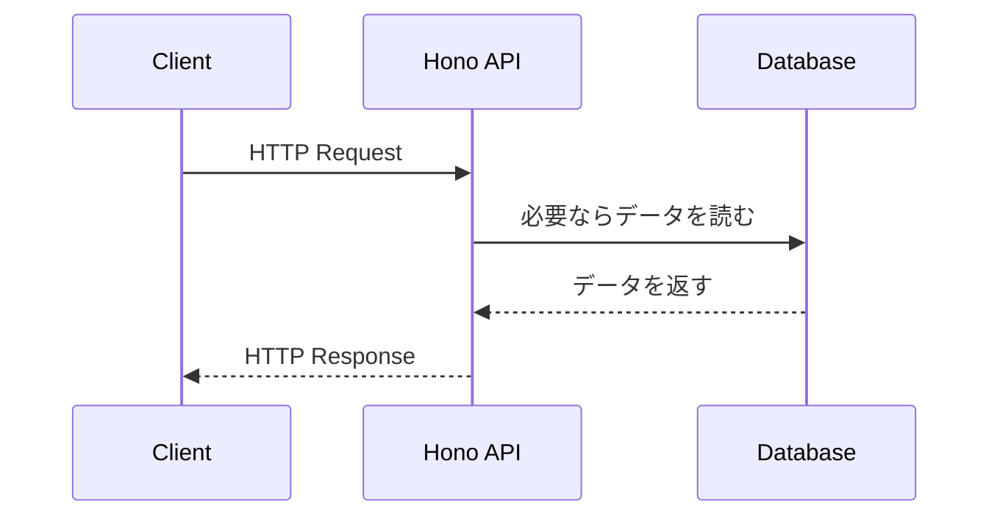
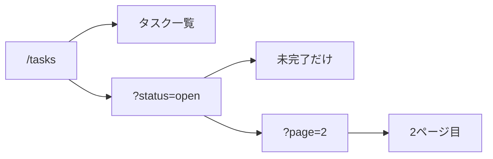
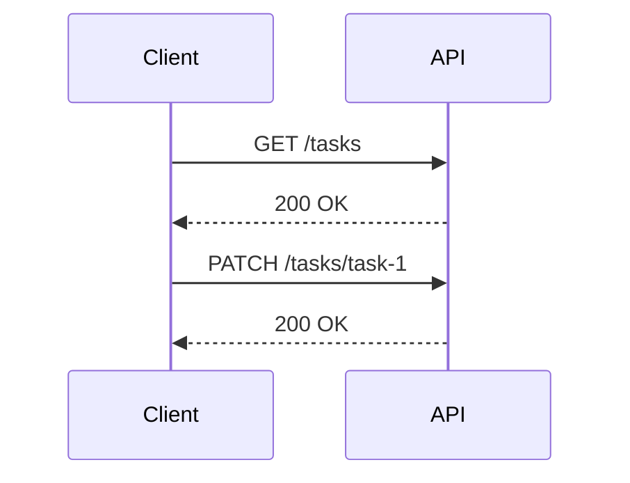
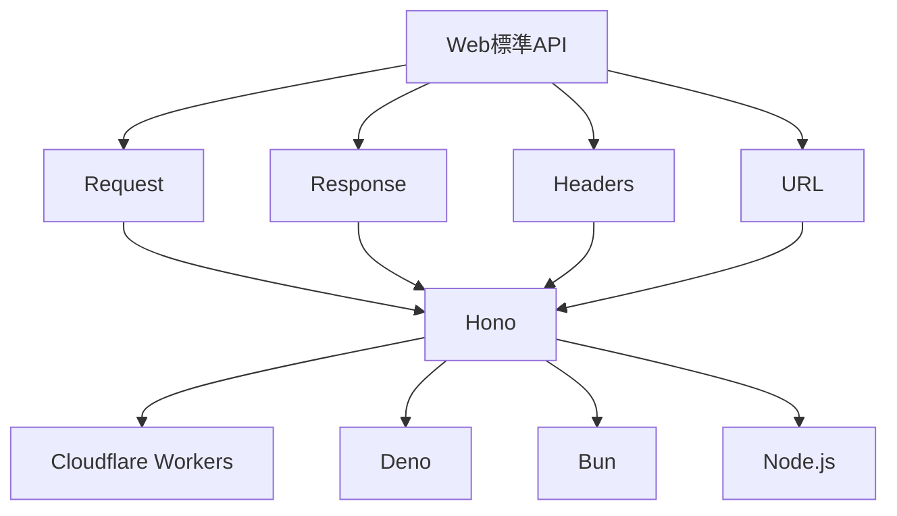

Honoを学ぶ前に、HTTPとWeb標準APIを整理しておきます。

Honoは、`Request`を受け取り、`Response`を返すというWeb標準の考え方に近いフレームワークです。そのため、HTTPの基本を押さえておくと、Honoのコードがただの記法ではなく、Webの仕組みに沿ったものとして読めるようになります。

この章では、Hono固有の機能には深く入りません。まず、クライアントとサーバーのやり取り、HTTPメソッド、URL、ヘッダー、ステータスコード、Fetch API、`Request`や`Response`の役割を確認します。

## HTTPはリクエストとレスポンスのやり取り

HTTPは、クライアントとサーバーがやり取りするための約束です。

ブラウザ、スマートフォンアプリ、フロントエンドアプリケーション、curlなどがクライアントになります。Honoで作るAPIは、サーバー側の役割を持ちます。



HTTPの基本はとても単純です。

1. クライアントがリクエストを送る
2. サーバーがリクエストを処理する
3. サーバーがレスポンスを返す

API開発では、この単純な流れを何度も扱います。HonoのHandlerも、最終的にはこの流れの中で動きます。

## HTTPリクエストの中身

HTTPリクエストには、主に次の情報が含まれます。

| 要素 | 例 | 役割 |
|---|---|---|
| メソッド | `GET` | 何をしたいリクエストなのかを表す |
| URL | `/tasks?status=open` | どのリソースにアクセスするかを表す |
| ヘッダー | `Authorization: Bearer ...` | 認証情報やデータ形式などの付加情報を表す |
| ボディ | `{ "title": "..." }` | 作成や更新に使うデータを送る |

たとえば、タスク一覧を取得するリクエストは次のように考えられます。

```http
GET /tasks?status=open HTTP/1.1
Host: api.example.com
Authorization: Bearer eyJ...
Accept: application/json
```

一方、タスクを作成するリクエストでは、ボディにJSONを含めます。

```http
POST /tasks HTTP/1.1
Host: api.example.com
Content-Type: application/json
Authorization: Bearer eyJ...

{
  "title": "Honoを学ぶ",
  "dueDate": "2026-08-01"
}
```

Honoでは、これらの情報を`c.req`から読み取ります。たとえば、パスパラメータ、クエリ文字列、ヘッダー、JSONボディなどを章が進むにつれて扱います。

## HTTPレスポンスの中身

HTTPレスポンスには、主に次の情報が含まれます。

| 要素 | 例 | 役割 |
|---|---|---|
| ステータスコード | `200` | リクエストの結果を数値で表す |
| ヘッダー | `Content-Type: application/json` | レスポンスの形式やキャッシュ方針などを表す |
| ボディ | `{ "tasks": [...] }` | クライアントへ返すデータを表す |

タスク一覧を返すレスポンスは、たとえば次のようになります。

```http
HTTP/1.1 200 OK
Content-Type: application/json

{
  "tasks": [
    {
      "id": "task-1",
      "title": "Honoを学ぶ",
      "completed": false
    }
  ]
}
```

Honoでは、次のようにJSONレスポンスを返せます。

```ts
app.get('/tasks', (c) => {
  return c.json({
    tasks: [
      {
        id: 'task-1',
        title: 'Honoを学ぶ',
        completed: false,
      },
    ],
  });
});
```

`c.json()`は、JSONを返すための便利なメソッドです。Honoの内部では、最終的にHTTPレスポンスとしてクライアントへ返されます。

## HTTPメソッド

HTTPメソッドは、クライアントがサーバーに対して「何をしたいのか」を表します。

API設計では、同じ`/tasks`というパスでも、メソッドが違えば意味が変わります。

| メソッド | 主な用途 | タスク管理APIでの例 |
|---|---|---|
| `GET` | データを取得する | タスク一覧を取得する |
| `POST` | 新しいデータを作成する | タスクを作成する |
| `PUT` | データ全体を置き換える | タスク全体を更新する |
| `PATCH` | データの一部を更新する | タスク名や完了状態だけを更新する |
| `DELETE` | データを削除する | タスクを削除する |
| `HEAD` | ヘッダーだけを取得する | 存在確認やメタ情報の取得 |
| `OPTIONS` | 利用可能な通信方法を確認する | CORSのプリフライトなど |

Honoでは、`app.get()`や`app.post()`のように、メソッドに対応した関数でルートを登録します。

```ts
app.get('/tasks', (c) => c.json({ tasks: [] }));

app.post('/tasks', (c) => c.json({ message: 'created' }, 201));
```

第5章では、このRoutingの仕組みを詳しく扱います。

## URL、パス、クエリ文字列

URLは、リソースの場所を表します。

たとえば、次のURLを分解してみます。

```text
https://api.example.com/tasks?status=open&page=2
```

| 部分 | 値 | 意味 |
|---|---|---|
| スキーム | `https` | 通信方式 |
| ホスト | `api.example.com` | 接続先 |
| パス | `/tasks` | 取得したいリソース |
| クエリ文字列 | `status=open&page=2` | 絞り込みやページ番号などの追加条件 |

Honoでは、パスによってHandlerを切り替えます。クエリ文字列は、検索、絞り込み、ページネーションなどに使います。

```ts
app.get('/tasks', (c) => {
  const status = c.req.query('status');
  const page = c.req.query('page');

  return c.json({ status, page });
});
```

クエリ文字列は、リソースそのものを表すというより、取得方法の条件を表すために使うことが多いです。



## ヘッダーとボディ

HTTPヘッダーは、リクエストやレスポンスに関する付加情報です。

API開発でよく見るヘッダーには、次のようなものがあります。

| ヘッダー | 例 | 役割 |
|---|---|---|
| `Content-Type` | `application/json` | ボディの形式を伝える |
| `Accept` | `application/json` | クライアントが受け取りたい形式を伝える |
| `Authorization` | `Bearer ...` | 認証情報を送る |
| `Cache-Control` | `no-store` | キャッシュの扱いを伝える |
| `Set-Cookie` | `session=...` | Cookieを設定する |

ボディは、リクエストやレスポンスの本体です。JSON APIでは、多くの場合、ボディにJSONを入れます。

```json
{
  "title": "Honoを学ぶ",
  "completed": false
}
```

ヘッダーとボディの関係では、`Content-Type`を必ず確認します。

`Content-Type: application/json`が付いていれば、受け取る側は「このボディはJSONとして読めばよい」と判断できます。逆に、`Content-Type`が合っていないと、サーバー側で正しく読み取れなかったり、クライアント側が期待と違う扱いをしたりします。

## ステータスコード

ステータスコードは、リクエストの結果を表す3桁の数値です。

APIを作るときは、レスポンスのJSONとステータスコードをあわせて設計します。クライアントはステータスコードを見て、成功したのか、入力が悪かったのか、認証が必要なのか、サーバー側で問題が起きたのかを判断します。

| 範囲 | 意味 | よく使う例 |
|---|---|---|
| `2xx` | 成功 | `200 OK`, `201 Created`, `204 No Content` |
| `3xx` | リダイレクト | `301 Moved Permanently`, `302 Found` |
| `4xx` | クライアント側の問題 | `400 Bad Request`, `401 Unauthorized`, `403 Forbidden`, `404 Not Found` |
| `5xx` | サーバー側の問題 | `500 Internal Server Error`, `503 Service Unavailable` |

Honoでは、`c.json()`の第2引数にステータスコードを渡せます。

```ts
app.post('/tasks', (c) => {
  return c.json(
    {
      id: 'task-1',
      title: 'Honoを学ぶ',
    },
    201,
  );
});
```

作成に成功したときは`201 Created`を使うと、クライアントに「新しいリソースが作られた」と伝えられます。

## ステートレスという性質

HTTPは、基本的にステートレスです。

ステートレスとは、各リクエストが独立しているという意味です。サーバーは、前回のリクエストを自動的に覚えているわけではありません。



この2つのリクエストは、HTTPとしてはそれぞれ独立しています。

ログイン状態を扱いたい場合は、CookieやAuthorizationヘッダーなどを使って、各リクエストに認証情報を含めます。本書では、JWTを使った認証を後半で扱います。

ステートレスな性質を理解しておくと、APIの設計が分かりやすくなります。たとえば、「ログイン済みかどうか」は、サーバーが雰囲気で覚えているのではなく、リクエストに含まれる情報をもとに判断するものです。

## HTTPSとの違い

HTTPとHTTPSは、アプリケーションから見ると似た形で使えます。どちらもリクエストとレスポンスのやり取りです。

違いは、通信が暗号化されているかどうかです。HTTPSでは、HTTPの通信をTLSで保護します。ログイン情報、JWT、個人情報を扱うAPIでは、HTTPSを使うことが前提になります。

| 観点 | HTTP | HTTPS |
|---|---|---|
| 暗号化 | なし | あり |
| URL | `http://...` | `https://...` |
| 認証情報の送信 | 危険 | 前提として利用できる |
| 本番API | 基本的に使わない | 使う |

ローカル開発では`http://localhost:8787`のようなURLを使うことがあります。これは開発環境の話です。本番環境では、HTTPSで公開することを前提に考えます。

## Fetch API

Fetch APIは、JavaScriptからHTTPリクエストを送るためのWeb標準APIです。

フロントエンドからAPIを呼び出すときにも、サーバー側で外部APIを呼び出すときにも使われます。

```ts
const response = await fetch('https://api.example.com/tasks');
const data = await response.json();

console.log(data);
```

Fetch APIでは、`fetch()`にURLやオプションを渡すと、`Response`が返ります。`response.json()`を呼ぶと、レスポンスボディをJSONとして読み取れます。

POSTリクエストを送る場合は、メソッド、ヘッダー、ボディを指定します。

```ts
await fetch('https://api.example.com/tasks', {
  method: 'POST',
  headers: {
    'Content-Type': 'application/json',
  },
  body: JSON.stringify({
    title: 'Honoを学ぶ',
  }),
});
```

Honoの考え方は、このFetch APIと近いところにあります。Honoアプリケーションも、リクエストを受け取り、レスポンスを返します。

## Request、Response、Headers

Web標準APIでは、HTTPの情報をオブジェクトとして扱います。

| オブジェクト | 役割 |
|---|---|
| `Request` | HTTPリクエストを表す |
| `Response` | HTTPレスポンスを表す |
| `Headers` | HTTPヘッダーを扱う |
| `URL` | URLを分解して扱う |
| `URLSearchParams` | クエリ文字列を扱う |

`Request`は、次のように作れます。

```ts
const request = new Request('https://api.example.com/tasks?status=open', {
  method: 'GET',
  headers: {
    Accept: 'application/json',
  },
});
```

`Response`も、次のように作れます。

```ts
const response = Response.json(
  {
    ok: true,
  },
  {
    status: 200,
  },
);
```

Honoでは、`c.json()`や`c.text()`のような便利なメソッドをよく使います。けれども、必要であれば`new Response()`を直接返すこともできます。

```ts
app.get('/plain', () => {
  return new Response('Hello', {
    status: 200,
    headers: {
      'Content-Type': 'text/plain',
    },
  });
});
```

この柔軟さは、HonoがWeb標準に寄っていることから来ています。

## URLとURLSearchParams

URLを文字列のまま扱うと、分解や結合が面倒になります。JavaScriptには、URLを扱うための`URL`オブジェクトがあります。

```ts
const url = new URL('https://api.example.com/tasks?status=open&page=2');

console.log(url.pathname); // /tasks
console.log(url.searchParams.get('status')); // open
console.log(url.searchParams.get('page')); // 2
```

Honoを使うと、クエリ文字列は`c.req.query()`で簡単に読めます。それでも、`URL`と`URLSearchParams`を知っておくと、Honoの裏側で何が起きているかを理解しやすくなります。

## FormDataとBlob

JSON APIでは、リクエストボディにJSONを送ることが多いです。ただし、WebではJSON以外の形式も扱います。

たとえば、フォーム送信では`FormData`を使うことがあります。ファイルやバイナリデータを扱うときには`Blob`が関係します。

```ts
const formData = new FormData();
formData.set('title', 'Honoを学ぶ');

await fetch('/tasks', {
  method: 'POST',
  body: formData,
});
```

本書の中心はJSON APIです。とはいえ、HonoはWeb標準APIを土台にしているため、`FormData`や`Blob`のようなWebの部品とも自然につながります。

## Web標準がマルチランタイムを可能にする

Web標準APIを使うと、特定の実行環境に強く依存しないコードを書きやすくなります。



もちろん、すべてが完全に同じになるわけではありません。環境変数、データベース接続、ファイルシステム、リクエストの入口などはランタイムごとに違います。

それでも、`Request`を受け取り`Response`を返すという中心部分が共通であれば、アプリケーションの考え方を共有しやすくなります。Honoが複数のランタイムで動かしやすいのは、この土台があるからです。

## まとめ

この章では、Honoを理解するための土台として、HTTPとWeb標準APIを見てきました。

- HTTPは、クライアントがリクエストを送り、サーバーがレスポンスを返す仕組みです。
- リクエストには、メソッド、URL、ヘッダー、ボディがあります。
- レスポンスには、ステータスコード、ヘッダー、ボディがあります。
- `GET`、`POST`、`PATCH`、`DELETE`などのHTTPメソッドは、APIの意図を表します。
- `Request`、`Response`、`Headers`、`URL`は、Honoを理解するうえで重要なWeb標準APIです。
- Web標準APIを土台にすると、複数のJavaScriptランタイムへ展開しやすくなります。

次章では、実際にHonoアプリケーションの開発環境を作ります。Cloudflare Workers向けのテンプレートを使い、`new Hono()`、エントリーポイント、`export default app`の意味を確認しながら、最初の小さなAPIを動かします。
