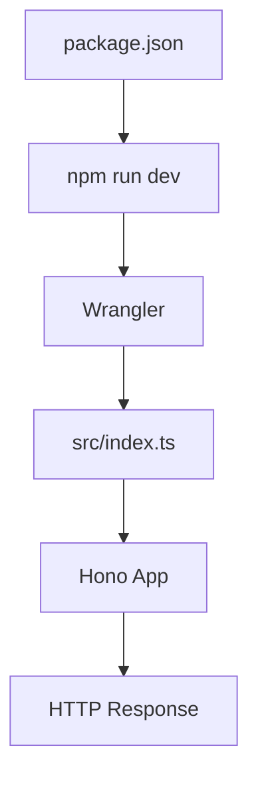
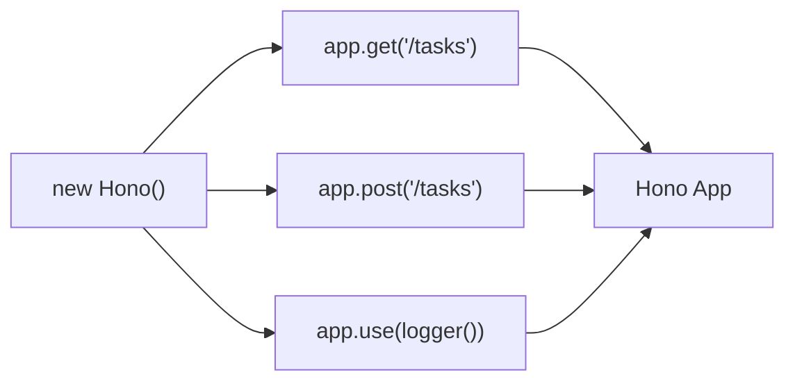
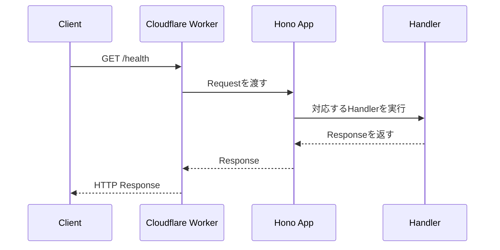
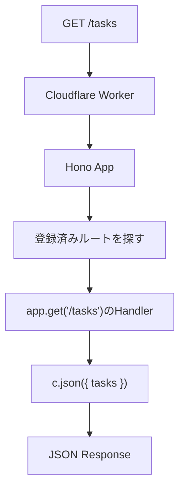
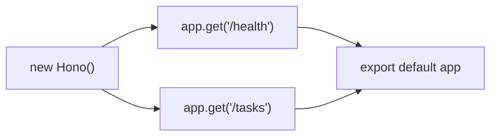

この章では、Honoアプリケーションを作り、ローカルで動かせるところまで進めます。

本書では、主な実行環境としてCloudflare Workersを使います。HonoはNode.js、Deno、Bunなどでも動きますが、まずはWorkers向けテンプレートで始めると、Honoが大切にしているWeb標準APIの感覚をつかみやすくなります。

この章のゴールは、次の3つです。

- Honoプロジェクトを作成する
- プロジェクト構成とエントリーポイントを理解する
- 最初のタスク取得ルートを作って動作確認する

まだデータベースは使いません。まずは小さく動かし、Honoアプリケーションの入口を見えるようにします。

## 必要なもの

この章では、Node.jsとnpmを使います。

Cloudflare Workersで動かすのに、なぜNode.jsが必要なのかと思うかもしれません。ここで使うNode.jsは、主に開発ツールを動かすためのものです。Honoアプリケーションそのものは、Workers上で動かすことを想定します。

| 道具 | 役割 |
|---|---|
| Node.js | 開発ツールやパッケージ管理を動かす |
| npm | 依存パッケージをインストールする |
| create-hono | Honoプロジェクトのひな形を作る |
| Wrangler | Cloudflare Workersをローカル実行し、D1などの開発用リソースを扱う |
| TypeScript | 型を使って安全にコードを書く |

Node.jsは、現在のLTS版か、それに近い新しいバージョンを使うのがおすすめです。バージョンは次のコマンドで確認できます。

```sh
node -v
npm -v
```

バージョン番号が表示されれば、Node.jsとnpmは使える状態です。

## プロジェクトを作成する

Honoには、プロジェクトのひな形を作るための`create-hono`があります。

本書では、プロジェクト名を`hono-task-api`とします。

```sh
npm create hono@latest hono-task-api
```

実行すると、テンプレートを選ぶ画面が表示されます。本書では、Cloudflare Workers向けのテンプレートを選びます。

```text
cloudflare-workers
```

作成後、プロジェクトディレクトリに移動して依存パッケージをインストールします。

```sh
cd hono-task-api
npm install
```

:::message
テンプレートの表示や生成されるファイルは、HonoやWranglerのバージョンによって少し変わることがあります。本書では、ファイル名や役割を確認しながら進めるので、細かな差分があっても慌てなくて大丈夫です。
:::

## プロジェクト構成を見る

作成直後の構成は、だいたい次のようになります。

```text
hono-task-api/
├─ src/
│  └─ index.ts
├─ package.json
├─ tsconfig.json
└─ wrangler.toml
```

テンプレートやバージョンによって、`README.md`や設定ファイルが追加されていることもあります。まず見るべきなのは、次の4つです。

| ファイル | 役割 |
|---|---|
| `src/index.ts` | Honoアプリケーションの入口 |
| `package.json` | npm scriptsと依存パッケージを管理する |
| `tsconfig.json` | TypeScriptの設定 |
| `wrangler.toml` | Cloudflare Workersの設定 |

この時点では、すべてを詳しく理解する必要はありません。まずは、`src/index.ts`がアプリケーションの中心になると押さえてください。



## 最初のHonoアプリケーション

`src/index.ts`を開くと、Honoの最小構成に近いコードが入っています。

本書では、次のような形に整えて進めます。

```ts:src/index.ts
import { Hono } from 'hono';

const app = new Hono();

app.get('/', (c) => {
  return c.text('Hello Hono!');
});

export default app;
```

このコードには、Honoアプリケーションの基本がすべて入っています。

| 行 | 意味 |
|---|---|
| `import { Hono } from 'hono'` | Hono本体を読み込む |
| `new Hono()` | アプリケーションを作る |
| `app.get()` | GETリクエストのルートを登録する |
| `(c) => ...` | リクエストを処理するHandler |
| `c.text()` | テキストレスポンスを返す |
| `export default app` | WorkersへHonoアプリケーションを渡す |

Honoでは、`app`にルートやミドルウェアを登録していきます。`app`は、API全体の入口です。

## new Hono()が作るもの

`new Hono()`は、Honoアプリケーションのインスタンスを作ります。

このインスタンスに対して、`get()`、`post()`、`use()`などを呼び出し、ルートやミドルウェアを登録します。



`new Hono()`しただけでは、まだAPIの機能は何もありません。`app.get()`や`app.post()`でルートを登録して、初めてリクエストを処理できるようになります。

## エントリーポイントの役割

エントリーポイントとは、アプリケーションが最初に読み込まれるファイルのことです。

本書の構成では、`src/index.ts`がエントリーポイントです。このファイルでHonoアプリケーションを作り、Workersに渡します。

```ts:src/index.ts
import { Hono } from 'hono';

const app = new Hono();

app.get('/health', (c) => {
  return c.json({ ok: true });
});

export default app;
```

Cloudflare Workersでは、リクエストを処理する入口が必要です。Honoアプリケーションは、その入口として使えます。`export default app`しておくことで、Workers側がHonoアプリケーションを呼び出せるようになります。

Honoが裏側で`fetch`イベントに対応する形を持っているため、私たちは`app.get()`などの書き方に集中できます。



## 開発サーバーを起動する

テンプレートには、ローカルでWorkersを動かすためのnpm scriptが用意されています。

まず、`package.json`を確認してください。

```json:package.json
{
  "scripts": {
    "dev": "wrangler dev"
  }
}
```

実際の内容は、テンプレートのバージョンによって少し違うことがあります。`dev`スクリプトを使えば、Workersに近いローカル開発環境を起動できます。

次のコマンドを実行します。

```sh
npm run dev
```

起動すると、ローカルのURLが表示されます。多くの場合、次のようなURLです。

```text
http://localhost:8787
```

ブラウザで開いて、`Hello Hono!`のようなレスポンスが表示されれば成功です。

## curlで確認する

API開発では、ブラウザだけでなく`curl`で確認できると便利です。

```sh
curl http://localhost:8787/
```

JSONレスポンスを返す`/health`を作った場合は、次のように確認できます。

```sh
curl http://localhost:8787/health
```

レスポンス例です。

```json
{
  "ok": true
}
```

ブラウザは画面表示に向いています。`curl`は、HTTPメソッド、ヘッダー、ボディを細かく指定した確認に向いています。今後の章では、`curl`でPOSTやPATCHの動作確認も行います。

## 最初のタスク取得ルートを作る

ここから、本書で作るタスク管理APIに少しだけ近づけます。

まだデータベースは使いません。まずは配列にタスクを用意し、`GET /tasks`で返します。

```ts:src/index.ts
import { Hono } from 'hono';

const app = new Hono();

const tasks = [
  {
    id: 'task-1',
    title: 'Honoを学ぶ',
    completed: false,
  },
  {
    id: 'task-2',
    title: 'HTTPを復習する',
    completed: true,
  },
];

app.get('/health', (c) => {
  return c.json({ ok: true });
});

app.get('/tasks', (c) => {
  return c.json({ tasks });
});

export default app;
```

動作確認します。

```sh
curl http://localhost:8787/tasks
```

レスポンス例です。

```json
{
  "tasks": [
    {
      "id": "task-1",
      "title": "Honoを学ぶ",
      "completed": false
    },
    {
      "id": "task-2",
      "title": "HTTPを復習する",
      "completed": true
    }
  ]
}
```

この時点では、配列に直接タスクを書いています。これは学習用の形です。第15章では、データの保存先をCloudflare D1へ移します。

## リクエストからレスポンスまでの流れ

`GET /tasks`にアクセスしたとき、何が起きているのかを図で見てみます。



この流れは、今後どのルートを作るときも同じです。

1. リクエストが来る
2. Honoがルートを探す
3. 対応するHandlerを実行する
4. Handlerがレスポンスを返す

API開発では、この流れを土台にして、入力値の検証、認証、データベースアクセス、エラー処理、テストを足していきます。

## TypeScriptの設定を確認する

`tsconfig.json`には、TypeScriptの設定が入っています。

最初からすべてを理解する必要はありませんが、次の点は意識しておくとよいです。

| 設定の観点 | 意味 |
|---|---|
| `strict` | 型チェックを厳しくする |
| `target` | どのJavaScript仕様を出力対象にするか |
| `module` | モジュール形式 |
| `types` | 使用する型定義 |

HonoやCloudflare Workersでは、実行環境に応じた型定義が重要になります。たとえば、WorkersのBindingsを型安全に扱うときには、後の章で`Bindings`の型を定義します。

今は、TypeScriptが「エディタ上で間違いを教えてくれる道具」だと考えておけば十分です。

## wrangler.tomlの役割

`wrangler.toml`は、Cloudflare Workersの設定ファイルです。

たとえば、Workerの名前、エントリーポイント、互換性日付、Bindingsなどを設定します。

```toml:wrangler.toml
name = "hono-task-api"
main = "src/index.ts"
compatibility_date = "2026-07-16"
```

実際のテンプレートでは、内容が少し違うことがあります。D1を使う章では、このファイルにD1のBindingを追加します。

ここで押さえておきたいのは、HonoのコードとWorkersの設定は別物だということです。

| 対象 | 書く場所 |
|---|---|
| ルートやHandler | `src/index.ts` |
| Workerの名前やBindings | `wrangler.toml` |
| npm scriptsや依存関係 | `package.json` |
| TypeScriptのチェック | `tsconfig.json` |

この分担が見えていると、後の章でD1や環境変数を追加するときに迷いにくくなります。

## この章でできたこと

この章では、Honoアプリケーションの最初の形を作りました。

現在の`src/index.ts`には、少なくとも次の2つのルートがあります。

| メソッド | パス | 役割 |
|---|---|---|
| `GET` | `/health` | APIが動いているか確認する |
| `GET` | `/tasks` | タスク一覧を返す |

まだ小さなAPIですが、Honoの基本的な流れはもう動いています。



## まとめ

この章では、Honoアプリケーションの開発環境と基本構造を確認しました。

- `create-hono`でCloudflare Workers向けのHonoプロジェクトを作成しました。
- `src/index.ts`がアプリケーションのエントリーポイントです。
- `new Hono()`でHonoアプリケーションを作ります。
- `app.get()`でGETリクエストのルートを登録できます。
- `export default app`によって、WorkersにHonoアプリケーションを渡します。
- `GET /health`と`GET /tasks`を作り、ローカルで動作確認しました。

次章では、RoutingとHandlerを詳しく見ていきます。`app.get()`以外にも、`app.post()`、`app.patch()`、`app.delete()`、パスパラメータ、ルートの登録順などを扱い、タスク一覧とタスク詳細のルートを整えていきます。
