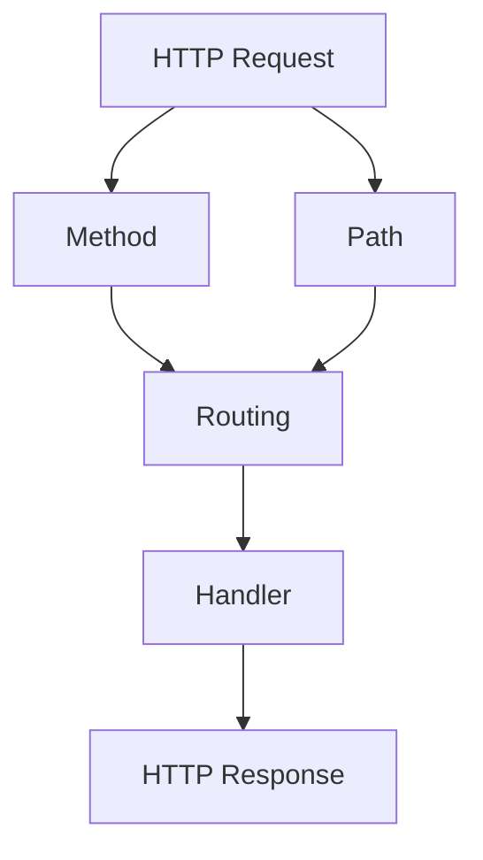
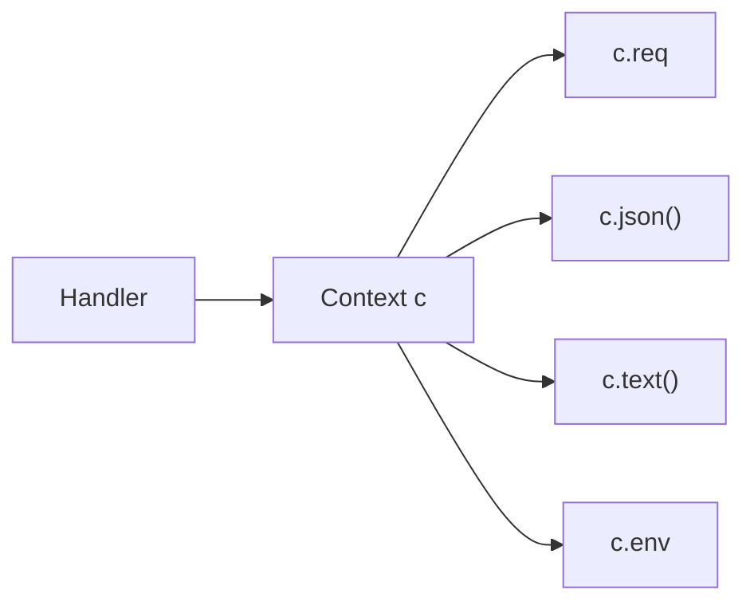
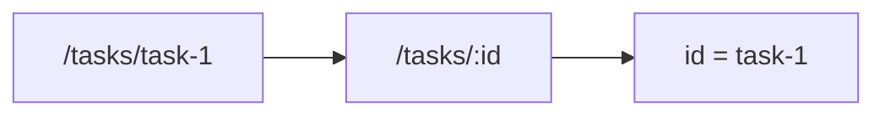
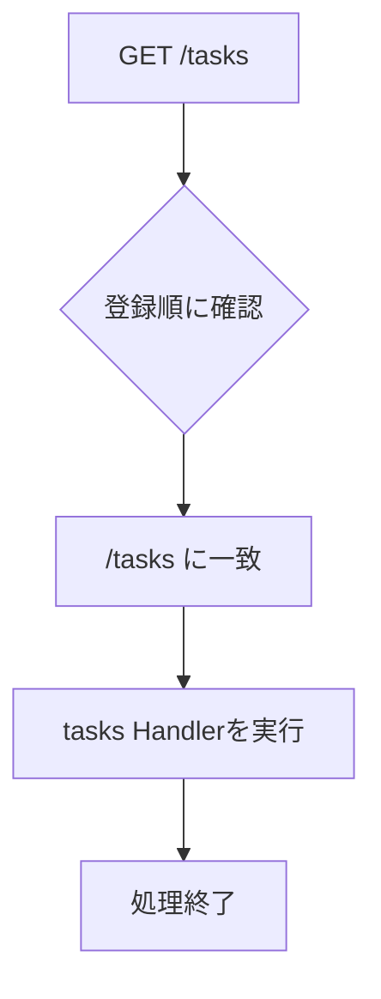
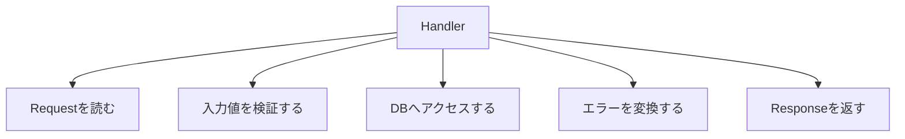

この章では、HonoのRoutingとHandlerを学びます。

Routingは、届いたHTTPリクエストをどの処理に渡すかを決める仕組みです。Handlerは、実際にリクエストを処理してレスポンスを返す関数です。

Honoのコードは短く書けますが、Routingの考え方を曖昧にしたまま進むと、APIが増えたときに混乱します。この章では、`app.get()`、`app.post()`、パスパラメータ、ワイルドカード、正規表現、登録順を確認しながら、タスク一覧とタスク詳細のルートを作ります。

## Routingとは何か

Routingは、リクエストのメソッドとパスを見て、対応するHandlerへ処理を渡す仕組みです。



たとえば、次の2つのリクエストは、同じ`/tasks`というパスを使っています。

| リクエスト | 意味 |
|---|---|
| `GET /tasks` | タスク一覧を取得する |
| `POST /tasks` | タスクを作成する |

パスが同じでも、HTTPメソッドが違えば別の処理になります。Honoでは、この違いを`app.get()`や`app.post()`で表します。

## Handlerとは何か

Handlerは、リクエストを処理してレスポンスを返す関数です。

```ts
app.get('/health', (c) => {
  return c.json({ ok: true });
});
```

この例では、`(c) => { ... }`の部分がHandlerです。

Handlerには、Honoの`Context`が渡されます。本書では、引数名として`c`を使います。



`Context`を使うと、リクエストの情報を読み取ったり、レスポンスを作ったり、環境変数にアクセスしたりできます。`Context`は第7章で詳しく扱います。ここでは、Handlerに渡される`c`を通して、Honoの操作を行うと理解しておけば十分です。

## app.get()

`app.get()`は、GETリクエストを処理するルートを登録します。

GETは、主にデータの取得に使います。

```ts:src/index.ts
app.get('/tasks', (c) => {
  return c.json({
    tasks: [],
  });
});
```

このルートは、`GET /tasks`に対応します。

```sh
curl http://localhost:8787/tasks
```

レスポンス例です。

```json
{
  "tasks": []
}
```

GETリクエストでは、基本的にサーバーの状態を変更しないようにします。タスク一覧を取得する、タスク詳細を取得する、ログイン中のユーザー情報を取得する、といった用途に向いています。

## app.post()

`app.post()`は、POSTリクエストを処理するルートを登録します。

POSTは、主に新しいデータの作成に使います。

```ts
app.post('/tasks', (c) => {
  return c.json(
    {
      id: 'task-1',
      title: 'Honoを学ぶ',
      completed: false,
    },
    201,
  );
});
```

このルートは、`POST /tasks`に対応します。

```sh
curl -X POST http://localhost:8787/tasks
```

作成に成功したことを表すために、ステータスコード`201`を返しています。

この時点では、リクエストボディをまだ読んでいません。ボディの読み取りは第6章で扱います。ここでは、メソッドによって処理を分けられることを押さえてください。

## app.put()とapp.patch()

`app.put()`と`app.patch()`は、どちらも更新に使います。

違いは、更新の考え方です。

| メソッド | 考え方 | 例 |
|---|---|---|
| `PUT` | リソース全体を置き換える | タスク全体を送って更新する |
| `PATCH` | リソースの一部を更新する | `completed`だけを変更する |

タスク管理APIでは、一部更新を扱うことが多いため、主に`PATCH`を使います。

```ts
app.patch('/tasks/:id', (c) => {
  const id = c.req.param('id');

  return c.json({
    id,
    message: 'updated',
  });
});
```

`:id`はパスパラメータです。次の節で詳しく見ます。

## app.delete()

`app.delete()`は、DELETEリクエストを処理するルートを登録します。

DELETEは、データの削除に使います。

```ts
app.delete('/tasks/:id', (c) => {
  const id = c.req.param('id');

  return c.json({
    id,
    message: 'deleted',
  });
});
```

削除に成功した場合、レスポンスボディを返さずに`204 No Content`を返す設計もあります。

```ts
app.delete('/tasks/:id', (c) => {
  return c.body(null, 204);
});
```

どちらを選ぶかはAPI設計の方針によります。本書では、学習中は分かりやすさのためにJSONを返し、後の章でレスポンス設計を整えます。

## app.all()とapp.on()

`app.all()`は、すべてのHTTPメソッドに一致するルートを登録します。

```ts
app.all('/ping', (c) => {
  return c.text('pong');
});
```

`GET /ping`でも`POST /ping`でも同じHandlerが実行されます。

一方、`app.on()`を使うと、メソッドを文字列で指定できます。

```ts
app.on('OPTIONS', '/tasks', (c) => {
  return c.text('', 204);
});
```

複数のメソッドや複数のパスをまとめて登録することもできます。

```ts
app.on(['GET', 'HEAD'], '/health', (c) => {
  return c.json({ ok: true });
});
```

普段のAPI開発では、まず`app.get()`、`app.post()`、`app.patch()`、`app.delete()`を使えば十分です。`app.all()`や`app.on()`は、共通処理や特殊なメソッドを扱いたいときに使います。

## パスパラメータ

パスパラメータは、URLの一部を変数として受け取る仕組みです。

タスク詳細を取得するルートを考えます。

```text
GET /tasks/task-1
GET /tasks/task-2
GET /tasks/task-3
```

タスクIDだけが変わっています。このような場合、Honoでは`:id`と書きます。

```ts
app.get('/tasks/:id', (c) => {
  const id = c.req.param('id');

  return c.json({
    id,
    title: 'Honoを学ぶ',
    completed: false,
  });
});
```

`/tasks/task-1`にアクセスすると、`c.req.param('id')`は`task-1`を返します。



複数のパラメータを使うこともできます。

```ts
app.get('/users/:userId/tasks/:taskId', (c) => {
  const { userId, taskId } = c.req.param();

  return c.json({ userId, taskId });
});
```

`c.req.param()`を引数なしで呼ぶと、パラメータをまとめて取得できます。

## 任意パラメータ

Honoでは、パスパラメータを任意にできます。

```ts
app.get('/api/tasks/:status?', (c) => {
  const status = c.req.param('status');

  return c.json({ status });
});
```

このルートは、次のどちらにも一致します。

```text
GET /api/tasks
GET /api/tasks/open
```

任意パラメータは便利ですが、使いすぎるとAPIの意味が分かりにくくなることがあります。検索条件や絞り込み条件は、パスパラメータではなくクエリ文字列にしたほうが自然な場合もあります。

たとえば、タスクの状態で絞り込むなら、次の形のほうが分かりやすいです。

```text
GET /tasks?status=open
```

本書では、タスクIDのようにリソースを特定する値はパスパラメータ、検索条件はクエリ文字列として扱います。

## ワイルドカードと正規表現

HonoのRoutingでは、ワイルドカードや正規表現も使えます。

ワイルドカードは、広い範囲のパスに一致させたいときに使います。

```ts
app.get('/files/*', (c) => {
  return c.text('file route');
});
```

正規表現を使うと、パラメータの形式をルート側で制限できます。

```ts
app.get('/tasks/:id{[a-z0-9-]+}', (c) => {
  const id = c.req.param('id');

  return c.json({ id });
});
```

この例では、`id`に小文字、数字、ハイフンだけを許可する意図を表しています。

ただし、正規表現に頼りすぎるとルートが読みにくくなります。入力値の検証は、第10章と第11章でZodを使ってきちんと扱います。Routingでは「どのHandlerに届けるか」を決め、細かい入力検証はバリデーション層で行う、と分けて考えると整理しやすくなります。

## ルートの登録順

Honoでは、HandlerやMiddlewareは登録順に実行されます。

そのため、広いルートを先に書くと、後ろの具体的なルートに届かないことがあります。

```ts
app.get('*', (c) => {
  return c.text('fallback');
});

app.get('/tasks', (c) => {
  return c.json({ tasks: [] });
});
```

この場合、`GET /tasks`も先に`*`へ一致してしまいます。`/tasks`のHandlerは実行されません。

正しくは、具体的なルートを先に書き、fallbackを後ろに置きます。

```ts
app.get('/tasks', (c) => {
  return c.json({ tasks: [] });
});

app.get('*', (c) => {
  return c.text('fallback');
});
```



ルートが増えてくると、登録順は思った以上に重要になります。特に、`*`や広いパスを使うときは注意してください。

## HEADとOPTIONS

HTTPには、`HEAD`や`OPTIONS`というメソッドもあります。

`HEAD`は、GETと似ていますが、レスポンスボディを受け取りません。ヘッダーだけを確認したいときに使われます。

`OPTIONS`は、そのリソースでどのような通信ができるかを確認するために使われます。ブラウザがCORSのプリフライトリクエストで使うこともあります。

Honoでは、必要に応じて`app.on()`で登録できます。

```ts
app.on('OPTIONS', '/tasks', (c) => {
  return c.text('', 204, {
    Allow: 'GET, POST, OPTIONS',
  });
});
```

ただし、CORSについては専用のミドルウェアを使うことが多いです。本書では、第8章と第18章でミドルウェアやセキュリティの文脈で扱います。

## タスク一覧とタスク詳細のルートを作る

ここまでの内容を使って、タスク一覧とタスク詳細のルートを作ります。

```ts:src/index.ts
import { Hono } from 'hono';

const app = new Hono();

type Task = {
  id: string;
  title: string;
  completed: boolean;
};

const tasks: Task[] = [
  {
    id: 'task-1',
    title: 'Honoを学ぶ',
    completed: false,
  },
  {
    id: 'task-2',
    title: 'HTTPを復習する',
    completed: true,
  },
];

app.get('/health', (c) => {
  return c.json({ ok: true });
});

app.get('/tasks', (c) => {
  return c.json({ tasks });
});

app.get('/tasks/:id', (c) => {
  const id = c.req.param('id');
  const task = tasks.find((task) => task.id === id);

  if (!task) {
    return c.json(
      {
        message: 'Task not found',
      },
      404,
    );
  }

  return c.json({ task });
});

export default app;
```

`GET /tasks`では一覧を返し、`GET /tasks/:id`ではIDに一致するタスクを返します。

確認してみます。

```sh
curl http://localhost:8787/tasks
```

```sh
curl http://localhost:8787/tasks/task-1
```

存在しないIDを指定すると、`404`を返します。

```sh
curl http://localhost:8787/tasks/unknown
```

この時点のエラー形式は、まだ簡易的です。第9章で、API全体のエラーレスポンスをそろえます。

## Handlerの中に書きすぎない

今のコードでは、Handlerの中でタスクを探しています。

```ts
const task = tasks.find((task) => task.id === id);
```

このくらいなら問題ありません。しかし、APIが育つと、Handlerの中にいろいろな処理が入りがちです。

- 入力値の検証
- 認証ユーザーの確認
- データベースアクセス
- エラー変換
- ログ出力
- レスポンス整形

すべてをHandlerに入れると、最初は分かりやすくても、すぐに読みにくくなります。



本書では、最初はHandlerに直接書きます。そのあと、ServiceやRepositoryへ分けていきます。いきなりきれいな設計を作るより、処理が増えて困る感覚をつかんでから分けるほうが、なぜ分けるのかを理解しやすいからです。

## この章で作ったルート

この章の終わりでは、次のルートができています。

| メソッド | パス | 役割 |
|---|---|---|
| `GET` | `/health` | APIの動作確認 |
| `GET` | `/tasks` | タスク一覧を取得する |
| `GET` | `/tasks/:id` | タスク詳細を取得する |

次章では、リクエストの読み取りとレスポンスの返し方を詳しく扱います。そこで、タスクの作成や更新に必要なJSONボディ、クエリ文字列、ヘッダー、ステータスコードを実装していきます。

## まとめ

この章では、HonoのRoutingとHandlerを学びました。

- Routingは、HTTPメソッドとパスを見てHandlerへ処理を渡す仕組みです。
- Handlerは、リクエストを処理してレスポンスを返す関数です。
- `app.get()`、`app.post()`、`app.patch()`、`app.delete()`でメソッドごとのルートを登録できます。
- `:id`のようなパスパラメータを使うと、URLの一部を変数として扱えます。
- ワイルドカードや正規表現も使えますが、使いすぎると読みにくくなります。
- Honoでは登録順が重要です。広いルートやfallbackは後ろに置きます。
- タスク一覧とタスク詳細のルートを作りました。

次章では、`c.req`を使ったリクエストの読み取りと、`c.json()`や`c.text()`を使ったレスポンスの返し方を深掘りします。
