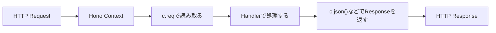
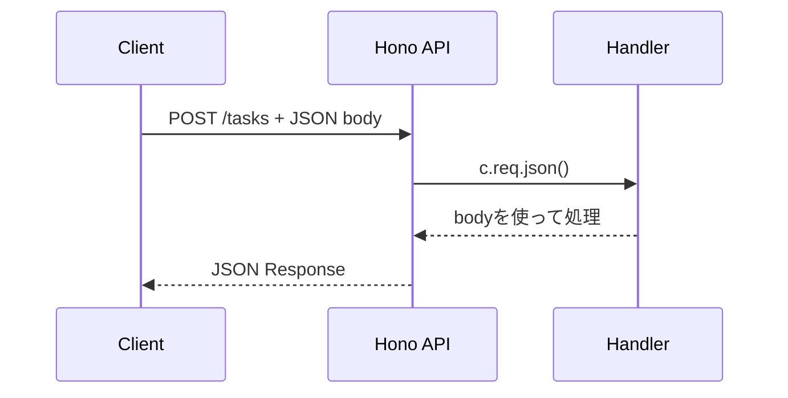
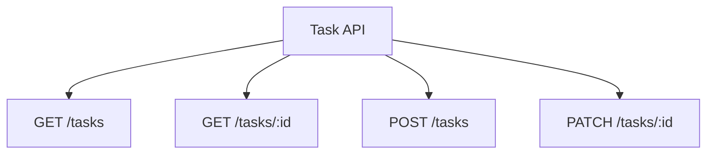

この章では、Honoでリクエストを読み取り、レスポンスを返す方法を学びます。

第5章では、RoutingとHandlerを使って、`GET /tasks`と`GET /tasks/:id`を作りました。けれども、APIは取得だけでは終わりません。タスクを作成するにはリクエストボディを読み取る必要があります。検索やページネーションではクエリ文字列を読み取ります。認証ではヘッダーを読み取ります。

Honoでは、こうした入力を主に`c.req`から読み取ります。そして、`c.json()`、`c.text()`、`c.body()`などを使ってレスポンスを返します。

この章のゴールは、タスクの作成と更新を実装しながら、RequestとResponseの基本操作を身につけることです。

## RequestとResponseの位置づけ

HonoのHandlerは、リクエストを受け取り、レスポンスを返します。



Honoの`c.req`は、Web標準の`Request`をそのまま渡すだけではなく、Honoで扱いやすいように包んだ`HonoRequest`です。

| 読み取りたいもの | Honoで使うもの |
|---|---|
| パスパラメータ | `c.req.param()` |
| クエリ文字列 | `c.req.query()` / `c.req.queries()` |
| ヘッダー | `c.req.header()` |
| JSONボディ | `await c.req.json()` |
| テキストボディ | `await c.req.text()` |
| フォームデータ | `await c.req.formData()` |
| 元のRequest | `c.req.raw` |

まずは、よく使うものから順番に見ていきます。

## パスパラメータを読む

パスパラメータは、URLの一部を変数として受け取る仕組みです。

```ts
app.get('/tasks/:id', (c) => {
  const id = c.req.param('id');

  return c.json({ id });
});
```

`GET /tasks/task-1`にアクセスすると、`id`には`task-1`が入ります。

複数のパスパラメータがある場合は、まとめて取得できます。

```ts
app.get('/users/:userId/tasks/:taskId', (c) => {
  const { userId, taskId } = c.req.param();

  return c.json({ userId, taskId });
});
```

パスパラメータは、リソースを特定する値に向いています。タスクID、ユーザーID、コメントIDなどです。

## クエリ文字列を読む

クエリ文字列は、検索、絞り込み、並び替え、ページネーションなどに向いています。

```text
GET /tasks?status=open&page=2
```

Honoでは、`c.req.query()`で読み取ります。

```ts
app.get('/tasks', (c) => {
  const status = c.req.query('status');
  const page = c.req.query('page');

  return c.json({ status, page });
});
```

引数なしで呼ぶと、クエリ文字列をまとめて取得できます。

```ts
app.get('/tasks', (c) => {
  const query = c.req.query();

  return c.json({ query });
});
```

同じキーが複数回出る場合は、`c.req.queries()`を使います。

```text
GET /tasks?tag=work&tag=hono
```

```ts
app.get('/tasks', (c) => {
  const tags = c.req.queries('tag');

  return c.json({ tags });
});
```

クエリ文字列で受け取る値は、基本的に文字列です。`page=2`のように見えても、`2`は数値ではなく文字列として届きます。数値に変換する処理や、正しい値かどうかの検証は、第10章以降で扱います。

## ヘッダーを読む

ヘッダーは、リクエストに関する付加情報です。

よく使うヘッダーには、`Authorization`、`Content-Type`、`User-Agent`、`Accept`などがあります。

```ts
app.get('/debug/headers', (c) => {
  const userAgent = c.req.header('User-Agent');
  const authorization = c.req.header('Authorization');

  return c.json({
    userAgent,
    hasAuthorization: Boolean(authorization),
  });
});
```

ヘッダー名は大文字小文字を区別しないものとして扱われますが、Honoでまとめて取得する場合はキーが小文字になります。特定のヘッダーを読みたい場合は、`c.req.header('X-Foo')`のように名前を指定して読むのが安全です。

認証では、次のようなヘッダーを読むことになります。

```http
Authorization: Bearer eyJ...
```

この章ではまだ認証処理は実装しません。第17章と第18章で、JWT認証と認可の中で扱います。

## JSONボディを読む

タスクを作成するときは、クライアントからJSONを送ります。

```http
POST /tasks
Content-Type: application/json

{
  "title": "Honoを学ぶ"
}
```

Honoでは、`await c.req.json()`でJSONボディを読み取ります。

```ts
app.post('/tasks', async (c) => {
  const body = await c.req.json();

  return c.json(
    {
      received: body,
    },
    201,
  );
});
```

`c.req.json()`は非同期処理なので、Handlerに`async`を付けます。



ここで大切なのは、`c.req.json()`で得られる値は、まだ信用できる値ではないということです。TypeScript上では`any`に近い扱いになり、実行時にどんな値が来るかはクライアント次第です。

この章では、まず読み取り方を学びます。安全な検証は第10章と第11章で扱います。

## textとformDataを読む

JSON以外のボディを扱うこともあります。

テキストとして読みたい場合は、`c.req.text()`を使います。

```ts
app.post('/plain', async (c) => {
  const text = await c.req.text();

  return c.text(`received: ${text}`);
});
```

フォームデータを読みたい場合は、`c.req.formData()`を使います。

```ts
app.post('/form', async (c) => {
  const form = await c.req.formData();
  const title = form.get('title');

  return c.json({ title });
});
```

ファイルアップロードやHTMLフォームを扱う場合は、`formData()`や`parseBody()`が関係します。本書の中心はJSON APIなので、フォームデータは必要な範囲に留めます。

## Content-Typeを確認する理由

リクエストボディを読むときは、`Content-Type`が重要です。

たとえば、JSONを送る場合は次のヘッダーが必要です。

```http
Content-Type: application/json
```

`Content-Type`がない、または間違っていると、サーバー側がボディを期待どおりに読めないことがあります。特にバリデーションミドルウェアを使うときは、`json`や`form`の対象に応じた`Content-Type`が必要です。

curlでJSONを送るときは、次のように指定します。

```sh
curl -X POST http://localhost:8787/tasks \
  -H "Content-Type: application/json" \
  -d "{\"title\":\"Honoを学ぶ\"}"
```

APIの不具合に見えて、実は`Content-Type`が抜けていただけ、ということはよくあります。早い段階で意識しておきましょう。

## リクエストボディは何度も読めない

Web標準の`Request`ボディは、ストリームとして扱われます。

そのため、基本的には一度読むと消費されます。同じリクエストボディを、`c.req.json()`で読んだあとにもう一度`c.req.text()`で読む、といったことは避けます。

```ts
app.post('/bad', async (c) => {
  const body = await c.req.json();

  // 同じボディをもう一度読む前提のコードは避ける
  const text = await c.req.text();

  return c.json({ body, text });
});
```

読み取った値を再利用したい場合は、変数に入れて使います。

```ts
app.post('/good', async (c) => {
  const body = await c.req.json();

  return c.json({
    title: body.title,
  });
});
```

第10章で扱う`validator()`や、第11章で扱う`zValidator()`を使うと、検証済みの値を`c.req.valid()`から取り出せるようになります。

## Responseを返す方法

Honoでは、レスポンスを返すための便利なメソッドが用意されています。

| メソッド | Content-Type | 用途 |
|---|---|---|
| `c.text()` | `text/plain` | テキストを返す |
| `c.json()` | `application/json` | JSONを返す |
| `c.html()` | `text/html` | HTMLを返す |
| `c.body()` | 明示または任意 | 生のボディを返す |
| `c.redirect()` | リダイレクト | 別URLへ移動させる |

APIでは、`c.json()`を使うことが多いです。

```ts
app.get('/health', (c) => {
  return c.json({ ok: true });
});
```

ステータスコードを指定する場合は、第2引数に渡します。

```ts
app.post('/tasks', (c) => {
  return c.json(
    {
      id: 'task-1',
      title: 'Honoを学ぶ',
    },
    201,
  );
});
```

ヘッダーも一緒に指定できます。

```ts
app.get('/tasks', (c) => {
  return c.json(
    {
      tasks: [],
    },
    200,
    {
      'Cache-Control': 'no-store',
    },
  );
});
```

## c.status()とc.header()

レスポンスを返す前に、`c.status()`や`c.header()`でステータスコードやヘッダーを設定することもできます。

```ts
app.post('/tasks', (c) => {
  c.status(201);
  c.header('X-Resource-Type', 'task');

  return c.json({
    id: 'task-1',
    title: 'Honoを学ぶ',
  });
});
```

短いレスポンスでは、`c.json(body, 201, headers)`のようにまとめて書くほうが読みやすいこともあります。共通処理や条件分岐がある場合は、`c.status()`や`c.header()`を使うと整理しやすくなります。

## Cookieの取得と設定

Cookieを扱う場合は、HonoのCookie Helperを使うと読みやすく書けます。

```ts
import { getCookie, setCookie } from 'hono/cookie';
```

Cookieを読む例です。

```ts
app.get('/cookie', (c) => {
  const theme = getCookie(c, 'theme');

  return c.json({ theme });
});
```

Cookieを設定する例です。

```ts
app.post('/cookie', (c) => {
  setCookie(c, 'theme', 'dark', {
    httpOnly: true,
    secure: true,
    sameSite: 'Lax',
    path: '/',
  });

  return c.json({ ok: true });
});
```

本書では、認証の中心にJWTを使います。Cookie認証を深く扱う本ではありませんが、Cookieを使う場合は`httpOnly`、`secure`、`sameSite`などの属性がセキュリティに関わります。

## リダイレクト

APIでは頻繁ではありませんが、Honoではリダイレクトもできます。

```ts
app.get('/old-docs', (c) => {
  return c.redirect('/docs', 301);
});
```

第1引数に移動先、必要であれば第2引数にステータスコードを渡します。何も指定しない場合は、一時的なリダイレクトとして`302`が使われます。

## new Response()を直接返す

Honoでは、`c.json()`や`c.text()`を使わず、Web標準の`Response`を直接返すこともできます。

```ts
app.get('/raw', () => {
  return new Response('raw response', {
    status: 200,
    headers: {
      'Content-Type': 'text/plain',
    },
  });
});
```

通常はHonoの便利メソッドを使うほうが読みやすいです。けれども、Web標準の`Response`を返せることを知っておくと、HonoがWeb標準の上に乗っていることがよく分かります。

## タスクの作成を実装する

ここから、タスク管理APIを少し進めます。

まず、タスク作成用の型を用意します。

この章では、あえて最小限の実装にしています。
ここでの目的は、リクエストボディを読み取り、レスポンスとして返す流れをつかむことです。
型アサーションや入力検証の弱さは残しますが、それは後の章で改善する前提です。

```ts:src/index.ts
type Task = {
  id: string;
  title: string;
  completed: boolean;
};

type CreateTaskInput = {
  title: string;
};
```

次に、`POST /tasks`を実装します。

```ts:src/index.ts
app.post('/tasks', async (c) => {
  const body = (await c.req.json()) as CreateTaskInput;

  const task: Task = {
    id: `task-${tasks.length + 1}`,
    title: body.title,
    completed: false,
  };

  tasks.push(task);

  return c.json({ task }, 201);
});
```

動作確認します。

```sh
curl -X POST http://localhost:8787/tasks \
  -H "Content-Type: application/json" \
  -d "{\"title\":\"Requestを読む\"}"
```

レスポンス例です。

```json
{
  "task": {
    "id": "task-3",
    "title": "Requestを読む",
    "completed": false
  }
}
```

このコードには、まだ弱いところがあります。`body.title`が文字列である保証がありません。`title`が空文字でも通ってしまいます。これは第10章以降で改善します。

## タスクの更新を実装する

次に、`PATCH /tasks/:id`を実装します。

更新処理では、パスパラメータとJSONボディを両方使います。
`id`で対象のタスクを探し、ボディに含まれている項目だけを書き換えます。
`undefined`を確認しているのは、送られていない項目まで上書きしないためです。

```ts:src/index.ts
type UpdateTaskInput = {
  title?: string;
  completed?: boolean;
};
```

```ts:src/index.ts
app.patch('/tasks/:id', async (c) => {
  const id = c.req.param('id');
  const body = (await c.req.json()) as UpdateTaskInput;
  const task = tasks.find((task) => task.id === id);

  if (!task) {
    return c.json({ message: 'Task not found' }, 404);
  }

  if (body.title !== undefined) {
    task.title = body.title;
  }

  if (body.completed !== undefined) {
    task.completed = body.completed;
  }

  return c.json({ task });
});
```

動作確認します。

```sh
curl -X PATCH http://localhost:8787/tasks/task-1 \
  -H "Content-Type: application/json" \
  -d "{\"completed\":true}"
```

この章では、まずリクエストの読み取りとレスポンスの返し方を優先しています。型アサーションや入力検証の問題は、次の数章で段階的に直していきます。

## この章でできたこと

この章の終わりでは、次のルートがあります。

| メソッド | パス | 役割 |
|---|---|---|
| `GET` | `/health` | APIの動作確認 |
| `GET` | `/tasks` | タスク一覧を取得する |
| `GET` | `/tasks/:id` | タスク詳細を取得する |
| `POST` | `/tasks` | タスクを作成する |
| `PATCH` | `/tasks/:id` | タスクを更新する |



## まとめ

この章では、HonoでRequestを読み取り、Responseを返す方法を学びました。

- `c.req.param()`でパスパラメータを読めます。
- `c.req.query()`と`c.req.queries()`でクエリ文字列を読めます。
- `c.req.header()`でヘッダーを読めます。
- `await c.req.json()`でJSONボディを読めます。
- リクエストボディは基本的に一度読むものとして扱います。
- `c.json()`、`c.text()`、`c.body()`、`c.redirect()`でレスポンスを返せます。
- Cookieを扱う場合はCookie Helperを使えます。
- タスクの作成と更新を実装しました。

次章では、Handlerに渡される`Context`を詳しく見ます。`c.req`、`c.res`、`c.env`、`c.set()`、`c.get()`、`Bindings`、`Variables`を整理し、Honoで型安全に情報を受け渡す方法を学びます。
