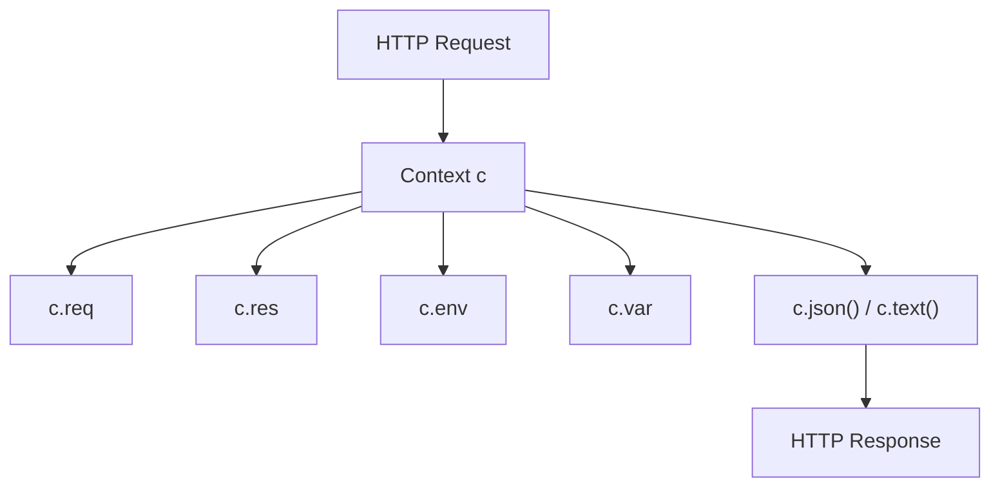
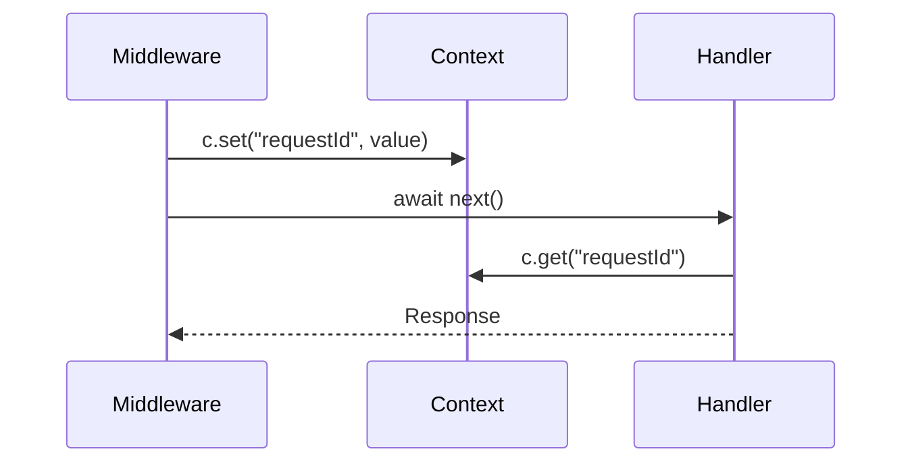
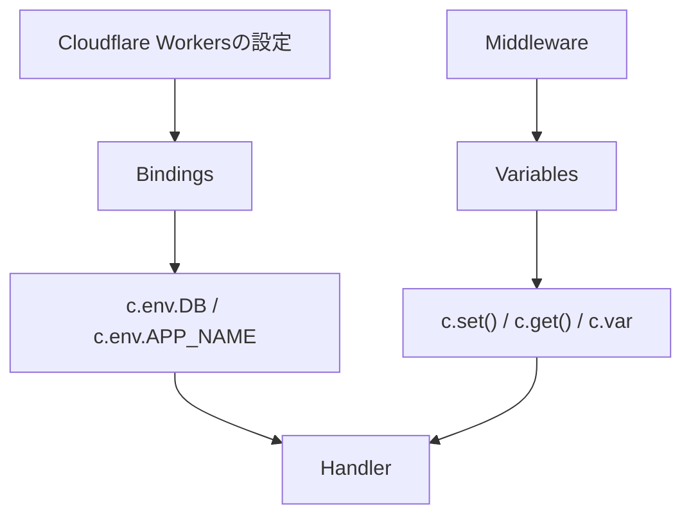
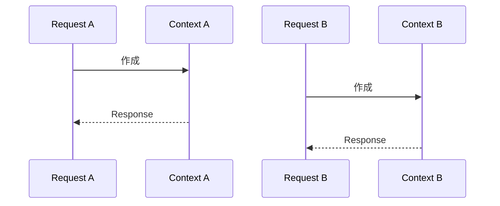

前章までに、Handlerの中で`c.req`や`c.json()`を使ってきました。この`c`が`Context`です。Honoでは、リクエストの読み取り、レスポンスの作成、環境変数へのアクセス、ミドルウェアからHandlerへの値の受け渡しなど、多くの操作が`Context`を通して行われます。

`Context`は便利ですが、何でも詰め込む場所ではありません。何を持ち、どのくらいの寿命があり、どの値を置いてよいのかを、この章で整理します。

## Contextとは何か

`Context`は、1つのリクエストを処理するあいだに必要な情報をまとめた入れ物です。



Handlerでは、`Context`を引数として受け取ります。

```ts
app.get('/tasks/:id', (c) => {
  const id = c.req.param('id');

  return c.json({ id });
});
```

`c`という名前は慣習です。別の名前でも動きますが、Honoのコードでは`c`がよく使われます。

## Contextが保持する情報

`Context`からは、主に次の情報や操作にアクセスできます。

| プロパティ・メソッド | 役割 |
|---|---|
| `c.req` | HonoRequest。リクエスト情報を読む |
| `c.res` | 返されるResponseへアクセスする |
| `c.env` | 環境変数やBindingsへアクセスする |
| `c.set()` | 現在のリクエストに値を保存する |
| `c.get()` | `c.set()`した値を取得する |
| `c.var` | `Variables`をプロパティとして読む |
| `c.status()` | レスポンスのステータスコードを設定する |
| `c.header()` | レスポンスヘッダーを設定する |
| `c.json()` | JSONレスポンスを返す |
| `c.text()` | テキストレスポンスを返す |

最初は、`c.req`と`c.json()`だけでも十分です。アプリケーションが育つにつれて、`c.env`、`c.set()`、`c.get()`、`Variables`が重要になります。

## c.reqとc.res

`c.req`は、リクエストを読むための入口です。

```ts
app.get('/debug/request', (c) => {
  return c.json({
    method: c.req.method,
    path: c.req.path,
    url: c.req.url,
  });
});
```

`c.res`は、返されるResponseへアクセスするためのプロパティです。Middlewareで、Handlerのあとにレスポンスヘッダーを追加したいときなどに使います。

```ts
app.use(async (c, next) => {
  await next();

  c.res.headers.append('X-Powered-By', 'Hono');
});
```

通常のHandlerでは、`c.res`を直接触るより、`return c.json(...)`のようにレスポンスを返す書き方のほうが読みやすいです。`c.res`は、主にMiddlewareで役立つと考えておきましょう。

## c.envとBindings

Cloudflare Workersでは、環境変数、シークレット、KV、D1、R2などをWorkerに紐づけて使います。こうした紐づけられた値をBindingsと呼びます。

Honoでは、`c.env`からBindingsへアクセスできます。

```ts
app.get('/debug/env', (c) => {
  return c.json({
    appName: c.env.APP_NAME,
  });
});
```

ただし、このままだとTypeScriptは`APP_NAME`が存在するか分かりません。そこで、Bindingsの型を定義します。

```ts
type Bindings = {
  APP_NAME: string;
};

const app = new Hono<{
  Bindings: Bindings;
}>();
```

これで、`c.env.APP_NAME`に型が付きます。

```ts
app.get('/debug/env', (c) => {
  const appName = c.env.APP_NAME;

  return c.json({ appName });
});
```


第15章でCloudflare D1を使うときも、Bindingsの型が重要になります。

## D1 Bindingのイメージ

この章ではまだD1を実装しませんが、先に形だけ見ておきます。

```ts
type Bindings = {
  DB: D1Database;
};

const app = new Hono<{
  Bindings: Bindings;
}>();

app.get('/tasks', async (c) => {
  const result = await c.env.DB.prepare('SELECT * FROM tasks').all();

  return c.json(result);
});
```

`c.env.DB`にD1データベースが入っている、という形です。TypeScriptに`DB`の存在を教えることで、エディタ補完や型チェックが効きます。

Bindingsは、実行環境から渡される値です。Handlerの中で勝手に作る値ではありません。

## c.set()とc.get()

`c.set()`と`c.get()`は、同じリクエストの処理中に値を受け渡すために使います。

たとえば、MiddlewareでリクエストIDを作り、Handlerで使いたい場合を考えます。

```ts
app.use(async (c, next) => {
  c.set('requestId', crypto.randomUUID());
  await next();
});

app.get('/debug/request-id', (c) => {
  const requestId = c.get('requestId');

  return c.json({ requestId });
});
```

この値は、現在のリクエストの中だけで有効です。別のリクエストには共有されません。



これは、認証ユーザー、リクエストID、処理開始時刻などを渡すときに便利です。

## Variablesへ型を付ける

`c.set()`と`c.get()`を型安全に使うには、`Variables`を定義します。

```ts
type Variables = {
  requestId: string;
};

const app = new Hono<{
  Variables: Variables;
}>();
```

これで、`c.set()`や`c.get()`に型が効きます。

```ts
app.use(async (c, next) => {
  c.set('requestId', crypto.randomUUID());
  await next();
});

app.get('/debug/request-id', (c) => {
  const requestId = c.get('requestId');

  return c.json({ requestId });
});
```

`Variables`を定義しておくと、存在しないキーを使ったときや、違う型の値を入れたときに気づきやすくなります。

## c.varで読む

`c.get()`の代わりに、`c.var`から読むこともできます。

```ts
app.get('/debug/request-id', (c) => {
  return c.json({
    requestId: c.var.requestId,
  });
});
```

`c.var.requestId`のようにプロパティとして読めるので、Handler側の見通しがよくなることがあります。

| 読み方 | 特徴 |
|---|---|
| `c.get('requestId')` | キー名を文字列で指定する |
| `c.var.requestId` | プロパティとして読む |

どちらを使っても構いません。チームやプロジェクト内で書き方をそろえることが大切です。

## BindingsとVariablesの違い

BindingsとVariablesは、どちらも`Context`からアクセスできます。けれども、役割は違います。

| 項目 | Bindings | Variables |
|---|---|---|
| アクセス | `c.env` | `c.get()` / `c.var` |
| 値の出どころ | 実行環境 | MiddlewareやHandler |
| 例 | D1、KV、環境変数、シークレット | 認証ユーザー、リクエストID、処理開始時刻 |
| 寿命 | 実行環境の設定に依存 | 1リクエストの間 |
| 型定義 | `Bindings` | `Variables` |

混同しやすいので、図でも見ておきます。



環境から渡されるものはBindings。リクエスト処理中に作るものはVariables。こう分けると整理しやすくなります。

## Contextの寿命

`Context`は、リクエストごとに作られます。そして、そのレスポンスが返されるまで使われます。



リクエストAの`Context`と、リクエストBの`Context`は別物です。

そのため、`c.set()`で保存した値は、別のリクエストからは読めません。これは安全な性質です。リクエストごとの情報が混ざらないからです。

## Contextへ保存してよい値

`Context`へ保存してよい値は、現在のリクエストに関係する値です。

| 保存してよい例 | 理由 |
|---|---|
| `requestId` | リクエストごとのログ追跡に使う |
| `currentUser` | 認証済みユーザーをHandlerへ渡す |
| `startTime` | 処理時間を測る |
| `validatedInput` | 検証済み入力を後続処理へ渡す |

逆に、次のような値はContextへ置くべきではありません。

| 避ける例 | 理由 |
|---|---|
| 全ユーザー共通のキャッシュ | リクエストの寿命を超えるため |
| 永続化したいデータ | データベースに保存するべき |
| 巨大なデータ | メモリ使用量が増え、見通しも悪くなる |
| 別リクエストへ共有したい状態 | Contextはリクエストごとに分かれるため |

Contextは、リクエスト処理の作業台です。倉庫ではありません。

## グローバル変数との違い

学習用コードでは、タスクを配列に保存しています。

```ts
const tasks: Task[] = [];
```

これは分かりやすさのための仮の形です。実務では、リクエストをまたいで保持したいデータは、データベースなどに保存します。

Contextとグローバル変数の違いを整理します。

| 観点 | Context | グローバル変数 |
|---|---|---|
| 寿命 | 1リクエスト | 実行環境が生きている間 |
| 主な用途 | リクエストごとの情報 | 設定、定数、共有したいインスタンス |
| 注意点 | レスポンス後は使わない | リクエスト間で状態が混ざりやすい |

Cloudflare Workersのような環境では、インスタンスの再利用や破棄が実行環境に任されます。グローバル変数に保存した値が、常に期待どおり残るとは考えないほうが安全です。

本書では、第15章でD1へ保存先を移します。それまでは学習のために配列を使います。

## Task APIへrequestIdを追加する

ここまでの内容を使い、すべてのレスポンスにリクエストIDを付けてみます。

```ts:src/index.ts
type Variables = {
  requestId: string;
};

const app = new Hono<{
  Variables: Variables;
}>();

app.use(async (c, next) => {
  const requestId = crypto.randomUUID();

  c.set('requestId', requestId);
  c.header('X-Request-Id', requestId);

  await next();
});
```

Handlerでは、`c.var.requestId`として読めます。

```ts:src/index.ts
app.get('/health', (c) => {
  return c.json({
    ok: true,
    requestId: c.var.requestId,
  });
});
```

このように、Middlewareで値を作り、Contextを通してHandlerへ渡す流れは、認証でもよく使います。

## まとめ

この章では、Honoの`Context`、`Bindings`、`Variables`を整理しました。

- `Context`は、1つのリクエスト処理に必要な情報をまとめた入れ物です。
- `c.req`でリクエストを読み、`c.json()`などでレスポンスを返します。
- `c.env`からBindingsへアクセスできます。
- Bindingsは、環境変数、D1、KV、シークレットなど、実行環境から渡される値です。
- `c.set()`、`c.get()`、`c.var`で、同じリクエスト内の値を受け渡せます。
- Variablesに型を付けると、`c.set()`や`c.var`を型安全に扱えます。
- Contextはリクエストごとに作られます。永続化やリクエスト間共有には使いません。

次章では、Middlewareを扱います。Middlewareを使うと、ログ出力、リクエストID、CORS、認証、処理時間の計測など、複数のルートに共通する処理をきれいにまとめられます。
