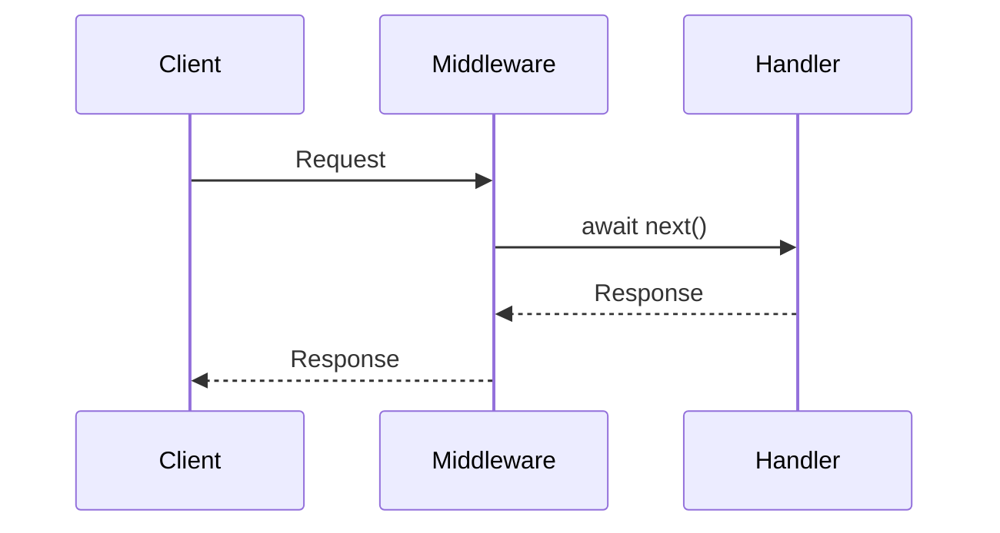
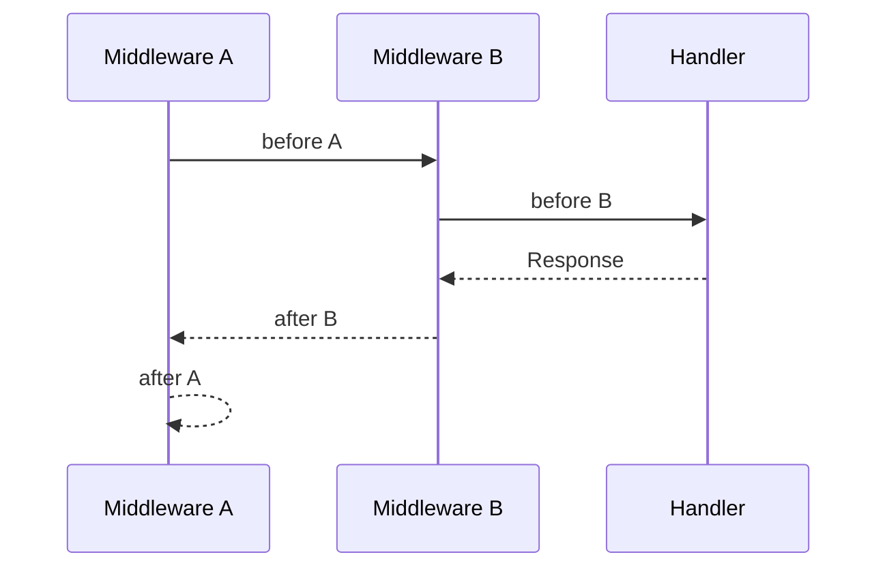
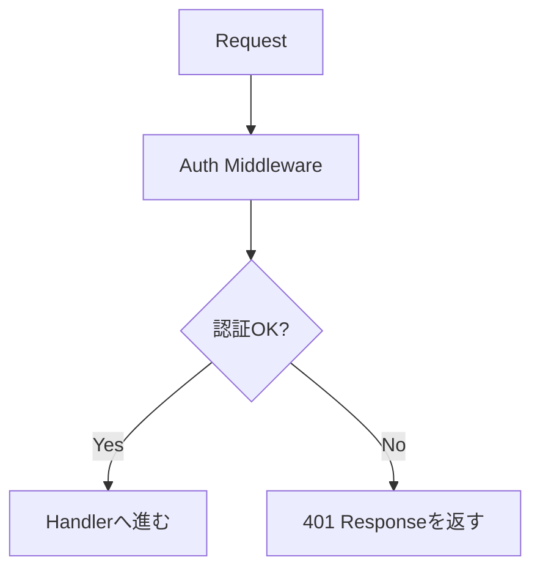
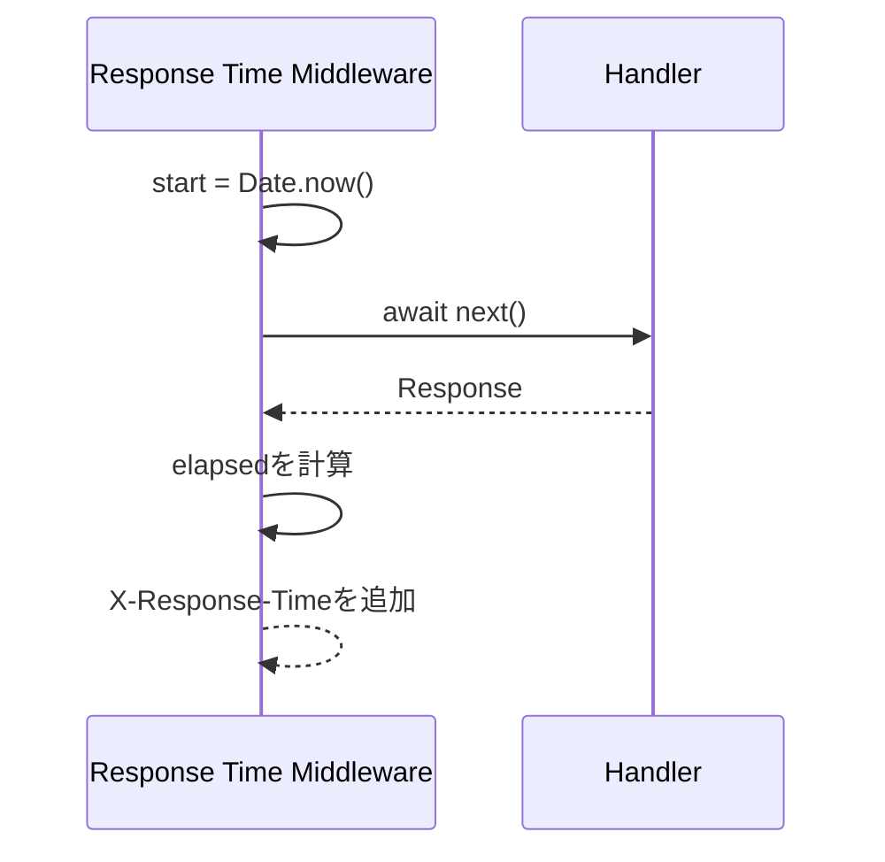

この章では、HonoのMiddlewareを学びます。

Middlewareは、Handlerの前後に共通処理を差し込む仕組みです。ログ出力、リクエストID、CORS、認証、セキュリティヘッダー、処理時間の計測など、複数のルートにまたがる処理を整理できます。

APIが小さいうちは、すべてをHandlerに書いても動きます。しかし、Handlerが増えるにつれて、同じ処理を何度も書くことになります。Middlewareは、その重複を減らし、API全体の入口を整えるための重要な仕組みです。

## Middlewareとは何か

Middlewareは、リクエストがHandlerへ届く前、またはHandlerがレスポンスを返した後に実行される関数です。



Honoでは、Middlewareの中で`await next()`を呼ぶと、次のMiddlewareまたはHandlerへ処理が進みます。

```ts
app.use(async (c, next) => {
  console.log('before');

  await next();

  console.log('after');
});
```

`await next()`より前がリクエスト前の処理、後がレスポンス後の処理です。

## Handlerとの違い

HandlerとMiddlewareは似ていますが、役割が違います。

| 項目 | Handler | Middleware |
|---|---|---|
| 主な役割 | そのルートの本処理を行う | 共通処理を行う |
| レスポンス | 通常は必ず返す | 返してもよいし、`next()`で次へ進めてもよい |
| 例 | タスクを取得する | ログ出力、認証、CORS |
| 実行範囲 | 登録したルート | 全体または指定パス |

Handlerは「このリクエストで何をするか」を書く場所です。Middlewareは「多くのリクエストに共通する前処理・後処理」を書く場所です。

## app.use()で登録する

Middlewareは、`app.use()`で登録できます。

```ts
app.use(async (c, next) => {
  console.log(`${c.req.method} ${c.req.path}`);
  await next();
});
```

このMiddlewareは、すべてのリクエストで実行されます。

特定のパスだけに適用することもできます。

```ts
app.use('/tasks/*', async (c, next) => {
  console.log('tasks route');
  await next();
});
```

この場合、`/tasks`配下のリクエストにだけ適用されます。

## Onion Model

Middlewareは、よく「玉ねぎ」のような構造で説明されます。

先に登録したMiddlewareの前処理が先に実行され、`await next()`で内側へ進みます。Handlerが終わると、今度は逆順で後処理が実行されます。



コードで見ると、次のようになります。

```ts
app.use(async (c, next) => {
  console.log('A before');
  await next();
  console.log('A after');
});

app.use(async (c, next) => {
  console.log('B before');
  await next();
  console.log('B after');
});

app.get('/hello', (c) => {
  console.log('Handler');
  return c.text('Hello');
});
```

実行順は次のようになります。

```text
A before
B before
Handler
B after
A after
```

この実行順を理解しておくと、ログ、処理時間の計測、レスポンスヘッダーの追加が書きやすくなります。

## next()を呼ばない場合

Middlewareは、`next()`を呼ばずにレスポンスを返すこともできます。

```ts
app.use('/admin/*', async (c, next) => {
  const authorization = c.req.header('Authorization');

  if (!authorization) {
    return c.json({ message: 'Unauthorized' }, 401);
  }

  await next();
});
```

認証に失敗した場合、Handlerには進まず、その場で`401`を返します。



これは、認証、認可、Bodyサイズ制限、メンテナンスモードなどでよく使います。

## Logger Middleware

Honoには、組み込みのLogger Middlewareがあります。

```ts
import { logger } from 'hono/logger';

app.use(logger());
```

これだけで、リクエストとレスポンスのログが出力されます。

ログは、開発中の動作確認や、想定外のレスポンスを追うときに役立ちます。

```text
<-- GET /tasks
--> GET /tasks 200 4ms
```

本番運用では、構造化ログやログ基盤との連携を考えることになります。本書では、まずHonoの組み込みLoggerで、Middlewareの使い方に慣れます。

## Request ID Middleware

リクエストIDは、1つのリクエストをログ上で追跡するためのIDです。

Honoには、Request ID Middlewareがあります。

```ts
import { requestId } from 'hono/request-id';

app.use('*', requestId());
```

Handlerでは、`c.get('requestId')`から取得できます。

```ts
app.get('/health', (c) => {
  return c.json({
    ok: true,
    requestId: c.get('requestId'),
  });
});
```

型を付けたい場合は、`RequestIdVariables`を使えます。

```ts
import type { RequestIdVariables } from 'hono/request-id';

const app = new Hono<{
  Variables: RequestIdVariables;
}>();
```

リクエストIDがあると、エラー調査がかなり楽になります。レスポンスに`X-Request-Id`を含めておくと、クライアントから問い合わせが来たときにも追いやすくなります。

## CORS Middleware

フロントエンドからAPIを呼び出す場合、CORSが必要になることがあります。

Honoには、CORS Middlewareがあります。

```ts
import { cors } from 'hono/cors';

app.use(
  '*',
  cors({
    origin: 'http://localhost:5173',
    allowMethods: ['GET', 'POST', 'PATCH', 'DELETE'],
    allowHeaders: ['Content-Type', 'Authorization'],
  }),
);
```

CORSは、ブラウザのセキュリティ機能と関係します。サーバー間通信ではなく、ブラウザから別オリジンのAPIを呼ぶときに問題になります。

開発中は広く許可したくなりますが、本番では許可するオリジンを絞るのが基本です。

## Secure Headers、Body Limit、Timeout

Honoには、よく使う組み込みMiddlewareがいくつもあります。

| Middleware | 役割 |
|---|---|
| `logger()` | リクエストとレスポンスをログに出す |
| `requestId()` | リクエストごとにIDを付ける |
| `cors()` | CORSヘッダーを設定する |
| `secureHeaders()` | セキュリティ関連ヘッダーを設定する |
| `bodyLimit()` | リクエストボディのサイズを制限する |
| `timeout()` | 処理時間に上限を設ける |

使い方の例です。

```ts
import { bodyLimit } from 'hono/body-limit';
import { secureHeaders } from 'hono/secure-headers';
import { timeout } from 'hono/timeout';

app.use(secureHeaders());
app.use('/api/*', timeout(5000));
app.use(
  '/tasks',
  bodyLimit({
    maxSize: 10 * 1024,
  }),
);
```

セキュリティや運用に関わるMiddlewareは、後から慌てて足すより、早めに存在を知っておくと設計しやすくなります。

## 独自Middlewareを作る

独自Middlewareは、普通の関数として書けます。

次の例では、処理時間をレスポンスヘッダーに追加します。

```ts
app.use(async (c, next) => {
  const start = Date.now();

  await next();

  const elapsed = Date.now() - start;
  c.header('X-Response-Time', `${elapsed}ms`);
});
```

このMiddlewareは、Handlerの前で開始時刻を保存し、Handlerの後で経過時間を計算しています。



シンプルですが、Middlewareの前後処理を理解するにはよい例です。

## createMiddleware()を使う

Honoには、Middlewareを作るための`createMiddleware()`があります。

型を付けた独自Middlewareを作りたいときに便利です。

```ts
import { createMiddleware } from 'hono/factory';

type Env = {
  Variables: {
    startedAt: number;
  };
};

const measureTime = createMiddleware<Env>(async (c, next) => {
  c.set('startedAt', Date.now());

  await next();

  const elapsed = Date.now() - c.var.startedAt;
  c.header('X-Response-Time', `${elapsed}ms`);
});
```

使う側です。

```ts
const app = new Hono<Env>();

app.use(measureTime);
```

`Variables`に型を付けているため、`c.var.startedAt`も型安全に扱えます。

## Variablesへ値を渡す

Middlewareは、後続のHandlerへ値を渡すためにも使います。

認証済みユーザーを渡すイメージを見てみます。

```ts
type User = {
  id: string;
  role: 'user' | 'admin';
};

type Env = {
  Variables: {
    currentUser: User;
  };
};

const app = new Hono<Env>();

app.use('/tasks/*', async (c, next) => {
  const user: User = {
    id: 'user-1',
    role: 'user',
  };

  c.set('currentUser', user);

  await next();
});

app.get('/tasks', (c) => {
  return c.json({
    userId: c.var.currentUser.id,
    tasks: [],
  });
});
```

今は仮のユーザーを入れています。第17章で、実際の認証処理に置き換えます。

## Middlewareを使いすぎない

Middlewareは便利ですが、何でもMiddlewareに入れればよいわけではありません。

| Middlewareに向いている | HandlerやServiceに置いたほうがよい |
|---|---|
| ログ出力 | そのルート固有のビジネス処理 |
| リクエストID | タスク作成の詳細ロジック |
| 認証ユーザーの取得 | DBからタスクを検索する処理 |
| CORS | 入力値を使った個別の判断 |
| セキュリティヘッダー | レスポンス本文の組み立て |

Middlewareは、リクエスト全体に共通する関心ごとに向いています。個別のユースケースまでMiddlewareへ押し込むと、どこで何が起きているか追いにくくなります。

## Task APIにMiddlewareを追加する

ここまでの内容を使って、Task APIに基本的なMiddlewareを追加します。

```ts:src/index.ts
import { Hono } from 'hono';
import { cors } from 'hono/cors';
import { logger } from 'hono/logger';
import { requestId } from 'hono/request-id';
import type { RequestIdVariables } from 'hono/request-id';

type Env = {
  Variables: RequestIdVariables;
};

const app = new Hono<Env>();

app.use(logger());
app.use('*', requestId());
app.use(
  '*',
  cors({
    origin: 'http://localhost:5173',
    allowMethods: ['GET', 'POST', 'PATCH', 'DELETE'],
    allowHeaders: ['Content-Type', 'Authorization'],
  }),
);

app.use(async (c, next) => {
  const start = Date.now();

  await next();

  c.header('X-Response-Time', `${Date.now() - start}ms`);
});
```

これで、ログ、リクエストID、CORS、処理時間ヘッダーがAPI全体に適用されます。

開発中は少しにぎやかになりますが、APIの流れが見えやすくなります。

## 組み込みMiddleware早見表

この本でよく出てくるMiddlewareをまとめます。

| Middleware | import元 | 主な用途 |
|---|---|---|
| `logger` | `hono/logger` | 開発中のリクエストログ |
| `requestId` | `hono/request-id` | ログ追跡用ID |
| `cors` | `hono/cors` | フロントエンドからAPIを呼ぶ |
| `secureHeaders` | `hono/secure-headers` | セキュリティヘッダー |
| `bodyLimit` | `hono/body-limit` | 大きすぎるリクエストを防ぐ |
| `timeout` | `hono/timeout` | 長すぎる処理を制限する |
| `jwt` | `hono/jwt` | JWT認証 |

すべてを最初から使う必要はありません。必要になったタイミングで、役割を理解して入れていきます。

## まとめ

この章では、HonoのMiddlewareを学びました。

- Middlewareは、Handlerの前後に共通処理を差し込む仕組みです。
- `await next()`より前が前処理、後が後処理です。
- `next()`を呼ばずにレスポンスを返すと、そこで処理を止められます。
- Logger、Request ID、CORSなどはMiddlewareに向いています。
- `createMiddleware()`を使うと、型付きの独自Middlewareを作れます。
- Middlewareから`Variables`へ値を渡すと、Handlerで型安全に利用できます。
- Middlewareは便利ですが、ルート固有のビジネス処理まで入れすぎないようにします。

次章では、エラー処理を扱います。APIでは、成功時だけでなく、入力が間違っている、データが見つからない、認証に失敗した、サーバーで想定外の問題が起きた、といった失敗時の設計が重要になります。
