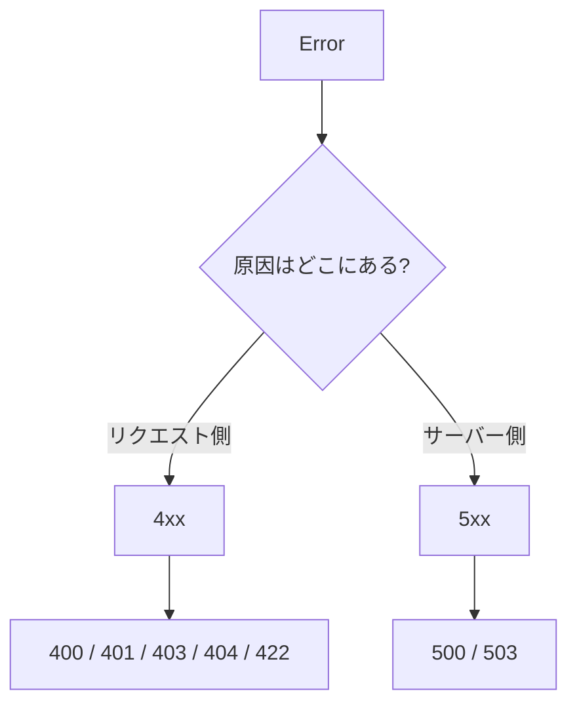
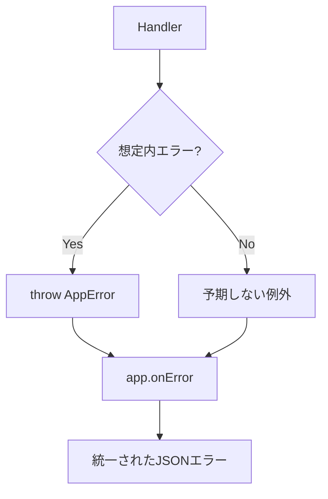

APIは、成功するリクエストだけでできているわけではありません。存在しないタスクを取得しようとする、認証なしで保護されたルートへアクセスする、不正なJSONを送る、データベースで予期しない問題が起きる。こうした失敗は、APIにとって日常です。

エラー処理を後回しにすると、ルートごとにレスポンス形式がばらばらになります。クライアント側も、何を見て判断すればよいのか分からなくなります。

そこで、Honoの`HTTPException`、`app.notFound()`、`app.onError()`を使い、API全体で一貫したエラー形式を作ります。

## エラー処理が必要な理由

まず、エラー処理がないコードを見てみます。

```ts
app.get('/tasks/:id', (c) => {
  const id = c.req.param('id');
  const task = tasks.find((task) => task.id === id);

  return c.json({ task });
});
```

存在しないIDを指定した場合、`task`は`undefined`です。それでも`200 OK`で返ってしまいます。

```json
{
  "task": null
}
```

これでは、クライアントは「タスクが存在しない」のか、「APIが壊れている」のか、「まだロード中なのか」を判断しにくくなります。

正しくは、存在しないリソースには`404 Not Found`を返します。

```ts
app.get('/tasks/:id', (c) => {
  const id = c.req.param('id');
  const task = tasks.find((task) => task.id === id);

  if (!task) {
    return c.json({ message: 'Task not found' }, 404);
  }

  return c.json({ task });
});
```

エラー処理は、単なる例外対策ではありません。クライアントとサーバーが失敗を正しく共有するための設計です。

## 400番台と500番台

HTTPステータスコードのうち、APIエラーでよく使うのは`4xx`と`5xx`です。

| 範囲 | 意味 | 例 |
|---|---|---|
| `4xx` | クライアント側の問題 | 入力が不正、認証がない、権限がない、リソースがない |
| `5xx` | サーバー側の問題 | バグ、DB障害、外部API障害、想定外の例外 |

代表的なステータスコードです。

| ステータス | 名前 | 使う場面 |
|---:|---|---|
| `400` | Bad Request | リクエストの形が不正 |
| `401` | Unauthorized | 認証が必要、または認証に失敗 |
| `403` | Forbidden | 認証済みだが権限がない |
| `404` | Not Found | リソースが存在しない |
| `409` | Conflict | 重複や状態の衝突 |
| `422` | Unprocessable Entity | 形式は読めるが値が不正 |
| `500` | Internal Server Error | 想定外のサーバーエラー |



API設計では、この分類をできるだけ一貫させます。

## 想定内エラーと想定外エラー

エラーは、大きく2種類に分けられます。

| 種類 | 例 | 扱い方 |
|---|---|---|
| 想定内エラー | タスクが見つからない、入力が不正、認証がない | 意図したステータスコードとJSONを返す |
| 想定外エラー | バグ、DB障害、未処理の例外 | ログに残し、クライアントには一般的な500を返す |

想定内エラーは、アプリケーションの仕様の一部です。

たとえば、`GET /tasks/unknown`でタスクが見つからないことは、異常なバグではありません。普通に起きるケースです。したがって、`404`として設計します。

一方で、存在するはずの変数が`undefined`になって例外が出る、データベース接続で予期しない例外が出る、といったものは想定外エラーです。クライアントへ詳細を返さず、サーバー側でログを残します。

## エラーレスポンスの形式を決める

API全体で、エラーレスポンスの形をそろえます。

本書では、次の形式を使います。

```json
{
  "error": {
    "code": "TASK_NOT_FOUND",
    "message": "Task not found"
  }
}
```

入力エラーのように詳細がある場合は、`details`を追加します。

```json
{
  "error": {
    "code": "VALIDATION_ERROR",
    "message": "Invalid request",
    "details": [
      {
        "path": "title",
        "message": "Title is required"
      }
    ]
  }
}
```

この形式にすると、人間が読む`message`と、プログラムが判定する`code`を分けられます。

| フィールド | 役割 |
|---|---|
| `error.code` | クライアントが機械的に判定するコード |
| `error.message` | 人間が読む短い説明 |
| `error.details` | 入力エラーなどの詳細 |

`message`の文言はあとで変わることがあります。クライアント側の分岐には、`message`ではなく`code`を使うほうが安全です。

## エラーを返すヘルパーを作る

毎回同じ形を書くのは面倒です。まず、小さなヘルパーを作ります。

```ts:src/index.ts
type ErrorCode =
  | 'TASK_NOT_FOUND'
  | 'VALIDATION_ERROR'
  | 'UNAUTHORIZED'
  | 'FORBIDDEN'
  | 'INTERNAL_SERVER_ERROR';

const errorResponse = (
  c: Context,
  status: 400 | 401 | 403 | 404 | 409 | 422 | 500,
  code: ErrorCode,
  message: string,
  details?: unknown,
) => {
  return c.json(
    {
      error: {
        code,
        message,
        ...(details === undefined ? {} : { details }),
      },
    },
    status,
  );
};
```

`Context`の型を使うため、先頭でimportします。

```ts
import { Hono, type Context } from 'hono';
```

これで、タスクが見つからない場合を次のように書けます。

```ts
if (!task) {
  return errorResponse(c, 404, 'TASK_NOT_FOUND', 'Task not found');
}
```

少し長く見えますが、レスポンスの形がそろいます。

## HTTPException

Honoには、`HTTPException`があります。

`HTTPException`は、ステータスコードを持った例外です。HandlerやMiddlewareの中で投げると、`app.onError()`でまとめて処理できます。

```ts
import { HTTPException } from 'hono/http-exception';

app.get('/tasks/:id', (c) => {
  const id = c.req.param('id');
  const task = tasks.find((task) => task.id === id);

  if (!task) {
    throw new HTTPException(404, {
      message: 'Task not found',
    });
  }

  return c.json({ task });
});
```

`return c.json(..., 404)`で返す方法と、`HTTPException`を投げる方法は、どちらも使えます。

| 方法 | 向いている場面 |
|---|---|
| `return c.json(..., status)` | その場で分かりやすく返したい |
| `throw new HTTPException(...)` | 共通のエラーハンドラーへ寄せたい |

本書では、API全体のエラー形式をそろえるために、`app.onError()`を使った共通処理へ進めます。

## app.notFound()

定義されていないルートへアクセスされた場合は、`app.notFound()`でレスポンスをカスタマイズできます。

```ts
app.notFound((c) => {
  return errorResponse(c, 404, 'TASK_NOT_FOUND', 'Route not found');
});
```

ただし、`TASK_NOT_FOUND`というコードはタスク専用に見えます。ルートが存在しない場合は、別のコードにしたほうが自然です。

```ts
type ErrorCode =
  | 'ROUTE_NOT_FOUND'
  | 'TASK_NOT_FOUND'
  | 'VALIDATION_ERROR'
  | 'UNAUTHORIZED'
  | 'FORBIDDEN'
  | 'INTERNAL_SERVER_ERROR';
```

```ts
app.notFound((c) => {
  return errorResponse(c, 404, 'ROUTE_NOT_FOUND', 'Route not found');
});
```

存在しないタスクと、存在しないルートは別のエラーです。エラーコードを分けると、あとからログやクライアント側で判定しやすくなります。

## app.onError()

`app.onError()`を使うと、HandlerやMiddlewareで投げられたエラーをまとめて処理できます。

```ts
app.onError((err, c) => {
  if (err instanceof HTTPException) {
    return errorResponse(
      c,
      err.status,
      'INTERNAL_SERVER_ERROR',
      err.message,
    );
  }

  console.error(err);

  return errorResponse(
    c,
    500,
    'INTERNAL_SERVER_ERROR',
    'Internal Server Error',
  );
});
```

このままだと、`HTTPException`がすべて`INTERNAL_SERVER_ERROR`になってしまいます。実務では、ステータスコードに応じてエラーコードを決めるか、独自エラークラスを使ってコードを持たせます。

## 独自エラークラスを作る

APIのエラーを扱いやすくするために、独自エラークラスを作ります。

```ts:src/index.ts
type ErrorCode =
  | 'ROUTE_NOT_FOUND'
  | 'TASK_NOT_FOUND'
  | 'VALIDATION_ERROR'
  | 'UNAUTHORIZED'
  | 'FORBIDDEN'
  | 'INTERNAL_SERVER_ERROR';

class AppError extends Error {
  constructor(
    public readonly status: 400 | 401 | 403 | 404 | 409 | 422 | 500,
    public readonly code: ErrorCode,
    message: string,
    public readonly details?: unknown,
  ) {
    super(message);
  }
}
```

タスクが見つからない場合は、このエラーを投げます。

```ts
if (!task) {
  throw new AppError(404, 'TASK_NOT_FOUND', 'Task not found');
}
```

`app.onError()`でまとめてJSONへ変換します。

```ts
app.onError((err, c) => {
  if (err instanceof AppError) {
    return errorResponse(c, err.status, err.code, err.message, err.details);
  }

  console.error(err);

  return errorResponse(
    c,
    500,
    'INTERNAL_SERVER_ERROR',
    'Internal Server Error',
  );
});
```



これで、想定内エラーと想定外エラーを同じ出口で扱えます。

## Stack Traceを本番で返さない

想定外エラーが起きたとき、Stack Traceは調査に役立ちます。

しかし、Stack Traceをそのままクライアントへ返してはいけません。ファイルパス、関数名、内部構造など、攻撃の手がかりになる情報が含まれることがあるからです。

悪い例です。

```json
{
  "error": {
    "message": "Cannot read properties of undefined",
    "stack": "TypeError: ..."
  }
}
```

本番では、クライアントには一般的なメッセージだけを返します。

```json
{
  "error": {
    "code": "INTERNAL_SERVER_ERROR",
    "message": "Internal Server Error"
  }
}
```

詳細はサーバー側のログに残します。

```ts
console.error(err);
```

ログをどのように収集するかは、運用の章で改めて扱います。

## エラーを握りつぶさない

エラー処理でよくある失敗は、エラーを握りつぶしてしまうことです。

```ts
try {
  await doSomething();
} catch {
  return c.json({ ok: false });
}
```

このコードでは、何が起きたのかログにも残りません。クライアントにも正しいステータスコードが返りません。

少なくとも、想定外エラーはログへ残し、`500`として返します。

```ts
try {
  await doSomething();
} catch (err) {
  console.error(err);
  throw new AppError(500, 'INTERNAL_SERVER_ERROR', 'Internal Server Error');
}
```

ただし、すべての場所で`try/catch`を書く必要はありません。`app.onError()`へ集約できるものは、そこでまとめて扱うほうが読みやすくなります。

## 入力エラーを一貫した形式で返す

第10章以降では、入力値の検証を行います。検証に失敗した場合も、同じエラー形式で返します。

```json
{
  "error": {
    "code": "VALIDATION_ERROR",
    "message": "Invalid request",
    "details": [
      {
        "path": "title",
        "message": "Title is required"
      }
    ]
  }
}
```

入力エラーは、クライアントが修正できるエラーです。したがって、`400`や`422`を使います。

| 状況 | ステータス |
|---|---:|
| JSONとして読めない | `400` |
| 必須項目がない | `422` |
| 値の形式が不正 | `422` |
| 認証がない | `401` |
| 権限がない | `403` |

本書では、細かい使い分けに深入りしすぎず、API全体で一貫して扱うことを重視します。

## Task APIへエラー処理を入れる

これまでのタスク詳細ルートを、`AppError`で書き換えます。

```ts:src/index.ts
app.get('/tasks/:id', (c) => {
  const id = c.req.param('id');
  const task = tasks.find((task) => task.id === id);

  if (!task) {
    throw new AppError(404, 'TASK_NOT_FOUND', 'Task not found');
  }

  return c.json({ task });
});
```

アプリケーションの最後に、`notFound`と`onError`を追加します。

```ts:src/index.ts
app.notFound((c) => {
  return errorResponse(c, 404, 'ROUTE_NOT_FOUND', 'Route not found');
});

app.onError((err, c) => {
  if (err instanceof AppError) {
    return errorResponse(c, err.status, err.code, err.message, err.details);
  }

  console.error(err);

  return errorResponse(
    c,
    500,
    'INTERNAL_SERVER_ERROR',
    'Internal Server Error',
  );
});
```

これで、存在しないタスク、存在しないルート、想定外エラーを同じ形で返せます。

## よくあるエラーと原因

API開発でよく出会うエラーをまとめます。

| 現象 | よくある原因 |
|---|---|
| `404`になる | パスが違う、ルート登録順が違う |
| `body`が空になる | `Content-Type`がない、または違う |
| `500`になる | 想定外の例外、型アサーションの誤り |
| CORSエラーになる | CORS Middlewareの設定不足 |
| 認証エラーになる | `Authorization`ヘッダーがない、トークンが不正 |
| エラー形式がばらばら | ルートごとに直接エラーを返している |

エラーが起きたときは、ステータスコード、レスポンスボディ、ログ、リクエストヘッダー、リクエストボディの順に見ると原因を追いやすくなります。

## まとめ

この章では、Honoでのエラー処理とAPIエラーの設計を学びました。

- APIでは、成功時だけでなく失敗時のレスポンス設計が重要です。
- `4xx`はクライアント側の問題、`5xx`はサーバー側の問題を表します。
- エラーレスポンスは、API全体で同じ形にそろえます。
- `error.code`は機械判定用、`error.message`は人間が読む説明です。
- `HTTPException`や`AppError`を使うと、エラー処理を共通化できます。
- `app.notFound()`で未定義ルートのレスポンスをカスタマイズできます。
- `app.onError()`で想定内エラーと想定外エラーの出口をまとめられます。
- Stack Traceを本番レスポンスへ返してはいけません。

次章では、TypeScriptと実行時バリデーションを扱います。TypeScriptの型は開発中に強力ですが、外部から届くリクエストの値を自動では保証してくれません。その境界を正しく理解します。
