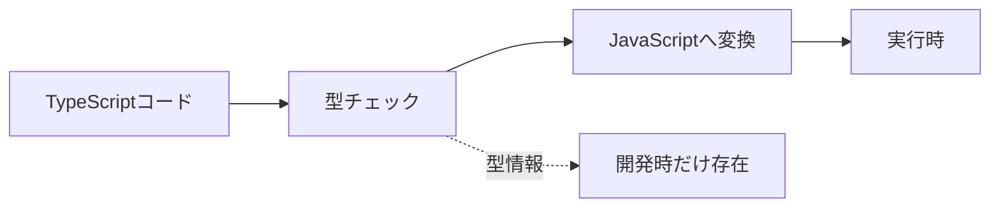
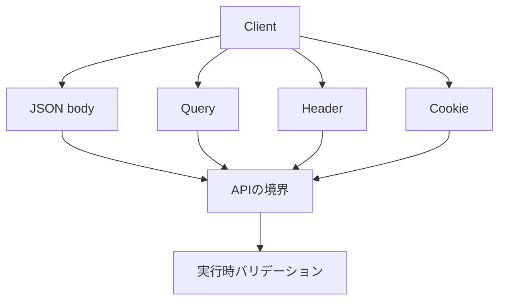
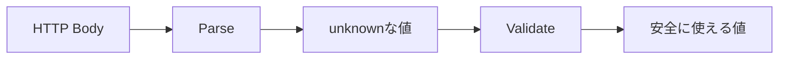
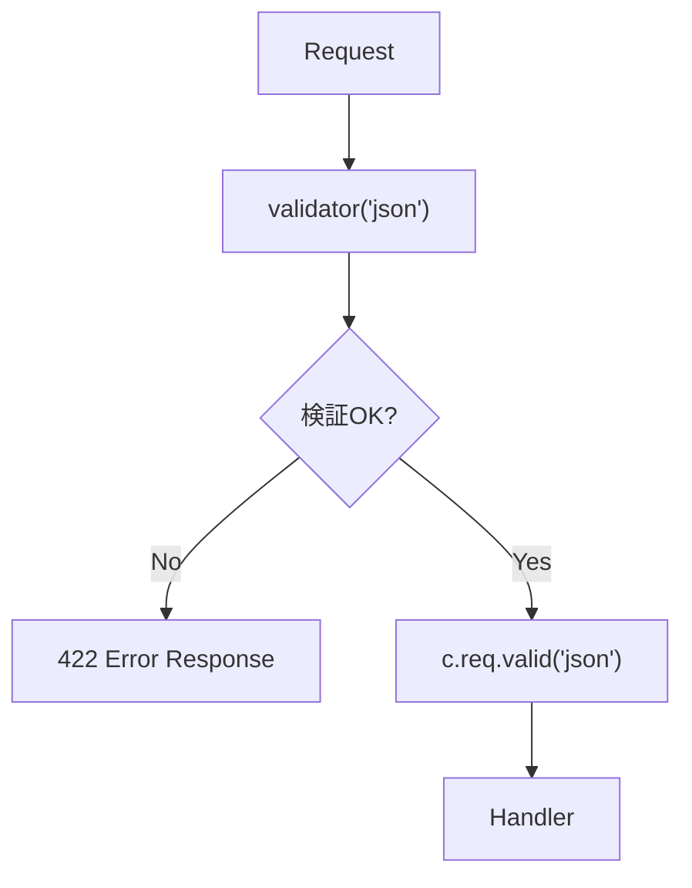
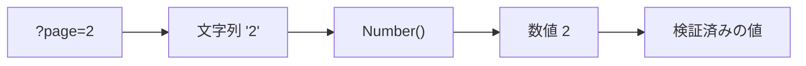

この章では、TypeScriptの型と、実行時バリデーションの違いを学びます。

前章までに、タスクの作成や更新で`c.req.json()`を使いました。そして、次のように型アサーションを書きました。

```ts
const body = (await c.req.json()) as CreateTaskInput;
```

このコードは、TypeScript上では便利に見えます。しかし、実行時に届いた値が本当に`CreateTaskInput`かどうかは確認していません。

APIでは、外部から届く値を信用してはいけません。TypeScriptは開発中のコードを守ってくれますが、HTTPリクエストで届く値までは自動で守ってくれません。この章では、その境界を整理し、Hono標準の`validator()`を使って入力値を検証する方法を学びます。

## TypeScriptが保証する範囲

TypeScriptは、コードを書く時点で型の間違いを見つけるための道具です。

```ts
type Task = {
  id: string;
  title: string;
  completed: boolean;
};

const task: Task = {
  id: 'task-1',
  title: 'Honoを学ぶ',
  completed: false,
};
```

このコードでは、`completed`に文字列を入れようとするとTypeScriptが警告してくれます。

```ts
const task: Task = {
  id: 'task-1',
  title: 'Honoを学ぶ',
  completed: 'no',
};
```

これは開発中にはとても強力です。けれども、TypeScriptの型は実行時には消えます。



APIに届くJSONは、実行時の値です。TypeScriptの型だけでは、外部入力が正しい形かどうかは分かりません。

## コンパイル時の型と実行時の値

次の型を考えます。

```ts
type CreateTaskInput = {
  title: string;
};
```

この型は、「`title`は文字列であるべき」と表しています。

しかし、クライアントは次のようなリクエストも送れてしまいます。

```json
{
  "title": 123
}
```

あるいは、`title`がないリクエストも送れます。

```json
{
  "completed": true
}
```

TypeScriptの型は、クライアントが送ってくるJSONを止めません。サーバー側で受け取ったあと、実行時に検証する必要があります。

| 種類 | いつ働くか | 何を守るか |
|---|---|---|
| TypeScriptの型 | 開発時、ビルド時 | 自分たちが書くコード |
| 実行時バリデーション | API実行時 | 外部から届く値 |

この2つは対立するものではありません。両方必要です。

ここで押さえておきたいのは、TypeScriptの型は「開発者同士の約束」に近いということです。
一方、実行時バリデーションは「外から来た値をAPIの入口で確認する門番」です。
APIを書くときは、この2つを同じものとして扱わないようにします。

## 外部入力を信用できない理由

APIの外から届く値は、すべて外部入力です。

外部入力には、次のようなものがあります。

- JSONボディ
- フォームデータ
- クエリ文字列
- パスパラメータ
- ヘッダー
- Cookie

これらは、クライアントが自由に送れます。フロントエンド側で入力チェックをしていても、それだけでは十分ではありません。ブラウザの開発者ツール、curl、別のプログラムから、いくらでも異なる値を送れるからです。



APIの境界では、必ず値を検証します。

## 型アサーションの危険性

型アサーションは、TypeScriptに「この値はこの型として扱ってよい」と伝える書き方です。

```ts
const body = (await c.req.json()) as CreateTaskInput;
```

このコードは、値を検証しているわけではありません。TypeScriptへの自己申告です。

たとえば、実際には次の値が届いているかもしれません。

```json
{
  "title": 123
}
```

それでも、型アサーションを書けばTypeScriptは`body.title`を文字列として扱います。

```ts
const title = body.title.toUpperCase();
```

実際には`title`が数値なので、実行時にエラーになる可能性があります。

型アサーションは、外部入力の検証には使わないほうが安全です。どうしても使う場合は、「すでに別の場所で検証済み」という根拠が必要です。

## ParseとValidateの違い

外部入力を扱うときは、ParseとValidateを分けて考えると分かりやすくなります。

| 処理 | 意味 | 例 |
|---|---|---|
| Parse | 生のデータを扱いやすい形に変換する | JSON文字列をオブジェクトにする |
| Validate | 値が期待する条件を満たすか確認する | `title`が空でない文字列か確認する |

`c.req.json()`は、主にParseです。

```ts
const body = await c.req.json();
```

この時点では、JSONとして読めただけです。`title`が文字列かどうか、空でないかどうかはまだ分かりません。

Validateでは、値を確認します。

```ts
if (typeof body.title !== 'string' || body.title.trim() === '') {
  return c.json(
    {
      error: {
        code: 'VALIDATION_ERROR',
        message: 'Title is required',
      },
    },
    422,
  );
}
```



この流れをAPIの入口で行うことが大切です。

## バリデーションを行う場所

バリデーションは、できるだけHandlerの入口に近い場所で行います。

悪い例です。

```ts
app.post('/tasks', async (c) => {
  const body = await c.req.json();

  const task = createTask(body);

  return c.json({ task }, 201);
});
```

このコードでは、`createTask()`に何が渡ってくるか分かりません。ServiceやRepositoryの中で毎回検証することになり、責務が曖昧になります。

よい例です。

```ts
app.post('/tasks', async (c) => {
  const body = await c.req.json();

  if (!isCreateTaskInput(body)) {
    return c.json(
      {
        error: {
          code: 'VALIDATION_ERROR',
          message: 'Invalid request',
        },
      },
      422,
    );
  }

  const task = createTask(body);

  return c.json({ task }, 201);
});
```

APIの境界で検証し、その内側では検証済みの値として扱う。この分担が基本です。

## 手書きの型ガード

まずは、TypeScriptの型ガードで検証してみます。

```ts
type CreateTaskInput = {
  title: string;
};

const isCreateTaskInput = (value: unknown): value is CreateTaskInput => {
  if (typeof value !== 'object' || value === null) {
    return false;
  }

  if (!('title' in value)) {
    return false;
  }

  const title = value.title;

  return typeof title === 'string' && title.trim().length > 0;
};
```

これをHandlerで使います。

```ts
app.post('/tasks', async (c) => {
  const body = await c.req.json();

  if (!isCreateTaskInput(body)) {
    return c.json(
      {
        error: {
          code: 'VALIDATION_ERROR',
          message: 'Title is required',
        },
      },
      422,
    );
  }

  const task = {
    id: `task-${tasks.length + 1}`,
    title: body.title,
    completed: false,
  };

  tasks.push(task);

  return c.json({ task }, 201);
});
```

型ガードを通った後は、TypeScriptが`body`を`CreateTaskInput`として扱ってくれます。

これは理解しやすい方法ですが、入力項目が増えると手書きの検証が大変になります。

## Hono Validatorの役割

Honoには、薄いValidatorの仕組みがあります。

`validator()`はMiddlewareとして使います。リクエストの一部を検証し、検証済みの値をHandlerへ渡します。

```ts
import { validator } from 'hono/validator';
```

JSONボディを検証する例です。

```ts
app.post(
  '/tasks',
  validator('json', (value, c) => {
    const title = value['title'];

    if (typeof title !== 'string' || title.trim() === '') {
      return c.json(
        {
          error: {
            code: 'VALIDATION_ERROR',
            message: 'Title is required',
          },
        },
        422,
      );
    }

    return {
      title: title.trim(),
    };
  }),
  (c) => {
    const body = c.req.valid('json');

    const task = {
      id: `task-${tasks.length + 1}`,
      title: body.title,
      completed: false,
    };

    tasks.push(task);

    return c.json({ task }, 201);
  },
);
```

流れを図にすると、次のようになります。



Handlerでは、`c.req.valid('json')`から検証済みの値を取得します。

この例で大事なのは、Handler本体が`value['title']`のような生の値に直接触っていないことです。
生の入力は`validator()`の中で確認し、Handlerでは検証後の`body.title`を使います。
この分担にすると、後から処理が増えても「どこまでが危険な外部入力か」を追いやすくなります。

## validator()の対象

`validator()`では、次の対象を検証できます。

| 対象 | 検証するもの |
|---|---|
| `json` | JSONボディ |
| `form` | フォームデータ |
| `query` | クエリ文字列 |
| `param` | パスパラメータ |
| `header` | ヘッダー |
| `cookie` | Cookie |

クエリ文字列を検証する例です。

```ts
app.get(
  '/tasks',
  validator('query', (value, c) => {
    const status = value['status'];

    if (
      status !== undefined &&
      status !== 'open' &&
      status !== 'completed'
    ) {
      return c.json(
        {
          error: {
            code: 'VALIDATION_ERROR',
            message: 'Invalid status',
          },
        },
        422,
      );
    }

    return {
      status,
    };
  }),
  (c) => {
    const { status } = c.req.valid('query');

    return c.json({ status });
  },
);
```

パスパラメータを検証する例です。

```ts
app.get(
  '/tasks/:id',
  validator('param', (value, c) => {
    const id = value['id'];

    if (typeof id !== 'string' || !id.startsWith('task-')) {
      return c.json(
        {
          error: {
            code: 'VALIDATION_ERROR',
            message: 'Invalid task id',
          },
        },
        422,
      );
    }

    return { id };
  }),
  (c) => {
    const { id } = c.req.valid('param');

    return c.json({ id });
  },
);
```

## Content-Typeに注意する

`validator('json')`を使う場合、リクエストには`Content-Type: application/json`が必要です。

curlでは、次のように指定します。

```sh
curl -X POST http://localhost:8787/tasks \
  -H "Content-Type: application/json" \
  -d "{\"title\":\"Honoを学ぶ\"}"
```

`Content-Type`がないと、期待どおりにJSONとして扱われないことがあります。テストを書くときも同じです。

```ts
const res = await app.request('/tasks', {
  method: 'POST',
  headers: {
    'Content-Type': 'application/json',
  },
  body: JSON.stringify({
    title: 'Honoを学ぶ',
  }),
});
```

APIの動作確認で「値が空になる」ときは、まず`Content-Type`を確認してください。

## headerのキーは小文字に注意する

`validator('header')`でヘッダーを検証する場合、キーは小文字として扱います。

たとえば、`Idempotency-Key`を検証したい場合は、`idempotency-key`として読みます。

```ts
app.post(
  '/tasks',
  validator('header', (value, c) => {
    const idempotencyKey = value['idempotency-key'];

    if (!idempotencyKey) {
      return c.json(
        {
          error: {
            code: 'VALIDATION_ERROR',
            message: 'Idempotency-Key is required',
          },
        },
        422,
      );
    }

    return { idempotencyKey };
  }),
  (c) => {
    const { idempotencyKey } = c.req.valid('header');

    return c.json({ idempotencyKey });
  },
);
```

ヘッダーは大文字小文字を区別しない仕組みですが、オブジェクトとして扱うときのキーには注意が必要です。

## 検証後の値を変換する

バリデーションでは、値を確認するだけでなく、扱いやすい形へ変換することもあります。

たとえば、`page`はクエリ文字列では文字列として届きます。

```text
GET /tasks?page=2
```

Handlerでは数値として使いたいので、Validatorで変換します。

```ts
app.get(
  '/tasks',
  validator('query', (value, c) => {
    const pageValue = value['page'];
    const page = pageValue === undefined ? 1 : Number(pageValue);

    if (!Number.isInteger(page) || page < 1) {
      return c.json(
        {
          error: {
            code: 'VALIDATION_ERROR',
            message: 'Page must be a positive integer',
          },
        },
        422,
      );
    }

    return { page };
  }),
  (c) => {
    const { page } = c.req.valid('query');

    return c.json({ page });
  },
);
```

`c.req.valid('query')`で受け取る`page`は、数値として扱えます。



## 手書きValidatorの限界

Honoの`validator()`は、薄くて分かりやすい仕組みです。

ただし、項目が増えると手書きの検証はすぐに長くなります。

```ts
if (typeof title !== 'string' || title.trim() === '') {
  // ...
}

if (description !== undefined && typeof description !== 'string') {
  // ...
}

if (dueDate !== undefined && typeof dueDate !== 'string') {
  // ...
}
```

さらに、次のような条件も必要になります。

- 文字列の最小長、最大長
- 数値の範囲
- 日付形式
- enumのチェック
- ネストしたオブジェクト
- 配列
- エラーメッセージの整形
- TypeScript型との同期

手書きでもできますが、だんだんバリデーションコードそのものが大きくなります。

そこで次章では、Zodと`@hono/zod-validator`を使います。Zodを使うと、スキーマから実行時バリデーションとTypeScript型をつなげやすくなります。

## Task APIをvalidator()で改善する

この章の最後に、`POST /tasks`を`validator()`で改善します。

ここでは、新しいAPIを増やすのではなく、すでに作ったタスク作成APIの入口を固くします。
見るポイントは、`c.req.json()`を直接呼ばなくなることと、Handlerが`c.req.valid('json')`から値を受け取ることです。

```ts:src/index.ts
import { validator } from 'hono/validator';
```

```ts:src/index.ts
app.post(
  '/tasks',
  validator('json', (value, c) => {
    const title = value['title'];

    if (typeof title !== 'string' || title.trim() === '') {
      return c.json(
        {
          error: {
            code: 'VALIDATION_ERROR',
            message: 'Title is required',
          },
        },
        422,
      );
    }

    return {
      title: title.trim(),
    };
  }),
  (c) => {
    const body = c.req.valid('json');

    const task = {
      id: `task-${tasks.length + 1}`,
      title: body.title,
      completed: false,
    };

    tasks.push(task);

    return c.json({ task }, 201);
  },
);
```

これで、`title`がないリクエストや、空文字のリクエストを防げます。

```sh
curl -X POST http://localhost:8787/tasks \
  -H "Content-Type: application/json" \
  -d "{}"
```

レスポンス例です。

```json
{
  "error": {
    "code": "VALIDATION_ERROR",
    "message": "Title is required"
  }
}
```

まだ手書きの検証ですが、APIの境界で値を確認する形に近づきました。

この時点では、検証ルールはまだコードの中に直接書いています。
小さな入力ならこれでも十分です。
ただ、項目が増えたときに同じ調子で書き続けると、Handlerよりも検証コードのほうが目立つようになります。
次章でZodを使うのは、その複雑さをスキーマへ逃がすためです。

## まとめ

この章では、TypeScriptと実行時バリデーションの違いを学びました。

- TypeScriptの型は、開発時やビルド時にコードを守ります。
- HTTPリクエストで届く値は、実行時に検証する必要があります。
- 型アサーションは検証ではありません。外部入力に安易に使うと危険です。
- Parseは値を読める形にすること、Validateは期待する条件を満たすか確認することです。
- バリデーションは、APIの境界に近い場所で行います。
- Honoの`validator()`を使うと、入力を検証し、`c.req.valid()`で検証済みの値を取得できます。
- `json`、`form`、`query`、`param`、`header`、`cookie`などを検証対象にできます。
- `Content-Type`やヘッダー名の扱いには注意が必要です。

次章では、Zodを使ってバリデーションをさらに型安全にします。手書きの`validator()`で見えた課題を、スキーマベースの検証で解消していきます。
