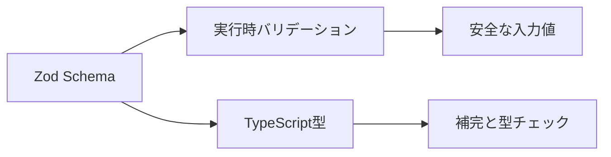
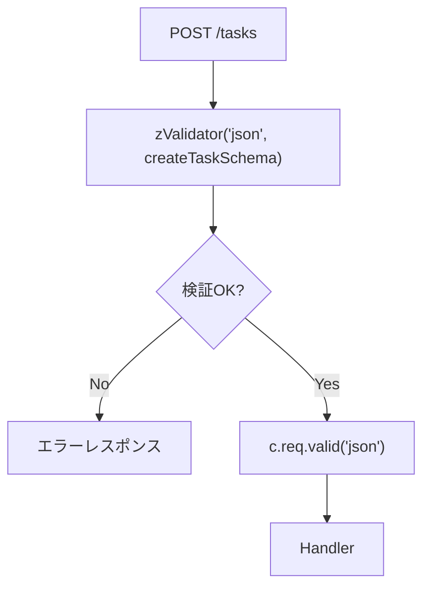
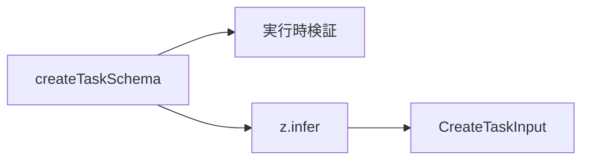
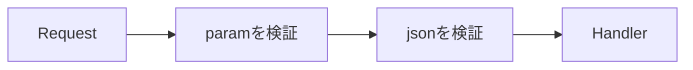

この章では、Zodと`@hono/zod-validator`を使って、リクエストを型安全に検証します。

第10章では、Hono標準の`validator()`を使い、手書きで入力値を検証しました。これは仕組みを理解するにはよい方法です。けれども、入力項目が増えると、`typeof`や`if`文が増え、検証コードそのものが読みにくくなります。

Zodを使うと、入力値の形を「スキーマ」として定義できます。スキーマは実行時の検証に使えるだけでなく、TypeScriptの型も取り出せます。

この章のゴールは、タスク作成、タスク更新、クエリ文字列、パスパラメータをZodで検証し、Handlerの中では検証済みの値だけを扱える状態にすることです。

## Zodとは何か

Zodは、TypeScript向けのスキーマバリデーションライブラリです。

たとえば、タスク作成用の入力は次のように定義できます。

```ts
import * as z from 'zod';

const createTaskSchema = z.object({
  title: z.string().min(1),
});
```

このスキーマは、次の2つの役割を持ちます。

| 役割 | 説明 |
|---|---|
| 実行時の検証 | 外部から届いた値が条件を満たすか確認する |
| TypeScript型の生成 | スキーマから型を取り出してコードに使う |

Zodを使うと、実行時バリデーションとTypeScript型の定義を近い場所に置けます。



TypeScriptの型だけでは、HTTPで届く値を検証できません。Zodは、その境界を守るために使います。

## インストール

ZodとHono用のZod Validatorをインストールします。

```sh
npm install zod @hono/zod-validator
```

使うときは、次のようにimportします。

```ts
import * as z from 'zod';
import { zValidator } from '@hono/zod-validator';
```

`zod`はスキーマを定義するためのライブラリです。`@hono/zod-validator`は、ZodスキーマをHonoのMiddlewareとして使いやすくするためのパッケージです。

## 基本のスキーマ

まず、タスク作成用のスキーマを作ります。

```ts
const createTaskSchema = z.object({
  title: z.string().trim().min(1, 'Title is required'),
});
```

このスキーマは、次の条件を表しています。

| 書き方 | 意味 |
|---|---|
| `z.object({...})` | オブジェクトである |
| `z.string()` | 文字列である |
| `.trim()` | 前後の空白を取り除く |
| `.min(1)` | 1文字以上である |

スキーマを使って値を検証するには、`parse()`または`safeParse()`を使います。

```ts
const result = createTaskSchema.safeParse({
  title: 'Honoを学ぶ',
});

if (result.success) {
  console.log(result.data.title);
}
```

`safeParse()`は、検証に失敗しても例外を投げず、成功か失敗かを結果として返します。APIのエラーレスポンスを自分で整えたい場合は、`safeParse()`の考え方が役立ちます。

## zValidatorでJSONボディを検証する

Honoでは、`zValidator()`を使うと、ZodスキーマをMiddlewareとして使えます。

```ts
app.post(
  '/tasks',
  zValidator('json', createTaskSchema),
  (c) => {
    const body = c.req.valid('json');

    const task = {
      id: `task-${tasks.length + 1}`,
      title: body.title,
      completed: false,
    };

    tasks.push(task);

    return c.json({ task }, 201);
  },
);
```

流れは次のようになります。



Handlerの中では、`c.req.valid('json')`から検証済みの値を取得します。ここまで来ると、`title`が文字列で、空でないことが分かっています。

## 検証エラーの形式をそろえる

そのまま`zValidator()`を使うと、検証失敗時のレスポンスがプロジェクトのエラー形式と合わないことがあります。

本書では、第9章で決めた形式にそろえます。

```json
{
  "error": {
    "code": "VALIDATION_ERROR",
    "message": "Invalid request",
    "details": []
  }
}
```

`zValidator()`の第3引数で、検証結果を受け取れます。

```ts
const validationErrorResponse = (c: Context, result: z.ZodSafeParseResult<unknown>) => {
  if (result.success) {
    return;
  }

  return c.json(
    {
      error: {
        code: 'VALIDATION_ERROR',
        message: 'Invalid request',
        details: result.error.issues.map((issue) => ({
          path: issue.path.join('.'),
          message: issue.message,
        })),
      },
    },
    422,
  );
};
```

実際に使う例です。

```ts
app.post(
  '/tasks',
  zValidator('json', createTaskSchema, (result, c) => {
    if (!result.success) {
      return validationErrorResponse(c, result);
    }
  }),
  (c) => {
    const body = c.req.valid('json');
    return c.json({ body }, 201);
  },
);
```

これで、Zodの検証エラーもAPI全体のエラー形式に合わせられます。

## ZodからTypeScript型を作る

ZodスキーマからTypeScript型を取り出すには、`z.infer`を使います。

```ts
type CreateTaskInput = z.infer<typeof createTaskSchema>;
```

これで、次のような型が得られます。

```ts
type CreateTaskInput = {
  title: string;
};
```

スキーマと型を別々に書くと、片方だけ修正してずれることがあります。Zodでは、スキーマを中心にして型を取り出せるので、ずれを減らせます。



本書では、外部入力の型はZodスキーマから作る方針にします。

## 更新用スキーマを作る

タスク更新では、`title`と`completed`のどちらか、または両方を受け取ります。

```ts
const updateTaskSchema = z
  .object({
    title: z.string().trim().min(1).optional(),
    completed: z.boolean().optional(),
  })
  .refine((value) => value.title !== undefined || value.completed !== undefined, {
    message: 'At least one field is required',
  });
```

`optional()`は、そのプロパティがなくてもよいことを表します。

| 入力 | 結果 |
|---|---|
| `{ "title": "新しいタイトル" }` | OK |
| `{ "completed": true }` | OK |
| `{ "title": "新しいタイトル", "completed": true }` | OK |
| `{}` | NG |

`refine()`を使うと、複数のフィールドを見た条件を追加できます。

## OptionalとNullable

`optional()`と`nullable()`は似ていますが、意味が違います。

| 書き方 | 許可する値 |
|---|---|
| `z.string().optional()` | 文字列、またはプロパティなし |
| `z.string().nullable()` | 文字列、または`null` |
| `z.string().nullish()` | 文字列、`null`、またはプロパティなし |

タスク更新では、プロパティが送られてこないことを許可したいので、`optional()`を使います。

`null`を許可するかどうかは、API設計として明確に決めます。曖昧に許可すると、クライアント側もサーバー側も扱いに迷います。

## クエリパラメータを検証する

タスク一覧では、状態による絞り込みやページ番号を受け取りたい場面があります。

```text
GET /tasks?status=open&page=2
```

クエリ文字列は文字列として届きます。そのため、必要に応じて変換します。

```ts
const listTasksQuerySchema = z.object({
  status: z.enum(['open', 'completed']).optional(),
  page: z.coerce.number().int().min(1).default(1),
  limit: z.coerce.number().int().min(1).max(100).default(20),
});
```

`z.coerce.number()`は、文字列の`"2"`を数値の`2`へ変換してから検証します。

```ts
app.get(
  '/tasks',
  zValidator('query', listTasksQuerySchema),
  (c) => {
    const query = c.req.valid('query');

    return c.json({
      page: query.page,
      limit: query.limit,
      status: query.status,
    });
  },
);
```

クエリパラメータは、検索やページネーションの入口になります。第16章でさらに詳しく扱います。

## パスパラメータを検証する

パスパラメータも外部入力です。

```ts
const taskParamSchema = z.object({
  id: z.string().min(1),
});
```

```ts
app.get(
  '/tasks/:id',
  zValidator('param', taskParamSchema),
  (c) => {
    const { id } = c.req.valid('param');

    const task = tasks.find((task) => task.id === id);

    if (!task) {
      throw new AppError(404, 'TASK_NOT_FOUND', 'Task not found');
    }

    return c.json({ task });
  },
);
```

`c.req.param('id')`で読むこともできますが、Zodで検証しておくと、Handlerの入口で値の形がそろいます。

## 複数の入力を検証する

1つのルートで、パスパラメータとJSONボディの両方を検証することもあります。

```ts
app.patch(
  '/tasks/:id',
  zValidator('param', taskParamSchema),
  zValidator('json', updateTaskSchema),
  (c) => {
    const { id } = c.req.valid('param');
    const body = c.req.valid('json');

    return c.json({ id, body });
  },
);
```

HonoのValidatorはMiddlewareとして動くため、複数並べて使えます。



この形は、更新や削除でよく使います。

## スキーマを再利用する

スキーマは、関連するものを近い場所にまとめておくと読みやすくなります。

```ts:src/schemas/task.ts
import * as z from 'zod';

export const taskParamSchema = z.object({
  id: z.string().min(1),
});

export const createTaskSchema = z.object({
  title: z.string().trim().min(1, 'Title is required'),
});

export const updateTaskSchema = z
  .object({
    title: z.string().trim().min(1).optional(),
    completed: z.boolean().optional(),
  })
  .refine((value) => value.title !== undefined || value.completed !== undefined, {
    message: 'At least one field is required',
  });

export type CreateTaskInput = z.infer<typeof createTaskSchema>;
export type UpdateTaskInput = z.infer<typeof updateTaskSchema>;
```

スキーマを再利用すると、Handler、Service、テストで同じ入力定義を使えます。

ただし、何でも共通化すればよいわけではありません。作成用、更新用、検索用では、許可したい値が違うことがあります。似ていても、意味が違う入力は別スキーマにしたほうが安全です。

## Standard Schemaという考え方

Honoは、Zodだけに閉じたValidatorではありません。Standard Schemaに対応したValidatorもあります。

Standard Schemaは、複数のTypeScriptバリデーションライブラリで共通のインターフェースを持とうとする考え方です。Zod、Valibot、ArkTypeなどの選択肢があります。

本書では、学習しやすさと利用例の多さからZodを使います。けれども、将来的に別のバリデーションライブラリを選ぶ可能性があることは知っておくとよいです。

## Task APIへZodを適用する

最後に、タスク作成と更新をZodで書き直します。

```ts:src/index.ts
app.post(
  '/tasks',
  zValidator('json', createTaskSchema, (result, c) => {
    if (!result.success) {
      return validationErrorResponse(c, result);
    }
  }),
  (c) => {
    const body = c.req.valid('json');

    const task = {
      id: `task-${tasks.length + 1}`,
      title: body.title,
      completed: false,
    };

    tasks.push(task);

    return c.json({ task }, 201);
  },
);
```

```ts:src/index.ts
app.patch(
  '/tasks/:id',
  zValidator('param', taskParamSchema, (result, c) => {
    if (!result.success) {
      return validationErrorResponse(c, result);
    }
  }),
  zValidator('json', updateTaskSchema, (result, c) => {
    if (!result.success) {
      return validationErrorResponse(c, result);
    }
  }),
  (c) => {
    const { id } = c.req.valid('param');
    const body = c.req.valid('json');
    const task = tasks.find((task) => task.id === id);

    if (!task) {
      throw new AppError(404, 'TASK_NOT_FOUND', 'Task not found');
    }

    if (body.title !== undefined) {
      task.title = body.title;
    }

    if (body.completed !== undefined) {
      task.completed = body.completed;
    }

    return c.json({ task });
  },
);
```

Handlerの中から、型アサーションが消えました。これは大きな前進です。

## まとめ

この章では、Zodと`@hono/zod-validator`を使って、入力値を型安全に検証しました。

- Zodは、実行時バリデーションとTypeScript型をつなげるライブラリです。
- `zValidator()`を使うと、ZodスキーマをHonoのMiddlewareとして使えます。
- Handlerでは、`c.req.valid()`から検証済みの値を取得します。
- `z.infer`を使うと、スキーマからTypeScript型を作れます。
- `optional()`と`nullable()`は意味が違います。
- クエリ文字列は文字列として届くため、`z.coerce.number()`などで変換できます。
- 複数のValidatorを並べると、パスパラメータとJSONボディを両方検証できます。
- エラーレスポンスは、API全体で同じ形式にそろえます。

次章では、REST APIとしてCRUDを設計します。ここまでに学んだRouting、Request/Response、エラー処理、Zodバリデーションを使い、タスク管理APIの基本操作をひと通り形にします。
