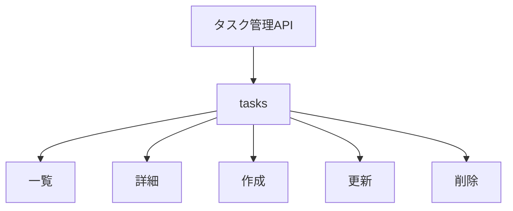
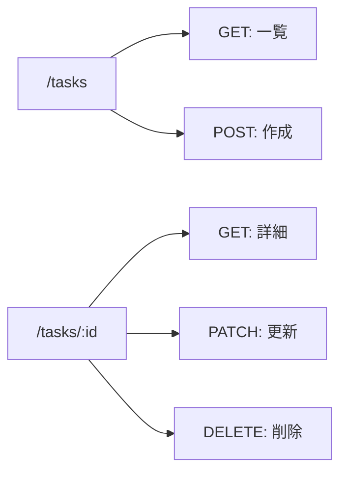
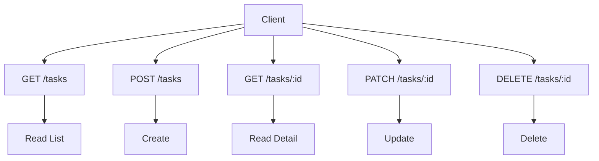

この章では、REST APIの考え方を整理し、タスク管理APIのCRUDを作ります。

CRUDは、Create、Read、Update、Deleteの頭文字です。API開発では、データを作成し、取得し、更新し、削除する基本操作を表します。

これまでに、Routing、Request/Response、エラー処理、Zodバリデーションを学びました。この章では、それらを組み合わせて、タスクAPIをひと通り使える形にします。

## RESTという考え方

RESTは、Web上のリソースをURLで表し、HTTPメソッドで操作する設計の考え方です。

本書では、RESTを厳密な論文上の定義として深掘りするのではなく、実務でAPIを設計するときの基本方針として扱います。

| 考え方 | 例 |
|---|---|
| リソースをURLで表す | `/tasks`, `/tasks/:id` |
| 操作をHTTPメソッドで表す | `GET`, `POST`, `PATCH`, `DELETE` |
| 結果をステータスコードで表す | `200`, `201`, `204`, `404` |
| データをJSONでやり取りする | `{ "title": "..." }` |

REST APIでは、URLに動詞を入れすぎないことが多いです。

```text
GET /tasks
POST /tasks
GET /tasks/:id
PATCH /tasks/:id
DELETE /tasks/:id
```

次のようなURLは、最初は分かりやすく見えますが、HTTPメソッドとの役割が重なります。

```text
POST /createTask
POST /updateTask
POST /deleteTask
```

リソースは名詞で表し、操作はHTTPメソッドで表す。まずはこの感覚を持つと、APIの見通しがよくなります。

## リソースを見つける

API設計では、最初にリソースを見つけます。

タスク管理APIでは、中心になるリソースは`task`です。複数形の`tasks`をURLに使います。



本書の前半では、タスクだけを扱います。後半でユーザーや認証が入ると、`users`や`auth`も登場します。

## URLとHTTPメソッドを決める

タスクAPIの基本ルートは、次のようにします。

| メソッド | パス | 役割 |
|---|---|---|
| `GET` | `/tasks` | タスク一覧を取得する |
| `POST` | `/tasks` | タスクを作成する |
| `GET` | `/tasks/:id` | タスク詳細を取得する |
| `PATCH` | `/tasks/:id` | タスクを更新する |
| `DELETE` | `/tasks/:id` | タスクを削除する |

同じ`/tasks`でも、メソッドによって意味が変わります。



この対応が自然に読めるようになると、API設計がかなり楽になります。

## 安全性と冪等性

HTTPメソッドには、安全性と冪等性という考え方があります。

| 用語 | 意味 |
|---|---|
| 安全 | リクエストしてもサーバーの状態を変えない |
| 冪等 | 同じリクエストを何度実行しても結果が同じ |

代表的なメソッドを整理します。

| メソッド | 安全 | 冪等 | 説明 |
|---|---:|---:|---|
| `GET` | はい | はい | 取得するだけ |
| `POST` | いいえ | いいえ | 新規作成など |
| `PUT` | いいえ | はい | 全体を置き換える |
| `PATCH` | いいえ | 設計次第 | 一部更新 |
| `DELETE` | いいえ | はい | 削除する |

この考え方は、キャッシュ、リトライ、クライアント実装に影響します。最初はすべてを厳密に覚える必要はありませんが、`GET`でデータを変更しない、という原則は必ず守ります。

## POST、PUT、PATCHの違い

更新APIでは、`PUT`と`PATCH`で迷いやすいです。

| メソッド | 使い方 |
|---|---|
| `POST` | 新しいリソースを作る |
| `PUT` | リソース全体を置き換える |
| `PATCH` | リソースの一部を更新する |

タスクのタイトルだけを変える場合は、`PATCH`が自然です。

```http
PATCH /tasks/task-1
Content-Type: application/json

{
  "title": "Honoを復習する"
}
```

本書では、タスク更新に`PATCH`を使います。

## ステータスコードを選ぶ

CRUDでよく使うステータスコードを整理します。

| 操作 | 成功時 | 失敗時の例 |
|---|---|---|
| 一覧取得 | `200 OK` | `500` |
| 詳細取得 | `200 OK` | `404` |
| 作成 | `201 Created` | `422` |
| 更新 | `200 OK` | `404`, `422` |
| 削除 | `204 No Content` | `404` |

削除成功時は、本文を返さない`204`にします。

```ts
return c.body(null, 204);
```

学習中はJSONを返したほうが見やすい場面もありますが、ここではREST APIとして自然な形に寄せます。

## JSONの命名規則と日時

JSONのキー名は、プロジェクト内でそろえます。

本書では、JSONのキー名にcamelCaseを使います。

```json
{
  "id": "task-1",
  "title": "Honoを学ぶ",
  "completed": false,
  "createdAt": "2026-07-16T10:00:00.000Z",
  "updatedAt": "2026-07-16T10:00:00.000Z"
}
```

日時は、ISO 8601形式の文字列として返します。

```ts
new Date().toISOString();
```

日時を数値のタイムスタンプで返す設計もあります。どちらが正解というより、API全体で一貫していることが大切です。本書では、読みやすさと扱いやすさからISO文字列を使います。

## タスクモデルを定義する

まず、タスクの型を定義します。

```ts:src/index.ts
type Task = {
  id: string;
  title: string;
  completed: boolean;
  createdAt: string;
  updatedAt: string;
};
```

作成用と更新用のスキーマも用意します。

```ts:src/index.ts
const createTaskSchema = z.object({
  title: z.string().trim().min(1, 'Title is required'),
});

const updateTaskSchema = z
  .object({
    title: z.string().trim().min(1).optional(),
    completed: z.boolean().optional(),
  })
  .refine((value) => value.title !== undefined || value.completed !== undefined, {
    message: 'At least one field is required',
  });

const taskParamSchema = z.object({
  id: z.string().min(1),
});
```

この章では、まだインメモリ配列に保存します。

```ts:src/index.ts
const tasks: Task[] = [];
```

第15章でD1に置き換えます。

## タスク一覧を取得する

`GET /tasks`では、タスク一覧を返します。

```ts:src/index.ts
app.get('/tasks', (c) => {
  return c.json({ tasks });
});
```

レスポンス例です。

```json
{
  "tasks": [
    {
      "id": "task-1",
      "title": "Honoを学ぶ",
      "completed": false,
      "createdAt": "2026-07-16T10:00:00.000Z",
      "updatedAt": "2026-07-16T10:00:00.000Z"
    }
  ]
}
```

検索、並び替え、ページネーションは第16章で扱います。この章では、まずCRUDの形を完成させます。

## タスク詳細を取得する

`GET /tasks/:id`では、IDに一致するタスクを返します。

```ts:src/index.ts
app.get(
  '/tasks/:id',
  zValidator('param', taskParamSchema, validationHook),
  (c) => {
    const { id } = c.req.valid('param');
    const task = tasks.find((task) => task.id === id);

    if (!task) {
      throw new AppError(404, 'TASK_NOT_FOUND', 'Task not found');
    }

    return c.json({ task });
  },
);
```

存在しない場合は、`404`を返します。

```json
{
  "error": {
    "code": "TASK_NOT_FOUND",
    "message": "Task not found"
  }
}
```

リソースが存在しないことは、想定内エラーです。`500`ではなく`404`で返します。

## タスクを作成する

`POST /tasks`では、タスクを作成します。

```ts:src/index.ts
app.post(
  '/tasks',
  zValidator('json', createTaskSchema, validationHook),
  (c) => {
    const body = c.req.valid('json');
    const now = new Date().toISOString();

    const task: Task = {
      id: `task-${crypto.randomUUID()}`,
      title: body.title,
      completed: false,
      createdAt: now,
      updatedAt: now,
    };

    tasks.push(task);

    return c.json({ task }, 201);
  },
);
```

`id`には`crypto.randomUUID()`を使っています。学習用の例なので、IDの形式には深く入りません。D1に保存する章でも、同じようにアプリケーション側でIDを作ります。

動作確認です。

```sh
curl -X POST http://localhost:8787/tasks \
  -H "Content-Type: application/json" \
  -d "{\"title\":\"CRUDを作る\"}"
```

## タスクを更新する

`PATCH /tasks/:id`では、タスクの一部を更新します。

```ts:src/index.ts
app.patch(
  '/tasks/:id',
  zValidator('param', taskParamSchema, validationHook),
  zValidator('json', updateTaskSchema, validationHook),
  (c) => {
    const { id } = c.req.valid('param');
    const body = c.req.valid('json');
    const task = tasks.find((task) => task.id === id);

    if (!task) {
      throw new AppError(404, 'TASK_NOT_FOUND', 'Task not found');
    }

    if (body.title !== undefined) {
      task.title = body.title;
    }

    if (body.completed !== undefined) {
      task.completed = body.completed;
    }

    task.updatedAt = new Date().toISOString();

    return c.json({ task });
  },
);
```

動作確認です。

```sh
curl -X PATCH http://localhost:8787/tasks/task-id \
  -H "Content-Type: application/json" \
  -d "{\"completed\":true}"
```

`title`だけ、`completed`だけ、両方の更新を許可します。ただし、空のJSONはZodスキーマで弾きます。

## タスクを削除する

`DELETE /tasks/:id`では、タスクを削除します。

```ts:src/index.ts
app.delete(
  '/tasks/:id',
  zValidator('param', taskParamSchema, validationHook),
  (c) => {
    const { id } = c.req.valid('param');
    const index = tasks.findIndex((task) => task.id === id);

    if (index === -1) {
      throw new AppError(404, 'TASK_NOT_FOUND', 'Task not found');
    }

    tasks.splice(index, 1);

    return c.body(null, 204);
  },
);
```

削除に成功した場合は、`204 No Content`を返します。`204`ではレスポンスボディを返しません。

```sh
curl -X DELETE http://localhost:8787/tasks/task-id
```

## CRUD全体の流れ

ここまでで、タスクのCRUDがそろいました。



この形は、タスク以外のリソースにも応用できます。ユーザー、記事、コメント、商品などでも、基本は同じです。

## インメモリデータの限界

この章では、タスクを配列に保存しています。

```ts
const tasks: Task[] = [];
```

これは学習用には分かりやすいですが、実務では限界があります。

| 問題 | 理由 |
|---|---|
| 再起動すると消える | メモリ上のデータだから |
| 複数インスタンスで共有できない | 実行環境ごとにメモリが違う |
| 検索や集計が弱い | DBの機能を使えない |
| データ整合性を保ちにくい | 制約やトランザクションがない |

Cloudflare Workersのような環境では、インメモリ保存を永続データとして期待してはいけません。

第15章で、保存先をCloudflare D1へ移します。

## API仕様を文章で説明する

コードだけでなく、API仕様を文章で説明できることも大切です。

たとえば、タスク作成APIは次のように説明できます。

| 項目 | 内容 |
|---|---|
| メソッド | `POST` |
| パス | `/tasks` |
| 説明 | タスクを作成する |
| リクエスト | `{ "title": string }` |
| 成功レスポンス | `201 Created` |
| エラー | `422 VALIDATION_ERROR` |

こうした説明は、後のOpenAPI章につながります。APIはコードで動くだけでなく、使う人が理解できる形で説明されている必要があります。

## まとめ

この章では、REST APIとしてタスクCRUDを設計し、実装しました。

- REST APIでは、リソースをURLで表し、操作をHTTPメソッドで表します。
- タスクAPIでは、`/tasks`と`/tasks/:id`を中心に設計しました。
- 作成は`POST`、取得は`GET`、更新は`PATCH`、削除は`DELETE`を使います。
- 成功時だけでなく、`404`や`422`などのエラーも設計します。
- 日時はISO文字列として返す方針にしました。
- Zodで入力を検証し、Handlerでは検証済みの値を扱います。
- インメモリ配列は学習用であり、永続化には向きません。

次章では、ルートを分割します。ここまで`src/index.ts`に書いてきたコードを、機能ごとに分けながら、Honoの型推論を壊さない構成を学びます。
