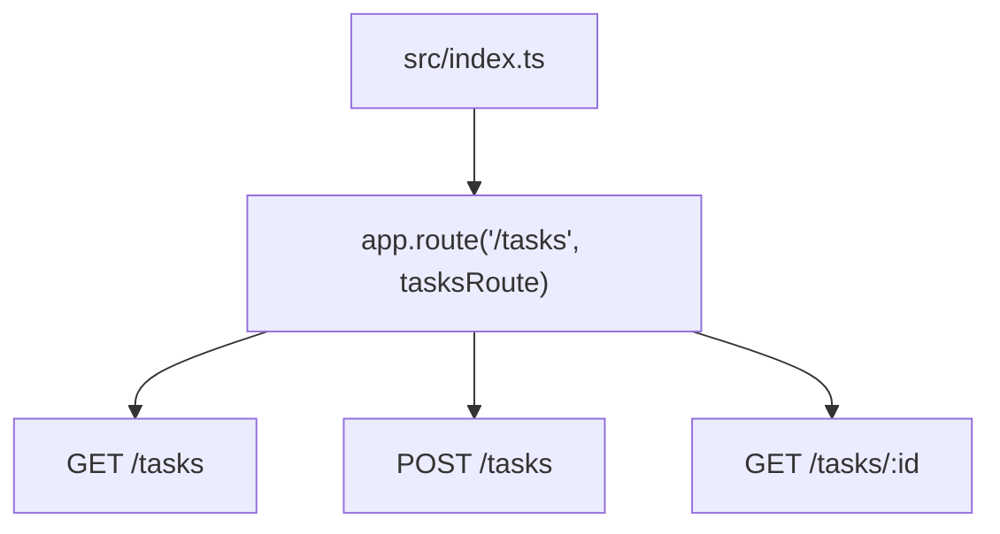
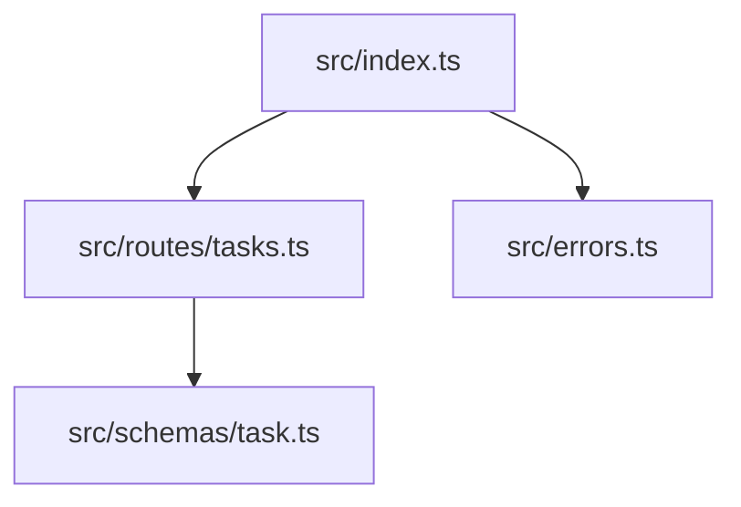

前章までで、タスク管理APIのCRUDを作りました。

ただし、すべてを`src/index.ts`に書き続けると、すぐに見通しが悪くなります。

最初は小さなAPIでも、次のようなものが増えていきます。

- タスクのルート
- ユーザーのルート
- 認証のルート
- バリデーションスキーマ
- エラー処理
- データベース処理

この章では、Honoアプリケーションを複数のファイルに分けます。ただし、単にファイルを分けるだけではありません。Honoはルート定義から型を推論できるため、その推論を保ったまま分割します。

この章のゴールは、次の形です。

```txt
src/
  index.ts
  routes/
    tasks.ts
  schemas/
    task.ts
```

この章は、ファイル整理の話に見えます。
しかし本当に大事なのは、「Honoが持っているルートの型情報を、分割しても失わないこと」です。
見た目のきれいさだけで分けると、あとでHono RPCや`testClient()`を使うときに補完が弱くなることがあります。

## 1ファイルに書き続ける問題

まず、分割前のイメージを見てみましょう。

```ts
import { Hono } from 'hono'
import { zValidator } from '@hono/zod-validator'
import { z } from 'zod'

const app = new Hono()

const createTaskSchema = z.object({
  title: z.string().min(1),
})

app.get('/tasks', (c) => {
  return c.json({ tasks: [] })
})

app.post('/tasks', zValidator('json', createTaskSchema), async (c) => {
  const body = c.req.valid('json')

  return c.json(
    {
      id: crypto.randomUUID(),
      title: body.title,
      completed: false,
    },
    201,
  )
})

app.get('/tasks/:id', (c) => {
  return c.json({ id: c.req.param('id') })
})

export default app
```

この時点では、まだ読めます。

しかし、ルートが10個、20個と増えていくと、次の問題が出てきます。

| 問題 | 起きること |
| --- | --- |
| ファイルが長くなる | 目的のルートを探しにくい |
| 関心が混ざる | タスク、ユーザー、認証が同じ場所に並ぶ |
| スキーマが散らかる | 再利用しにくくなる |
| 型推論を壊しやすい | 分割方法によってはHono RPCで困る |

Honoの分割では、ファイルを分けること自体よりも、ルート定義をどう残すかが重要です。

## Honoのルートは「型情報」でもある

Honoでは、ルートを定義した結果そのものが型情報になります。

少し抽象的なので、図にします。


たとえば、次のようにルートを定義したとします。

```ts
const app = new Hono()
  .get('/tasks', (c) => c.json({ tasks: [] }))
  .post('/tasks', (c) => c.json({ ok: true }))

export type AppType = typeof app
```

`typeof app` には、`GET /tasks` と `POST /tasks` が定義されていることが含まれます。

つまり、Honoではルート定義がそのままAPIの型になります。

これは、Honoの大きな魅力です。
一方で、分割の仕方を間違えると、この型情報を失いやすくなります。

## 機能単位でルートを分ける

まずは、タスク関連のルートを `src/routes/tasks.ts` に切り出します。

```txt
src/
  index.ts
  routes/
    tasks.ts
```

`tasks.ts` には、タスクに関するルートだけを書きます。

ここでは、`tasksRoute`をひとつの小さなHonoアプリとして作ります。
親アプリから見ると「タスク機能をまとめた部品」です。
そのため、ファイルの中ではタスク機能の相対パスだけを扱います。

```ts
// src/routes/tasks.ts
import { Hono } from 'hono'

export const tasksRoute = new Hono()
  .get('/', (c) => {
    return c.json({
      tasks: [],
    })
  })
  .post('/', async (c) => {
    return c.json(
      {
        id: crypto.randomUUID(),
        title: 'Learn Hono',
        completed: false,
      },
      201,
    )
  })
  .get('/:id', (c) => {
    const id = c.req.param('id')

    return c.json({
      id,
      title: 'Learn Hono',
      completed: false,
    })
  })
```

ここで注目してほしいのは、パスが `/tasks` ではなく `/` や `/:id` になっていることです。

`tasksRoute` は、タスク機能の中だけを担当します。
`/tasks` という親のパスは、あとで `index.ts` 側で付けます。

この分け方に慣れるまでは、少し不思議に見えるかもしれません。
ただ、サブルーター側を相対パスにしておくと、`/tasks`を`/api/tasks`へ移したくなったときも親側だけを変えれば済みます。
機能の中身と、アプリ全体の配置を分けて考えられるわけです。

## app.route()でサブルーターを接続する

`src/index.ts` では、`app.route()` を使ってサブルーターを接続します。

```ts
// src/index.ts
import { Hono } from 'hono'
import { tasksRoute } from './routes/tasks'

const app = new Hono()

app.route('/tasks', tasksRoute)

export default app
```

これで、実際のパスは次のようになります。

| `tasksRoute` 側 | `app.route()` 側 | 実際のパス |
| --- | --- | --- |
| `GET /` | `/tasks` | `GET /tasks` |
| `POST /` | `/tasks` | `POST /tasks` |
| `GET /:id` | `/tasks` | `GET /tasks/:id` |

図にすると、こうです。



このように、親のルートがサブルーターにプレフィックスとして付与されます。

## パスの重複に注意する

よくある失敗は、サブルーター側にも `/tasks` を書いてしまうことです。

```ts
// 悪い例
export const tasksRoute = new Hono()
  .get('/tasks', (c) => c.json({ tasks: [] }))

// index.ts
app.route('/tasks', tasksRoute)
```

この場合、実際のパスは `/tasks/tasks` になります。

```txt
GET /tasks/tasks
```

これは意図していないはずです。

サブルーター側には、親から見た相対パスを書きます。

```ts
// 良い例
export const tasksRoute = new Hono()
  .get('/', (c) => c.json({ tasks: [] }))

// index.ts
app.route('/tasks', tasksRoute)
```

実際のパスは `/tasks` になります。

## basePath()を使う方法

Honoには `basePath()` もあります。

```ts
const api = new Hono().basePath('/api')

api.get('/health', (c) => {
  return c.json({ ok: true })
})
```

この場合、実際のパスは `/api/health` です。

`basePath()` は、アプリケーション全体に共通のプレフィックスを付けたいときに便利です。

たとえば、API全体を `/api` 配下に置きたい場合です。

```ts
const app = new Hono().basePath('/api')

app.route('/tasks', tasksRoute)
```

この場合、タスク一覧のパスは次のようになります。

```txt
GET /api/tasks
```

`route()` と `basePath()` の使い分けは、次のように考えるとわかりやすいです。

| メソッド | 向いている場面 |
| --- | --- |
| `route()` | 機能ごとのサブルーターを接続する |
| `basePath()` | アプリ全体やAPI全体に共通の接頭辞を付ける |

## チェーンして定義する

Honoの型推論を活かすなら、ルート定義はチェーンでつなぐのが基本です。

```ts
export const tasksRoute = new Hono()
  .get('/', (c) => {
    return c.json({ tasks: [] })
  })
  .post('/', (c) => {
    return c.json({ ok: true }, 201)
  })
  .get('/:id', (c) => {
    return c.json({ id: c.req.param('id') })
  })
```

このように書くと、`tasksRoute` の型にルート情報が積み上がります。


Honoでは、ルートを追加するたびに型情報も更新される、と考えると理解しやすいです。

## typeofでルート型を取得する

Hono RPCやHono Clientを使う場合、サーバー側のルート型をクライアント側で使います。

そのために、`typeof` で型を取り出します。

```ts
// src/index.ts
import { Hono } from 'hono'
import { tasksRoute } from './routes/tasks'

const app = new Hono()
  .route('/tasks', tasksRoute)

export type AppType = typeof app

export default app
```

ポイントは、`app` をチェーンした結果として定義していることです。

```ts
const app = new Hono()
  .route('/tasks', tasksRoute)
```

次のように書いても動きます。

```ts
const app = new Hono()

app.route('/tasks', tasksRoute)
```

ただし、Honoの型推論を最大限活かすなら、チェーンした結果を `const app` に入れる書き方がわかりやすいです。

## 型推論が失われやすい分割

次のように、アプリケーションを作ってから別の関数でルートを登録する書き方は注意が必要です。

```ts
import { Hono } from 'hono'

function registerTasks(app: Hono) {
  app.get('/tasks', (c) => {
    return c.json({ tasks: [] })
  })
}

const app = new Hono()

registerTasks(app)

export type AppType = typeof app
```

この書き方でも、実行時にはルートが登録されます。

しかし、`registerTasks()` の中で追加されたルート情報を、`typeof app` が十分に表現できないことがあります。
特にHono RPCで型を使いたい場合は、期待した補完が出ない原因になります。

Honoで型推論を大切にするなら、次のように考えるのが安全です。

```txt
ルートを登録する関数を作るより、
ルート定義そのものをexportする。
```

つまり、こうです。

```ts
// 良い分割
export const tasksRoute = new Hono()
  .get('/', (c) => c.json({ tasks: [] }))
  .post('/', (c) => c.json({ ok: true }))
```

そして、親アプリで接続します。

```ts
const app = new Hono()
  .route('/tasks', tasksRoute)
```

## Handlerを別ファイルへ移すときの注意

コードが増えると、Handlerを別ファイルに移したくなります。

それ自体は悪くありません。
ただし、最初からすべてを分離すると、かえって読みにくくなります。

たとえば、次のようにHandlerだけを別ファイルにできます。

```ts
// src/routes/tasks.handlers.ts
import type { Context } from 'hono'

export const listTasksHandler = (c: Context) => {
  return c.json({
    tasks: [],
  })
}
```

```ts
// src/routes/tasks.ts
import { Hono } from 'hono'
import { listTasksHandler } from './tasks.handlers'

export const tasksRoute = new Hono()
  .get('/', listTasksHandler)
```

この書き方は動きます。

ただし、`Context` を広く書きすぎると、Bindings、Variables、検証済み入力の型が薄くなります。

特に `zValidator()` と組み合わせる場合は、ルート定義の近くにHandlerを書いたほうが読みやすい場面が多いです。

```ts
export const tasksRoute = new Hono()
  .post('/', zValidator('json', createTaskSchema), async (c) => {
    const body = c.req.valid('json')

    return c.json({
      title: body.title,
    })
  })
```

`c.req.valid('json')` の型がその場でわかるためです。

## Controllerクラスを前提にしない

他のフレームワークに慣れていると、次のような構成を作りたくなるかもしれません。

```txt
controllers/
  task-controller.ts
services/
  task-service.ts
repositories/
  task-repository.ts
```

この構成が必要になることもあります。

ただ、Honoでは最初からControllerクラスを作る必要はありません。

HonoのHandlerは小さく書けます。
そのため、ルート定義の近くにHandlerを置いても、十分に読みやすいコードになります。

```ts
export const tasksRoute = new Hono()
  .get('/', async (c) => {
    const tasks = await listTasks()
    return c.json({ tasks })
  })
```

複雑な処理は、Handlerの外へ関数として切り出します。

```ts
async function listTasks() {
  return []
}
```

最初から大きな階層を作るより、必要になったら分ける。
Honoでは、このくらいの軽さがよく合います。

## createFactory()とcreateHandlers()

Honoには、HandlerやMiddlewareを作るためのFactoryもあります。

```ts
import { createFactory } from 'hono/factory'

const factory = createFactory()

const handlers = factory.createHandlers((c) => {
  return c.json({ message: 'Hello' })
})
```

`createFactory()` を使うと、型付きのHandlerやMiddlewareを作りやすくなります。

ただし、本書ではいきなりFactoryを中心にしません。
まずは、ルート定義を素直に書くほうが理解しやすいからです。

Factoryは、次のような場面で検討するとよいです。

- 共通の型を持つHandlerをたくさん作る
- MiddlewareやHandlerの型を安定させたい
- ルート定義から少し離れた場所でHandlerを作りたい

今は「こういう道具もある」と知っておけば十分です。

## 小規模アプリケーションのディレクトリ構成

本書のタスク管理APIでは、まず次の構成を採用します。

```txt
src/
  index.ts
  routes/
    tasks.ts
  schemas/
    task.ts
  errors.ts
```

それぞれの役割は次のとおりです。

| ファイル | 役割 |
| --- | --- |
| `src/index.ts` | Honoアプリ本体を作り、ルートを接続する |
| `src/routes/tasks.ts` | タスク関連のルートを定義する |
| `src/schemas/task.ts` | タスク関連のZodスキーマを定義する |
| `src/errors.ts` | 共通のエラー型やエラーハンドリングを置く |

ルート分割後の全体像は、次のようになります。



## タスクルートを整理する

前章のCRUDを、分割後の形に近づけてみます。

ここからのコードは少し長くなります。
読むときは、まずファイルごとの役割だけを追ってください。
`schemas/task.ts`は入力の形、`routes/tasks.ts`はルート定義、`index.ts`は接続だけを担当しています。

```ts
// src/schemas/task.ts
import { z } from 'zod'

export const createTaskSchema = z.object({
  title: z.string().min(1).max(100),
})

export const updateTaskSchema = z.object({
  title: z.string().min(1).max(100).optional(),
  completed: z.boolean().optional(),
}).refine((value) => Object.keys(value).length > 0, {
  message: '更新する項目を指定してください',
})
```

```ts
// src/routes/tasks.ts
import { Hono } from 'hono'
import { zValidator } from '@hono/zod-validator'
import { createTaskSchema, updateTaskSchema } from '../schemas/task'

type Task = {
  id: string
  title: string
  completed: boolean
}

const tasks = new Map<string, Task>()

export const tasksRoute = new Hono()
  .get('/', (c) => {
    return c.json({
      tasks: [...tasks.values()],
    })
  })
  .post('/', zValidator('json', createTaskSchema), async (c) => {
    const body = c.req.valid('json')

    const task: Task = {
      id: crypto.randomUUID(),
      title: body.title,
      completed: false,
    }

    tasks.set(task.id, task)

    return c.json({ task }, 201)
  })
  .get('/:id', (c) => {
    const id = c.req.param('id')
    const task = tasks.get(id)

    if (!task) {
      return c.json({ message: 'Task not found' }, 404)
    }

    return c.json({ task })
  })
  .patch('/:id', zValidator('json', updateTaskSchema), async (c) => {
    const id = c.req.param('id')
    const body = c.req.valid('json')
    const task = tasks.get(id)

    if (!task) {
      return c.json({ message: 'Task not found' }, 404)
    }

    const updatedTask = {
      ...task,
      ...body,
    }

    tasks.set(id, updatedTask)

    return c.json({ task: updatedTask })
  })
  .delete('/:id', (c) => {
    const id = c.req.param('id')
    const deleted = tasks.delete(id)

    if (!deleted) {
      return c.json({ message: 'Task not found' }, 404)
    }

    return c.body(null, 204)
  })
```

```ts
// src/index.ts
import { Hono } from 'hono'
import { tasksRoute } from './routes/tasks'

const app = new Hono()
  .route('/tasks', tasksRoute)

export type AppType = typeof app

export default app
```

これで、`src/index.ts` はかなり薄くなりました。

`index.ts` はアプリ全体の入口。
`routes/tasks.ts` はタスク機能の入口。
`schemas/task.ts` は入力の約束。

この分け方なら、ファイルが増えても読み手が迷いにくくなります。
また、`tasksRoute`を`export const`として定義しているため、親アプリはそれをそのまま`route()`で接続できます。
ルート登録を関数の中に隠しすぎないことで、Honoの型推論も保ちやすくなります。

## まとめ

この章では、Honoのルート分割を学びました。

- `app.route()` でサブルーターを接続できる
- サブルーター側には、親から見た相対パスを書く
- `basePath()` は、アプリ全体の共通プレフィックスに向いている
- Honoでは、ルート定義そのものが型情報になる
- 型推論を活かすなら、ルート定義をチェーンで書く
- ルート登録関数より、サブルーターを `export` するほうが扱いやすい
- Handlerは最初から分けすぎず、ルート定義の近くに置くと読みやすい

次章では、さらに一歩進めます。

ルートの中に残っている処理を、Handler、Service、Repositoryに分けていきます。
ただし、分ければよいわけではありません。

どこまで分けると読みやすく、どこからが分けすぎなのか。
その境界を、タスク管理APIを題材に考えていきます。
