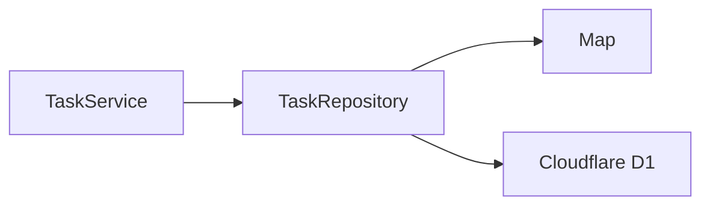
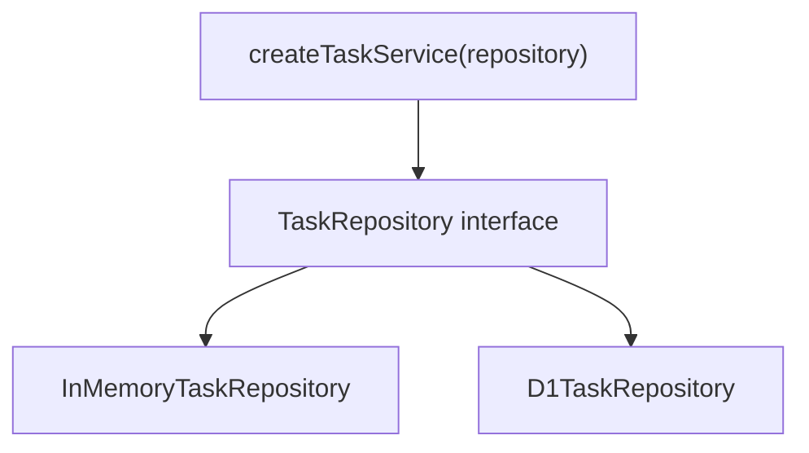
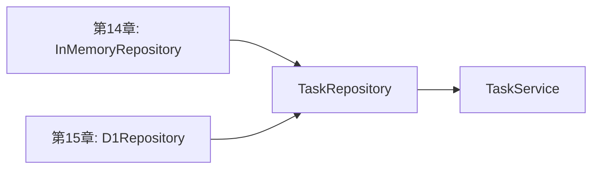

前章では、Honoアプリケーションを機能ごとに分割しました。

`src/index.ts` にすべてを書くのではなく、タスク関連のルートを `src/routes/tasks.ts` に切り出しました。

ただ、ルートの中にはまだ次の処理が混ざっています。

- リクエストを読む
- レスポンスを返す
- タスクを作る
- タスクを保存する
- タスクが存在しない場合を判断する

小さいうちは問題ありませんが、アプリケーションが大きくなると、Handlerの中が太っていきます。

この章では、処理を次の3つに分けます。

- Handler
- Service
- Repository

名前は少し堅そうですが、考え方はシンプルです。

```txt
HandlerはHTTPの入口。
Serviceはアプリケーションの仕事。
Repositoryはデータの置き場所。
```

この分割の目的は、ファイル数を増やすことではありません。
「変更したい理由」が違うコードを、同じ場所に置きすぎないことです。
HTTPの返し方を変えたいとき、業務ルールを変えたいとき、保存先を変えたいときで、触る場所が分かれている状態を目指します。

## まず全体像を見る

この章で目指す構成は、次のような流れです。


それぞれの責務を表にすると、こうなります。

| 層 | 主な責務 | Honoを知っているか |
| --- | --- | --- |
| Handler | リクエストを読み、レスポンスを返す | 知っている |
| Service | ユースケースを実行する | 知らない |
| Repository | データを保存・取得する | 知らない |

大事なのは、Honoの `Context` をアプリケーション全体に広げないことです。

`Context` は便利です。
しかし、ServiceやRepositoryまで `Context` を受け取るようにすると、Honoに強く依存したコードになります。

## Handlerの責務

Handlerは、HTTPの入口です。

Honoでは、次のような関数がHandlerです。

```ts
app.get('/tasks', (c) => {
  return c.json({ tasks: [] })
})
```

Handlerの責務は、主に次の4つです。

1. リクエストから値を取り出す
2. バリデーション済みの値をServiceへ渡す
3. Serviceの結果をレスポンスに変換する
4. HTTPステータスコードを決める

たとえば、タスク作成のHandlerは次のように書けます。

```ts
tasksRoute.post('/', zValidator('json', createTaskSchema), async (c) => {
  const body = c.req.valid('json')

  const task = await taskService.createTask({
    title: body.title,
  })

  return c.json({ task }, 201)
})
```

このHandlerは、かなり薄いです。

やっていることは、入力を取り出してServiceに渡し、結果をJSONで返すだけです。

このくらいの薄さを目指すと、Handlerは読みやすくなります。

## ビジネスロジックとは何か

「ビジネスロジック」という言葉は、少し曖昧です。

ここでは、次のように考えます。

```txt
HTTPがなくても成立する、アプリケーション固有の判断や処理。
```

たとえば、タスク管理APIでは次のようなものです。

- タスク作成時は `completed` を `false` にする
- 存在しないタスクは更新できない
- タイトルが空のタスクは作らない
- 削除済みのタスクは一覧に出さない
- 更新日時を更新する

これらは、HTTPとは直接関係ありません。

CLIアプリでも、バッチ処理でも、同じルールが必要になるかもしれません。

そのため、HandlerではなくServiceへ置くと扱いやすくなります。

## Serviceへ切り出す

まず、タスクの型を用意します。

```ts
// src/models/task.ts
export type Task = {
  id: string
  title: string
  completed: boolean
  createdAt: string
  updatedAt: string
}

export type CreateTaskInput = {
  title: string
}

export type UpdateTaskInput = {
  title?: string
  completed?: boolean
}
```

次に、Serviceを作ります。

このServiceでは、まだ保存先に`Map`を使っています。
つまり、この段階のServiceは「業務ルール」と「保存処理」が少し混ざった中間形です。
まずはHandlerから処理を外へ出し、その後でRepositoryへさらに分ける、という順番で進めます。

```ts
// src/services/task-service.ts
import type { CreateTaskInput, Task, UpdateTaskInput } from '../models/task'

export function createTaskService() {
  const tasks = new Map<string, Task>()

  return {
    listTasks() {
      return [...tasks.values()]
    },

    getTask(id: string) {
      return tasks.get(id) ?? null
    },

    createTask(input: CreateTaskInput) {
      const now = new Date().toISOString()

      const task: Task = {
        id: crypto.randomUUID(),
        title: input.title,
        completed: false,
        createdAt: now,
        updatedAt: now,
      }

      tasks.set(task.id, task)

      return task
    },

    updateTask(id: string, input: UpdateTaskInput) {
      const task = tasks.get(id)

      if (!task) {
        return null
      }

      const updatedTask: Task = {
        ...task,
        ...input,
        updatedAt: new Date().toISOString(),
      }

      tasks.set(id, updatedTask)

      return updatedTask
    },

    deleteTask(id: string) {
      return tasks.delete(id)
    },
  }
}
```

Handler側は、このServiceを呼び出します。

Handlerから見ると、`taskService.createTask()`を呼べばタスクが作られます。
タスクIDをどう作るか、更新日時をどう入れるか、内部で`Map`を使うかは、Handlerの関心ではありません。
この小さな切り分けだけでも、Handlerの見通しはかなりよくなります。

```ts
// src/routes/tasks.ts
import { Hono } from 'hono'
import { zValidator } from '@hono/zod-validator'
import { createTaskSchema, updateTaskSchema } from '../schemas/task'
import { createTaskService } from '../services/task-service'

const taskService = createTaskService()

export const tasksRoute = new Hono()
  .get('/', (c) => {
    const tasks = taskService.listTasks()
    return c.json({ tasks })
  })
  .post('/', zValidator('json', createTaskSchema), async (c) => {
    const body = c.req.valid('json')
    const task = taskService.createTask({ title: body.title })

    return c.json({ task }, 201)
  })
```

この時点で、Handlerから「タスクをどう保存するか」という詳細が少し消えました。

## ContextをServiceへ渡さない

次のようなServiceは避けたほうがよいです。

```ts
// 避けたい例
import type { Context } from 'hono'

export async function createTask(c: Context) {
  const body = await c.req.json()

  return {
    id: crypto.randomUUID(),
    title: body.title,
    completed: false,
  }
}
```

これだと、ServiceがHonoの `Context` を知ってしまいます。

結果として、次のような問題が起きます。

- Service単体でテストしにくい
- HTTP以外から再利用しにくい
- 入力と出力が読み取りにくい
- Honoに依存した処理が増える

Serviceには、普通の値を渡します。

```ts
// 良い例
export function createTask(input: { title: string }) {
  return {
    id: crypto.randomUUID(),
    title: input.title,
    completed: false,
  }
}
```

HandlerはHonoを知っていてよい。
ServiceはHonoを知らない。

この境界を守ると、コードが整理されます。

## 入力と出力を明確にする

Serviceを読みやすくするには、入力と出力の型を明確にします。

```ts
export type TaskService = {
  listTasks(): Promise<Task[]>
  getTask(id: string): Promise<Task | null>
  createTask(input: CreateTaskInput): Promise<Task>
  updateTask(id: string, input: UpdateTaskInput): Promise<Task | null>
  deleteTask(id: string): Promise<boolean>
}
```

この型を見るだけで、Serviceが何をするのかがわかります。

特に重要なのは、存在しないタスクをどう表すかです。

ここでは、`null` を返すことにします。

```ts
const task = await taskService.getTask(id)

if (!task) {
  return c.json({ message: 'Task not found' }, 404)
}
```

`null` を返す方針は、単純で読みやすいです。

一方で、エラーの種類が増えてきたら、独自のエラー型を使う選択肢もあります。

## 例外をどこでレスポンスに変換するか

Serviceで例外を投げる設計もあります。

```ts
export class TaskNotFoundError extends Error {
  constructor() {
    super('Task not found')
  }
}
```

Serviceでは、タスクが存在しないときに例外を投げます。

```ts
async function updateTask(id: string, input: UpdateTaskInput) {
  const task = await repository.findById(id)

  if (!task) {
    throw new TaskNotFoundError()
  }

  return repository.update(id, input)
}
```

Handler側でHTTPレスポンスへ変換します。

```ts
try {
  const task = await taskService.updateTask(id, body)
  return c.json({ task })
} catch (error) {
  if (error instanceof TaskNotFoundError) {
    return c.json({ message: 'Task not found' }, 404)
  }

  throw error
}
```

この方法も有効です。

ただし、本書のこの段階では、まず `null` や `boolean` を返す形を使います。
理由は、読みやすく、動きを追いやすいからです。

エラーが増えてきたら、第17章以降で認証・認可とあわせて整理します。

## Repositoryの役割

今のServiceには、`Map` が直接入っています。

```ts
const tasks = new Map<string, Task>()
```

これは簡単ですが、次章でD1に保存先を変えるときに困ります。

保存先が変わるたびに、Serviceを書き換えたくありません。

そこで、データの保存と取得をRepositoryへ切り出します。

Repositoryの役割は、データストアの詳細を隠すことです。



Serviceは、Repositoryの向こう側が `Map` なのかD1なのかを知りません。

## RepositoryのInterfaceを作る

TypeScriptでは、まず型を定義すると見通しがよくなります。

```ts
// src/repositories/task-repository.ts
import type { CreateTaskInput, Task, UpdateTaskInput } from '../models/task'

export type TaskRepository = {
  list(): Promise<Task[]>
  findById(id: string): Promise<Task | null>
  create(input: CreateTaskInput): Promise<Task>
  update(id: string, input: UpdateTaskInput): Promise<Task | null>
  delete(id: string): Promise<boolean>
}
```

Repositoryは、保存先の詳細を外に出しません。

外から見ると、次のように使えるだけです。

```ts
const tasks = await repository.list()
const task = await repository.findById(id)
```

ここでSQLを書くか、`Map` を使うかはRepositoryの内側の話です。

## インメモリRepositoryを作る

まずは、今までの `Map` をRepositoryに移します。

```ts
// src/repositories/in-memory-task-repository.ts
import type { CreateTaskInput, Task, UpdateTaskInput } from '../models/task'
import type { TaskRepository } from './task-repository'

export function createInMemoryTaskRepository(): TaskRepository {
  const tasks = new Map<string, Task>()

  return {
    async list() {
      return [...tasks.values()]
    },

    async findById(id) {
      return tasks.get(id) ?? null
    },

    async create(input) {
      const now = new Date().toISOString()

      const task: Task = {
        id: crypto.randomUUID(),
        title: input.title,
        completed: false,
        createdAt: now,
        updatedAt: now,
      }

      tasks.set(task.id, task)

      return task
    },

    async update(id, input) {
      const task = tasks.get(id)

      if (!task) {
        return null
      }

      const updatedTask: Task = {
        ...task,
        ...input,
        updatedAt: new Date().toISOString(),
      }

      tasks.set(id, updatedTask)

      return updatedTask
    },

    async delete(id) {
      return tasks.delete(id)
    },
  }
}
```

`Map` はRepositoryの中に閉じ込められました。

Serviceは、`Map` を直接知る必要がありません。

## ServiceはRepositoryに依存する

次に、ServiceがRepositoryを受け取るようにします。

```ts
// src/services/task-service.ts
import type { CreateTaskInput, UpdateTaskInput } from '../models/task'
import type { TaskRepository } from '../repositories/task-repository'

export function createTaskService(repository: TaskRepository) {
  return {
    listTasks() {
      return repository.list()
    },

    getTask(id: string) {
      return repository.findById(id)
    },

    createTask(input: CreateTaskInput) {
      return repository.create(input)
    },

    updateTask(id: string, input: UpdateTaskInput) {
      return repository.update(id, input)
    },

    deleteTask(id: string) {
      return repository.delete(id)
    },
  }
}
```

このServiceは、保存先を知りません。

`Map` でもD1でも、`TaskRepository` の形を満たしていれば使えます。



この形にしておくと、次章でD1に差し替えやすくなります。

## Handlerで組み立てる

最後に、Handler側でRepositoryとServiceを組み立てます。

ここからのコードでは、3つの役割が一度に登場します。
読む順番は、上から順に追うよりも、まず先頭の2行に注目すると分かりやすいです。
Repositoryを作り、それをServiceへ渡し、そのServiceを各Handlerから呼び出しています。

```ts
// src/routes/tasks.ts
import { Hono } from 'hono'
import { zValidator } from '@hono/zod-validator'
import { createInMemoryTaskRepository } from '../repositories/in-memory-task-repository'
import { createTaskService } from '../services/task-service'
import { createTaskSchema, updateTaskSchema } from '../schemas/task'

const repository = createInMemoryTaskRepository()
const taskService = createTaskService(repository)

export const tasksRoute = new Hono()
  .get('/', async (c) => {
    const tasks = await taskService.listTasks()
    return c.json({ tasks })
  })
  .post('/', zValidator('json', createTaskSchema), async (c) => {
    const body = c.req.valid('json')
    const task = await taskService.createTask({ title: body.title })

    return c.json({ task }, 201)
  })
  .get('/:id', async (c) => {
    const id = c.req.param('id')
    const task = await taskService.getTask(id)

    if (!task) {
      return c.json({ message: 'Task not found' }, 404)
    }

    return c.json({ task })
  })
  .patch('/:id', zValidator('json', updateTaskSchema), async (c) => {
    const id = c.req.param('id')
    const body = c.req.valid('json')
    const task = await taskService.updateTask(id, body)

    if (!task) {
      return c.json({ message: 'Task not found' }, 404)
    }

    return c.json({ task })
  })
  .delete('/:id', async (c) => {
    const id = c.req.param('id')
    const deleted = await taskService.deleteTask(id)

    if (!deleted) {
      return c.json({ message: 'Task not found' }, 404)
    }

    return c.body(null, 204)
  })
```

HandlerはHTTPに集中しています。

Serviceはアプリケーションの操作を表しています。

Repositoryは保存先を隠しています。

この3つが分かれると、コードの見通しがよくなります。
特に次章で保存先をD1に変えるとき、この分割の意味がはっきりします。
Handlerはほとんど同じまま、Repositoryの実装だけを差し替えられるからです。

## Domain ModelとDB Model

次章では、Cloudflare D1に保存します。

D1はSQLiteベースなので、データベースでは次のような列名を使うことが多いです。

```txt
created_at
updated_at
```

一方、TypeScriptのオブジェクトでは、次のように書くことが多いです。

```ts
createdAt
updatedAt
```

このように、アプリケーションで使うモデルと、データベースの行は少し違うことがあります。

| 種類 | 例 | 役割 |
| --- | --- | --- |
| Domain Model | `Task` | アプリケーション内で使う形 |
| DB Model | `TaskRow` | データベースの行に近い形 |

次章では、D1から取得した行を `Task` に変換します。

```ts
type TaskRow = {
  id: string
  title: string
  completed: number
  created_at: string
  updated_at: string
}

function toTask(row: TaskRow): Task {
  return {
    id: row.id,
    title: row.title,
    completed: row.completed === 1,
    createdAt: row.created_at,
    updatedAt: row.updated_at,
  }
}
```

変換をRepositoryの中に閉じ込めると、ServiceはDBの都合を知る必要がなくなります。

## トランザクションの境界

トランザクションとは、複数のデータ操作をひとまとまりとして扱う仕組みです。

たとえば、次のような処理ではトランザクションが必要になることがあります。

- 注文を作成する
- 在庫を減らす
- 支払い記録を作る

この3つのうち、途中の1つだけ成功すると困ります。

タスク管理APIでは、まだ単純なCRUDが中心です。
そのため、トランザクションを深く扱う必要はありません。

ただし、考え方としては次のように覚えておくとよいです。

```txt
複数のRepository操作をひとまとまりにしたいなら、
Serviceがトランザクションの境界を意識する。
```

Repositoryは1つの保存先への操作を担当します。
Serviceは、アプリケーションとして何を一連の処理にするかを決めます。

## 分割しすぎによる複雑化

ここまで、Handler、Service、Repositoryに分けてきました。

ただし、分ければ分けるほどよいわけではありません。

小さなAPIで、次のような構成を最初から作ると、かえって読みにくくなります。

```txt
controllers/
  task-controller.ts
use-cases/
  create-task-use-case.ts
  update-task-use-case.ts
services/
  task-service.ts
repositories/
  task-repository.ts
entities/
  task.ts
dto/
  task-dto.ts
```

構造は立派ですが、読むための移動が多すぎます。

本書では、まず次のくらいの分割から始めます。

```txt
src/
  routes/
    tasks.ts
  schemas/
    task.ts
  models/
    task.ts
  services/
    task-service.ts
  repositories/
    task-repository.ts
    in-memory-task-repository.ts
```

この構成なら、責務は分かれています。
それでも、ファイルを追う負担はまだ大きくありません。

## Repositoryを作らない判断

Repositoryは便利ですが、いつも必要とは限りません。

たとえば、次のような場合はRepositoryを作らなくてもよいことがあります。

- APIがとても小さい
- 保存先が1つだけで、差し替える予定がない
- データアクセスが単純で、抽象化すると逆に読みにくい
- 学習用のサンプルで、構造より動作を優先したい

一方で、今回の本ではRepositoryを作ります。

理由は、次章で保存先をインメモリからD1へ差し替えるからです。

Repositoryがあると、Serviceを大きく変えずに保存先を変更できます。



この差し替えやすさが、Repositoryを作る大きな理由です。

## まとめ

この章では、Handler、Service、Repositoryの責務を整理しました。

- HandlerはHTTPの入口として、リクエストとレスポンスを扱う
- Serviceは、Honoの `Context` を受け取らない
- Serviceには、普通の値を渡す
- Repositoryは保存先の詳細を隠す
- RepositoryのInterfaceを作ると、保存先を差し替えやすい
- Domain ModelとDB Modelは分けて考える
- 分割しすぎると、かえって読みにくくなる

次章では、いよいよインメモリ保存を卒業します。

Cloudflare D1を使って、タスクをデータベースへ保存します。
この章で作ったRepositoryの形が、そこで効いてきます。
