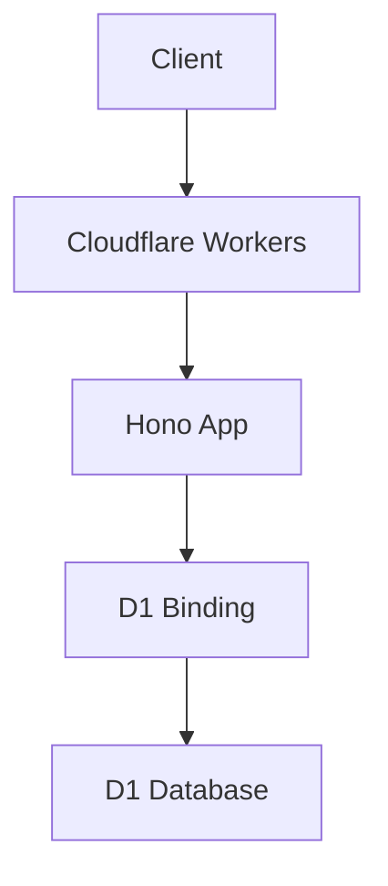
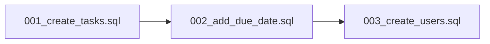
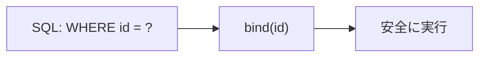
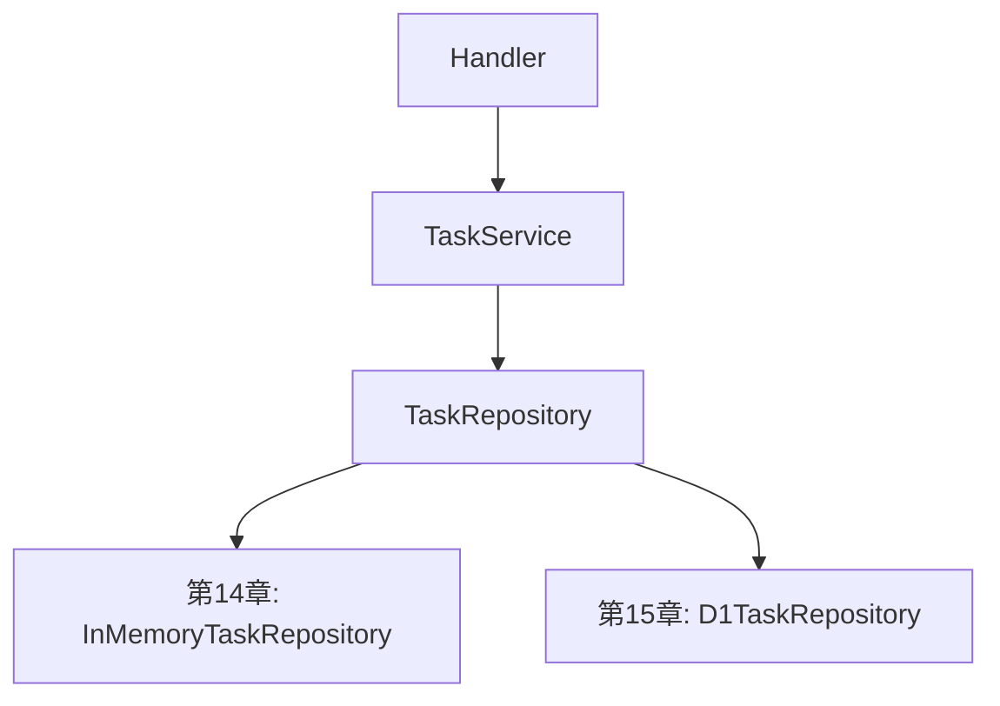

前章では、タスクの保存処理をRepositoryへ切り出しました。

この章では、保存先をインメモリの `Map` からCloudflare D1へ変更します。

ここまでのAPIは、サーバーを再起動するとデータが消えました。
それは、データをメモリ上に持っていたからです。

本格的なAPIでは、データを永続化する必要があります。

この章では、次の流れで進めます。


D1に直接依存するのはRepositoryだけです。
ServiceやHandlerの形は、できるだけ変えません。

## データベースが必要な理由

インメモリの `Map` は、学習には便利です。

```ts
const tasks = new Map<string, Task>()
```

ただし、実際のアプリケーションでは大きな問題があります。

| 問題 | 内容 |
| --- | --- |
| 再起動で消える | サーバーを再起動するとデータが失われる |
| 複数インスタンスに弱い | 別の実行環境とデータを共有できない |
| 検索しにくい | 条件検索や並び替えを自前で書く必要がある |
| 運用に向かない | バックアップや移行を管理しにくい |

データベースを使うと、データを永続化できます。

また、検索、並び替え、ページネーションなども扱いやすくなります。

## Cloudflare D1とは

Cloudflare D1は、Cloudflare Workersから使えるサーバーレスSQLデータベースです。

D1はSQLiteをベースにしています。
そのため、SQLの基本的な書き方はSQLiteに近いです。

HonoをCloudflare Workersで動かす場合、D1は自然な選択肢のひとつです。



D1を使うときは、Honoから直接URLやパスワードを持つのではありません。

Cloudflare WorkersのBindingとしてD1を受け取ります。

## D1 Bindingを設定する

D1をWorkersから使うには、`wrangler.toml` にBindingを設定します。

まず、D1データベースを作成します。

```sh
npx wrangler d1 create hono-task-api-db
```

実行すると、`database_id` が表示されます。

その値を `wrangler.toml` に設定します。

```toml
name = "hono-task-api"
main = "src/index.ts"
compatibility_date = "2026-07-16"

[[d1_databases]]
binding = "DB"
database_name = "hono-task-api-db"
database_id = "xxxxxxxx-xxxx-xxxx-xxxx-xxxxxxxxxxxx"
```

ここで大事なのは、`binding = "DB"` です。

この名前で、HonoのContextからD1にアクセスできます。

```ts
c.env.DB
```

## HonoでBindingの型を定義する

TypeScriptで `c.env.DB` を安全に使うために、Bindingsの型を定義します。

```ts
import { Hono } from 'hono'

type Env = {
  Bindings: {
    DB: D1Database
  }
}

const app = new Hono<Env>()
```

これで、Handlerの中で `c.env.DB` が `D1Database` として扱われます。

```ts
app.get('/health', (c) => {
  return c.json({
    hasDatabase: Boolean(c.env.DB),
  })
})
```

もし `D1Database` の型が見つからない場合は、Cloudflare Workersの型をプロジェクトに入れます。

```sh
npm install -D @cloudflare/workers-types
```

`tsconfig.json` で型を読み込む例です。

```json
{
  "compilerOptions": {
    "types": ["@cloudflare/workers-types"]
  }
}
```

## テーブルを設計する

タスクを保存するためのテーブルを考えます。

今回保存したい項目は、次のとおりです。

| カラム | 型 | 内容 |
| --- | --- | --- |
| `id` | `TEXT` | タスクID |
| `title` | `TEXT` | タイトル |
| `completed` | `INTEGER` | 完了状態。`0` または `1` |
| `created_at` | `TEXT` | 作成日時 |
| `updated_at` | `TEXT` | 更新日時 |

SQLiteにはBoolean専用の型がありません。
そのため、`completed` は `0` と `1` で表します。

TypeScript側では `boolean` として扱い、Repositoryで変換します。


## 主キー、NOT NULL、UNIQUE、外部キー

テーブル設計では、制約も重要です。

| 制約 | 意味 | 今回の例 |
| --- | --- | --- |
| `PRIMARY KEY` | 行を一意に識別する | `id` |
| `NOT NULL` | 値が必ず入る | `title`, `created_at` |
| `UNIQUE` | 重複を許さない | メールアドレスなど |
| `FOREIGN KEY` | 他のテーブルとの関係を表す | ユーザーIDなど |

今回はタスク単体なので、外部キーはまだ使いません。

ユーザー機能を追加する場合は、`user_id` を持たせて、ユーザーテーブルと関連付けることになります。

## マイグレーションを作成する

テーブルはSQLで作成します。

ただし、本番環境で手作業でSQLを実行するのは危険です。
そこで、マイグレーションを使います。

マイグレーションとは、データベース構造の変更履歴です。



Wranglerでマイグレーションファイルを作成します。

```sh
npx wrangler d1 migrations create hono-task-api-db create_tasks
```

作成されたSQLファイルに、次の内容を書きます。

```sql
CREATE TABLE tasks (
  id TEXT PRIMARY KEY,
  title TEXT NOT NULL,
  completed INTEGER NOT NULL DEFAULT 0,
  created_at TEXT NOT NULL,
  updated_at TEXT NOT NULL
);

CREATE INDEX idx_tasks_completed ON tasks(completed);
CREATE INDEX idx_tasks_created_at ON tasks(created_at);
```

`idx_tasks_completed` は、完了状態で絞り込むときに役立ちます。

`idx_tasks_created_at` は、新しい順に並べるときに役立ちます。

まだ検索・並び替えは本格的に扱いません。
次章で、このインデックスが効いてきます。

## ローカルD1で安全に試す

D1を学ぶときは、まずローカルでマイグレーションを適用します。

```sh
npx wrangler d1 migrations apply hono-task-api-db --local
```

このBookでは、ローカルD1で構造を作り、アプリケーションから読み書きできる状態を完成条件にします。

```txt
マイグレーションを書く
↓
ローカルD1へ適用する
↓
APIから読み書きする
↓
テストで再現できるようにする
```

データベースの構造は、アプリケーションの動作に直接影響します。だからこそ、手元で何度でも作り直せる状態にしておくことが大切です。

## Prepared Statement

D1でSQLを実行するには、`prepare()` を使います。

```ts
const row = await c.env.DB
  .prepare('SELECT * FROM tasks WHERE id = ?')
  .bind(id)
  .first()
```

このように、SQLの中では `?` を使います。
実際の値は `.bind()` で渡します。



値を文字列結合でSQLに埋め込まないことが大切です。

## SQLインジェクションを防ぐ

次のようなSQLは避けてください。

```ts
// 悪い例
const row = await db
  .prepare(`SELECT * FROM tasks WHERE id = '${id}'`)
  .first()
```

ユーザー入力をSQL文字列へ直接埋め込むと、SQLインジェクションの原因になります。

必ず `.bind()` を使います。

```ts
// 良い例
const row = await db
  .prepare('SELECT * FROM tasks WHERE id = ?')
  .bind(id)
  .first()
```

検索条件が増えても、考え方は同じです。

```ts
const result = await db
  .prepare(
    `
    SELECT *
    FROM tasks
    WHERE completed = ?
    ORDER BY created_at DESC
    LIMIT ?
    OFFSET ?
    `,
  )
  .bind(completed ? 1 : 0, limit, offset)
  .all()
```

SQLの構造はコード側で固定し、値だけを `.bind()` で渡します。

## D1の結果を型安全に扱う

D1から返る行は、データベースの形をしています。

```ts
type TaskRow = {
  id: string
  title: string
  completed: number
  created_at: string
  updated_at: string
}
```

一方、アプリケーション内では次の `Task` 型を使います。

```ts
type Task = {
  id: string
  title: string
  completed: boolean
  createdAt: string
  updatedAt: string
}
```

この2つを変換する関数を作ります。

```ts
function toTask(row: TaskRow): Task {
  return {
    id: row.id,
    title: row.title,
    completed: row.completed === 1,
    createdAt: row.created_at,
    updatedAt: row.updated_at,
  }
}
```

この変換はRepositoryの中に置きます。

Serviceは `TaskRow` を知る必要がありません。
Serviceは常に `Task` を扱います。

## D1TaskRepositoryを作る

前章で作ったRepositoryのInterfaceを思い出しましょう。

```ts
export type TaskRepository = {
  list(): Promise<Task[]>
  findById(id: string): Promise<Task | null>
  create(input: CreateTaskInput): Promise<Task>
  update(id: string, input: UpdateTaskInput): Promise<Task | null>
  delete(id: string): Promise<boolean>
}
```

この形に合わせて、D1実装を作ります。

```ts
// src/repositories/d1-task-repository.ts
import type { CreateTaskInput, Task, UpdateTaskInput } from '../models/task'
import type { TaskRepository } from './task-repository'

type TaskRow = {
  id: string
  title: string
  completed: number
  created_at: string
  updated_at: string
}

function toTask(row: TaskRow): Task {
  return {
    id: row.id,
    title: row.title,
    completed: row.completed === 1,
    createdAt: row.created_at,
    updatedAt: row.updated_at,
  }
}

export function createD1TaskRepository(db: D1Database): TaskRepository {
  const findById = async (id: string) => {
    const row = await db
      .prepare(
        `
        SELECT id, title, completed, created_at, updated_at
        FROM tasks
        WHERE id = ?
        `,
      )
      .bind(id)
      .first<TaskRow>()

    return row ? toTask(row) : null
  }

  return {
    async list() {
      const result = await db
        .prepare(
          `
          SELECT id, title, completed, created_at, updated_at
          FROM tasks
          ORDER BY created_at DESC
          `,
        )
        .all<TaskRow>()

      return result.results.map(toTask)
    },

    findById,

    async create(input) {
      const now = new Date().toISOString()

      const task: Task = {
        id: crypto.randomUUID(),
        title: input.title,
        completed: false,
        createdAt: now,
        updatedAt: now,
      }

      await db
        .prepare(
          `
          INSERT INTO tasks (id, title, completed, created_at, updated_at)
          VALUES (?, ?, ?, ?, ?)
          `,
        )
        .bind(
          task.id,
          task.title,
          task.completed ? 1 : 0,
          task.createdAt,
          task.updatedAt,
        )
        .run()

      return task
    },

    async update(id, input) {
      const current = await findById(id)

      if (!current) {
        return null
      }

      const updatedTask: Task = {
        ...current,
        ...input,
        updatedAt: new Date().toISOString(),
      }

      await db
        .prepare(
          `
          UPDATE tasks
          SET title = ?, completed = ?, updated_at = ?
          WHERE id = ?
          `,
        )
        .bind(
          updatedTask.title,
          updatedTask.completed ? 1 : 0,
          updatedTask.updatedAt,
          id,
        )
        .run()

      return updatedTask
    },

    async delete(id) {
      const result = await db
        .prepare('DELETE FROM tasks WHERE id = ?')
        .bind(id)
        .run()

      return result.meta.changes > 0
    },
  }
}
```

これで、D1を使うRepositoryができました。

ただし、ひとつ注意があります。

上の `update()` では、まず `findById()` で現在のタスクを取得し、そのあと `UPDATE` しています。
単純で読みやすい一方で、更新処理が2回のSQLになります。

この章では読みやすさを優先します。
より厳密な並行更新やトランザクションは、実務の要件に応じて考えます。

## HandlerでD1 Repositoryを使う

D1は `c.env.DB` から取れます。

そのため、Handlerの中でRepositoryを作り、Serviceへ渡します。

```ts
// src/routes/tasks.ts
import { Hono } from 'hono'
import { zValidator } from '@hono/zod-validator'
import { createD1TaskRepository } from '../repositories/d1-task-repository'
import { createTaskService } from '../services/task-service'
import { createTaskSchema, updateTaskSchema } from '../schemas/task'

type Env = {
  Bindings: {
    DB: D1Database
  }
}

export const tasksRoute = new Hono<Env>()
  .get('/', async (c) => {
    const repository = createD1TaskRepository(c.env.DB)
    const taskService = createTaskService(repository)

    const tasks = await taskService.listTasks()

    return c.json({ tasks })
  })
  .post('/', zValidator('json', createTaskSchema), async (c) => {
    const repository = createD1TaskRepository(c.env.DB)
    const taskService = createTaskService(repository)

    const body = c.req.valid('json')
    const task = await taskService.createTask({ title: body.title })

    return c.json({ task }, 201)
  })
```

これでD1に接続できます。

ただ、毎回RepositoryとServiceを作るのが少し重たく見えます。

小さなアプリなら問題ありません。
気になる場合は、Helper関数にまとめます。

```ts
function createServices(db: D1Database) {
  const taskRepository = createD1TaskRepository(db)
  const taskService = createTaskService(taskRepository)

  return {
    taskService,
  }
}
```

Handlerでは、こう使えます。

```ts
export const tasksRoute = new Hono<Env>()
  .get('/', async (c) => {
    const { taskService } = createServices(c.env.DB)
    const tasks = await taskService.listTasks()

    return c.json({ tasks })
  })
```

## タスクCRUDをD1へ接続する

CRUD全体をD1 Repositoryへ接続した例です。

```ts
// src/routes/tasks.ts
import { Hono } from 'hono'
import { zValidator } from '@hono/zod-validator'
import { createD1TaskRepository } from '../repositories/d1-task-repository'
import { createTaskService } from '../services/task-service'
import { createTaskSchema, updateTaskSchema } from '../schemas/task'

type Env = {
  Bindings: {
    DB: D1Database
  }
}

function createServices(db: D1Database) {
  const taskRepository = createD1TaskRepository(db)
  const taskService = createTaskService(taskRepository)

  return {
    taskService,
  }
}

export const tasksRoute = new Hono<Env>()
  .get('/', async (c) => {
    const { taskService } = createServices(c.env.DB)
    const tasks = await taskService.listTasks()

    return c.json({ tasks })
  })
  .post('/', zValidator('json', createTaskSchema), async (c) => {
    const { taskService } = createServices(c.env.DB)
    const body = c.req.valid('json')

    const task = await taskService.createTask({
      title: body.title,
    })

    return c.json({ task }, 201)
  })
  .get('/:id', async (c) => {
    const { taskService } = createServices(c.env.DB)
    const id = c.req.param('id')
    const task = await taskService.getTask(id)

    if (!task) {
      return c.json({ message: 'Task not found' }, 404)
    }

    return c.json({ task })
  })
  .patch('/:id', zValidator('json', updateTaskSchema), async (c) => {
    const { taskService } = createServices(c.env.DB)
    const id = c.req.param('id')
    const body = c.req.valid('json')

    const task = await taskService.updateTask(id, body)

    if (!task) {
      return c.json({ message: 'Task not found' }, 404)
    }

    return c.json({ task })
  })
  .delete('/:id', async (c) => {
    const { taskService } = createServices(c.env.DB)
    const id = c.req.param('id')

    const deleted = await taskService.deleteTask(id)

    if (!deleted) {
      return c.json({ message: 'Task not found' }, 404)
    }

    return c.body(null, 204)
  })
```

Handlerの形は、インメモリのときとほとんど同じです。

変わったのは、Repositoryの実装です。



この差し替えが、前章でRepositoryを作った理由です。

## ローカルで動かす

マイグレーションをローカルへ適用したら、Wranglerで開発サーバーを起動します。

```sh
npx wrangler dev
```

別のターミナルからAPIを呼び出します。

```sh
curl -X POST http://localhost:8787/tasks \
  -H "Content-Type: application/json" \
  -d '{"title":"Learn Hono with D1"}'
```

一覧を取得します。

```sh
curl http://localhost:8787/tasks
```

データが返ってくれば、D1への保存ができています。

サーバーを再起動してもデータが残っていることを確認してみましょう。

## D1を使うときの注意点

D1は便利ですが、使うときにはいくつか注意があります。

| 注意点 | 内容 |
| --- | --- |
| SQLは文字列結合しない | `.bind()` を使う |
| マイグレーションをコードとして管理する | テーブル構造を再現できるようにする |
| DB RowとDomain Modelを分ける | `completed` や日時の表現を変換する |
| インデックスを意識する | 検索や並び替えが増える前に設計する |
| Repositoryに閉じ込める | ServiceへD1の都合を漏らさない |

特に、SQLインジェクション対策は必ず守ってください。

```ts
// 値はbindで渡す
db.prepare('SELECT * FROM tasks WHERE id = ?').bind(id)
```

この形を習慣にしておくと、安全なSQLを書きやすくなります。

## まとめ

この章では、Cloudflare D1を使ってタスクを保存しました。

- D1はCloudflare WorkersからBindingとして使う
- `wrangler.toml` の `binding = "DB"` で `c.env.DB` から参照できる
- テーブル作成にはマイグレーションを使う
- SQLの値は `.bind()` で渡す
- DB RowとDomain ModelはRepositoryで変換する
- `D1TaskRepository` を作ることで、Serviceを大きく変えずに保存先を差し替えられる

ここで、APIはかなり実用的になりました。

次章では、保存したタスクを検索・並び替え・ページネーションできるようにします。

D1に保存したデータを、どう取り出しやすく設計するか。
そこから、APIの使いやすさが一段上がります。
