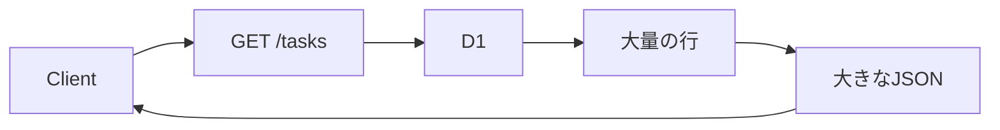
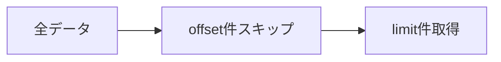
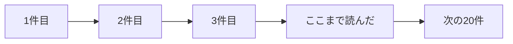
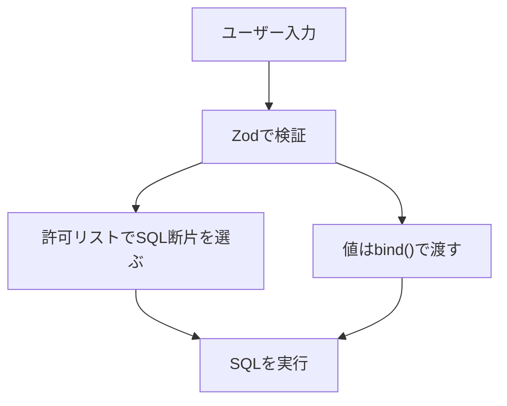

前章では、Cloudflare D1へタスクを保存しました。

これで、タスクはサーバーを再起動しても消えなくなりました。
ただし、一覧APIにはまだ課題があります。

```ts
GET /tasks
```

このAPIが、毎回すべてのタスクを返してしまうことです。

データが10件なら問題ありません。
しかし、1万件、10万件と増えていくと、レスポンスは重くなります。
クライアントも、サーバーも、データベースも無駄に疲れます。

この章では、一覧APIを実用的な形へ育てます。

- ページネーション
- 並び替え
- 完了状態による絞り込み
- キーワード検索
- レスポンスメタデータ
- 安全なSQLの組み立て

最終的には、次のようなAPIを目指します。

```txt
GET /tasks?limit=20&offset=0&completed=false&q=hono&sort=createdAt&order=desc
```

## 一覧APIが重くなる理由

一覧APIは、簡単そうに見えて負荷が集まりやすい場所です。



何も制限しない一覧APIには、次の問題があります。

| 問題 | 内容 |
| --- | --- |
| 返す件数が増える | JSONが大きくなる |
| DBの読み取りが増える | クエリが重くなる |
| 通信量が増える | レスポンスが遅くなる |
| UIが扱いにくい | 一度に表示しきれない |

そこで、一覧APIには「どの範囲を、どの条件で、どの順番で返すか」を指定できるようにします。

## クエリパラメータを検証する

一覧APIでは、クエリパラメータを使います。

```txt
GET /tasks?limit=20&offset=0
```

HTTPのクエリパラメータは、基本的に文字列です。

`limit=20` と書いてあっても、最初は文字列の `"20"` として届きます。
そのため、Zodで検証しながら数値へ変換します。

```ts
// src/schemas/task.ts
import { z } from 'zod'

export const listTasksQuerySchema = z.object({
  limit: z.coerce.number().int().min(1).max(100).default(20),
  offset: z.coerce.number().int().min(0).default(0),
  completed: z
    .enum(['true', 'false'])
    .transform((value) => value === 'true')
    .optional(),
  q: z.string().trim().max(100).optional(),
  sort: z.enum(['createdAt', 'updatedAt', 'title']).default('createdAt'),
  order: z.enum(['asc', 'desc']).default('desc'),
})
```

ここで、`limit` の最大値を100にしています。

これは大切です。
もし最大値を決めないと、クライアントが次のようなリクエストを送れてしまいます。

```txt
GET /tasks?limit=100000
```

API側で上限を決めることで、サーバーとデータベースを守ります。

## limitとoffset

ページネーションの基本は、`limit` と `offset` です。

| パラメータ | 意味 |
| --- | --- |
| `limit` | 何件取得するか |
| `offset` | 何件スキップするか |

たとえば、1ページ20件で表示する場合はこうなります。

| ページ | limit | offset |
| --- | ---: | ---: |
| 1ページ目 | 20 | 0 |
| 2ページ目 | 20 | 20 |
| 3ページ目 | 20 | 40 |

SQLでは、次のように書きます。

```sql
SELECT *
FROM tasks
ORDER BY created_at DESC
LIMIT ?
OFFSET ?;
```

D1では、値を `.bind()` で渡します。

```ts
const result = await db
  .prepare(
    `
    SELECT id, title, completed, created_at, updated_at
    FROM tasks
    ORDER BY created_at DESC
    LIMIT ?
    OFFSET ?
    `,
  )
  .bind(limit, offset)
  .all<TaskRow>()
```

`limit` と `offset` はユーザー入力です。
そのため、SQL文字列へ直接埋め込まず、必ず `.bind()` で渡します。

## Offset Pagination

`limit` と `offset` を使うページネーションを、Offset Paginationと呼びます。



Offset Paginationは、理解しやすいのが長所です。

```txt
GET /tasks?limit=20&offset=40
```

これは「40件スキップして、20件取得する」という意味です。

ただし、弱点もあります。

- 深いページほど遅くなりやすい
- 途中でデータが増減すると、同じデータが重複したり飛んだりすることがある
- 大量データの無限スクロールには向かないことがある

管理画面や小〜中規模の一覧では、Offset Paginationで十分なことが多いです。
本書でも、まずはOffset Paginationを採用します。

## Cursor Pagination

大量データや無限スクロールでは、Cursor Paginationを使うことがあります。

Cursor Paginationでは、`offset` ではなく「前回最後に見た位置」を渡します。

```txt
GET /tasks?limit=20&cursor=2026-07-16T10:00:00.000Z
```

イメージは、しおりです。



作成日時で新しい順に並べるなら、次のようなSQLになります。

```sql
SELECT *
FROM tasks
WHERE created_at < ?
ORDER BY created_at DESC
LIMIT ?;
```

Cursor Paginationは、深いページでも比較的安定します。

ただし、実装は少し複雑です。
並び替え条件とCursorの設計をそろえる必要があります。

本書では、まずOffset Paginationで一覧APIを作ります。
そのうえで、Cursor Paginationは「大量データ向けの選択肢」として覚えておきましょう。

## 並び替え

一覧APIでは、並び順も指定できると便利です。

```txt
GET /tasks?sort=createdAt&order=desc
GET /tasks?sort=title&order=asc
```

ただし、ここで注意があります。

SQLのカラム名や `ASC` / `DESC` は、`.bind()` で渡せません。

```ts
// これはできない
db.prepare('SELECT * FROM tasks ORDER BY ? ?').bind(sort, order)
```

そのため、許可した値だけをSQLに変換します。

```ts
const sortColumns = {
  createdAt: 'created_at',
  updatedAt: 'updated_at',
  title: 'title',
} as const

const orderValues = {
  asc: 'ASC',
  desc: 'DESC',
} as const

const sortColumn = sortColumns[query.sort]
const orderValue = orderValues[query.order]
```

`query.sort` と `query.order` はZodで検証済みです。
さらに、アプリケーション側で許可リストからSQL断片を選んでいます。

この形なら、ユーザー入力がそのままSQL構造に入りません。

## 完了状態による絞り込み

タスク一覧では、完了済みだけ、未完了だけを表示したいことがあります。

```txt
GET /tasks?completed=true
GET /tasks?completed=false
```

D1では、`completed` を `0` / `1` で保存していました。

そのため、Repositoryでは `boolean` を数値へ変換します。

```ts
const completedValue = query.completed ? 1 : 0
```

SQLの条件は次のようになります。

```sql
WHERE completed = ?
```

ただし、`completed` が指定されていない場合は、この条件を付けません。

## キーワード検索

タイトルに含まれる文字で検索するには、`LIKE` を使います。

```txt
GET /tasks?q=hono
```

SQLは次のようになります。

```sql
WHERE title LIKE ?
```

値は `%` を付けて `.bind()` します。

```ts
const keyword = `%${query.q}%`
```

```ts
db.prepare('SELECT * FROM tasks WHERE title LIKE ?').bind(keyword)
```

ただし、本格的な全文検索が必要な場合は、通常の `LIKE` だけでは足りないことがあります。

この本では、まずシンプルなタイトル検索として扱います。

## 複数条件を組み立てる

一覧APIでは、条件が複数あります。

```txt
GET /tasks?completed=false&q=hono&limit=20&offset=0
```

このとき、SQLを安全に組み立てる必要があります。

方針は次のとおりです。

```txt
SQLの構造は、コード側で制御する。
値は、bind()で渡す。
```

Repositoryに、一覧取得用の型を追加します。

```ts
// src/models/task.ts
export type ListTasksQuery = {
  limit: number
  offset: number
  completed?: boolean
  q?: string
  sort: 'createdAt' | 'updatedAt' | 'title'
  order: 'asc' | 'desc'
}
```

D1 Repositoryに実装します。

```ts
async list(query: ListTasksQuery) {
  const where: string[] = []
  const params: unknown[] = []

  if (query.completed !== undefined) {
    where.push('completed = ?')
    params.push(query.completed ? 1 : 0)
  }

  if (query.q) {
    where.push('title LIKE ?')
    params.push(`%${query.q}%`)
  }

  const sortColumns = {
    createdAt: 'created_at',
    updatedAt: 'updated_at',
    title: 'title',
  } as const

  const orderValues = {
    asc: 'ASC',
    desc: 'DESC',
  } as const

  const whereSql = where.length > 0 ? `WHERE ${where.join(' AND ')}` : ''
  const sortColumn = sortColumns[query.sort]
  const orderValue = orderValues[query.order]

  const result = await db
    .prepare(
      `
      SELECT id, title, completed, created_at, updated_at
      FROM tasks
      ${whereSql}
      ORDER BY ${sortColumn} ${orderValue}
      LIMIT ?
      OFFSET ?
      `,
    )
    .bind(...params, query.limit, query.offset)
    .all<TaskRow>()

  return result.results.map(toTask)
}
```

ここで、`whereSql`、`sortColumn`、`orderValue` がSQL文字列へ入っています。

不安になるかもしれません。
でも、これらはユーザー入力をそのまま入れているわけではありません。

- `whereSql` はコード側で固定文を追加している
- `sortColumn` は許可リストから選んでいる
- `orderValue` も許可リストから選んでいる
- 実際の値は `.bind()` で渡している

この境界が大切です。

## 総件数を返すか

ページネーションでは、総件数を返したいことがあります。

```json
{
  "tasks": [],
  "meta": {
    "limit": 20,
    "offset": 0,
    "total": 143
  }
}
```

総件数があると、UIで「全8ページ」のような表示ができます。

ただし、総件数の取得には追加のSQLが必要です。

```sql
SELECT COUNT(*) as total
FROM tasks
WHERE completed = ?;
```

件数が多いテーブルでは、`COUNT(*)` も負荷になります。

本書では、学習しやすさを優先して `total` を返す形にします。
実務では、画面要件とデータ量を見て判断します。

## レスポンスメタデータ

一覧APIでは、データ本体とメタデータを分けると扱いやすくなります。

```json
{
  "tasks": [
    {
      "id": "task_1",
      "title": "Learn Hono",
      "completed": false,
      "createdAt": "2026-07-16T10:00:00.000Z",
      "updatedAt": "2026-07-16T10:00:00.000Z"
    }
  ],
  "meta": {
    "limit": 20,
    "offset": 0,
    "total": 1,
    "hasNext": false
  }
}
```

`hasNext` は、次のページがあるかどうかです。

```ts
const hasNext = query.offset + query.limit < total
```

このようなメタデータがあると、クライアント側の実装が楽になります。

## Repositoryの戻り値を変更する

一覧APIでは、タスク配列だけでなくメタデータも返します。

Repositoryの型を変更します。

```ts
export type ListTasksResult = {
  tasks: Task[]
  meta: {
    limit: number
    offset: number
    total: number
    hasNext: boolean
  }
}

export type TaskRepository = {
  list(query: ListTasksQuery): Promise<ListTasksResult>
  findById(id: string): Promise<Task | null>
  create(input: CreateTaskInput): Promise<Task>
  update(id: string, input: UpdateTaskInput): Promise<Task | null>
  delete(id: string): Promise<boolean>
}
```

Service側も、一覧取得の引数を受け取るようにします。

```ts
export function createTaskService(repository: TaskRepository) {
  return {
    listTasks(query: ListTasksQuery) {
      return repository.list(query)
    },

    // ほかのメソッドは省略
  }
}
```

Handlerでは、検証済みクエリをServiceへ渡します。

```ts
export const tasksRoute = new Hono<Env>()
  .get('/', zValidator('query', listTasksQuerySchema), async (c) => {
    const query = c.req.valid('query')
    const { taskService } = createServices(c.env.DB)

    const result = await taskService.listTasks(query)

    return c.json(result)
  })
```

`c.req.valid('query')` から取り出した時点で、`limit` や `offset` は数値になっています。
Handlerの中で再度変換する必要はありません。

## COUNTも同じ条件で実行する

`total` を正しく返すには、一覧取得と同じ検索条件で `COUNT(*)` を実行します。

```ts
const countRow = await db
  .prepare(
    `
    SELECT COUNT(*) as total
    FROM tasks
    ${whereSql}
    `,
  )
  .bind(...params)
  .first<{ total: number }>()
```

そして、一覧取得の結果と合わせて返します。

```ts
const total = countRow?.total ?? 0

return {
  tasks: result.results.map(toTask),
  meta: {
    limit: query.limit,
    offset: query.offset,
    total,
    hasNext: query.offset + query.limit < total,
  },
}
```

この形なら、クライアントは次のページがあるか判断できます。

## インデックスを意識する

検索・並び替えを入れるときは、インデックスを意識します。

前章では、次のインデックスを作りました。

```sql
CREATE INDEX idx_tasks_completed ON tasks(completed);
CREATE INDEX idx_tasks_created_at ON tasks(created_at);
```

完了状態で絞り込むなら、`completed` のインデックスが役立ちます。
作成日時で並び替えるなら、`created_at` のインデックスが役立ちます。

ただし、インデックスは多ければ多いほどよいわけではありません。

| インデックスの利点 | インデックスの負担 |
| --- | --- |
| 検索が速くなる | 書き込み時の更新が増える |
| 並び替えが速くなることがある | DBサイズが増える |
| 条件検索に強くなる | 使われないと意味がない |

検索条件が増えたら、実際のクエリとデータ量を見ながら追加します。

## SQLを安全に組み立てる

この章の最後に、SQLの安全な組み立て方を整理します。



守りたい原則は、次の3つです。

1. 値は `.bind()` で渡す
2. カラム名や並び順は許可リストから選ぶ
3. SQL断片を作る場合も、ユーザー入力を直接混ぜない

悪い例です。

```ts
const sql = `
  SELECT *
  FROM tasks
  WHERE title LIKE '%${query.q}%'
  ORDER BY ${query.sort} ${query.order}
`
```

良い例です。

```ts
const sortColumn = sortColumns[query.sort]
const orderValue = orderValues[query.order]

const sql = `
  SELECT *
  FROM tasks
  WHERE title LIKE ?
  ORDER BY ${sortColumn} ${orderValue}
`

const result = await db.prepare(sql).bind(`%${query.q}%`).all()
```

小さな違いに見えますが、APIの安全性はこういう積み重ねで決まります。

## まとめ

この章では、一覧APIを実用的にする方法を学びました。

- 一覧APIには取得件数の上限が必要
- `limit` と `offset` でOffset Paginationを実装できる
- Cursor Paginationは大量データや無限スクロールに向いている
- 並び替えのカラム名は `.bind()` できないため、許可リストで制御する
- 検索値や絞り込み値は `.bind()` で渡す
- `total` や `hasNext` を返すとクライアントが扱いやすい
- インデックスは検索条件と並び替えに合わせて設計する

次章では、Web APIの認証と認可を扱います。

ここまでは、誰でもすべてのタスクを操作できるAPIでした。
次は「誰が操作しているのか」「その人はその操作をしてよいのか」を考えます。
