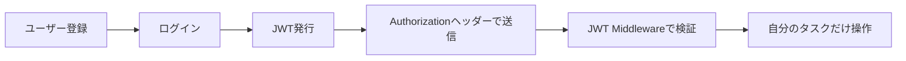

前章では、認証と認可の考え方を整理しました。

この章では、実際にJWT認証を実装します。

実装する流れは、次のとおりです。



JWTは便利です。
ただし、扱い方を間違えると危険です。

この章では、動くコードだけでなく、最低限守るべきセキュリティの考え方も一緒に扱います。

## ユーザーテーブルを作る

まず、ユーザーを保存するテーブルを作ります。

```sh
npx wrangler d1 migrations create hono-task-api-db create_users
```

マイグレーションSQLです。

```sql
CREATE TABLE users (
  id TEXT PRIMARY KEY,
  email TEXT NOT NULL UNIQUE,
  password_hash TEXT NOT NULL,
  role TEXT NOT NULL DEFAULT 'user',
  created_at TEXT NOT NULL,
  updated_at TEXT NOT NULL
);

CREATE INDEX idx_users_email ON users(email);
```

`email` には `UNIQUE` を付けています。

同じメールアドレスのユーザーが複数作られないようにするためです。

次に、タスクに所有者を追加します。

```sh
npx wrangler d1 migrations create hono-task-api-db add_user_id_to_tasks
```

```sql
ALTER TABLE tasks ADD COLUMN user_id TEXT;

CREATE INDEX idx_tasks_user_id ON tasks(user_id);
CREATE INDEX idx_tasks_user_id_created_at ON tasks(user_id, created_at);
```

既存データがある場合、`user_id` をあとから `NOT NULL` にするには移行手順が必要です。

本書では学習用として、まず `user_id` を追加します。
新しく作るタスクには、必ずログインユーザーのIDを入れるようにします。

## ユーザーの型を定義する

アプリケーション内で使うユーザー型を用意します。

```ts
// src/models/user.ts
export type UserRole = 'user' | 'admin'

export type User = {
  id: string
  email: string
  passwordHash: string
  role: UserRole
  createdAt: string
  updatedAt: string
}

export type PublicUser = {
  id: string
  email: string
  role: UserRole
  createdAt: string
}
```

`User` には `passwordHash` が含まれます。
これはサーバー内部用です。

APIレスポンスでは、`PublicUser` を返します。

```ts
export function toPublicUser(user: User): PublicUser {
  return {
    id: user.id,
    email: user.email,
    role: user.role,
    createdAt: user.createdAt,
  }
}
```

パスワードハッシュも、レスポンスには含めません。

## ユーザー登録API

登録用のスキーマを作ります。

```ts
// src/schemas/auth.ts
import { z } from 'zod'

export const registerSchema = z.object({
  email: z.string().email(),
  password: z.string().min(8).max(100),
})

export const loginSchema = z.object({
  email: z.string().email(),
  password: z.string().min(8).max(100),
})
```

`password` は短すぎるものを拒否します。

ただし、長ければ安全というわけでもありません。
実務では、パスワードポリシー、漏えい済みパスワードチェック、多要素認証なども検討します。

ここでは、最小限の形で進めます。

## パスワードをハッシュ化する

パスワードは平文で保存しません。

Cloudflare Workersでは、Node.jsのbcryptライブラリがそのまま使いにくい場合があります。
実務では、Workersで動くパスワードハッシュライブラリや外部認証基盤を選びます。

本書では、インターフェースを先に決めます。

```ts
// src/services/password.ts
export type PasswordHasher = {
  hash(password: string): Promise<string>
  verify(password: string, passwordHash: string): Promise<boolean>
}
```

こうしておくと、あとから実装を差し替えられます。

学習用の実装を置くなら、少なくともソルトとストレッチングを含めます。

ここでは、WorkersのWeb Crypto APIで使えるPBKDF2を例にします。
ただし、これは「本書のサンプルを完結させるための実装」です。
本番では、Argon2id、bcrypt、scryptなど、パスワード保存向けに設計された方式や外部認証基盤も検討してください。

```ts
// src/services/password.ts
const encoder = new TextEncoder()
const iterations = 210_000
const algorithm = 'PBKDF2'
const digest = 'SHA-256'
const keyLength = 256

function bytesToBase64(bytes: Uint8Array): string {
  return btoa(String.fromCharCode(...bytes))
}

function base64ToBytes(value: string): Uint8Array {
  return Uint8Array.from(atob(value), (char) => char.charCodeAt(0))
}

async function derivePasswordHash(password: string, salt: Uint8Array): Promise<string> {
  const keyMaterial = await crypto.subtle.importKey(
    'raw',
    encoder.encode(password),
    algorithm,
    false,
    ['deriveBits'],
  )

  const bits = await crypto.subtle.deriveBits(
    {
      name: algorithm,
      salt,
      iterations,
      hash: digest,
    },
    keyMaterial,
    keyLength,
  )

  return bytesToBase64(new Uint8Array(bits))
}

export function createPasswordHasher(): PasswordHasher {
  const hash = async (password: string) => {
    const salt = crypto.getRandomValues(new Uint8Array(16))
    const passwordHash = await derivePasswordHash(password, salt)

    return [
      'pbkdf2',
      digest.toLowerCase(),
      String(iterations),
      bytesToBase64(salt),
      passwordHash,
    ].join('$')
  }

  return {
    hash,

    async verify(password, storedValue) {
      const [name, hashName, iterationValue, saltValue, expectedHash] =
        storedValue.split('$')

      if (name !== 'pbkdf2' || hashName !== digest.toLowerCase()) {
        return false
      }

      const actualHash = await derivePasswordHash(password, base64ToBytes(saltValue))

      return actualHash === expectedHash && Number(iterationValue) === iterations
    },
  }
}
```

保存される文字列には、アルゴリズム名、ハッシュ名、反復回数、ソルト、ハッシュ値を含めています。
将来アルゴリズムや反復回数を変えたときに、古いハッシュも検証できるようにするためです。

## UserRepositoryを作る

ユーザーをD1へ保存するRepositoryを作ります。

```ts
// src/repositories/user-repository.ts
import type { User } from '../models/user'

export type CreateUserInput = {
  email: string
  passwordHash: string
}

export type UserRepository = {
  findByEmail(email: string): Promise<User | null>
  findById(id: string): Promise<User | null>
  create(input: CreateUserInput): Promise<User>
}
```

D1実装です。

```ts
// src/repositories/d1-user-repository.ts
import type { User, UserRole } from '../models/user'
import type { CreateUserInput, UserRepository } from './user-repository'

type UserRow = {
  id: string
  email: string
  password_hash: string
  role: UserRole
  created_at: string
  updated_at: string
}

function toUser(row: UserRow): User {
  return {
    id: row.id,
    email: row.email,
    passwordHash: row.password_hash,
    role: row.role,
    createdAt: row.created_at,
    updatedAt: row.updated_at,
  }
}

export function createD1UserRepository(db: D1Database): UserRepository {
  return {
    async findByEmail(email) {
      const row = await db
        .prepare(
          `
          SELECT id, email, password_hash, role, created_at, updated_at
          FROM users
          WHERE email = ?
          `,
        )
        .bind(email)
        .first<UserRow>()

      return row ? toUser(row) : null
    },

    async findById(id) {
      const row = await db
        .prepare(
          `
          SELECT id, email, password_hash, role, created_at, updated_at
          FROM users
          WHERE id = ?
          `,
        )
        .bind(id)
        .first<UserRow>()

      return row ? toUser(row) : null
    },

    async create(input) {
      const now = new Date().toISOString()

      const user: User = {
        id: crypto.randomUUID(),
        email: input.email,
        passwordHash: input.passwordHash,
        role: 'user',
        createdAt: now,
        updatedAt: now,
      }

      await db
        .prepare(
          `
          INSERT INTO users (id, email, password_hash, role, created_at, updated_at)
          VALUES (?, ?, ?, ?, ?, ?)
          `,
        )
        .bind(
          user.id,
          user.email,
          user.passwordHash,
          user.role,
          user.createdAt,
          user.updatedAt,
        )
        .run()

      return user
    },
  }
}
```

メールアドレスの重複は、DBの `UNIQUE` 制約でも守ります。
アプリケーション側でも事前に確認します。

## AuthServiceを作る

認証処理はServiceへ置きます。

```ts
// src/services/auth-service.ts
import type { PublicUser } from '../models/user'
import { toPublicUser } from '../models/user'
import type { PasswordHasher } from './password'
import type { UserRepository } from '../repositories/user-repository'

export class AuthError extends Error {
  constructor(message: string) {
    super(message)
  }
}

export function createAuthService(
  userRepository: UserRepository,
  passwordHasher: PasswordHasher,
) {
  return {
    async register(input: { email: string; password: string }): Promise<PublicUser> {
      const existingUser = await userRepository.findByEmail(input.email)

      if (existingUser) {
        throw new AuthError('Email is already registered')
      }

      const passwordHash = await passwordHasher.hash(input.password)
      const user = await userRepository.create({
        email: input.email,
        passwordHash,
      })

      return toPublicUser(user)
    },

    async verifyLogin(input: { email: string; password: string }) {
      const user = await userRepository.findByEmail(input.email)

      if (!user) {
        throw new AuthError('Invalid email or password')
      }

      const valid = await passwordHasher.verify(input.password, user.passwordHash)

      if (!valid) {
        throw new AuthError('Invalid email or password')
      }

      return user
    },
  }
}
```

ログイン失敗時は、メールアドレスが存在しない場合も、パスワードが違う場合も同じメッセージにしています。

```txt
Invalid email or password
```

どちらが間違っているかを外部に教えないためです。

## JWTを発行する

HonoにはJWT helperがあります。

`sign()` を使うと、JWTを発行できます。

```ts
import { sign } from 'hono/jwt'

const token = await sign(
  {
    sub: user.id,
    role: user.role,
    iss: 'hono-task-api',
    aud: 'hono-task-client',
    exp: Math.floor(Date.now() / 1000) + 60 * 15,
  },
  c.env.JWT_SECRET,
)
```

`exp` は有効期限です。

ここでは15分にしています。

```txt
60秒 × 15 = 15分
```

JWTのPayloadには、必要最小限の情報だけを入れます。

## ログインAPI

`/auth/login` でJWTを返します。

```ts
// src/routes/auth.ts
import { Hono } from 'hono'
import { sign } from 'hono/jwt'
import { zValidator } from '@hono/zod-validator'
import { loginSchema, registerSchema } from '../schemas/auth'
import { createAuthService, AuthError } from '../services/auth-service'
import { createPasswordHasher } from '../services/password'
import { createD1UserRepository } from '../repositories/d1-user-repository'

type Env = {
  Bindings: {
    DB: D1Database
    JWT_SECRET: string
  }
}

function createServices(db: D1Database) {
  const userRepository = createD1UserRepository(db)
  const passwordHasher = createPasswordHasher()
  const authService = createAuthService(userRepository, passwordHasher)

  return { authService }
}

export const authRoute = new Hono<Env>()
  .post('/register', zValidator('json', registerSchema), async (c) => {
    const body = c.req.valid('json')
    const { authService } = createServices(c.env.DB)

    try {
      const user = await authService.register(body)
      return c.json({ user }, 201)
    } catch (error) {
      if (error instanceof AuthError) {
        return c.json({ message: error.message }, 409)
      }

      throw error
    }
  })
  .post('/login', zValidator('json', loginSchema), async (c) => {
    const body = c.req.valid('json')
    const { authService } = createServices(c.env.DB)

    try {
      const user = await authService.verifyLogin(body)

      const accessToken = await sign(
        {
          sub: user.id,
          role: user.role,
          iss: 'hono-task-api',
          aud: 'hono-task-client',
          exp: Math.floor(Date.now() / 1000) + 60 * 15,
        },
        c.env.JWT_SECRET,
      )

      return c.json({
        accessToken,
        tokenType: 'Bearer',
        expiresIn: 60 * 15,
      })
    } catch (error) {
      if (error instanceof AuthError) {
        return c.json({ message: 'Invalid email or password' }, 401)
      }

      throw error
    }
  })
```

`JWT_SECRET` は環境変数として渡します。

`wrangler.toml` に直接秘密を置くのではなく、Secretsとして管理します。

```sh
npx wrangler secret put JWT_SECRET
```

ローカル開発では、`.dev.vars` に置けます。

```txt
JWT_SECRET=local-development-secret
```

本番と同じ値をローカルに置かないようにしましょう。

## JWT Middlewareで署名を検証する

HonoのJWT Middlewareを使うと、`Authorization` ヘッダーのBearer Tokenを検証できます。

```ts
import { jwt } from 'hono/jwt'
import type { JwtVariables } from 'hono/jwt'
import type { Context, Next } from 'hono'

type Env = {
  Bindings: {
    DB: D1Database
    JWT_SECRET: string
  }
  Variables: JwtVariables
}

const app = new Hono<Env>()

const jwtAuth = (c: Context<Env>, next: Next) => {
  const middleware = jwt({
    secret: c.env.JWT_SECRET,
    alg: 'HS256',
    verification: {
      iss: 'hono-task-api',
      aud: 'hono-task-client',
    },
  })

  return middleware(c, next)
}

app.use('/tasks', jwtAuth)
app.use('/tasks/*', jwtAuth)
```

`/tasks` と `/tasks/*` の両方に適用しているのは、一覧取得の `/tasks` と、詳細・更新・削除の `/tasks/:id` をどちらも守るためです。

HonoのJWT Middlewareは、Cookie設定がない場合、`Authorization` ヘッダーを見ます。

クライアントは次のように送ります。

```http
Authorization: Bearer <access_token>
```

検証に成功すると、Payloadを取り出せます。

```ts
const payload = c.get('jwtPayload')
```

## iss、aud、expを検証する

JWTでは、代表的なClaimがあります。

| Claim | 意味 |
| --- | --- |
| `sub` | 誰を表すトークンか |
| `iss` | 誰が発行したか |
| `aud` | 誰に向けたトークンか |
| `exp` | 有効期限 |

`exp` は、期限切れトークンを拒否するために使います。

`iss` と `aud` は、「このAPI向けに発行されたトークンか」を確認するために使います。

```ts
jwt({
  secret: c.env.JWT_SECRET,
  alg: 'HS256',
  verification: {
    iss: 'hono-task-api',
    aud: 'hono-task-client',
  },
})
```

トークンが署名されていても、別の用途のトークンを受け入れてしまうと危険です。

`iss` と `aud` を使うと、トークンの用途を絞れます。

## 認証ユーザーをVariablesへ保存する

JWT Payloadから `sub` を取り出せば、ユーザーIDがわかります。

ただし、HandlerごとにPayloadを直接読むと、処理が散らかります。

そこで、認証済みユーザーを `Variables` へ保存します。

```ts
// src/middlewares/current-user.ts
import { createMiddleware } from 'hono/factory'
import type { JwtVariables } from 'hono/jwt'
import type { PublicUser } from '../models/user'
import { createD1UserRepository } from '../repositories/d1-user-repository'
import { toPublicUser } from '../models/user'

type Env = {
  Bindings: {
    DB: D1Database
  }
  Variables: JwtVariables & {
    currentUser: PublicUser
  }
}

export const currentUser = createMiddleware<Env>(async (c, next) => {
  const payload = c.get('jwtPayload')
  const userId = payload.sub

  if (typeof userId !== 'string') {
    return c.json({ message: 'Invalid token' }, 401)
  }

  const userRepository = createD1UserRepository(c.env.DB)
  const user = await userRepository.findById(userId)

  if (!user) {
    return c.json({ message: 'User not found' }, 401)
  }

  c.set('currentUser', toPublicUser(user))

  await next()
})
```

Handlerでは、次のように使えます。

```ts
const currentUser = c.get('currentUser')
```

これで、タスク操作時にログインユーザーを使えます。

実際に使うときは、JWT検証のあとに `currentUser` Middlewareを通します。

```ts
app.use('/tasks', jwtAuth, currentUser)
app.use('/tasks/*', jwtAuth, currentUser)
```

## 自分のタスクだけを取得する

タスクテーブルに `user_id` を追加したので、Repositoryのクエリに `userId` を渡します。

```ts
export type ListTasksQuery = {
  userId: string
  limit: number
  offset: number
  completed?: boolean
  q?: string
  sort: 'createdAt' | 'updatedAt' | 'title'
  order: 'asc' | 'desc'
}
```

D1のSQLでは、必ず `user_id = ?` を条件に入れます。

```ts
where.push('user_id = ?')
params.push(query.userId)
```

一覧取得のSQLは、次のようになります。

```sql
SELECT id, title, completed, created_at, updated_at
FROM tasks
WHERE user_id = ?
ORDER BY created_at DESC
LIMIT ?
OFFSET ?;
```

Handlerでは、認証ユーザーIDを渡します。

```ts
.get('/', zValidator('query', listTasksQuerySchema), async (c) => {
  const query = c.req.valid('query')
  const currentUser = c.get('currentUser')
  const { taskService } = createServices(c.env.DB)

  const result = await taskService.listTasks({
    ...query,
    userId: currentUser.id,
  })

  return c.json(result)
})
```

これで、自分のタスクだけが返ります。

## 所有者を検証する

詳細取得、更新、削除でも、所有者を確認します。

```ts
const task = await taskService.getTask(id)

if (!task) {
  return c.json({ message: 'Task not found' }, 404)
}

if (task.userId !== currentUser.id) {
  return c.json({ message: 'Forbidden' }, 403)
}
```

ただし、他人のタスクの存在を隠したい場合は、403ではなく404を返すこともあります。

```ts
if (!task || task.userId !== currentUser.id) {
  return c.json({ message: 'Task not found' }, 404)
}
```

どちらが正しいかは、APIの設計方針によります。

本書では、学習のために認可エラーが見える `403` を使います。

## Roleを検証する

ユーザーに `role` を持たせると、管理者だけが使えるAPIを作れます。

```ts
function requireAdmin(c: Context) {
  const currentUser = c.get('currentUser')

  if (currentUser.role !== 'admin') {
    return c.json({ message: 'Forbidden' }, 403)
  }
}
```

Middlewareとして書くなら、次のようにできます。

```ts
import { createMiddleware } from 'hono/factory'

export const requireAdmin = createMiddleware<Env>(async (c, next) => {
  const currentUser = c.get('currentUser')

  if (currentUser.role !== 'admin') {
    return c.json({ message: 'Forbidden' }, 403)
  }

  await next()
})
```

```ts
app.get('/admin/users', requireAdmin, async (c) => {
  return c.json({ users: [] })
})
```

認証は「誰か」。
認可は「何をしてよいか」。

Roleは、認可を実装する方法のひとつです。

## ログアウトをどう考えるか

JWTをAuthorizationヘッダーで使う場合、ログアウトは少し考え方が違います。

クライアントがトークンを削除すれば、以後そのクライアントからは認証済みリクエストを送れません。

```txt
ログアウト = クライアント側のAccess Tokenを破棄する
```

ただし、すでに漏えいしたAccess Tokenを即時に無効化するには、サーバー側で失効リストを持つ必要があります。

そのため、Access Tokenは短命にします。

```txt
短命なAccess Token
必要ならRefresh Token
必要なら失効リスト
```

この章では、まず短命なAccess Tokenだけを扱います。

## CORSとCSRF

AuthorizationヘッダーでJWTを送る場合、ブラウザは勝手にトークンを付けません。
そのため、Cookie認証よりはCSRFの影響を受けにくくなります。

一方、CookieでJWTやセッションIDを送る場合、ブラウザが自動的にCookieを付けます。
その場合はCSRF対策が重要になります。

HonoにはCORS Middlewareがあります。

```ts
import { cors } from 'hono/cors'

app.use(
  '*',
  cors({
    origin: 'https://example.com',
    allowHeaders: ['Content-Type', 'Authorization'],
    allowMethods: ['GET', 'POST', 'PATCH', 'DELETE', 'OPTIONS'],
  }),
)
```

本番では、`origin: '*'` を安易に使わず、許可するオリジンを明示します。

## Secure HeadersとBody Limit

API全体の安全性を上げるために、共通Middlewareも使います。

```ts
import { secureHeaders } from 'hono/secure-headers'
import { bodyLimit } from 'hono/body-limit'

app.use('*', secureHeaders())

app.use(
  '*',
  bodyLimit({
    maxSize: 100 * 1024,
    onError: (c) => c.json({ message: 'Request body too large' }, 413),
  }),
)
```

`secureHeaders()` は、セキュリティ関連のHTTPヘッダーを付与します。

`bodyLimit()` は、大きすぎるリクエストボディを拒否します。

ログインAPIや登録APIは、攻撃の入口にもなりやすい場所です。
入力サイズを制限しておくことは、地味ですが重要です。

## Rate LimitとBrute Force対策

ログインAPIでは、総当たり攻撃を考える必要があります。

```txt
password1
password2
password3
...
```

このような攻撃をBrute Force攻撃と呼びます。

対策としては、次のようなものがあります。

- IPごとの試行回数制限
- メールアドレスごとの試行回数制限
- 一定回数失敗したら遅延を入れる
- 多要素認証を導入する
- ログイン失敗を監視する

Hono本体だけで完結する話ではありません。
Cloudflareの機能や外部サービスを組み合わせることもあります。

本書では実装を深追いしませんが、ログインAPIにはRate Limitが必要だと覚えておきましょう。

## シークレットと個人情報を安全に扱う

JWTの署名鍵は、絶対にGitへコミットしません。

避けたい例です。

```ts
const secret = 'my-production-secret'
```

良い例です。

```ts
const secret = c.env.JWT_SECRET
```

Cloudflare Workersでは、Secretsを使います。

```sh
npx wrangler secret put JWT_SECRET
```

また、ログにも注意します。

次のような情報はログへ出さないようにします。

- パスワード
- パスワードハッシュ
- JWT
- Authorizationヘッダー
- 個人情報

デバッグ中に便利でも、本番ログに残ると危険です。

## セキュリティチェックリスト

最後に、この章のチェックリストです。

| 項目 | 確認 |
| --- | --- |
| パスワードを平文保存していない | `password_hash` のみ保存する |
| JWTに秘密情報を入れていない | Payloadは読める前提で扱う |
| JWTに有効期限がある | `exp` を設定する |
| `iss` と `aud` を検証している | 用途の違うトークンを拒否する |
| JWT_SECRETをSecretsで管理している | Gitに入れない |
| 認証ユーザーを安全に取り出している | `currentUser` をVariablesへ保存する |
| 所有者を確認している | 他人のタスクを操作させない |
| CORSのoriginを制御している | 本番で `*` を乱用しない |
| リクエストサイズを制限している | `bodyLimit()` を使う |
| ログに秘密情報を出していない | Authorizationヘッダーを出さない |

セキュリティは、ひとつの機能ではありません。

小さな判断の積み重ねです。

## まとめ

この章では、JWT認証を実装しました。

- ユーザーテーブルを作った
- パスワードハッシュを保存する設計にした
- ユーザー登録APIを作った
- ログインAPIでJWTを発行した
- HonoのJWT Middlewareで署名を検証した
- `iss`、`aud`、`exp` を意識した
- 認証ユーザーをVariablesへ保存した
- 自分のタスクだけを操作できるようにした
- CORS、Secure Headers、Body Limit、Rate Limitの考え方を整理した

次章では、Hono RPCとHono Clientを扱います。

ここまで作ったAPIを、クライアント側から型安全に呼び出す方法を見ていきます。
