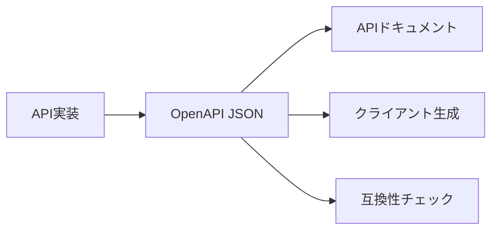
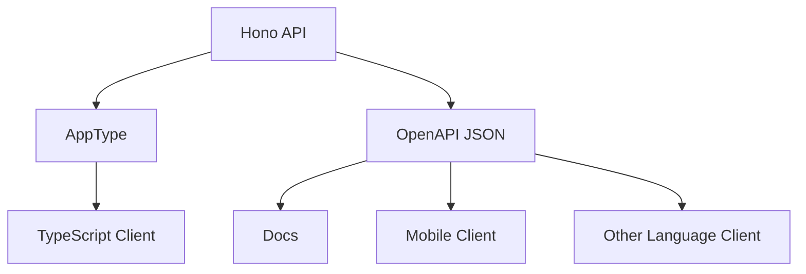
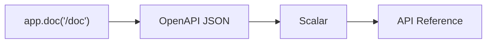
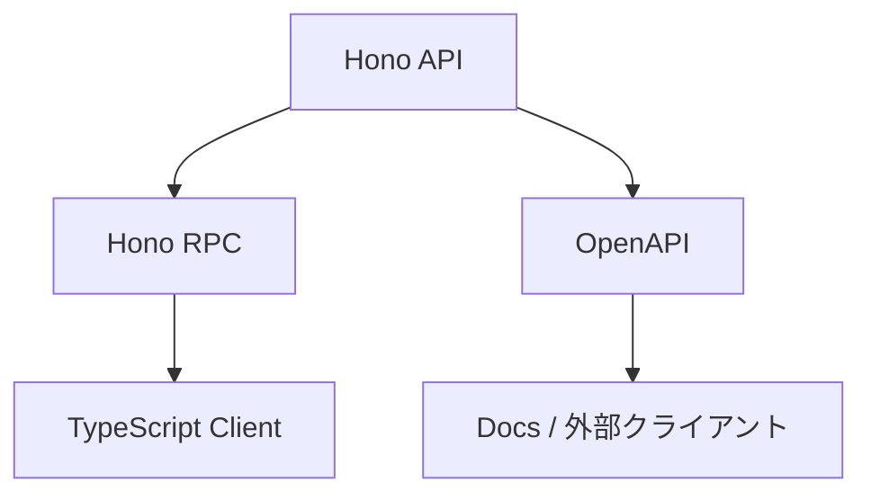

前章では、Hono RPCとHono Clientを学びました。

Hono RPCは、TypeScript同士でAPIの型を共有する、とても気持ちのよい仕組みです。

一方で、APIはいつもTypeScriptのクライアントだけから呼ばれるとは限りません。

- 外部パートナーにAPI仕様を渡したい
- モバイルアプリから呼びたい
- PythonやGoのクライアントから呼びたい
- API仕様書を画面で確認したい
- 仕様変更の影響をレビューしたい

こういう場面では、OpenAPIが役立ちます。

この章では、HonoでOpenAPIを扱う方法と、APIの互換性を守る考え方を学びます。

## OpenAPIとは何か

OpenAPIは、HTTP APIの仕様を機械が読める形で表すための仕様です。

ざっくり言うと、APIの説明書です。



OpenAPIには、次のような情報を書けます。

- パス
- HTTPメソッド
- クエリパラメーター
- パスパラメーター
- リクエストボディ
- レスポンス
- エラーレスポンス
- 認証方式

たとえば、`GET /tasks` というAPIについて、次のようなことを表現できます。

```txt
GET /tasks
query:
  limit: number
  offset: number
response:
  200: tasks and meta
  401: unauthorized
```

この仕様があると、人間も機械もAPIを理解しやすくなります。

## Hono RPCとの違い

Hono RPCとOpenAPIは、どちらもAPIの型や仕様を扱います。

ただし、向いている場面が違います。

| 観点 | Hono RPC | OpenAPI |
| --- | --- | --- |
| 主な目的 | TypeScriptクライアントの型安全 | API仕様の共有 |
| 使いやすい相手 | TypeScriptアプリ | 他言語、外部パートナー、ドキュメント |
| 形式 | TypeScriptの型 | JSON/YAMLの仕様書 |
| コード生成 | 不要 | 生成ツールと相性がよい |
| ドキュメント表示 | 主目的ではない | Swagger UIやScalarで表示できる |

どちらか一方だけが正解ではありません。

TypeScriptの社内クライアントにはHono RPC。
外部公開や仕様レビューにはOpenAPI。

このように使い分けるとよいです。

## 型共有と仕様書共有の違い

Hono RPCは、サーバー側の型をクライアント側へ共有します。

```txt
TypeScriptの世界で強い
```

OpenAPIは、API仕様を言語に依存しない形で共有します。

```txt
言語やチームをまたいで強い
```

図にすると、こうです。



本書では、まず `@hono/zod-openapi` を使って、ZodスキーマからOpenAPIを生成します。

ここで目指すのは、仕様書を別管理で書き起こすことではありません。
できるだけ実装に近いスキーマからOpenAPIを作り、実装と仕様のずれを減らします。
Hono RPCがTypeScript向けの型共有なら、OpenAPIはチームや言語をまたいだ仕様共有です。

## @hono/zod-openapiを導入する

`@hono/zod-openapi` を使うと、Zodスキーマを使いながらOpenAPIを生成できます。

```sh
npm install @hono/zod-openapi
```

Swagger UIやScalarで表示したい場合は、それぞれのパッケージも追加します。

```sh
npm install @scalar/hono-api-reference
```

この章では、Scalarを使ってAPI仕様を表示します。

## OpenAPIHonoを使う

通常のHonoではなく、`OpenAPIHono` を使います。

```ts
import { OpenAPIHono } from '@hono/zod-openapi'

const app = new OpenAPIHono()

export default app
```

`OpenAPIHono` は、OpenAPIの情報を持てるHonoアプリケーションです。

ルート定義には、`createRoute()` と `app.openapi()` を使います。

通常の`app.get()`や`app.post()`に近い感覚で使えますが、先にルート仕様を作る点が違います。
仕様として何を受け取り、何を返すのかを`createRoute()`に書き、その仕様に対応するHandlerを`app.openapi()`で登録します。

## Zodスキーマを再利用する

まず、OpenAPI用のZodをimportします。

```ts
import { z } from '@hono/zod-openapi'
```

通常の `zod` ではなく、`@hono/zod-openapi` からimportするのがポイントです。

タスクのスキーマを定義します。

```ts
// src/openapi/schemas.ts
import { z } from '@hono/zod-openapi'

export const TaskSchema = z
  .object({
    id: z.string().openapi({
      example: 'task_123',
    }),
    title: z.string().openapi({
      example: 'Learn Hono',
    }),
    completed: z.boolean().openapi({
      example: false,
    }),
    createdAt: z.string().datetime().openapi({
      example: '2026-07-16T10:00:00.000Z',
    }),
    updatedAt: z.string().datetime().openapi({
      example: '2026-07-16T10:00:00.000Z',
    }),
  })
  .openapi('Task')

export const ErrorSchema = z
  .object({
    message: z.string().openapi({
      example: 'Task not found',
    }),
  })
  .openapi('Error')
```

`.openapi('Task')` のように名前を付けると、OpenAPIのComponentsとして扱いやすくなります。

## Requestを定義する

タスク作成APIのリクエストスキーマです。

```ts
export const CreateTaskSchema = z
  .object({
    title: z.string().min(1).max(100).openapi({
      example: 'Write documentation',
    }),
  })
  .openapi('CreateTask')
```

パスパラメーターもスキーマとして定義できます。

```ts
export const TaskParamsSchema = z.object({
  id: z.string().openapi({
    param: {
      name: 'id',
      in: 'path',
    },
    example: 'task_123',
  }),
})
```

クエリパラメーターも同じです。

```ts
export const ListTasksQuerySchema = z.object({
  limit: z.coerce.number().int().min(1).max(100).default(20).openapi({
    example: 20,
  }),
  offset: z.coerce.number().int().min(0).default(0).openapi({
    example: 0,
  }),
  completed: z.enum(['true', 'false']).optional().openapi({
    example: 'false',
  }),
  q: z.string().max(100).optional().openapi({
    example: 'hono',
  }),
})
```

入力検証とAPI仕様を、同じスキーマから作るのが狙いです。

## Responseを定義する

一覧レスポンスのスキーマを作ります。

```ts
export const ListTasksResponseSchema = z
  .object({
    tasks: z.array(TaskSchema),
    meta: z.object({
      limit: z.number().openapi({ example: 20 }),
      offset: z.number().openapi({ example: 0 }),
      total: z.number().openapi({ example: 42 }),
      hasNext: z.boolean().openapi({ example: true }),
    }),
  })
  .openapi('ListTasksResponse')
```

タスク単体のレスポンスも作ります。

```ts
export const TaskResponseSchema = z
  .object({
    task: TaskSchema,
  })
  .openapi('TaskResponse')
```

エラーレスポンスも忘れずに定義します。

```ts
export const UnauthorizedResponseSchema = z
  .object({
    message: z.string().openapi({
      example: 'Unauthorized',
    }),
  })
  .openapi('UnauthorizedResponse')
```

成功レスポンスだけを書くと、ドキュメントとしては不十分です。

API利用者が知りたいのは、失敗したときに何が返るかでもあります。

## createRoute()でルート仕様を作る

`createRoute()` で、OpenAPI用のルート定義を作ります。

この定義は、API利用者に見せる契約書のようなものです。
Handlerの中身を知らなくても、どんなクエリを渡せるか、どんなステータスコードが返るかを読み取れるようにします。
そのため、成功レスポンスだけでなく、認証エラーなどもここに含めます。

```ts
// src/routes/openapi/tasks.ts
import { createRoute } from '@hono/zod-openapi'
import {
  ErrorSchema,
  ListTasksQuerySchema,
  ListTasksResponseSchema,
} from '../../openapi/schemas'

export const listTasksRoute = createRoute({
  method: 'get',
  path: '/tasks',
  tags: ['Tasks'],
  summary: 'タスク一覧を取得する',
  request: {
    query: ListTasksQuerySchema,
  },
  responses: {
    200: {
      description: 'タスク一覧',
      content: {
        'application/json': {
          schema: ListTasksResponseSchema,
        },
      },
    },
    401: {
      description: '認証されていない',
      content: {
        'application/json': {
          schema: ErrorSchema,
        },
      },
    },
  },
})
```

この定義には、HTTPメソッド、パス、リクエスト、レスポンス、説明が含まれています。

## app.openapi()で実装する

作ったルート仕様を、`app.openapi()` に渡します。

ここでは、仕様と実装がつながります。
`listTasksRoute`で定義したクエリは、Handlerの中で`c.req.valid('query')`として取得できます。
Zodで検証した値を使う流れは、これまでの`zValidator()`と同じです。

```ts
import { OpenAPIHono } from '@hono/zod-openapi'
import { listTasksRoute } from './routes/openapi/tasks'

const app = new OpenAPIHono()

app.openapi(listTasksRoute, async (c) => {
  const query = c.req.valid('query')

  return c.json(
    {
      tasks: [],
      meta: {
        limit: query.limit,
        offset: query.offset,
        total: 0,
        hasNext: false,
      },
    },
    200,
  )
})
```

`c.req.valid('query')` で、検証済みのクエリを取得できます。

これは、これまで使ってきたValidatorの考え方と同じです。

## 作成APIをOpenAPI化する

タスク作成APIも定義します。

```ts
import { createRoute } from '@hono/zod-openapi'
import {
  CreateTaskSchema,
  ErrorSchema,
  TaskResponseSchema,
} from '../../openapi/schemas'

export const createTaskRoute = createRoute({
  method: 'post',
  path: '/tasks',
  tags: ['Tasks'],
  summary: 'タスクを作成する',
  request: {
    body: {
      content: {
        'application/json': {
          schema: CreateTaskSchema,
        },
      },
    },
  },
  responses: {
    201: {
      description: '作成されたタスク',
      content: {
        'application/json': {
          schema: TaskResponseSchema,
        },
      },
    },
    400: {
      description: '入力エラー',
      content: {
        'application/json': {
          schema: ErrorSchema,
        },
      },
    },
    401: {
      description: '認証されていない',
      content: {
        'application/json': {
          schema: ErrorSchema,
        },
      },
    },
  },
})
```

実装側です。

```ts
app.openapi(createTaskRoute, async (c) => {
  const body = c.req.valid('json')

  const task = {
    id: crypto.randomUUID(),
    title: body.title,
    completed: false,
    createdAt: new Date().toISOString(),
    updatedAt: new Date().toISOString(),
  }

  return c.json({ task }, 201)
})
```

ここでも、成功だけでなく、入力エラーや認証エラーを仕様に含めます。

## OpenAPI JSONを生成する

`app.doc()` を使うと、OpenAPI JSONを配信できます。

```ts
app.doc('/doc', {
  openapi: '3.0.0',
  info: {
    title: 'Hono Task API',
    version: '1.0.0',
    description: 'Honoで作るタスク管理API',
  },
})
```

これで、次のURLからOpenAPI JSONを取得できます。

```txt
GET /doc
```

OpenAPI JSONは、人間が直接読むためというより、ツールに渡すための形式です。

## ScalarでAPI仕様を表示する

OpenAPI JSONを見やすく表示するには、Scalarを使えます。

```ts
import { Scalar } from '@scalar/hono-api-reference'

app.get(
  '/reference',
  Scalar({
    url: '/doc',
    pageTitle: 'Hono Task API',
  }),
)
```

ブラウザで次のURLを開くと、APIリファレンスを確認できます。

```txt
GET /reference
```



OpenAPI JSONが `/doc`。
人間向けの画面が `/reference`。

このように分けると、役割がわかりやすくなります。

## 認証付きAPIを仕様に書く

JWT認証を使うAPIでは、OpenAPIにも認証方式を書きます。

```ts
app.doc('/doc', {
  openapi: '3.0.0',
  info: {
    title: 'Hono Task API',
    version: '1.0.0',
  },
  components: {
    securitySchemes: {
      bearerAuth: {
        type: 'http',
        scheme: 'bearer',
        bearerFormat: 'JWT',
      },
    },
  },
  security: [
    {
      bearerAuth: [],
    },
  ],
})
```

これで、このAPIはBearer Tokenを使うことを仕様書に表せます。

ルートごとに認証の有無を分けたい場合は、ルート定義側で `security` を調整します。

ログインAPIや登録APIは、通常は認証不要です。

```txt
POST /auth/register  認証不要
POST /auth/login     認証不要
GET /tasks           認証必要
```

## API仕様と実装のずれを防ぐ

OpenAPIで怖いのは、仕様と実装がずれることです。

```txt
仕様書には title が必須と書いてある
でも実装では title がなくても通る
```

または、その逆です。

```txt
仕様書には 200 しか書いていない
でも実装では 401 や 404 が返る
```

これを防ぐには、次のような工夫が必要です。

- Zodスキーマを実装とOpenAPIで共有する
- エラーレスポンスも仕様に書く
- ステータスコードを明示する
- 仕様変更をレビューする
- テストで代表的なレスポンスを確認する

Hono RPCと同じく、OpenAPIも「書けば終わり」ではありません。

実装と一緒に育てるものです。

## 破壊的変更とは何か

APIを公開すると、あとから変更したくなることがあります。

しかし、変更には種類があります。

クライアントを壊す変更を、破壊的変更と呼びます。

| 変更 | 破壊的か |
| --- | --- |
| レスポンスに任意フィールドを追加する | 破壊的でないことが多い |
| 必須リクエストフィールドを追加する | 破壊的 |
| レスポンスフィールドを削除する | 破壊的 |
| 型を `string` から `number` に変える | 破壊的 |
| ステータスコードを変える | 破壊的になりやすい |
| エラー形式を変える | 破壊的になりやすい |

たとえば、次の変更は危険です。

```json
{
  "task": {
    "id": "task_123",
    "title": "Learn Hono"
  }
}
```

これを次のように変えると、既存クライアントが壊れるかもしれません。

```json
{
  "data": {
    "id": "task_123",
    "title": "Learn Hono"
  }
}
```

意味は同じでも、形が違えばクライアントには別物です。

## APIバージョニング

破壊的変更が避けられない場合は、APIのバージョンを分けます。

よくある方法は、パスにバージョンを入れることです。

```txt
/api/v1/tasks
/api/v2/tasks
```

Honoでは、`basePath()` を使って分けられます。

```ts
const app = new OpenAPIHono().basePath('/api/v1')
```

または、ルート接続時に分けます。

```ts
const app = new OpenAPIHono()
  .route('/api/v1', v1Route)
  .route('/api/v2', v2Route)
```

バージョンを分けると、古いクライアントをすぐに壊さずに新しいAPIへ移行できます。

## 非推奨機能と移行期間

古いAPIをやめる場合は、いきなり消すのではなく、非推奨期間を設けます。

```txt
2026-08-01: v2公開
2026-09-01: v1を非推奨にする
2026-12-01: v1を停止する
```

API利用者には、次の情報を伝えます。

- 何が変わるのか
- いつまで使えるのか
- どう移行すればよいのか
- 移行しないと何が起きるのか

OpenAPIの説明欄や、別の移行ガイドに書いておくと親切です。

## 後方互換性チェックリスト

最後に、API変更時のチェックリストです。

| 確認項目 | 例 |
| --- | --- |
| 必須リクエストを増やしていないか | `title` に加えて `dueDate` を必須にする |
| レスポンスフィールドを消していないか | `createdAt` を削除する |
| フィールド型を変えていないか | `completed: boolean` を `completed: string` にする |
| ステータスコードを変えていないか | `201` を `200` に変える |
| エラー形式を変えていないか | `{ message }` を `{ error }` に変える |
| 認証方式を変えていないか | Bearer TokenからCookieへ変更する |
| OpenAPI JSONも更新したか | `/doc` が古いままになっていないか |
| 旧クライアントの移行期間があるか | v1停止日を案内しているか |

APIは、作るよりも育てる時間のほうが長いです。

互換性を意識しておくと、利用者に優しいAPIになります。

## Hono RPCとOpenAPIを併用する

最後に、Hono RPCとOpenAPIの関係を整理します。



社内のAngularアプリではHono RPCを使う。
外部仕様としてOpenAPIを公開する。

このように併用して構いません。

ただし、二重管理には注意します。
スキーマやレスポンス形式をできるだけ共有し、仕様と実装が離れないようにします。

## まとめ

この章では、OpenAPIとAPI互換性を学びました。

- OpenAPIはAPIの仕様書を機械が読める形で表す
- Hono RPCは型共有、OpenAPIは仕様書共有に向いている
- `@hono/zod-openapi` でZodスキーマからOpenAPIを作れる
- `OpenAPIHono`、`createRoute()`、`app.openapi()` を使う
- `app.doc('/doc', ...)` でOpenAPI JSONを配信できる
- ScalarでAPIリファレンスを表示できる
- 認証方式もOpenAPIに書ける
- API仕様と実装のずれを防ぐ必要がある
- 破壊的変更、バージョニング、非推奨期間を意識する

これで、タスク管理APIは「実装する」だけでなく、「使ってもらう」ための形に近づきました。

次章からは、テストに入ります。
Honoの `app.request()` と `testClient()` を使って、APIを安全に育てるための土台を作ります。
