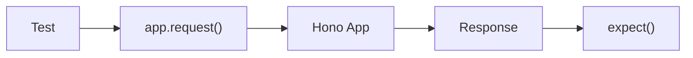

前章では、OpenAPIでAPI仕様を共有する方法を学びました。

ここからは、作ったAPIを壊さずに育てるためのテストへ進みます。

Honoのテストは、とても素直です。
理由は、HonoがWeb標準の `Request` と `Response` を中心に作られているからです。

サーバーを起動しなくても、Honoアプリケーションへ直接リクエストを渡して、レスポンスを検証できます。



この章では、次の2つを扱います。

- `app.request()`
- `testClient()`

どちらも便利ですが、得意なことが少し違います。

## Honoがテストしやすい理由

多くのWebフレームワークでは、APIテストのためにサーバーを起動したり、専用のHTTPクライアントを用意したりします。

Honoでは、もっと直接的にテストできます。

```ts
const res = await app.request('/tasks')
```

これだけで、`GET /tasks` へリクエストしたのと同じようにレスポンスを取得できます。

Hono公式でも、RequestをHonoアプリケーションへ渡してResponseを検証する、という考え方が基本として紹介されています。

このシンプルさは、Honoの大きな魅力です。

テストで大事なのは、実装の細部ではなく「外から見たAPIの振る舞い」を固定することです。
`app.request()`を使うと、実際のHTTPに近い形で、ステータスコード、ヘッダー、JSONレスポンスを確認できます。
Handlerの内側を直接呼ばないので、ルートやMiddlewareを含めた動きを見られます。

## Vitestを導入する

本書では、テストランナーとしてVitestを使います。

```sh
npm install -D vitest
```

`package.json` にテストスクリプトを追加します。

```json
{
  "scripts": {
    "test": "vitest",
    "test:watch": "vitest --watch"
  }
}
```

最初のテストファイルを作ります。

```txt
src/
  index.ts
test/
  app.test.ts
```

Vitestの基本形は、次のとおりです。

```ts
import { describe, expect, test } from 'vitest'

describe('example', () => {
  test('works', () => {
    expect(1 + 1).toBe(2)
  })
})
```

## テストしやすいappをexportする

テストでは、Honoアプリケーション本体をimportしたいです。

そのため、`src/index.ts` で `app` を名前付きexportしておくと便利です。

```ts
// src/index.ts
import { Hono } from 'hono'
import { tasksRoute } from './routes/tasks'

export const app = new Hono()
  .route('/tasks', tasksRoute)

export type AppType = typeof app

export default app
```

`export default app` はWorkersのエントリーポイントとして使います。

`export const app` はテストからimportするために使います。

```ts
import { app } from '../src'
```

このようにしておくと、テストが書きやすくなります。

## app.request()でGETをテストする

まず、単純なGETリクエストをテストします。

```ts
// test/app.test.ts
import { describe, expect, test } from 'vitest'
import { app } from '../src'

describe('GET /tasks', () => {
  test('タスク一覧を取得できる', async () => {
    const res = await app.request('/tasks')

    expect(res.status).toBe(200)

    const body = await res.json()

    expect(body).toHaveProperty('tasks')
    expect(body).toHaveProperty('meta')
  })
})
```

`app.request()` の戻り値は `Response` です。

そのため、通常のFetch APIと同じように扱えます。

```ts
res.status
res.headers
await res.json()
await res.text()
```

## POSTをテストする

JSONボディを送る場合は、第2引数にリクエスト情報を渡します。

```ts
test('タスクを作成できる', async () => {
  const res = await app.request('/tasks', {
    method: 'POST',
    headers: {
      'Content-Type': 'application/json',
    },
    body: JSON.stringify({
      title: 'Write tests',
    }),
  })

  expect(res.status).toBe(201)

  const body = await res.json()

  expect(body.task.title).toBe('Write tests')
  expect(body.task.completed).toBe(false)
})
```

ここでは、実際のHTTPリクエストと同じように `method`、`headers`、`body` を指定しています。

HonoはWeb標準の `Request` を扱うので、この形が自然です。

## バリデーションエラーをテストする

正常系だけでなく、異常系もテストします。

たとえば、`title` が空の場合は400を返してほしいです。

```ts
test('titleが空なら400を返す', async () => {
  const res = await app.request('/tasks', {
    method: 'POST',
    headers: {
      'Content-Type': 'application/json',
    },
    body: JSON.stringify({
      title: '',
    }),
  })

  expect(res.status).toBe(400)

  const body = await res.json()

  expect(body).toHaveProperty('message')
})
```

テストでは、成功することだけを確認しません。

失敗してほしい入力が、ちゃんと失敗することも確認します。

## PATCHとDELETEをテストする

更新と削除は、作成してから操作するとわかりやすいです。

この種のテストでは、1つのテストの中で「作成 → 更新」や「作成 → 削除」という流れを作ります。
先に固定IDのデータを用意する方法もありますが、API経由で作ってから操作すると、実際の利用に近い流れを確認できます。

```ts
test('タスクを更新できる', async () => {
  const createRes = await app.request('/tasks', {
    method: 'POST',
    headers: {
      'Content-Type': 'application/json',
    },
    body: JSON.stringify({
      title: 'Before',
    }),
  })

  const created = await createRes.json()
  const id = created.task.id

  const updateRes = await app.request(`/tasks/${id}`, {
    method: 'PATCH',
    headers: {
      'Content-Type': 'application/json',
    },
    body: JSON.stringify({
      title: 'After',
      completed: true,
    }),
  })

  expect(updateRes.status).toBe(200)

  const updated = await updateRes.json()

  expect(updated.task.title).toBe('After')
  expect(updated.task.completed).toBe(true)
})
```

削除も同じです。

```ts
test('タスクを削除できる', async () => {
  const createRes = await app.request('/tasks', {
    method: 'POST',
    headers: {
      'Content-Type': 'application/json',
    },
    body: JSON.stringify({
      title: 'Delete me',
    }),
  })

  const created = await createRes.json()
  const id = created.task.id

  const deleteRes = await app.request(`/tasks/${id}`, {
    method: 'DELETE',
  })

  expect(deleteRes.status).toBe(204)
})
```

このように、APIの操作を一連の流れとして確認できます。

## Headerを送る

JWT認証が必要なAPIでは、`Authorization` ヘッダーを送ります。

```ts
const res = await app.request('/tasks', {
  headers: {
    Authorization: `Bearer ${accessToken}`,
  },
})
```

ログインAPIからトークンを取得するテストも書けます。

```ts
async function login() {
  const res = await app.request('/auth/login', {
    method: 'POST',
    headers: {
      'Content-Type': 'application/json',
    },
    body: JSON.stringify({
      email: 'alice@example.com',
      password: 'password123',
    }),
  })

  const body = await res.json()

  return body.accessToken as string
}
```

このHelperを使って、認証付きリクエストを作れます。

```ts
test('認証済みならタスク一覧を取得できる', async () => {
  const accessToken = await login()

  const res = await app.request('/tasks', {
    headers: {
      Authorization: `Bearer ${accessToken}`,
    },
  })

  expect(res.status).toBe(200)
})
```

## Envを渡す

Cloudflare Workersでは、D1やSecretsを `c.env` から受け取ります。

テストで `c.env.DB` や `c.env.JWT_SECRET` が必要な場合は、`app.request()` にEnvを渡します。

```ts
const env = {
  DB: testDb,
  JWT_SECRET: 'test-secret',
}

const res = await app.request(
  '/tasks',
  {
    headers: {
      Authorization: `Bearer ${accessToken}`,
    },
  },
  env,
)
```

ただし、D1を本物に近い形でテストする場合は、次章で扱うWorkers向けVitest環境を使うほうが自然です。

この章では、まず「Envを渡せる」と覚えておけば十分です。

## testClient()を使う

`app.request()` はFetch APIに近く、素直です。

一方、Honoにはテスト用の型付きクライアントもあります。

```ts
import { testClient } from 'hono/testing'
```

`testClient()` にHonoアプリケーションを渡すと、Hono Clientに似た形でAPIを呼べます。

`app.request()`では、パスやHTTPメソッドを文字列で指定します。
一方、`testClient()`では、サーバー側のルート型に沿って呼び出せます。
APIの形を変えたときに、テスト側の補完や型エラーで気づきやすいのが利点です。

```ts
import { describe, expect, test } from 'vitest'
import { testClient } from 'hono/testing'
import { app } from '../src'

const client = testClient(app)

describe('tasks', () => {
  test('タスクを作成できる', async () => {
    const res = await client.tasks.$post({
      json: {
        title: 'Write typed tests',
      },
    })

    expect(res.status).toBe(201)

    const body = await res.json()

    expect(body.task.title).toBe('Write typed tests')
  })
})
```

`testClient()` は、Honoのルート型をもとに補完してくれます。

```txt
client.tasks.$get()
client.tasks.$post()
client.tasks[':id'].$patch()
```

Hono RPCと同じ感覚でテストを書けます。

## Query、Param、JSONを型安全に指定する

`testClient()` では、`query`、`param`、`json` を型付きで渡せます。

```ts
const listRes = await client.tasks.$get({
  query: {
    limit: '20',
    offset: '0',
    completed: 'false',
  },
})
```

パスパラメーターは `param` です。

```ts
const detailRes = await client.tasks[':id'].$get({
  param: {
    id: 'task_123',
  },
})
```

JSONボディは `json` です。

```ts
const updateRes = await client.tasks[':id'].$patch({
  param: {
    id: 'task_123',
  },
  json: {
    completed: true,
  },
})
```

これらは、サーバー側のValidatorから型推論されます。

入力の形を間違えると、TypeScriptが教えてくれます。

## 認証ヘッダーを付ける

`testClient()` でも、ヘッダーを渡せます。

```ts
const res = await client.tasks.$get(
  {
    query: {
      limit: '20',
      offset: '0',
    },
  },
  {
    headers: {
      Authorization: `Bearer ${accessToken}`,
    },
  },
)
```

認証が必要なテストでは、ログインしてトークンを取得してからAPIを呼びます。

```ts
async function loginWithClient() {
  const res = await client.auth.login.$post({
    json: {
      email: 'alice@example.com',
      password: 'password123',
    },
  })

  const body = await res.json()

  return body.accessToken
}
```

## レスポンスのUnion型

APIは、いつも成功するわけではありません。

たとえば、タスク詳細APIは200か404を返します。

```ts
return c.json({ task }, 200)
return c.json({ message: 'Task not found' }, 404)
```

Hono RPCや `testClient()` では、ステータスコードを明示しておくと、レスポンス型を扱いやすくなります。

```ts
const res = await client.tasks[':id'].$get({
  param: {
    id: 'missing',
  },
})

if (res.status === 404) {
  const body = await res.json()
  expect(body.message).toBe('Task not found')
  return
}

if (res.ok) {
  const body = await res.json()
  expect(body.task.id).toBe('missing')
}
```

テストでは、正常系と異常系を分けて書くと読みやすくなります。

レスポンスがUnion型になる場面では、最初に`res.status`で分岐すると安全です。
成功レスポンスとエラーレスポンスではJSONの形が違うため、ステータスコードを見てから`res.json()`の中身を扱うと、テストの意図も明確になります。

## 型推論が失われるケース

`testClient()` の型推論も、Hono RPCと同じくルート定義の書き方に影響されます。

次のように、ルート登録を関数の中へ隠しすぎると補完が弱くなることがあります。

```ts
function registerTasks(app: Hono) {
  app.get('/tasks', (c) => c.json({ tasks: [] }))
}

const app = new Hono()
registerTasks(app)

const client = testClient(app)
```

型推論を活かすなら、ルート定義をチェーンで組み立てます。

```ts
const app = new Hono()
  .route('/tasks', tasksRoute)

const client = testClient(app)
```

第13章、第19章で扱った話が、テストでも効いてきます。

## app.request()とtestClient()の使い分け

最後に、使い分けを整理します。

| 方法 | 向いている場面 |
| --- | --- |
| `app.request()` | Request/Responseを直接検証したい |
| `testClient()` | ルート型に沿ってAPIを呼びたい |

`app.request()` は、HTTPそのものに近いです。

```ts
await app.request('/tasks', {
  method: 'POST',
  body: JSON.stringify({ title: 'Task' }),
})
```

`testClient()` は、Hono RPCに近いです。

```ts
await client.tasks.$post({
  json: {
    title: 'Task',
  },
})
```

本書では、次のように使い分けます。

```txt
低レベルなHTTPの挙動を見たい → app.request()
APIの型を活かしてテストしたい → testClient()
```

どちらか一方に決める必要はありません。

テストしたい内容に合わせて選びます。

迷ったら、最初は`app.request()`で書くとよいです。
HTTPの基礎的な挙動を素直に確認できます。
ルート型を活かしたテストを増やしたくなったら、`testClient()`を併用します。

## まとめ

この章では、Honoアプリケーションのテスト方法を学びました。

- Honoは `Request` と `Response` を直接扱うためテストしやすい
- `app.request()` でサーバーを起動せずにAPIを呼べる
- JSONボディやHeaderを送れる
- Envを渡してBindingsを再現できる
- `testClient()` で型安全にAPIを呼べる
- `query`、`param`、`json` を型付きで指定できる
- ルート定義の型推論はテストにも影響する
- `app.request()` と `testClient()` は目的に応じて使い分ける

次章では、さらに一歩進めます。

Service、Repository、D1、Workers runtimeをどうテストするか。
アプリケーションの内側と外側を分けて、テスト戦略を整理していきます。
