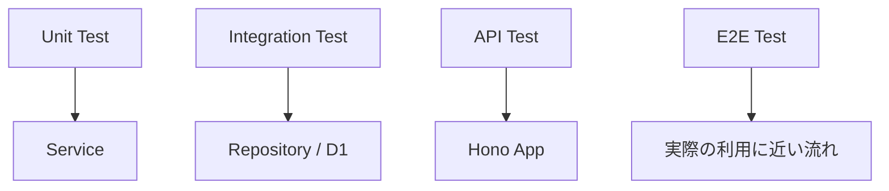
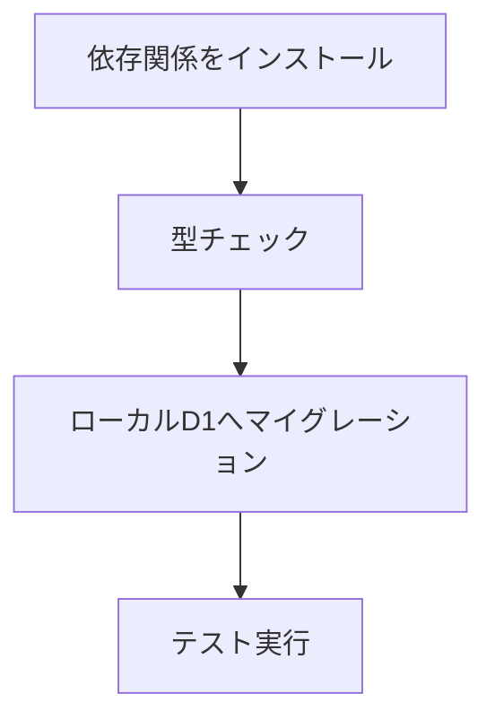

前章では、`app.request()` と `testClient()` を使ってHono APIをテストしました。

この章では、もう少し広い視点でテストを整理します。

APIのテストには、いくつかの層があります。



すべてを同じ方法でテストしようとすると、テストは遅くなり、壊れやすくなります。

大切なのは、どの層で何を確認するかを決めることです。

## Unit Test、Integration Test、E2E Test

まず、テストの種類を整理します。

| 種類 | 主な対象 | 特徴 |
| --- | --- | --- |
| Unit Test | 関数、Service | 速い。原因を特定しやすい |
| Integration Test | Repository、D1、外部連携 | 複数要素の接続を確認できる |
| API Test | Honoのルート | HTTPとしての挙動を確認できる |
| E2E Test | ユーザー操作全体 | 実際の利用に近いが重い |

本書のタスク管理APIでは、次のように考えます。

```txt
Serviceの判断 → Unit Test
D1のSQL → Integration Test
HTTPのステータスやJSON → API Test
画面操作全体 → E2E Test
```

この章では、Unit Test、Integration Test、API Testを中心に扱います。

## Serviceを単体テストする

Serviceは、Honoの `Context` を受け取らないように設計しました。

これはテストで効きます。

たとえば、タスク作成Serviceは、Repositoryを渡せばテストできます。

```ts
import { describe, expect, test } from 'vitest'
import { createTaskService } from '../src/services/task-service'
import { createInMemoryTaskRepository } from '../src/repositories/in-memory-task-repository'

describe('TaskService', () => {
  test('タスクを作成できる', async () => {
    const repository = createInMemoryTaskRepository()
    const service = createTaskService(repository)

    const task = await service.createTask({
      userId: 'user_1',
      title: 'Write unit test',
    })

    expect(task.title).toBe('Write unit test')
    expect(task.completed).toBe(false)
    expect(task.userId).toBe('user_1')
  })
})
```

このテストでは、HonoもD1も登場しません。

Serviceの判断だけを見ています。

## FakeとMockの使い分け

テストでは、FakeやMockという言葉が出てきます。

ざっくり分けると、次のようになります。

| 種類 | 意味 |
| --- | --- |
| Fake | 本物より簡単な実装 |
| Mock | 呼び出されたかを確認するための代用品 |

インメモリRepositoryはFakeです。

```ts
const repository = createInMemoryTaskRepository()
```

実際のD1ではありませんが、Repositoryとして動きます。

一方、Mockは「この関数が呼ばれたか」を確認したいときに使います。

```ts
const repository = {
  create: vi.fn(),
}
```

本書では、まずFakeを多めに使います。
理由は、読みやすく、実際の動きに近いからです。

## 正常系と異常系

テストでは、正常系だけでなく異常系も書きます。

タスク更新では、存在しないタスクを更新しようとした場合を確認します。

```ts
test('存在しないタスクは更新できない', async () => {
  const repository = createInMemoryTaskRepository()
  const service = createTaskService(repository)

  const result = await service.updateTask('missing', {
    title: 'After',
  })

  expect(result).toBeNull()
})
```

異常系は、アプリケーションの仕様をはっきりさせます。

```txt
存在しないタスクを更新したら null を返す
```

この仕様が決まると、Handlerでは404へ変換できます。

## バリデーションをテストする

バリデーションは、APIの入口で確認します。

`testClient()` を使うと、入力の形に沿ってテストできます。

```ts
test('titleが空なら400を返す', async () => {
  const res = await client.tasks.$post({
    json: {
      title: '',
    },
  })

  expect(res.status).toBe(400)
})
```

バリデーションテストでは、境界値を意識します。

| 項目 | 例 |
| --- | --- |
| 最小値 | 空文字、0 |
| 最大値 | 100文字、101文字 |
| 型違い | `number` ではなく `string` |
| 必須 | フィールドなし |
| 余分な値 | 想定外のフィールド |

境界値のテストは地味ですが、バグを見つけやすいです。

## 未認証と権限不足をテストする

認証付きAPIでは、未認証と権限不足を分けてテストします。

未認証の例です。

```ts
test('未認証なら401を返す', async () => {
  const res = await app.request('/tasks')

  expect(res.status).toBe(401)
})
```

権限不足の例です。

```ts
test('他人のタスクは更新できない', async () => {
  const aliceToken = await loginAs('alice@example.com')
  const bobToken = await loginAs('bob@example.com')

  const createRes = await createTask(aliceToken, {
    title: 'Alice task',
  })
  const { task } = await createRes.json()

  const updateRes = await app.request(`/tasks/${task.id}`, {
    method: 'PATCH',
    headers: {
      'Content-Type': 'application/json',
      Authorization: `Bearer ${bobToken}`,
    },
    body: JSON.stringify({
      title: 'Bob tries to update',
    }),
  })

  expect(updateRes.status).toBe(403)
})
```

このテストは、認証だけでなく認可の確認です。

## Repositoryをテストする

Repositoryは、データストアとの接続を担当します。

D1 Repositoryでは、SQLが正しいかを確認したいです。

ただし、ServiceのUnit Testで毎回D1を使う必要はありません。

```txt
Serviceの判断 → Fake Repository
D1のSQL → D1 RepositoryのIntegration Test
```

役割を分けると、テストが読みやすくなります。

Repositoryのテストでは、次のことを確認します。

- 作成したデータを取得できる
- 存在しないIDは `null` を返す
- 更新すると `updatedAt` が変わる
- 削除すると取得できなくなる
- ユーザーIDで絞り込まれる

## Workers向けVitest環境

D1やWorkersのBindingsを含めてテストする場合は、通常のNode.js環境だけでは足りません。

Cloudflareは、Workers runtimeでVitestを実行するための `@cloudflare/vitest-pool-workers` を提供しています。

```sh
npm install -D vitest@^4.1.0 @cloudflare/vitest-pool-workers
```

Cloudflare公式ドキュメントでは、Vitest 4.1以降が必要とされています。

`vitest.config.ts` を作ります。

```ts
import { cloudflareTest } from '@cloudflare/vitest-pool-workers'
import { defineConfig } from 'vitest/config'

export default defineConfig({
  plugins: [
    cloudflareTest({
      wrangler: {
        configPath: './wrangler.jsonc',
      },
    }),
  ],
})
```

この設定により、Workers runtimeに近い環境でテストできます。

## 型定義を用意する

Cloudflare Workersの型を使うために、Wranglerで型を生成します。

```sh
npx wrangler types
```

テスト用の `tsconfig.json` を用意する例です。

```json
{
  "extends": "../tsconfig.json",
  "compilerOptions": {
    "moduleResolution": "bundler",
    "types": ["@cloudflare/vitest-pool-workers/types"]
  },
  "include": [
    "./**/*.ts",
    "../src/worker-configuration.d.ts"
  ]
}
```

実際のファイル名は、プロジェクトの設定に合わせます。

重要なのは、Workers runtimeとBindingsの型をテスト側でも見えるようにすることです。

## BindingsとD1を使ったテスト

Workers向けVitest環境では、`cloudflare:test` からテスト用のBindingsを扱えます。

```ts
import { env } from 'cloudflare:test'
import { describe, expect, test } from 'vitest'
import { createD1TaskRepository } from '../src/repositories/d1-task-repository'

describe('D1TaskRepository', () => {
  test('タスクを作成できる', async () => {
    const repository = createD1TaskRepository(env.DB)

    const task = await repository.create({
      userId: 'user_1',
      title: 'D1 test',
    })

    expect(task.title).toBe('D1 test')
  })
})
```

`env.DB` は、Wrangler設定のD1 Bindingに対応します。

ローカルのD1を使うことで、本番D1を汚さずにテストできます。

## マイグレーションを適用する

D1を使うテストでは、テーブルが存在している必要があります。

そのため、テスト前にマイグレーションを適用します。

ローカルD1へ適用する例です。

```sh
npx wrangler d1 migrations apply hono-task-api-db --local
```

CIでも、テスト前に同じようにマイグレーションを適用します。

```json
{
  "scripts": {
    "db:migrate:local": "wrangler d1 migrations apply hono-task-api-db --local",
    "test": "vitest"
  }
}
```

テストが失敗するときは、まずテーブルが作成されているかを確認します。

```txt
no such table: tasks
```

このエラーが出たら、マイグレーションが適用されていない可能性が高いです。

## テストデータを初期化する

テストでは、データの初期化が重要です。

前のテストで作ったデータが残っていると、次のテストが偶然失敗したり、偶然成功したりします。

シンプルな方法は、各テストの前にテーブルを空にすることです。

```ts
import { beforeEach } from 'vitest'
import { env } from 'cloudflare:test'

beforeEach(async () => {
  await env.DB.prepare('DELETE FROM tasks').run()
  await env.DB.prepare('DELETE FROM users').run()
})
```

外部キーを使っている場合は、削除順に注意します。

```txt
子テーブルを先に削除する
親テーブルを後で削除する
```

テストデータの初期化は、テストの安定性を支えます。

## CIでテストを実行する

CIでは、次の順番で実行するとわかりやすいです。



`package.json` の例です。

```json
{
  "scripts": {
    "typecheck": "tsc --noEmit",
    "db:migrate:local": "wrangler d1 migrations apply hono-task-api-db --local",
    "test": "vitest run",
    "ci": "npm run typecheck && npm run db:migrate:local && npm run test"
  }
}
```

CIでは、対話プロンプトが出ないように注意します。

必要に応じて、WranglerのコマンドオプションやCI用の認証設定を確認します。

## 実装詳細をテストしすぎない

テストを書くときに、実装詳細を見すぎると壊れやすくなります。

避けたい例です。

```ts
expect(repository.internalMap.size).toBe(1)
```

これは、Repositoryの内部構造に依存しています。

良い例です。

```ts
const task = await repository.findById(id)
expect(task).not.toBeNull()
```

外から見える振る舞いをテストします。

実装を変えても、振る舞いが同じならテストは通る。
これが良いテストです。

## テストケースの優先順位

すべてを一度にテストしようとすると、手が止まります。

まずは、壊れると困るところから書きます。

| 優先度 | テスト |
| --- | --- |
| 高 | ログイン、認証、認可 |
| 高 | タスク作成、更新、削除 |
| 高 | バリデーションエラー |
| 中 | 検索、ページネーション |
| 中 | OpenAPI JSONが返る |
| 低 | 細かい表示メッセージ |

タスク管理APIなら、まず「他人のタスクを操作できない」ことを強く守ります。

セキュリティに関わる仕様は、優先してテストします。

## まとめ

この章では、Service、D1、Workersのテスト戦略を整理しました。

- Unit Test、Integration Test、API Testを分けて考える
- ServiceはFake Repositoryで単体テストしやすい
- D1 RepositoryはIntegration TestでSQLを確認する
- 正常系だけでなく異常系もテストする
- 認証と認可は優先してテストする
- Workers runtimeを含めるなら `@cloudflare/vitest-pool-workers` を使う
- D1テストではマイグレーションとデータ初期化が重要
- 実装詳細ではなく、外から見える振る舞いをテストする

次章では、Honoをマルチランタイムの視点から整理します。

ここまで作ったAPIを、特定の実行環境に閉じすぎない形で見直し、どの処理をHono本体に置き、どの処理をランタイム固有の入口に置くべきかを確認します。
