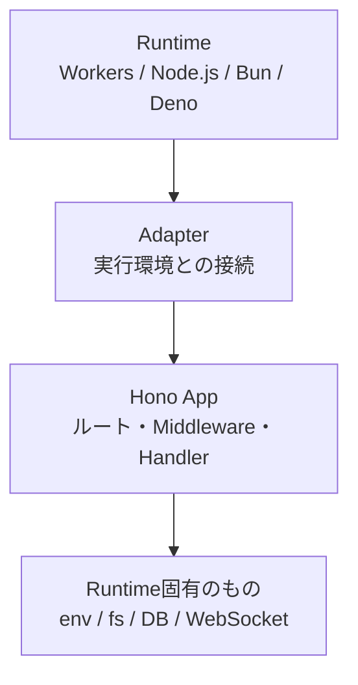
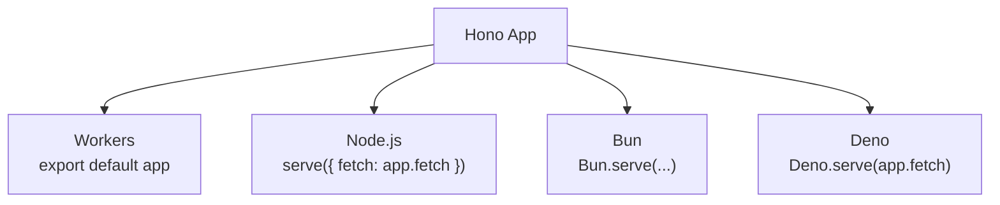

ここまでの章では、Cloudflare Workersを主な実行環境としてHonoアプリケーションを作ってきました。

この章では、少し視点を引きます。HonoはCloudflare Workers専用のフレームワークではありません。Node.js、Bun、Denoなど、複数のJavaScriptランタイムで動かせます。

ただし、「どこでも同じように動く」と雑に覚えると危険です。Honoの中心部分は共通にしやすい一方で、環境変数、ファイルシステム、データベース接続、WebSocket、Streamingなどはランタイムごとに違います。

この章の目的は、Honoアプリケーションを移植しやすくすることです。特定の実行環境に閉じた話を、どこに置けばよいかを整理します。

## この章で学ぶこと

この章では、次の内容を扱います。

- ランタイム、アダプター、Honoアプリケーションの違い
- Cloudflare Workers、Node.js、Bun、Denoで入口がどう変わるか
- `Request`と`Response`を中心に考える理由
- ランタイム固有の処理を閉じ込める設計
- 移植しやすいHonoアプリケーションの作り方

先に全体像を見ておきます。



Honoアプリケーションの中に何でも直接書いてはいけません。ランタイム固有の処理を外側に寄せるほど、アプリケーション本体は読みやすく、テストしやすくなります。

## ランタイムとは何か

ランタイムとは、JavaScriptやTypeScriptのコードを実行する環境です。

代表的なランタイムには、次のようなものがあります。

| ランタイム | 特徴 |
|---|---|
| Cloudflare Workers | Web標準APIを中心にしたエッジ環境 |
| Node.js | npmエコシステムが大きく、サーバーアプリで広く使われる |
| Bun | 高速なJavaScriptランタイムとツールチェーンを持つ |
| Deno | Web標準APIとの親和性が高く、権限モデルを持つ |

同じJavaScriptでも、すべてのAPIが同じように使えるわけではありません。

たとえば、Node.jsでは`fs`でファイルを読み書きできます。一方、Cloudflare Workersでは、ローカルファイルシステムを前提にした処理は基本的に使いません。環境変数の読み方も、Node.jsでは`process.env`、Workersでは`c.env`を使うことが多くなります。

この違いを無視してHandlerに直接書くと、アプリケーションが特定のランタイムに強く結びつきます。

## Honoが共通化してくれる部分

Honoのよいところは、リクエストとレスポンスの中心をWeb標準APIに寄せている点です。

HonoのHandlerでは、`Context`を通してリクエストを読み、レスポンスを返します。

```ts
app.get('/health', (c) => {
  return c.json({ ok: true });
});
```

この書き方は、実行環境の違いをある程度隠してくれます。


Handlerが`Request`を受け取り、`Response`を返す流れに近いほど、ランタイムごとの差を小さくできます。

一方で、Honoがすべての差を消してくれるわけではありません。特に次のものは、実行環境の違いが出やすい場所です。

| 項目 | 違いが出やすい理由 |
|---|---|
| 環境変数 | `c.env`、`process.env`など取得方法が違う |
| ファイルシステム | Workersではローカルファイル前提の処理を置きにくい |
| データベース | 接続方法やBindingの渡し方が違う |
| 暗号化API | Web CryptoとNode.jsの`crypto`で書き方が違う場合がある |
| WebSocket | ランタイムや環境ごとに接続の入口が違う |
| Streaming | 実装は似ていても制約や動作確認の方法が違う |

この表は、移植しにくさの地図です。迷ったら、この表に戻って「いま書こうとしている処理はどこに置くべきか」を考えます。

## Adapterの役割

Adapterは、Honoアプリケーションを実行環境につなぐための薄い層です。

Cloudflare Workersでは、Honoアプリケーションをそのまま`export default`できます。

```ts:src/index.ts
import { Hono } from 'hono';

const app = new Hono();

app.get('/health', (c) => {
  return c.json({ ok: true });
});

export default app;
```

Node.jsでは、`@hono/node-server`の`serve()`を使ってHonoアプリケーションをHTTPサーバーにつなげます。

```ts:src/node.ts
import { serve } from '@hono/node-server';
import { Hono } from 'hono';

const app = new Hono();

app.get('/health', (c) => {
  return c.json({ ok: true });
});

serve({
  fetch: app.fetch,
  port: 3000,
});
```

アプリケーション本体は似ています。違うのは、最後にどのランタイムへ渡すかです。



この「最後の接続部分」を小さく保つと、アプリケーションの中心がランタイムから独立しやすくなります。

## アプリケーション本体をFactoryにする

移植しやすい構成にするなら、Honoアプリケーションを作る関数を用意すると便利です。

```ts:src/app.ts
import { Hono } from 'hono';

type Services = {
  now: () => Date;
};

export const createApp = (services: Services) => {
  const app = new Hono();

  app.get('/health', (c) => {
    return c.json({
      ok: true,
      checkedAt: services.now().toISOString(),
    });
  });

  return app;
};
```

Workersの入口では、必要な依存を渡してアプリケーションを作ります。

```ts:src/index.ts
import { createApp } from './app';

const app = createApp({
  now: () => new Date(),
});

export default app;
```

Node.jsの入口でも、同じ`createApp()`を使えます。

```ts:src/node.ts
import { serve } from '@hono/node-server';
import { createApp } from './app';

const app = createApp({
  now: () => new Date(),
});

serve({
  fetch: app.fetch,
  port: 3000,
});
```

この構成では、ルートやHandlerは`src/app.ts`に集まります。実行環境との接続は、`src/index.ts`や`src/node.ts`のような入口ファイルに閉じ込めます。

## 環境変数を直接読まない

ランタイム差が出やすい代表例が、環境変数です。

Workersでは、Bindingとして環境変数を受け取ります。

```ts
type Bindings = {
  JWT_SECRET: string;
};

const app = new Hono<{ Bindings: Bindings }>();

app.get('/config-check', (c) => {
  return c.json({
    hasJwtSecret: Boolean(c.env.JWT_SECRET),
  });
});
```

Node.jsでは、`process.env.JWT_SECRET`のように読むことが多いです。

どちらにも対応したいからといって、Handlerの中で両方を書くのはおすすめしません。

```ts
// 避けたい例
const secret = c.env.JWT_SECRET ?? process.env.JWT_SECRET;
```

この書き方は一見便利ですが、Handlerがランタイムの事情を知りすぎます。

代わりに、設定値を作る処理を入口側に寄せます。

```ts:src/config.ts
export type AppConfig = {
  jwtSecret: string;
};

export const createConfig = (values: { jwtSecret?: string }): AppConfig => {
  if (!values.jwtSecret) {
    throw new Error('JWT secret is required');
  }

  return {
    jwtSecret: values.jwtSecret,
  };
};
```

Workersの入口では`env`から設定を作ります。

```ts:src/index.ts
import { Hono } from 'hono';
import { createConfig } from './config';

type Bindings = {
  JWT_SECRET: string;
};

const app = new Hono<{ Bindings: Bindings }>();

app.get('/health', (c) => {
  const config = createConfig({
    jwtSecret: c.env.JWT_SECRET,
  });

  return c.json({
    ok: true,
    configured: Boolean(config.jwtSecret),
  });
});

export default app;
```

実際のアプリケーションでは、リクエストごとに毎回設定を作るより、Serviceを作る段階で注入するほうが扱いやすいこともあります。環境変数の読み方は、アプリケーション全体へ散らさないようにします。

## Database Bindingを閉じ込める

D1もランタイム差が出やすい場所です。

Workersでは、D1 DatabaseをBindingとして受け取ります。

```ts
type Bindings = {
  DB: D1Database;
};
```

Handlerで直接`c.env.DB.prepare()`を書き続けると、後からテストや別環境への移植が難しくなります。第14章で扱ったように、Repositoryを挟むと境界が見えやすくなります。


RepositoryのInterfaceをアプリケーション側に置き、D1に依存する実装を外側に置きます。

```ts
export type TaskRepository = {
  findById: (id: string) => Promise<Task | null>;
  create: (input: CreateTaskInput) => Promise<Task>;
};
```

この形にしておくと、テストではFake Repositoryを渡せます。別のランタイムで別のDBを使う場合も、Repositoryの実装を差し替える余地が残ります。

## ランタイム固有機能を使ってよい場所

ランタイム固有機能は悪ではありません。むしろ、各環境の強みを活かすために必要です。

問題は、固有機能がどこに散らばるかです。

| 書く場所 | 向いている内容 |
|---|---|
| Entry Point | ランタイムとの接続、環境変数の読み取り |
| Infrastructure | D1、外部API、ファイル、キューなど具体的な接続 |
| Service | 業務ルール、ユースケース |
| Handler | HTTPリクエストとレスポンスの変換 |

Handlerにランタイム固有の処理を詰め込むと、HTTPの処理、業務ロジック、環境差が混ざります。

ランタイム固有の処理は、Entry PointかInfrastructureへ寄せる。これだけで、Honoアプリケーションはかなり扱いやすくなります。

## タスク管理APIでの方針

本書のタスク管理APIでは、Cloudflare WorkersとD1を主な環境として使います。

ただし、章を通して次のような境界を意識してきました。

| 関心 | 置き場所 |
|---|---|
| Routing | Hono App |
| Request / Response | Handler |
| 入力値検証 | Zod Schema |
| 業務ルール | Service |
| データ保存 | Repository |
| D1接続 | D1 Repository |
| 認証情報 | Middleware / Context Variables |
| 環境変数 | Bindings / Config |
| テスト用差し替え | Fake Repository / Test App |

この分け方は、マルチランタイムのためだけのものではありません。普段の開発でも、責務が見えるだけでコードの読みやすさが上がります。

## よくある失敗

マルチランタイムを意識するとき、よくある失敗があります。

1つ目は、最初からすべてのランタイムに対応しようとすることです。これはたいてい重すぎます。まずは主な実行環境を決め、そのうえで境界だけをきれいにしておくほうが現実的です。

2つ目は、Handlerに環境差を書くことです。`c.env`、`process.env`、DB接続、外部API呼び出しがHandlerに混ざると、後から分けるのが難しくなります。

3つ目は、Web標準APIだけで全部同じになると思い込むことです。`Request`と`Response`は共通化しやすい土台ですが、DBやWebSocketのような外側の機能は別に考える必要があります。

## 設計チェックリスト

ランタイム差に強いHonoアプリケーションにするため、次の点を確認します。

| 観点 | 確認すること |
|---|---|
| Entry Point | ランタイムとの接続が入口ファイルに閉じている |
| Config | 環境変数の読み取りが散らばっていない |
| Handler | HTTPの入出力に集中している |
| Service | ランタイム固有APIを直接呼んでいない |
| Repository | DB実装を差し替えられる |
| Test | FakeやMockを使って主要な処理を検証できる |

このチェックリストは、第25章の総仕上げでも使います。

## まとめ

この章では、Honoをマルチランタイムの視点から整理しました。

- ランタイムはJavaScriptを実行する環境です。
- HonoはWeb標準APIに寄せることで、ルートやHandlerを共通化しやすくします。
- それでも、環境変数、DB、ファイル、WebSocketなどはランタイム差が出ます。
- AdapterやEntry Pointに環境差を閉じ込めると、アプリケーション本体が読みやすくなります。
- ServiceやRepositoryを分ける設計は、テストしやすさだけでなく、移植しやすさにも効きます。

次章では、Honoの発展的な機能を見ていきます。Streaming、SSE、WebSocket、JSXを扱い、通常のREST APIとは少し違うリクエストとレスポンスの形を学びます。
