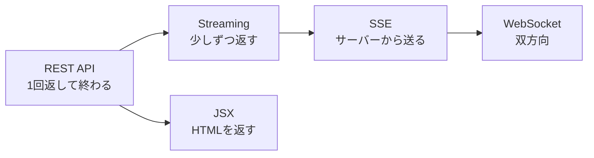
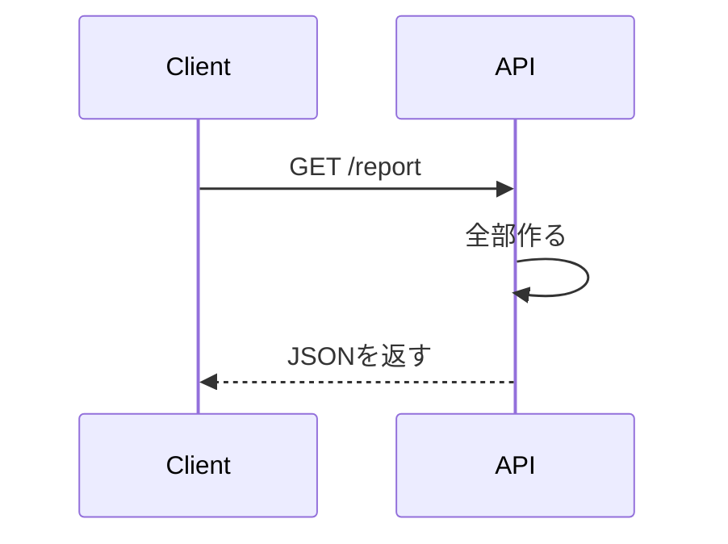
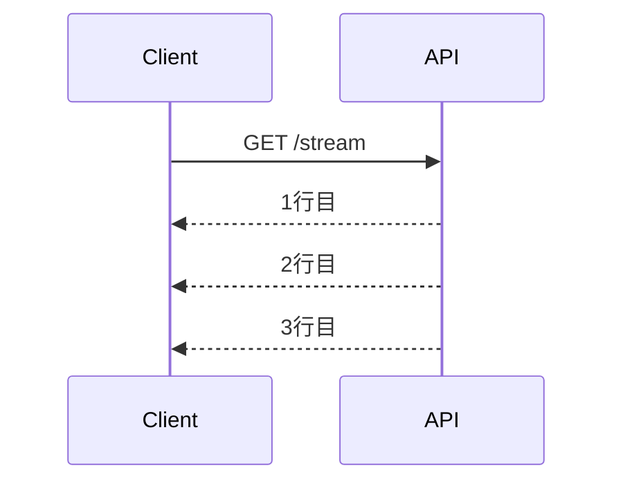
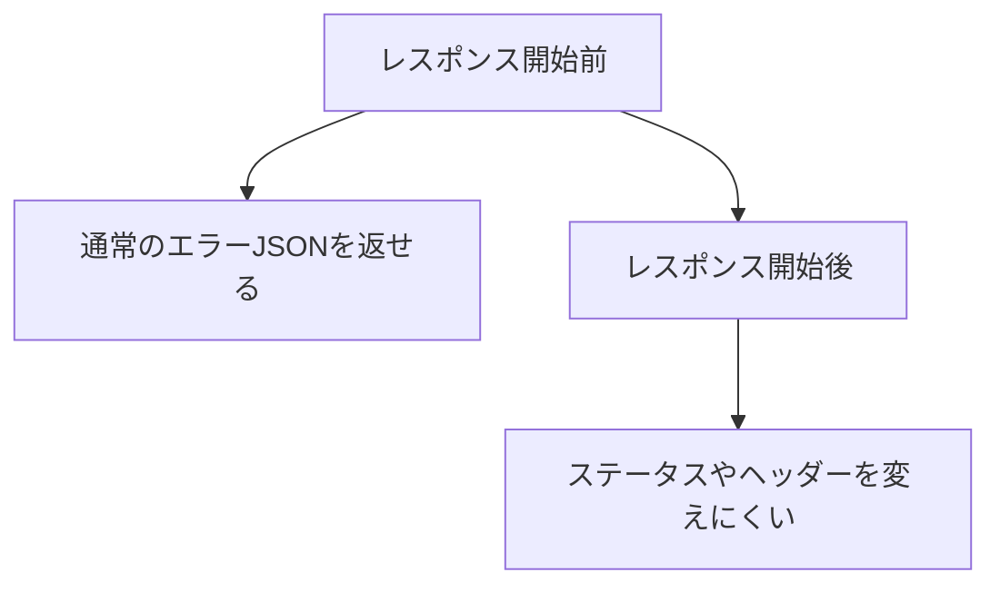
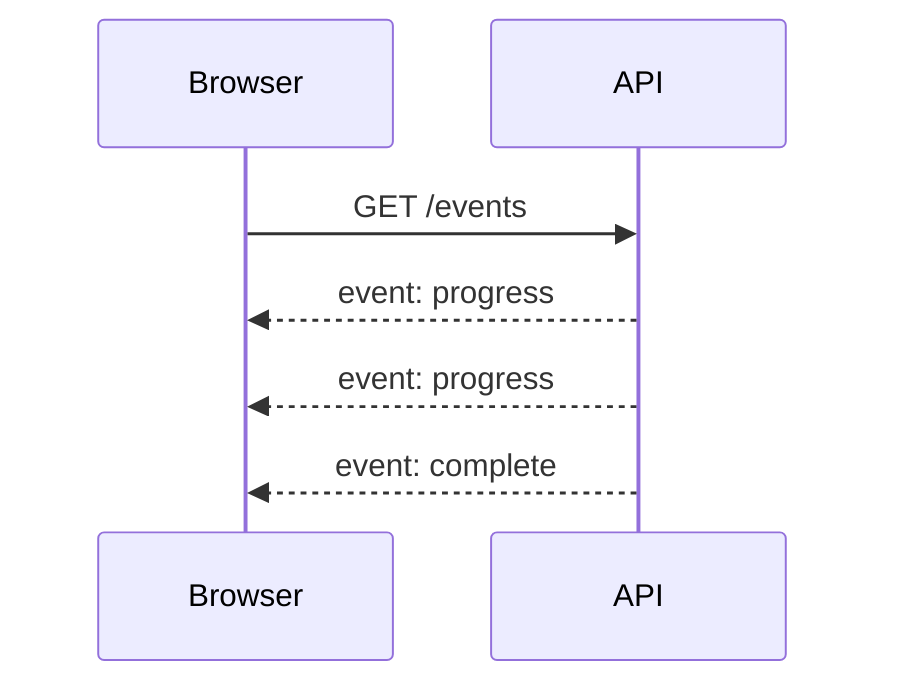
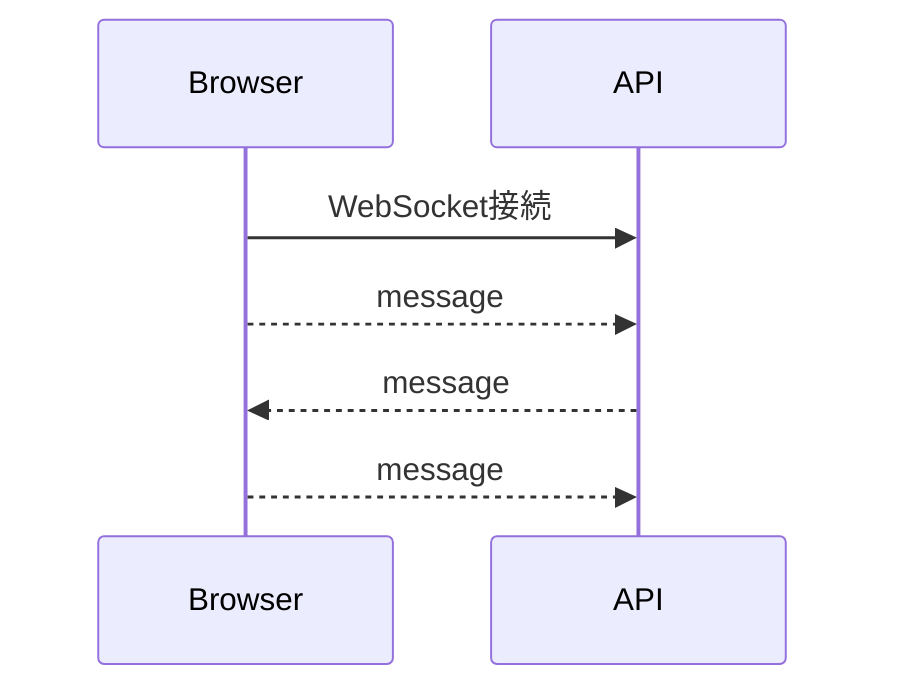
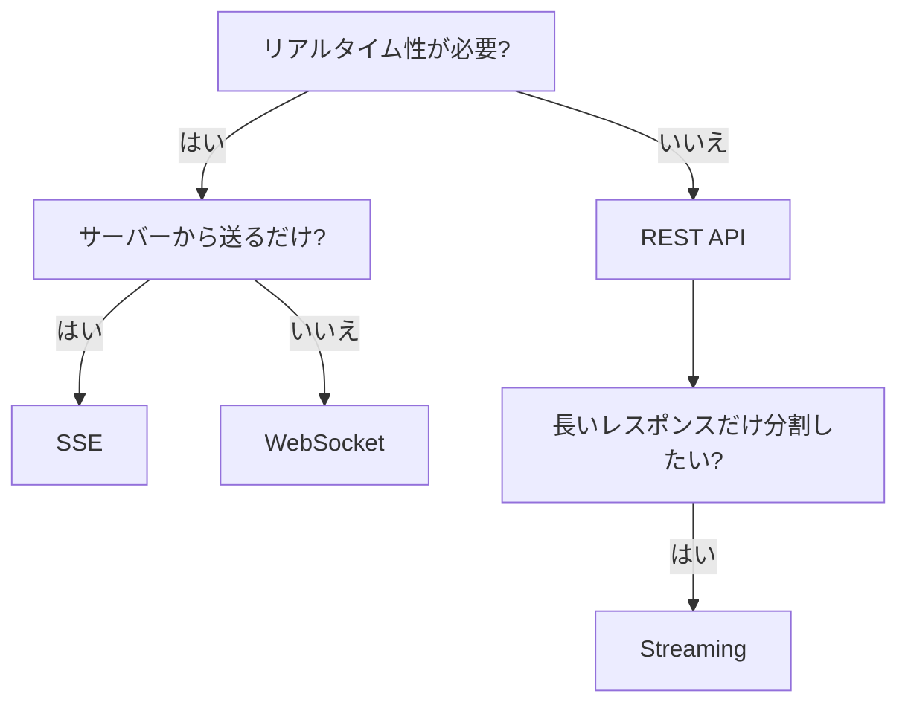

前章では、Honoを複数のランタイムで扱うための境界を整理しました。

この章では、Honoの発展的な機能を扱います。Streaming、SSE、WebSocket、JSXです。

これらは、通常のREST APIとは少し違う性質を持っています。リクエストを受け取り、JSONを返して終わるだけではありません。レスポンスを少しずつ返したり、サーバーからイベントを送り続けたり、双方向通信を扱ったり、HTMLを返したりします。

ただし、発展機能は「知っているから使う」ものではありません。使う理由がはっきりしているときに採用します。この章では、書き方だけでなく、どの場面で選ぶべきかも見ていきます。

## この章で学ぶこと

この章では、次の内容を扱います。

- Streamingでレスポンスを少しずつ返す
- SSEでサーバーからイベントを送る
- WebSocketで双方向通信を扱う
- JSXで小さなHTMLレスポンスを作る
- 発展機能を採用する判断基準

まず、4つの違いを整理します。

| 機能 | 通信の形 | 向いている用途 |
|---|---|---|
| Streaming | 1回のレスポンスを分割して返す | 長いテキスト生成、逐次ログ、重い処理の進捗 |
| SSE | サーバーからイベントを送り続ける | 通知、進捗、状態更新 |
| WebSocket | クライアントとサーバーの双方向通信 | チャット、共同編集、リアルタイム操作 |
| JSX | HTMLをTypeScriptで書く | 小さな管理画面、ドキュメント、確認用UI |



この図は、難易度の順番でもあります。通常のAPIで足りるなら、REST APIのままで十分です。必要が出てきたところだけ、発展機能を使います。

## Streamingとは何か

Streamingは、レスポンスを一度にまとめて返さず、少しずつ返す仕組みです。

通常のJSON APIでは、Handlerの処理が終わってからレスポンスを返します。



Streamingでは、レスポンスを作りながら順番に送れます。



ユーザーが「処理が始まっている」と分かるので、長い処理と相性がよくなります。

## streamText()でテキストを返す

Honoには、Streamingを扱いやすくするヘルパーがあります。

```ts
import { Hono } from 'hono';
import { streamText } from 'hono/streaming';

const app = new Hono();

app.get('/stream', (c) => {
  return streamText(c, async (stream) => {
    await stream.write('Start\n');
    await stream.write('Processing...\n');
    await stream.write('Done\n');
  });
});
```

`streamText()`は、テキストを少しずつ返したいときに使いやすいヘルパーです。

`curl`で確認すると、レスポンスが順番に流れてくる様子を見られます。

```sh
curl http://localhost:8787/stream
```

短い例ではありがたみが薄いかもしれません。実際には、次のような場面で使います。

- 長いレポートを生成する
- ログを少しずつ返す
- AIの応答を逐次表示する
- 重い処理の進捗を見せる

## stream()で自由に制御する

テキストに限らず、より自由にレスポンスを扱いたい場合は`stream()`を使います。

```ts
import { Hono } from 'hono';
import { stream } from 'hono/streaming';

const app = new Hono();

app.get('/download-log', (c) => {
  c.header('Content-Type', 'text/plain; charset=utf-8');

  return stream(c, async (stream) => {
    for (const line of ['task created', 'task updated', 'task completed']) {
      await stream.write(`${line}\n`);
    }
  });
});
```

`stream()`は便利ですが、エラー処理が難しくなります。一度レスポンスを送り始めると、通常のJSONエラーへ戻しにくいからです。



Streamingを使う場合は、開始前にできる検証を先に終わらせます。

```ts
app.get('/tasks/export', async (c) => {
  const user = c.get('user');

  if (!user) {
    return c.json({ error: { code: 'UNAUTHORIZED' } }, 401);
  }

  return streamText(c, async (stream) => {
    await stream.write('id,title,status\n');
    await stream.write('1,Learn Hono,done\n');
  });
});
```

先に認証や入力値検証を終えてから、Streamingを始めます。これは実務でも大事な順番です。

## SSEとは何か

SSEは、Server-Sent Eventsの略です。

名前の通り、サーバーからクライアントへイベントを送り続ける仕組みです。通信は基本的に一方向です。クライアントから何かを送る必要がある場合は、通常のHTTPリクエストを別に使います。



SSEは、次のような場面で向いています。

- 処理の進捗を表示する
- 通知を受け取る
- ダッシュボードの値を更新する
- サーバー側の状態変化を画面へ反映する

双方向通信が必要ないなら、WebSocketよりSSEのほうがシンプルに済むことがあります。

## streamSSE()でイベントを送る

Honoでは、`streamSSE()`を使ってSSEを扱えます。

```ts
import { Hono } from 'hono';
import { streamSSE } from 'hono/streaming';

const app = new Hono();

app.get('/events', (c) => {
  return streamSSE(c, async (stream) => {
    for (let i = 1; i <= 3; i++) {
      await stream.writeSSE({
        event: 'progress',
        data: JSON.stringify({ step: i }),
        id: String(i),
      });

      await stream.sleep(1000);
    }

    await stream.writeSSE({
      event: 'complete',
      data: JSON.stringify({ ok: true }),
    });
  });
});
```

ブラウザ側では、`EventSource`で受け取れます。

```ts
const events = new EventSource('/events');

events.addEventListener('progress', (event) => {
  const data = JSON.parse(event.data);
  console.log(data.step);
});

events.addEventListener('complete', () => {
  events.close();
});
```

SSEはHTTP上で扱えるので、仕組みとしては比較的分かりやすいです。一方、接続が長く続くため、タイムアウト、再接続、認証、接続数には注意します。

## WebSocketとは何か

WebSocketは、クライアントとサーバーが接続を張ったまま双方向にメッセージを送り合う仕組みです。

SSEとの違いは、クライアントからもリアルタイムに送れることです。



WebSocketは強力ですが、状態を持ちやすくなります。

REST APIでは、1回のリクエストを処理して終わります。WebSocketでは、接続中のユーザー、部屋、購読対象、切断時の後処理などを考える必要があります。

## upgradeWebSocket()を使う

Cloudflare WorkersでWebSocketを扱う場合、Honoの`upgradeWebSocket()`を使えます。

```ts
import { Hono } from 'hono';
import { upgradeWebSocket } from 'hono/cloudflare-workers';

const app = new Hono();

app.get(
  '/ws',
  upgradeWebSocket(() => {
    return {
      onOpen(_event, ws) {
        ws.send('connected');
      },
      onMessage(event, ws) {
        ws.send(`echo: ${event.data}`);
      },
      onClose() {
        console.log('closed');
      },
    };
  }),
);

export default app;
```

これは小さなEchoサーバーです。受け取ったメッセージを、そのまま返します。

ブラウザ側では、次のように接続できます。

```ts
const socket = new WebSocket('ws://localhost:8787/ws');

socket.addEventListener('open', () => {
  socket.send('hello');
});

socket.addEventListener('message', (event) => {
  console.log(event.data);
});
```

WebSocketはランタイムごとの差が出やすい機能です。Cloudflare Workers、Node.js、Bun、Denoで入口や制約が変わることがあります。第23章で扱ったように、ランタイム固有の接続部分を小さく保つのが大切です。

## REST、SSE、WebSocketの選び方

リアルタイム性が必要なときも、最初からWebSocketを選ぶ必要はありません。

| 要件 | 選択肢 |
|---|---|
| ただデータを取得したい | REST API |
| サーバーから進捗や通知を送りたい | SSE |
| クライアントからも頻繁に送信したい | WebSocket |
| 長いレスポンスを少しずつ見せたい | Streaming |

たとえば、タスクの作成や更新はREST APIで十分です。タスクの一括処理の進捗を表示したいならSSEが合います。複数ユーザーが同時に同じ画面を編集するならWebSocketを検討します。



設計で迷ったら、もっとも単純な通信方式から始めます。複雑な通信は、必要になったときに足すほうが保守しやすくなります。

## Hono JSX

Honoは、HTMLを返す用途にも使えます。

Hono JSXを使うと、TypeScriptの中でHTMLに近い形を書けます。

```tsx
import { Hono } from 'hono';
import { jsxRenderer } from 'hono/jsx-renderer';

const app = new Hono();

app.use(
  '/ui/*',
  jsxRenderer(({ children }) => {
    return (
      <html lang="ja">
        <body>{children}</body>
      </html>
    );
  }),
);

app.get('/ui/tasks', (c) => {
  return c.render(
    <main>
      <h1>Tasks</h1>
      <ul>
        <li>Learn Hono</li>
        <li>Write tests</li>
      </ul>
    </main>,
  );
});
```

APIサーバーでも、簡単な確認画面やドキュメント画面を返したいことがあります。Hono JSXは、そのような小さなHTMLに向いています。

一方で、複雑なフロントエンドを作るなら、React、Vue、Angularなどのフロントエンドフレームワークを使うほうが自然です。

## JSXを使う場面

Hono JSXは、次のような用途に向いています。

- 小さな管理画面
- ヘルスチェックや診断画面
- APIドキュメントへの入口
- ローカル確認用の簡易UI
- HTMLメールのテンプレート

逆に、次のような用途では慎重に考えます。

- 状態管理が複雑な画面
- 大きなSPA
- 高度なフォーム操作
- 多数のコンポーネントを持つUI

Honoの本体はWeb APIに強いフレームワークです。HTMLを返せるからといって、すべての画面をHonoだけで作る必要はありません。

## 発展機能を入れる前に確認すること

Streaming、SSE、WebSocket、JSXは便利です。けれども、通常のAPIより考えることが増えます。

導入前に、次の点を確認します。

| 観点 | 確認すること |
|---|---|
| 要件 | 通常のREST APIでは足りない理由があるか |
| 接続時間 | 長い接続を扱う前提があるか |
| エラー処理 | 途中で失敗したときの見せ方を決めているか |
| 認証 | 接続開始時に誰をどう確認するか |
| テスト | ローカルで動作確認できる形があるか |
| ランタイム差 | 使う環境で対応しているか |

発展機能は、設計を豊かにします。同時に、見えない状態も増やします。採用するなら、その分だけ境界とテストを丁寧に作ります。

## タスク管理APIで使うなら

本書のタスク管理APIでは、最終章の必須機能としてStreamingやWebSocketを入れません。

理由は、タスクのCRUD、検索、認証、認可、テスト、OpenAPIだけで、Web APIの学習として十分に厚いからです。

ただし、拡張するなら次のような使い方が考えられます。

| 機能 | 拡張例 |
|---|---|
| Streaming | タスク一覧のCSV出力を少しずつ返す |
| SSE | 一括処理の進捗を画面へ通知する |
| WebSocket | 複数人で同じタスクリストを編集する |
| JSX | ローカル確認用の簡易管理画面を作る |

このように、必要になったときに足せる余地を残しておくのが現実的です。

## まとめ

この章では、Honoの発展的な機能を整理しました。

- Streamingは、レスポンスを少しずつ返す仕組みです。
- SSEは、サーバーからクライアントへイベントを送り続ける仕組みです。
- WebSocketは、双方向通信を扱う仕組みです。
- Hono JSXを使うと、小さなHTMLレスポンスをTypeScriptで書けます。
- 発展機能は便利ですが、REST APIで足りない理由があるときに採用します。

次章では、これまでの内容をまとめ、タスク管理APIを完成形として見直します。ルート、Service、Repository、D1、認証、テスト、OpenAPIを一本につなぎ、どこまで作れたら「良いHono API」と言えるのかを確認します。
